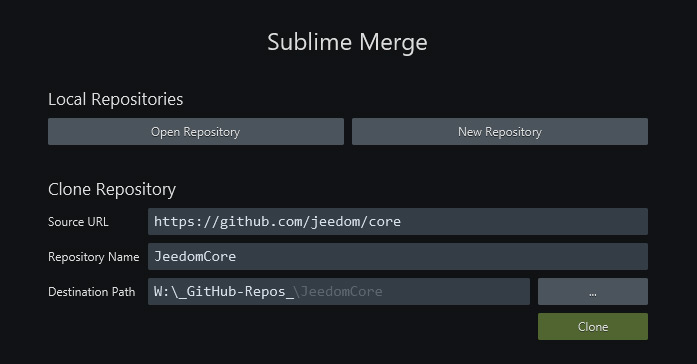

## Environnement de développement

Nous allons voir ici comment mettre en place un environnement de développement efficace entre un Pi de test et un PC sous Windows pour l'édition du code et la maintenance du repository GitHub.

Cette page concerne le Core de Jeedom mais cette méthode peu-être utilisée pour le développement de plugin.

Certes, pour des éditions rapide de quelques fichiers, on peut utiliser le plugin **jeeXplorer** directement sur Jeedom. Mais c'est rapidement fastidieux, et il faut ensuite reporter toutes les modifications sur le repository local ou directement sur GitHub. Ce n'est pas ce qu'il y a de plus pratique.

### Principe

- Nous allons mettre en place un Pi de test avec Jeedom et un partage Samba pour y accéder depuis le PC.
- Nous allons ensuite dupliquer le repository avec **Sublime Merge**
- Puis mettre en place **Sublime Text** pour l'édition de code du repository avec synchronisation sur le Pi de test.

**Sublime Merge** et **Sublime Text** sont certes payant (un prix faible avec 3 ans de maj), mais sont très léger, rapide, facilement customisable et très complet sans nécessiter pleins de plugins/packages. De plus, si vous ne prenez pas de licence, vous pouvez les utiliser normalement, vous aurez juste un petit popup de temps en temps avec un bouton *Cancel* !

Cette méthode est également possible avec d'autres outils, comme *Atom* et *GitHub Desktop*.

### Pi de test / développement

La première chose à faire si vous développer des fonctions du Core ou un plugin : Mettre en place une configuration de test. En effet, on ne développe pas sur une configuration de production !

Pour l'installation de Jeedom, la doc est là : [Installation sur Raspberry Pi](https://doc.jeedom.com/fr_FR/installation/rpi)

Ensuite, on installe Samba, en SSH :

`sudo apt-get install samba -y`

On met un mot de passe :

`sudo smbpasswd www-data` puis entrez votre *password*.

Éditez la configuration de samba :

`sudo nano /etc/samba/smb.conf`

Ajoutez :

```
wins support = yes

[jeedomRoot]
path = /var/www/html
browsable = yes
writable = yes
force user = www-data
force group = www-data
read only = No
guest ok = Yes
```

Et on redémarre samba:

`sudo /etc/init.d/smbd restart`

Sous Windows, dans un explorateur de fichier, entrez l'adresse l'IP du Pi `\\192.168.x.x`

Faites un clic droit sur `jeedomRoot` puis `Connecter un lecteur réseau...`

Sous windows, nous avons donc maintenant un Disque Réseau `jeedomRoot` !


### Mise en place du repository local

Pour dupliquer le repository en local et pouvoir travailler dessus, nous allons récupérer [Sublime Merge portable](https://www.sublimemerge.com/download).

Récupérer également [Sublime Text portable 64bit](https://www.sublimetext.com/3).

Décompressez les deux archives et placez les dans `C:\Program Files`.

Indiquez à **Sublime Merge** l'éditeur de fichier :

{:height="432px" width="867px"}

Puis dupliquez le repository. Ici, si vous avez les droits sur le repository du Core, récupérez le, sinon *forkez* le sur votre compte GitHub et récupérez votre *fork*.

**File / Clone Repository ...**

{:height="364px" width="697px"}


### Mise en place de l'édition

Dans **Sublime Text**, *Project* / *Edit Project*, définissez le répertoire de votre repository :

```json
{
  "folders":
  [
    {
      "name": "__GitHub Jeedom Core__",
      "path": "W:\\_GitHub-Repos_\\JeedomCore"
    },
    {
      "name": "___Pi_JeedomAlpha___",
      "path": "\\\\192.168.0.110\\jeedomRoot"
    }
  ]
}
```

Ici, ajouter le path du Pi de test n'est pas obligatoire, mais c'est toujours pratique.


Vous pouvez donc maintenant, dans **Sublime Text**, éditer directement les fichiers du repository local. Les modifications de ces fichiers apparaîtront dans **Sublime Merge**, où vous pourrez faire des commits de tout ou partie de chaque fichier.

Maintenant, il reste à tester nos modifications de code sur notre Jeedom de test.

Pour çà, vous pouvez bien sûr copier les fichiers modifiés sur votre Pi grâce au partage samba sur votre PC. Ou pas ! Quand vous modifiez une dizaine de fichiers à différents endroits, çà va vite devenir pénible !

On va donc configurer **Sublime Text** pour que, quand on sauve un fichier, il le recopie directement sur le Pi !

Allez dans le répertoire `C:\Program Files\SublimeText3\Data\Packages\User` et créez un fichier `onSaveCopy.py`. Editez le et, après avoir modifier les bon chemins, enregistrez le code suivant:

```py
import sublime, sublime_plugin, os
from shutil import copyfile

gitHub_repoCore = "W:\\_GitHub-Repos_\\JeedomCore"
rpi_root = "\\\\192.168.0.110\\jeedomRoot"

class EventListener( sublime_plugin.EventListener ):
  def on_post_save_async(self, view):
    fullPath = view.file_name()
    path, baseName = os.path.split(fullPath)
    if gitHub_repoCore in path:
      rpi_path = fullPath.replace(gitHub_repoCore, rpi_root)
      copyfile(fullPath, rpi_path)
```

Et voilà !

A chaque fois que vous sauvez un fichier, si celui-ci fait partie du repository local, **Sublime Text** va également le copier au bon endroit sur votre Pi. Ctrl-S, F5 sur le Pi et voilà ! Si tout est bon, stage/commit/push dans **Sublime Merge**


Vous pouvez bien sûr suivre la même méthode pour mettre en place vos repository et synchronisation sur vos plugins.