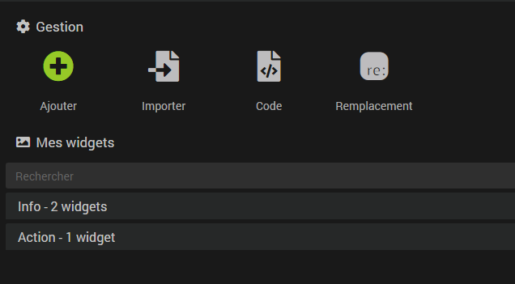
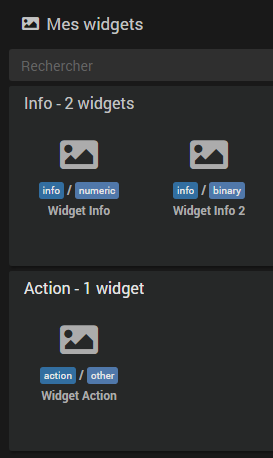
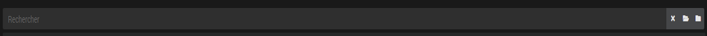
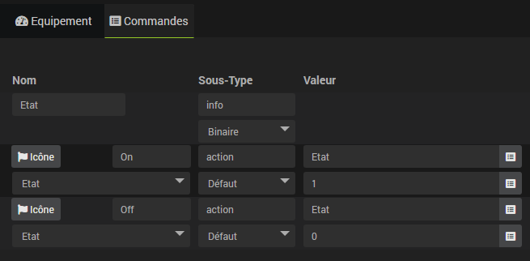

# Widgets

Un widget est la représentation graphique d'une commande sur le dashboard ou en version mobile. Le Core Jeedom attribue automatiquement un widget selon le type *(Info ou Action)* et le sous-type *(Binaire, Numérique, Autre, Curseur, etc.)* de la commande. Il est possible d'en sélectionner un autre parmi ceux disponibles via la configuration avancée de la commande, onglet "Affichage" → "**Widget**".

## Widgets par défaut

Voici les widgets intégrés au Core Jeedom, leurs usages et leurs paramètres de personnalisation.

### Commandes

La plupart des widgets exposent des **paramètres optionnels** permettant d'ajuster leur rendu sans créer de widget personnalisé : couleur, échelle, comportement, etc. Ils se configurent dans la configuration avancée de la commande, onglet "Affichage" → section "**Paramètres optionnels widget**", sous forme de paires nom/valeur. Les paramètres disponibles varient selon le widget sélectionné et sont listés ci-dessous.

Le paramètre **`time`** (`duration` | `date`) est commun à tous les widgets *(sauf HygroThermographe)* et affiche respectivement la durée écoulée ou la date du dernier changement de valeur.

#### Info / Binaire

| Widget | Description | Paramètres optionnels |
|--------|-------------|----------------------|
| Shutter | Représentation visuelle d'un volet avec position en % | `color` |
| Alert | Coche verte (ON) / alerte rouge (OFF) | |
| Door | Porte fermée verte (ON) / porte ouverte rouge (OFF) | |
| Flood | Goutte d'eau barrée verte (ON) / goutte d'eau bleue (OFF) | |
| Heat | Flamme rouge (ON) / croix (OFF) | |
| Icon | Coche verte (ON) / croix rouge (OFF) | |
| Light | Ampoule allumée jaune (ON) / ampoule éteinte (OFF) | |
| Line | Coche verte (ON) / croix rouge (OFF), affichage inline avec le nom | |
| Lock | Cadenas fermé (ON) / cadenas ouvert rouge (OFF) | |
| Presence | Coche verte (ON) / icône mouvement rouge (OFF) | |
| Prise | Icône prise (ON) / croix (OFF) | |
| Window | Fenêtre fermée verte (ON) / fenêtre ouverte rouge (OFF) | |

#### Info / Numérique

| Widget | Description | Paramètres optionnels |
|--------|-------------|----------------------|
| Badge | Valeur affichée dans un badge coloré | `color`, `fontcolor` |
| Compass | Boussole indiquant une direction en degrés | `needle_color`, `ns_color`, `oe_color`, `scale` |
| Gauge | Jauge en arc de cercle | `color` |
| Horizontal | Barre de progression horizontale | `color` |
| HygroThermographe | Affichage combiné température et humidité *(widget multi-commandes, sans `time`)* | `scale` |
| Light | Icône d'ampoule (allumée/éteinte selon la valeur) avec valeur et unité | |
| Line | Nom, valeur et unité affichés sur une seule ligne (format compact) | |
| Rain | Niveau d'eau ou de précipitations | `color`, `scale`, `showRange`, `animate` |
| Shutter | Volet avec curseur de position en % | `color`, `invert` |
| Tile | Nom affiché en titre au-dessus de la valeur et de l'unité | |
| Vertical | Barre de progression verticale | `color` |
| HeatPiloteWire | Fil pilote 4 états : confort, hors-gel, éco, arrêt | |
| HeatPiloteWireQubino | Fil pilote Qubino : 6 paliers de confort/éco/hors-gel/arrêt | |

#### Info / Autre

| Widget | Description | Paramètres optionnels |
|--------|-------------|----------------------|
| Badge | Valeur texte dans un badge coloré | `color`, `fontcolor` |
| ButtonImage | Bouton ouvrant en modal l'image dont l'URL est la valeur de la commande | |
| Color | Affiche la couleur correspondant à un code hexadécimal | `showValue` |
| Line | Nom et valeur texte affichés sur une seule ligne (format compact) | |
| Multiline | Valeur texte sur plusieurs lignes avec défilement | `maxHeight`, `minHeight`, `backgroundColor` |
| Tile | Nom affiché en titre au-dessus de la valeur texte | |

#### Action / Couleur

| Widget | Description | Paramètres optionnels |
|--------|-------------|----------------------|
| Default | Sélecteur de couleur complet (roue chromatique + valeur hex) | |
| Picker | Sélecteur de couleur simplifié | |

#### Action / Défaut

| Widget | Description | Paramètres optionnels |
|--------|-------------|----------------------|
| Alert | Icône clochette reflétant l'état de la commande liée (rouge = actif, verte barrée = inactif) | |
| BinaryDefault | Icône reflétant l'état de la commande liée (coche verte = actif, croix rouge = inactif) | |
| BinarySwitch | Interrupteur à bascule ON/OFF | `color`, `color_switch` |
| BtnAlert | Bouton avec icône clochette reflétant l'état de la commande liée | |
| Button | Bouton simple d'exécution | |
| Circle | Cercle plein (ON) / cercle vide (OFF) | |
| Fan | Ventilateur (ON) / croix (OFF) | |
| Garage | Garage fermé vert (ON) / garage ouvert rouge (OFF) | |
| Light | Ampoule allumée jaune (ON) / ampoule éteinte (OFF) | |
| Lock | Cadenas fermé (ON) / cadenas ouvert orange (OFF) | |
| Prise | Icône prise (ON) / croix (OFF) | |
| Sprinkle | Arrosage bleu (ON) / croix (OFF) | |
| Toggle | Interrupteur activé jaune (ON) / désactivé (OFF) | |
| ToggleLine | Interrupteur activé jaune (ON) / désactivé (OFF), affichage inline | |

#### Action / Curseur

| Widget | Description | Paramètres optionnels |
|--------|-------------|----------------------|
| Button | Curseur avec boutons + et − pour ajustement précis | `step`, `width` |
| Shutter | Curseur spécialisé pour la position d'un volet | `color`, `step`, `invert` |
| Slider | Curseur horizontal | `color`, `step` |
| SliderVertical | Curseur vertical | `color`, `step` |
| Value | Champ de saisie numérique direct | `color`, `step`, `noslider`, `width` |
| Light | Ampoule allumée jaune (ON) / ampoule éteinte (OFF) | |

#### Action / Liste

| Widget | Description | Paramètres optionnels |
|--------|-------------|----------------------|
| Select | Liste déroulante de valeurs prédéfinies | |

#### Action / Message

| Widget | Description | Paramètres optionnels |
|--------|-------------|----------------------|
| Input | Formulaire d'envoi d'un message avec titre et corps | `title`, `title_placeholder`, `title_possibility_list`, `title_disable`, `message_placeholder`, `message`, `message_disable` |

### Équipements

Les équipements (ou tuiles) possèdent certains paramètres de configuration accessibles via la configuration avancée de l'équipement, onglet "Affichage" → "**Paramètres optionnels sur la tuile**":

- **dashboard_class/mobile_class** : permet d'ajouter une class à l'équipement. Par exemple `col2` pour les équipements en version mobile va permettre de doubler la largeur du widget.

## Widgets personnalisés

La page Widgets, accessible par le menu **Outils → Widgets**, vous permet d'ajouter des widgets personnalisés en complément de ceux disponibles par défaut dans Jeedom.

Il existe deux types de widgets personnalisés :

- Les widgets *Core* basés sur un template. Ces widgets sont gérés par le Core de Jeedom et donc suivis par l'équipe de développement. Leur compatibilité est assurée avec les futures évolutions de Jeedom.
- Les widgets *Tiers* basés sur du code utilisateur. A la différence des widgets Core, l'équipe de développement Jeedom n'ayant pas le contrôle sur le code inséré dans ces widgets, leur compatibilité avec les évolutions à venir n'est pas garantie. Ces widgets nécessitent donc d'être maintenus par l'utilisateur.

### Gestion



Quatre options s’offrent à vous :
- **Ajouter** : Permet d'ajouter un widget *Core*.
- **Importer** : Permet d'importer un widget sous forme de fichier json précédemment exporté.
- **Code** : Accède à la page d'édition des widgets *Tiers*.
- **Remplacement** : Ouvre une fenêtre permettant de remplacer un widget par un autre sur tous les équipements l'utilisant.

### Mes widgets

Dans cette partie vous retrouverez l'ensemble des widgets que vous avez créés classés par type.



> **Astuce**
> Vous pouvez ouvrir un widget en faisant :
> - `Clic` sur l'un d'entre eux.
> - `Ctrl+Clic` ou `Clic+Centre` pour l'ouvrir dans un nouvel onglet du navigateur.

Le moteur de recherche vous permet de filtrer l'affichage des widgets selon différents critères (nom, type, sous-type, etc...). La touche `Echap` annule la recherche.



A droite du champ de recherche, trois boutons que l'on retrouve à plusieurs endroits dans Jeedom:

- **La croix** pour annuler la recherche.
- **Le dossier ouvert** pour déplier tous les panneaux et afficher les widgets.
- **Le dossier fermé** pour replier tous les panneaux et masquer les widgets.

Une fois sur la page de configuration d'un widget, un menu contextuel est accessible au `Clic Droit` sur les onglets du widget. Vous pouvez également utiliser un `Ctrl+Clic` ou `Clic+Centre` pour ouvrir directement un autre widget dans un nouvel onglet du navigateur.

### Création d'un widget

Une fois sur la page **Outils → Widgets** il vous faut cliquer sur le bouton "**Ajouter**" et donner un nom à votre nouveau widget.

Ensuite :
- Vous choisissez s’il s'applique sur une commande de type **Action** ou **Info**.
- En fonction du choix précédent, vous allez devoir **choisir le sous-type** de la commande.
- Enfin **le template** parmis ceux qui seront disponibles selon les choix précédents.
- Une fois le template choisi, Jeedom affiche les possibilités de configuration de celui-ci en-dessous.

### Les templates

#### Définition d'un template

Pour faire simple, c'est du code (HTML/JS), intégré au Core, dont certaines parties sont configurables par l'utilisateur via l'interface graphique du menu **Widgets**. A partir de la même base et en prenant en compte les éléments que vous allez renseigner dans le template, le Core va générer des widgets uniques correspondant à l'affichage que vous souhaitez obtenir.

Suivant le type de widget, vous pouvez généralement personnaliser les icônes, mettre les images de votre choix et/ou intégrer du code HTML.

Il existe deux types de template :

- Les "**simples**" : comme une icône/image pour le "**ON**" et une icône/image pour le "**OFF**".
- Les "**multistates**" : Cela permet de définir, par exemple, une image si la commande a pour valeur "**XX**" et une autre si supérieure à "**YY**" ou encore si inférieure à "**ZZ**". Fonctionne également pour les valeurs textuelles, une image si la valeur vaut "**toto**", une autre si "**plop**" et ainsi de suite...

#### Remplacement

C'est ce que l'on appelle un template simple, ici vous avez juste à dire que le "**ON**" correspond à telle icône/image *(à l'aide du bouton choisir)*, le "**OFF**" à telle autre icône/image, etc...

Les widgets Core de type remplacement disponibles sont :

| Widget | Types/Sous-types |
|--------|-----------------|
| Template Icon | Info/Binaire, Action/Défaut, Action/Curseur |
| Template Iconline | Info/Binaire, Action/Défaut |
| Template Img | Info/Binaire, Action/Défaut, Action/Curseur |

La case **Time widget**, si disponible, est équivalente au paramètre `time: duration` (voir [Commandes](#commandes)).

Pour les template utilisant des images, il vous est proposé de paramétrer la largeur du widget en pixel en fonction du support (**Largeur desktop** & **Largeur mobile**). Des images différentes peuvent également être sélectionnées selon le thème actif de Jeedom *(light ou dark)*.

>**Astuce**
>Pour les utilisateurs avancés il est possible de mettre des tags dans les valeurs de remplacement et de spécifier leur valeur dans la configuration avancée de la commande.
>Si, par exemple, dans **Largeur desktop** vous mettez comme valeur `#largeur_desktop#` (**attention à bien mettre les** `#` **autour**) puis dans la configuration avancée d'une commande, onglet affichage → "**Paramètres optionnels widget**" vous ajoutez le paramètre `largeur_desktop` (**sans les** `#`) et lui donnez la valeur "**90**", ce widget personnalisé sur cette commande aura une largeur de 90 pixels. Cela permet d'adapter la taille du widget à chaque commande sans avoir à  faire un widget spécifique à chaque fois.

#### Test

C'est ce que l'on appelle les templates multistates *(plusieurs états)*. Au lieu de mettre une image pour le "**ON** et/ou pour le "**OFF** comme dans le cas précèdent, vous allez affecter une icône en fonction de la validation d'une condition *(test)*. Si celle-ci est vraie alors le widget affichera l'icône/l'image en question.

Les widgets Core de type multistate disponibles sont :

| Widget | Types/Sous-types |
|--------|-----------------|
| Template Multistate | Info/Numérique, Info/Autre |
| Template Multistateline | Info/Autre |

Comme précédemment, différentes images peuvent être sélectionnées en fonction du thème actif sur Jeedom et la case **Time widget** permet d'afficher la durée depuis le dernier changement d'état.

Les tests sont sous la forme : `#value# == 1`, `#value#` sera automatiquement remplacé par la valeur actuelle de la commande. Vous pouvez aussi faire par exemple :

- `#value# > 1`
- `#value# >= 1 && #value# <= 5`
- `#value# == 'toto'`

>**Note**
>Il est indispensable de faire apparaitre les apostrophes (**'**) autour du texte à comparer si la valeur est un texte *(info/autre)*.

>**Note**
>Pour les utilisateurs avancés, il est possible d'utiliser aussi des fonctions javascript telle que `#value#.match("^plop")`, ici on teste si le texte commence par `plop`.

>**Note**
>Il est possible d'afficher la valeur de la commande dans le widget en précisant `#value#` dans le code HTML du test. Pour afficher l'unité ajoutez `#unite#`.

## Widget code

### Les tags

En mode code vous avez accès à différents tags pour les commandes, en voici une liste (pas forcément exhaustive) :

- **#name#** : nom de la commande
- **#valueName#** : nom de la valeur de la commande, et = #name# quand c'est une commande de type info
- **#minValue#** : valeur minimum que peut prendre la commande (si la commande est de type slider)
- **#maxValue#** : valeur maximum que peut prendre la commande (si la commande est de type slider)
- **#hide_name#** : vide ou hidden si l'utilisateur a demandé à masquer le nom du widget, à mettre directement dans une balise class
- **#id#** : id de la commande
- **#state#** : valeur de la commande, vide pour une commande de type action si elle n'est pas a liée à une commande d'état
- **#uid#** : identifiant unique pour cette génération du widget (si il y a plusieurs fois la même commande, cas des designs:  seul cet identifiant est réellement unique)
- **#valueDate#** : date de la valeur de la commande
- **#collectDate#** : date de collecte de la commande
- **#alertLevel#** : niveau d'alerte (voir [ici](https://github.com/Jeedom/core/blob/alpha/core/config/Jeedom.config.php#L67) pour la liste)
- **#hide_history#** : si l'historique (valeur max, min, moyenne, tendance) doit être masqué ou non. Comme pour le #hide_name# il vaut vide ou hidden, et peut donc être utilisé directement dans une class. IMPORTANT si ce tag n'est pas trouvé sur votre widget alors les tags #minHistoryValue#, #averageHistoryValue#, #maxHistoryValue# et #tendance# ne seront pas remplacés par Jeedom.
- **#minHistoryValue#** : valeur minimale sur la période (période définie dans la configuration de Jeedom par l'utilisateur)
- **#averageHistoryValue#** : valeur moyenne sur la période (période définie dans la configuration de Jeedom par l'utilisateur)
- **#maxHistoryValue#** : valeur maximale sur la période (période définie dans la configuration de Jeedom par l'utilisateur)
- **#tendance#** : tendance sur la période (période définie dans la configuration de Jeedom par l'utilisateur). Attention la tendance est directement une class pour icône : fas fa-arrow-up, fas fa-arrow-down ou fas fa-minus

### Mise à jour des valeurs

Lors d'une nouvelle valeur Jeedom va chercher dans la page si la commande est là et dans jeedom.cmd.update si il y a une fonction d'update. Si oui il l'appelle avec un unique argument qui est un objet sous la forme :

```
{display_value: '#state#', valueDate: '#valueDate#', collectDate: '#collectDate#', alertLevel: '#alertLevel#'}
```

Voila un exemple simple de code javascript à mettre dans votre widget :

```
<script>
    jeedom.cmd.addUpdateFunction('#id#', function(_options) {
      if (is_object(cmd = document.querySelector('.cmd[data-cmd_id="#id#"]'))) {
        cmd.setAttribute('title', '{{Date de valeur}}: ' + _options.valueDate + '<br>{{Date de collecte}}: ' + _options.collectDate)
        cmd.querySelector('.value').innerHTML = _options.display_value
        cmd.querySelector('.unit').innerHTML = _options.unit
      }
    }
    jeedom.cmd.refreshValue([{ cmd_id: '#id#', value: '#value#', display_value: '#state#', valueDate: '#valueDate#', collectDate: '#collectDate#', alertLevel: '#alertLevel#', unit: '#unite#' }])
</script>
```

Ici deux choses importantes :

```
jeedom.cmd.addUpdateFunction('#id#', function(_options) {
  if (is_object(cmd = document.querySelector('.cmd[data-cmd_id="#id#"]'))) {
    cmd.setAttribute('title', '{{Date de valeur}}: ' + _options.valueDate + '<br>{{Date de collecte}}: ' + _options.collectDate)
    cmd.querySelector('.value').innerHTML = _options.display_value
    cmd.querySelector('.unit').innerHTML = _options.unit
  }
}
```
La fonction est appelée lors d'une mise à jour du widget. Elle met alors à jour le code html du widget_template.

```
jeedom.cmd.refreshValue([{ cmd_id: '#id#', value: '#value#', display_value: '#state#', valueDate: '#valueDate#', collectDate: '#collectDate#', alertLevel: '#alertLevel#', unit: '#unite#' }])
```
 L'appel  à cette fonction pour l'initialisation du widget.

### Exemples

 Vous trouverez [ici](https://github.com/Jeedom/core/tree/master/core/template) des exemples de widgets (dans les dossiers dashboard et mobile)

## Toggle d'icône ON/OFF

Concernant les widgets pour interrupteurs *(on/off, allumer/éteindre, ouvrir/fermer, etc...)*, il peut-être considéré comme plus agréable visuellement de n'afficher qu'une icône reflétant l'état de l'appareil à contrôler.

Cette possibilité est utilisable aussi bien avec les widgets par défaut qu'avec les widgets personnalisés.

Pour se faire, il est nécessaire de prendre en compte 2 pré-requis :

- Les **2 commandes action/défaut** doivent être liées à une commande **info/binaire** qui se chargera de mémoriser l'état actuel de l'appareil.

>**Exemple**
>

>**Conseil**
>Décocher la case *"Afficher"* de la commande info/binaire qui n'aura pas besoin d'être affichée.

- Afin que le Core Jeedom soit en mesure d'identifier quelle commande correspond à quelle action, il est indispensable de respecter le nommage suivant pour les **2 commandes action/défaut** :
```
    'on':'on',
    'off':'off',
    'monter':'on',
    'descendre':'off',
    'ouvrir':'on',
    'ouvrirStop':'on',
    'ouvert':'on',
    'fermer':'off',
    'activer':'on',
    'desactiver':'off',
    'désactiver':'off',
    'lock':'on',
    'unlock':'off',
    'marche':'on',
    'arret':'off',
    'arrêt':'off',
    'stop':'off',
    'go':'on'
```

>**Astuce**
>Tant que le nom normalisé reste lisible il est possible d'adapter le nommage, par exemple *ouvrir_volet* ou *volet_fermer*, *marche_2* et *arret_2*, etc.
