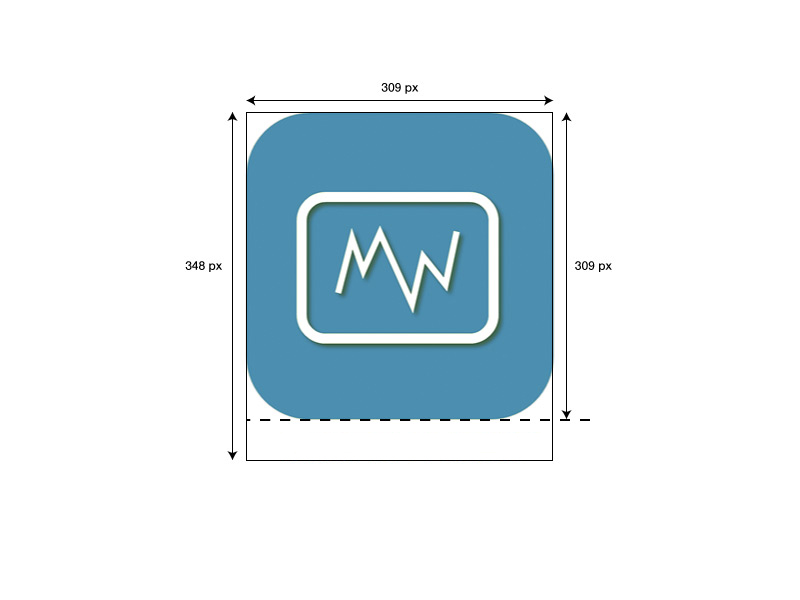

**Documentation icône de plugins**

Afin de pouvoir être publié sur le Market Jeedom, tout plugin doit disposer d’une icône.

Cette icône sera celle affichée pour les utilisateurs, sur le market et depuis l’interface Jeedom.

Il faut produire un fichier au format png, de 309 x 348 pixels.

Le nom du fichier est structuré ainsi : `<plugin-id>_icon.png`

Il doit être enregistré dans le dossier `/plugin-info/`

Ce fichier est obligatoire.

Nous vous remercions par avance de ne pas utiliser le même code couleur que les icônes des plugins officiels Jeedom.

Depuis 2020, il est recommandé de ne plus mettre le nom sous l'image (attention à garder quand même les mêmes tailles du modèle !)

Merci d'utiliser ce modèle (bords arrondi, taille, fond coloré, transparence autour etc..) :

