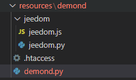

# Les démons & dépendances

## Introduction

Dans le [tutoriel](/fr_FR/dev/tutorial_plugin) et la [documentation](/fr_FR/dev/plugin_template) vous avez appris comment coder votre premier plugin avec des actions relativement simples déclenchées par l'utilisateur via une commande action ou par une tâche planifiée par le core (les crons).
Le plugin est alors capable de ponctuellement aller chercher de l'information (par exemple via requête http) ou de faire toute sortes d'opérations pour autant que cela puisse être codé en PHP.

Il va arriver que vous ayez besoin de plus que cela, quelques exemples sans être exhaustif:

- utiliser des resources systèmes, par exemple clé usb ou autres matériels (bluetooth...)
- maintenir une connexion avec un système distant (en réseau local ou sur internet mais pas jeedom)
- garder des processus actifs en arrière plan ce qui n'est pas le cas du code PHP qui ne "vit" que pendant l'exécution de la requête http
- faire un traitement en temps réel

Pour cela, la plupart du temps on utilise un "démon".
Pas de panique, tout est déjà prévu dans le core de jeedom pour nous aider à mettre ce démon en place et on va détailler cela ici.

## Structure des fichiers d'un démon

Le code et/ou l'exécutable de votre démon doit évidement se trouver dans l'arborescence de votre plugin et doit donc être inclus et livré avec l'archive lors de l'installation d'un plugin.
Il n'y a pas de règle stricte sur l'emplacement exact de votre démon, cependant la convention veut que l'on place celui-ci dans le sous-répertoire `./resources/` du plugin.

Dans le plugin template vous trouverez les bases pour implémenter un démon en python et c'est l'exemple que l'on va utiliser dans cette documentation cependant vous êtes libre de développer votre démon dans le langage de votre choix à condition qu'il puisse être exécuté sur les [plateformes supportées par Jeedom](/fr_FR/compatibility/).
La plupart des démons des plugins Jeedom sont en python ou nodeJs mais il en existe aussi en .netCore et certainement d'autres technos.

Vous trouverez également quelques méthodes utiles pour un démon en nodeJs qui seront peut-être détaillées dans une prochaine version de cette documentation. Pour l'instant je vous invite à consulter le community dev pour vous aligner avec les autres développeurs sur tout ce qui concerne NodeJs, principalement sur la version à utiliser.

Structure du répertoire du template:



### le démon python

Dans le plugin template, le répertoire du démon a été nommé `demond`, et le démon en lui même se nomme `demond.py`.
Ces noms sont arbitraires, libre à vous de les changer.
La convention est de prendre l'ID du plugin suivi de la lettre ´d´. Ce qui donne par exemple pour le plugin `blea` le répertoire `./resources/blead/` qui contient entre autre le fichier `blead.py`, ce fichier étant le point de départ du démon.

> **TIP**
>
> N'hésitez pas à vous inspirer des plugins officiels avec démon pour comprendre les détails, tel que blea, openzwave ou sms.

### le package jeedom pour un démon python

Jeedom fournit avec le plugin template un package python offrant les classes et méthodes de bases utiles pour la gestion du démon et de la communication entre le démon et le code php de votre plugin.
Ces classes se trouvent dans le répertoire `./resources/demond/jeedom/jeedom.py` (visible dans la capture ci-dessus).
Pour démarrer vous n'avez pas besoin de connaître les détails d'implémentations de ces classes et méthodes donc ici vous aurez juste un résumé de ce qu'elles permettent.

#### class jeedom_utils()

Cette classe est un ensemble de méthodes statiques utiles telle que `convert_log_level` pour convertir le loglevel reçu de jeedom en un log level de la class python `logging` ou `find_tty_usb` pour retourner une liste de device sur le système.
On ne va pas toutes les détailler ici, le nom de chacune des méthodes est assez explicite, vous les découvrirez en vous plongeant dans le code.

#### class jeedom_serial()

Cette class encapsule la lecture et l'écriture sur un device.
De nouveau on ne va pas détailler la classe, les méthodes parlent d'elles-mêmes, sachez juste que ca existe si vous en avez besoin.

> **Attention**
>
> Si votre démon n'a pas besoin de faire ce type d'action, il faudra penser à ne pas utiliser ni importer cette classe car le package python `serial` n'est pas installé par défaut et dans ce cas votre démon ne démarrera pas (problème vu plusieurs fois sur community). On y reviendra dans la gestion des dépendances.

#### class jeedom_socket() & jeedom_socket_handler()

Vous n'utiliserez pas la classe `jeedom_socket_handler()` directement, elle ne sert qu'à `jeedom_socket()`.
Le but de `jeedom_socket()` est d'assurer une communication descendante (de votre code php vers le démon).
Lorsque votre plugin devra envoyer une instruction à votre démon il pourra le faire via ce socket, vous verrez un exemple plus tard dans cette documentation.

Donc la class ouvre un socket tcp et écoute. Quand un message est reçu il est mis dans une queue qui sera lue par après par votre démon, on y reviendra.

A nouveau, vous n'êtes pas obligé d'utiliser ce mécanisme, vous êtes libre de créer autre chose (server http par exemple) mais c'est ce qui est fournit de base par Jeedom, c'est léger et ca fonctionne très bien.

#### class jeedom_com()

Celle-ci assure la communication montante, du démon vers votre code php.
Vous utiliserez essentiellement `send_change_immediate()` au début qui permet donc d'envoyer un payload json à jeedom via une requête http. C'est très simple et efficace, on verra un exemple plus tard.

### Squelette du démon python

A présent que l'on connaît l'environnement, on peut regarder la partie qui nous intéresse le plus: le démon et ce qu'on va devoir coder.

On va donc regarder en détails le squelette d'un démon tel que proposé par Jeedom, ouvrez le fichier `demond.py` et on va commencer par les dernières lignes qui sont en fait le début du programme:

```python
_log_level = "error"
_socket_port = 55009 # à modifier
_socket_host = 'localhost'
_device = 'auto'
_pidfile = '/tmp/demond.pid'
_apikey = ''
_callback = ''

for arg in sys.argv:
    if arg.startswith("--loglevel="):
        temp, _log_level = arg.split("=")
    elif arg.startswith("--socketport="):
        temp, _socket_port = arg.split("=")
    elif arg.startswith("--sockethost="):
        temp, _socket_host = arg.split("=")
    elif arg.startswith("--pidfile="):
        temp, _pidfile = arg.split("=")
    elif arg.startswith("--apikey="):
        temp, _apikey = arg.split("=")
    elif arg.startswith("--device="):
        temp, _device = arg.split("=")

_socket_port = int(_socket_port)

jeedom_utils.set_log_level(_log_level)

logging.info('Start demond')
logging.info('Log level : '+str(_log_level))
logging.info('Socket port : '+str(_socket_port))
logging.info('Socket host : '+str(_socket_host))
logging.info('PID file : '+str(_pidfile))
logging.info('Apikey : '+str(_apikey))
logging.info('Device : '+str(_device))

signal.signal(signal.SIGINT, handler)
signal.signal(signal.SIGTERM, handler)

try:
    jeedom_utils.write_pid(str(_pidfile))
    jeedom_com = jeedom_com(apikey = _apikey,url = _callback,cycle=_cycle)
    if not jeedom_com.test():
        logging.error('Network communication issues. Please fixe your Jeedom network configuration.')
        shutdown()
    jeedom_socket = jeedom_socket(port=_socket_port,address=_socket_host)
    listen()
except Exception as e:
    logging.error('Fatal error : '+str(e))
    shutdown()
```

Quelques initialisations de variable:

```python
_log_level = "error" # le log level par défaut, au format texte tel qu'il est envoyé par Jeedom
_socket_port = 55009 # le port que votre démon utilisera par défaut pour ouvrir le socket d'écoute de Jeedom, à modifier.
_socket_host = 'localhost' # l'interface sur laquelle ouvrir le socket, à priori ne pas changer.
_device = 'auto' # ne sert à rien si vous n'utilisez pas un device matériel
_pidfile = '/tmp/demond.pid' # emplacement par défaut du pidfile, ce fichier est utiliser par Jeedom pour savoir si votre démon est démarrer ou pas; nom du démon à modifier comme expliqué ci-dessus;
_apikey = '' # apikey pour authentifier la communication entre Jeedom et votre démon
_callback = '' ## l'url de callback pour envoyer les notifications à Jeedom (et à votre code php)
```

> **Attention**
>
> Il faut bien faire attention en choisissant le port que vous allez utiliser pour votre socket, c'est un point d'amélioration possible sous jeedom, car il n'y a pas de mécanisme en place pour éviter les collisions: donc si un autre plugin utilise le même port que vous cela va évidement poser un problème. Pour l'instant la seule méthode pour faire son choix est de chercher parmi les plugins existant les ports déjà utilisés et de s'aligner entre dev sur community (il y a déjà des sujets ouverts à ce propos). Par ailleurs il est important de laisser ceci configurable par l'utilisateur dans la configuration de votre plugin pour que le numéro de port puisse être modifié si un tel conflit devait se produire.

Ensuite on récupère les arguments reçus en ligne de commande, cette ligne de commande sera générée par votre code php, on y reviendra.
A vous de supprimer ce qui n'est pas utile (comme l'argument device) ou d'en rajouter d'autres tel qu'un user/pswd si votre démon doit se connecter sur un système distant.

```python
for arg in sys.argv:
    if arg.startswith("--loglevel="):
        temp, _log_level = arg.split("=")
    elif arg.startswith("--socketport="):
        temp, _socket_port = arg.split("=")
    elif arg.startswith("--sockethost="):
        temp, _socket_host = arg.split("=")
    elif arg.startswith("--pidfile="):
        temp, _pidfile = arg.split("=")
    elif arg.startswith("--apikey="):
        temp, _apikey = arg.split("=")
    elif arg.startswith("--device="):
        temp, _device = arg.split("=")
```

Ensuite il y a quelques lignes de log et ces deux lignes, classique en python, qui enregistrent simplement la méthode à appeler dans le cas où ces deux signaux d'interruptions sont reçus, ce qui permettra de stopper le démon:

```python
signal.signal(signal.SIGINT, handler)
signal.signal(signal.SIGTERM, handler)
```

et la méthode `handler` qui est définie un peu plus haut dans le démon:

```python
def handler(signum=None, frame=None):
    logging.debug("Signal %i caught, exiting..." % int(signum))
    shutdown()
```

qui ne fait que rajouter un log et appeler la méthode `shutdown()` définie juste en dessous:

```python
def shutdown():
    logging.debug("Shutdown")
    logging.debug("Removing PID file " + str(_pidfile))
    try:
        os.remove(_pidfile)
    except:
        pass
    try:
        jeedom_socket.close()
    except:
        pass
    try:
        jeedom_serial.close()
    except:
        pass
    logging.debug("Exit 0")
    sys.stdout.flush()
    os._exit(0)
```

C'est dans cette méthode que vous devez écrire le code à exécuter en cas de shutdown du démon, par exemple faire un logout du système distant et fermer proprement les connexions ouvertes.

> **Attention**
>
> vous devez adapter cette méthode et supprimer le code qui n'est pas nécessaire dans votre cas, notamment le try/except sur `jeedom_serial.close()` si vous n'utilisez pas cette classe.

Si on retourne sur le démarrage du démon, voici la suite commentée:

```python
try:
    jeedom_utils.write_pid(str(_pidfile)) # écrit le pidfile que le core de jeedom va surveiller pour déterminer si le démon est démarré
    jeedom_com = jeedom_com(apikey = _apikey,url = _callback,cycle=_cycle) # création de l'objet jeedom_com
    if not jeedom_com.test(): #premier test pour vérifier que l'url de callback est correcte
        logging.error('Network communication issues. Please fixe your Jeedom network configuration.')
        shutdown()
    jeedom_socket = jeedom_socket(port=_socket_port,address=_socket_host) # on déclare le socket pour recevoir les ordres de jeedom
    listen() # et on écoute
except Exception as e:
    logging.error('Fatal error : '+str(e))
    shutdown()
```

La méthode `listen()` définie au début du fichier:

```python
def listen():
    jeedom_socket.open()
    try:
        while 1:
            time.sleep(0.5)
            read_socket()
    except KeyboardInterrupt:
        shutdown()
```

Rien à modifier ici, on peut voir que le socket est ouvert et ensuite une boucle infinie pour lire toutes les demi-secondes le socket

La méthode `read_socket()`

```python
def read_socket():
    global JEEDOM_SOCKET_MESSAGE
    if not JEEDOM_SOCKET_MESSAGE.empty():
        logging.debug("Message received in socket JEEDOM_SOCKET_MESSAGE")
        message = json.loads(jeedom_utils.stripped(JEEDOM_SOCKET_MESSAGE.get()))
        if message['apikey'] != _apikey:
            logging.error("Invalid apikey from socket : " + str(message))
            return
        try:
            print 'read'
        except Exception, e:
            logging.error('Send command to demon error : '+str(e))
```

La variable `JEEDOM_SOCKET_MESSAGE` est une `queue()` python alimentée par la class `jeedom_socket()` comme vu précédemment.

Si la queue n'est pas vide, on charge le json et on vérifie que la clé api reçue avec le message correspond à celle reçue lors du démarrage du démon (`_apikey`) ensuite on peut lire le message et faire nos actions dans le try/except:

```python
        try:
            print 'read'
        except Exception, e:
            logging.error('Send command to demon error : '+str(e))
```

Donc à la place du `print 'read'` à vous de lire les éléments relevants du message que votre plugin aura envoyé et de déclencher les actions ou d'appeler vos classes ou méthodes propres à votre plugin.

A partir d'ici vous avez un démon qui peut être exécuté même s'il ne fait encore rien (ça c'est votre travail).

## Adaptation du code php du plugin

Avoir un démon et comprendre sa structure c'est très bien mais il manque quelques éléments clés pour que justement votre plugin (code php) puisse contrôler ce démon et pour que le core soit également informé qu'il existe.

### plugin_info/info.json

Dans le fichier info.json de votre plugin, il faut rajouter la propriété `hasOwnDeamon` et attribuer la valeur `true`, exemple:

```json
{
    "id" : "pluginID",
    "name" : "pluginName",
    ...
    "hasDependency" : true,
    "hasOwnDeamon" : true,
    "maxDependancyInstallTime" : 10,
    ...
}
```

Nous verrons plus tard l'utilisation de `hasDependency` et `maxDependancyInstallTime`.

### Gestion du démon dans votre class eqLogic

Dans la class eqLogic de votre plugin il y a quelques méthodes à implémenter pour la bonne gestion du démon.

#### Fonction deamon_info()

La fonction `deamon_info()` sera appelée par le core lors de l'affichage du cadre suivant dans la page de configuration de votre plugin, elle doit obligatoirement exister:


Typiquement elle ressemblera à ceci, l'array renvoyé et les clés utilisées dans cet array sont évidement importants.
Vous pouvez copier/coller le code ci-dessous tel quel et adapter le code à la fin de la fonction pour vérifier la configuration nécessaire à votre plugin.

```php
    public static function deamon_info() {
        $return = array();
        $return['log'] = __CLASS__;
        $return['state'] = 'nok';
        $pid_file = jeedom::getTmpFolder(__CLASS__) . '/deamon.pid';
        if (file_exists($pid_file)) {
            if (@posix_getsid(trim(file_get_contents($pid_file)))) {
                $return['state'] = 'ok';
            } else {
                shell_exec(system::getCmdSudo() . 'rm -rf ' . $pid_file . ' 2>&1 > /dev/null');
            }
        }
        $return['launchable'] = 'ok';
        $user = config::byKey('user', __CLASS__); // exemple si votre démon à besoin de la config user,
        $pswd = config::byKey('password', __CLASS__); // password,
        $clientId = config::byKey('clientId', __CLASS__); // et clientId
        if ($user == '') {
            $return['launchable'] = 'nok';
            $return['launchable_message'] = __('Le nom d\'utilisateur n\'est pas configuré', __FILE__);
        } elseif ($pswd == '') {
            $return['launchable'] = 'nok';
            $return['launchable_message'] = __('Le mot de passe n\'est pas configuré', __FILE__);
        } elseif ($clientId == '') {
            $return['launchable'] = 'nok';
            $return['launchable_message'] = __('La clé d\'application n\'est pas configurée', __FILE__);
        }
        return $return;
    }
```

> **Attention**
>
> Il n'y a pas de faute de frappe dans l'exemple, la méthode se nomme bien `deamon_info()` et pas `daemon_info`, l'erreur est dans le core.

La clé `state` correspond évidement au statut affiché à l'écran, on peut lire ci-dessus que l'on teste la présence de notre "pid_file" pour savoir si le démon tourne ou pas.

La clé `launchable` correspond à la colonne "Configuration" dans le cadre et on peut donc vérifier si la configuration est complète et correcte pour pouvoir démarrer le démon. `launchable_message` permet d'afficher un message à l'utilisateur en cas de "NOK"

#### Fonction deamon_start()

La fonction `deamon_start()` est comme son nom l'indique la méthode qui sera appelée par le core pour démarrer votre démon.
Vous pouvez copier/coller le code ci-dessous tel quel et modifier les lignes indiquées.

```php
    public static function deamon_start() {
        self::deamon_stop();
        $deamon_info = self::deamon_info();
        if ($deamon_info['launchable'] != 'ok') {
            throw new Exception(__('Veuillez vérifier la configuration', __FILE__));
        }

        $path = realpath(dirname(__FILE__) . '/../../resources/demond'); // répertoire du démon à modifier
        $cmd = system::getCmdPython3(__CLASS__) . " {$path}/demond.py"; // nom du démon à modifier
        $cmd .= ' --loglevel ' . log::convertLogLevel(log::getLogLevel(__CLASS__));
        $cmd .= ' --socketport ' . config::byKey('socketport', __CLASS__, '55009'); // port par défaut à modifier
        $cmd .= ' --callback ' . network::getNetworkAccess('internal', 'http:127.0.0.1:port:comp') . '/plugins/template/core/php/jeeTemplate.php'; // chemin de la callback url à modifier (voir ci-dessous)
        $cmd .= ' --user "' . trim(str_replace('"', '\"', config::byKey('user', __CLASS__))) . '"'; // on rajoute les paramètres utiles à votre démon, ici user
        $cmd .= ' --pswd "' . trim(str_replace('"', '\"', config::byKey('password', __CLASS__))) . '"'; // et password
        $cmd .= ' --apikey ' . jeedom::getApiKey(__CLASS__); // l'apikey pour authentifier les échanges suivants
        $cmd .= ' --pid ' . jeedom::getTmpFolder(__CLASS__) . '/deamon.pid'; // et on précise le chemin vers le pid file (ne pas modifier)
        log::add(__CLASS__, 'info', 'Lancement démon');
        $result = exec($cmd . ' >> ' . log::getPathToLog('template_daemon') . ' 2>&1 &'); // 'template_daemon' est le nom du log pour votre démon, vous devez nommer votre log en commençant par le pluginid pour que le fichier apparaisse dans la page de config
        $i = 0;
        while ($i < 20) {
            $deamon_info = self::deamon_info();
            if ($deamon_info['state'] == 'ok') {
                break;
            }
            sleep(1);
            $i++;
        }
        if ($i >= 30) {
            log::add(__CLASS__, 'error', __('Impossible de lancer le démon, vérifiez le log', __FILE__), 'unableStartDeamon');
            return false;
        }
        message::removeAll(__CLASS__, 'unableStartDeamon');
        return true;
    }
```

Ne modifiez que les lignes ayant un commentaire, le reste doit rester inchangé.

Notez que l'on commence par stopper le démon, ceci pour gérer le redémarrage.
Ensuite on vérifie si le démon peut effectivement être démarré avec la méthode `deamon_info()` et on génère la ligne de commande dans la variable `$cmd` pour démarrer notre démon, ici avec python3. Notez l'utilisation de la fonction `system::getCmdPython3(__CLASS__)` qui retournera le chemin vers python3 à utiliser ceci afin d'être compatible avec Debian 12 si vos dépendances sont installées par le core.

#### Fonction deamon_stop()

Cette méthode sera utilisée pour stopper le démon: on récupère le pid du démon, qui a été écrit dans le "pid_file" et on envoi le kill système au process.

```php
    public static function deamon_stop() {
        $pid_file = jeedom::getTmpFolder(__CLASS__) . '/deamon.pid'; // ne pas modifier
        if (file_exists($pid_file)) {
            $pid = intval(trim(file_get_contents($pid_file)));
            system::kill($pid);
        }
        system::kill('templated.py'); // nom du démon à modifier
        sleep(1);
    }
```

Arrivé ici vous avez déclaré le démon dans le info.json et implémenté les 3 méthodes nécessaires pour que le core de Jeedom puisse démarrer et arrêter votre démon ainsi qu'afficher son statut. Les prérequis sont en places.

### Communication entre le démon et le code PHP

Il reste à gérer la communication depuis et vers le démon. Dans le code python on a déjà vu comment c'était géré: pour rappel la méthode `listen()` et `read_socket()` qui écoute sur un socket et la méthode `send_change_immediate()` pour envoyer un payload json au code php.

Il faut donc gérer l'équivalent coté PHP.

#### Envoyer un message au démon

Cette fonction n'existe pas dans le core et n'est pas standard pour tous les plugins Jeedom, elle n'est pas obligatoire non plus.
C'est la fonction que j'utilise moi (@Mips) dans chacun de mes plugins ayant un démon, je vous la met ici et vous en faite ce que vous voulez ;-)

Elle reçoit donc en paramètre un tableau de valeur et se charge de l'envoyer au socket du démon qui pourra donc lire ce tableau dans la méthode `read_socket()` que l'on a vu précédemment.

```php
    public static function sendToDaemon($params) {
        $deamon_info = self::deamon_info();
        if ($deamon_info['state'] != 'ok') {
            throw new Exception("Le démon n'est pas démarré");
        }
        $params['apikey'] = jeedom::getApiKey(__CLASS__);
        $payLoad = json_encode($params);
        $socket = socket_create(AF_INET, SOCK_STREAM, 0);
        socket_connect($socket, '127.0.0.1', config::byKey('socketport', __CLASS__, '55009')); //port par défaut de votre plugin à modifier
        socket_write($socket, $payLoad, strlen($payLoad));
        socket_close($socket);
    }
```

Ce qui se trouvent dans le tableau `$params` et comment vous exploitez ces données dans votre démon est de votre ressort, cela dépend de ce que fait votre plugin.

Pour rappel, ce tableau sera donc récupéré dans la méthode `read_socket()`; extrait du code python:

```python
        if message['apikey'] != _apikey:
            logging.error("Invalid apikey from socket : " + str(message))
            return
        try:
            print 'read'
        except Exception, e:
            logging.error('Send command to demon error : '+str(e))
```

On voit bien la clé "apikey" ajoutée par le code php qui sera lue par le code python dans le tableau "message"

#### Réceptionner un message du démon

Pour cela on doit ajouter un fichier à notre plugin dans le dossier `./core/php/`. Par convention, on va nommer ce fichier `jee[pluginId].php`. `/plugins/[pluginId]/core/php/jee[pluginId].php` sera donc le chemin à utiliser comme url de callback dans la méthode `deamon_start()`

Voici le contenu de base que vous pouvez copier/coller dans ce fichier:

```php
<?php

try {
    require_once dirname(__FILE__) . "/../../../../core/php/core.inc.php";

    if (!jeedom::apiAccess(init('apikey'), 'template')) { //remplacez template par l'id de votre plugin
        echo __('Vous n\'êtes pas autorisé à effectuer cette action', __FILE__);
        die();
    }
    if (init('test') != '') {
        echo 'OK';
        die();
    }
    $result = json_decode(file_get_contents("php://input"), true);
    if (!is_array($result)) {
        die();
    }

    if (isset($result['key1'])) {
        // do something
    } elseif (isset($result['key2'])) {
        // do something else
    } else {
        log::add('template', 'error', 'unknown message received from daemon'); //remplacez template par l'id de votre plugin
    }
} catch (Exception $e) {
    log::add('template', 'error', displayException($e)); //remplacez template par l'id de votre plugin
}
```

Le code commence par valider que l'apikey est correcte:

```php
    if (!jeedom::apiAccess(init('apikey'), 'template')) { //remplacez template par l'id de votre plugin
        echo __('Vous n\'êtes pas autorisé à effectuer cette action', __FILE__);
        die();
    }
```

Le premier test sert de méthode de test lors du démarrage du démon (voir appel `jeedom_com.test()` dans le code du démon):

```php
    if (init('test') != '') {
        echo 'OK';
        die();
    }
```

et finalement on charge le payload que l'on décode dans le tableau `$result`:

```php
    $result = json_decode(file_get_contents("php://input"), true);
    if (!is_array($result)) {
        die();
    }
```

Ensuite c'est à vous de lire le tableau et d'effectuer les actions dans votre plugin en conséquence, exemple:

```php
    if (isset($result['key1'])) {
        // do something
    } elseif (isset($result['key2'])) {
        // do something else
    } else {
        log::add('template', 'error', 'unknown message received from daemon'); //remplacez template par l'id de votre plugin
    }
```

Le code python pour envoyer le message ressemblera à ceci:

```python
jeedom_com.send_change_immediate({'key1' : 'value1', 'key2' : 'value2' })
```

Voila, vous avez un démon complètement fonctionnel et vous pouvez communiquer dans les deux sens entre votre démon et votre code php, Le plus dur reste à faire: coder la logique du démon.

## Les dépendances

Lorsque l'on va écrire un démon, on va très souvent avoir besoin de librairies externes en plus de nos propres classes.

Sous Debian, typiquement, on va utiliser l'outils apt pour installer les paquets nécessaires et pour python3, on va utiliser pip3.

Et pour gérer cela, encore une fois, tout est prévu dans le core de Jeedom pour nous aider via deux méthodes distinctes:

1. La méthode par procédures.
   Cette méthode était la seule méthode possible avec les versions de jeedom antérieures à la 4.2
1. La méthode par fichier json de configuration.
   Cette méthode est apparue avec la version 4.2 du core de Jeedom.

Les deux méthodes peuvent être implémentées dans un même plugin.

- Si les deux méthodes sont implémentées dans un plugin:
  - Les core avant 4.2 utiliseront la méthode par procédures.
  - Les core 4.2 et suivants utiliseront la méthode par fichier de configuration json.
- Si seule la méthode par procédures est implémentée dans un plugin:
  - Tous les core utiliseront cette méthode.
- Si seule la méthode par fichier de configuration json est implémentée dans un plugin.
  - Le plugin ne sera pas compatible avec les versions du core antérieures à la 4.2

Les deux méthodes ont leurs avantages et désavantages. A vous de choisir selon votre situation.

### Déclaration dans plugin_info/info.json

Dans les deux cas, vous devez adapter votre fichier `info.json`.
Même exemple que pour la déclaration du démon, il faut rajouter la propriété `hasDependency` et attribuer la valeur `true`:

```json
{
    "id" : "pluginID",
    "name" : "pluginName",
    ...
    "hasDependency" : true,
    "hasOwnDeamon" : true,
    "maxDependancyInstallTime" : 30,
    ...
}
```

La propriété `maxDependancyInstallTime` est le délai en minute après lequel le core considérera que l'installation n'a pas aboutie.
 Dans ce cas, le mode auto du démon sera désactivé et un message sera posté dans le centre de notification.
 Si cette propriété n'est pas définie, le délai par défaut sera de 30min.

> **TIP**
>
> Le script d'installation ne sera pas interrompu donc il se peut que celui-ci finisse par se terminer avec succès. Il s'agit uniquement du délai après lequel le core n'attend plus et n'affiche plus la progression.

### La méthode par fichier de configuration json

#### Création du fichiers plugin_info/packages.json

La syntaxe de ce fichier est décrite ici. Voir aussi
[l'article de lancement sur le blog](https://blog.jeedom.com/6170-introduction-jeedom-4-2-installation-de-dependance/).

Ce fichier peut contenir l'une ou l'autre des sections suivantes:

##### pre-install: le chemin vers un script à exécuter avant l'installation

Exemple :

```json
{
  "pre-install" : {
    "script" : "plugins/[pluginID]/resources/post-install.sh"
  }
```

##### post-install

Cela peut être  le chemin vers un script à exécuter après l'installation, ou bien l'action de restart apache.
Exemple :

```json
{
  "post-install" : {
    "restart_apache" : true,
    "script" : "plugins/[pluginID]/resources/post-install.sh"
  }
```

##### apt: dépendances Debian

Exemple

```json
{
  "apt" : {
    "libav-tools" : {"alternative" : ["ffmpeg"]},
    "ffmpeg" : {"alternative" : ["libav-tools"]},
    "python-pil" : {},
    "php-gd" : {}
  }
}
```

Pour chaque package, on peut spécifier `version` pour fixer une version, `alternative` si disponible,
 `optional` si c'est optionel, `reinstall` pour forcer la re-installation du package, `remark` pour ajouter un commentaire libre.

##### pip3: dépendances Python3

Exemple:

```json
{
  "apt" : {
    "python3-pyudev" : {},
    "python3-requests" : {},
    "python3-dev" : {}
  },
  "pip3" : {
    "wheel" : {},
    "pyserial" : {},
    "tornado" : {},
    "zigpy" : {"reinstall" : true},
    "zha-quirks" : {"reinstall" : true},
    "zigpy-znp" : {"reinstall" : true},
    "zigpy-xbee" : {"reinstall" : true},
    "zigpy-deconz" : {"reinstall" : true},
    "zigpy-zigate" : {"reinstall" : true},
    "zigpy-cc" : {"reinstall" : true},
    "bellows" : {"reinstall" : true}
  }
}
```

##### npm: les dépendances pour NodeJS

Pour NodeJS les dépendances sont dans un autre fichier `packages.json` dans un format qui lui est propre,
placé dans le répertoire `/resources` par exemple, c'est ce fichier qui sera indiqué dans celui de Jeedom:

```json
{
  "apt" : {
    "nodejs" : {}
  },
  "npm" : {
    "plugins/dyson/resources/dysond"  : {}
  }
}
```

##### composer: pour installer une autre dépendance PHP

pas d'exemple sous la main; la syntaxe est similaire aux autres packages, avec le mot-clé `composer`.

##### Dépendances sur un autre plugin

Si un plugin requiert l'installation d'un autre plugin, c'est possible aussi avec la syntaxe suivante;
il faut que le plugin soit gratuit, ou bien déjà acheté :

```json
{
    "plugin":{
        "mqtt2": {}
    }
}
```

### La méthode par procédures

Il y 2 prérequis que nous allons détailler tout de suite.

#### Installation des dépendances

Dans votre classe eqLogic vous devez rajouter cette fonction si elle n'existe pas. Vous pouvez copier/coller celle-ci tel quel sans rien modifier

```php
    public static function dependancy_install() {
        log::remove(__CLASS__ . '_update');
        return array('script' => dirname(__FILE__) . '/../../resources/install_#stype#.sh ' . jeedom::getTmpFolder(__CLASS__) . '/dependance', 'log' => log::getPathToLog(__CLASS__ . '_update'));
    }
```

Cette fonction commence par supprimer le log de l'installation précédente s'il existait et ensuite il va retourner au core la commande script à exécuter et l'emplacement du log.

Notez que le fichier script renvoyé est nommé `install_#stype#.sh`. En effet, `#stype#` sera remplacé dynamiquement par le core avec l'outil de gestion des paquets à utiliser en fonction du système sur lequel est installé Jeedom. Donc `#stype#` sera remplacé par `apt` sur un système Debian.
Cela permet de proposer des scripts d'installation des dépendances pour plusieurs systèmes et donc de supporter autre chose que Debian/apt qui est le strict minimum et le seul que l'on va gérer ici.

Le premier argument: `jeedom::getTmpFolder(__CLASS__) . '/dependance'` est le fichier qui sert au suivi de la progression de l'installation (le pourcentage qui apparaît à l'écran lors de l'installation).

C'est tout pour la partie php, à présent il faut créer le script dans `./resources/install_apt.sh` et évidemment le contenu du script va dépendre de votre plugin et des paquets que vous voulez installer.

Voici un exemple de script assez simple issu d'un de mes plugins mais vous pouvez en faire de beaucoup plus complet et évolué:

> **Attention**
>
> A partir de Debian 12, il est obligatoire d'installer les packages python dans un environnement virtuel, ce script exemple ne fonctionnera donc plus tel quel, à vous de l'adapter en conséquence.
>
> Je vous invite également à consulter cette documentation qui offre une alternative: <https://github.com/Mips2648/dependance.lib/blob/master/pyenv.md>

```bash
PROGRESS_FILE=/tmp/jeedom/template/dependance #remplacez template par l'ID de votre plugin

if [ ! -z $1 ]; then
    PROGRESS_FILE=$1
fi
touch ${PROGRESS_FILE}
echo 0 > ${PROGRESS_FILE}
echo "*************************************"
echo "*   Launch install of dependencies  *"
echo "*************************************"
echo $(date)
echo 5 > ${PROGRESS_FILE}
apt-get clean
echo 10 > ${PROGRESS_FILE}
apt-get update
echo 20 > ${PROGRESS_FILE}

echo "*****************************"
echo "Install modules using apt-get"
echo "*****************************"
apt-get install -y python3 python3-requests python3-pip python3-voluptuous python3-bs4
echo 60 > ${PROGRESS_FILE}

echo "*************************************"
echo "Install the required python libraries"
echo "*************************************"
python3 -m pip install "aiohttp"
echo 80 > ${PROGRESS_FILE}

echo 100 > ${PROGRESS_FILE}
echo $(date)
echo "***************************"
echo "*      Install ended      *"
echo "***************************"
rm ${PROGRESS_FILE}
```

On va détailler quelques lignes:

On commence par définir l'emplacement par défaut du fichier de progression au cas où on n'aurait pas réalisé correctement l'étape précédente...
Et on utilise le premier argument reçu comme emplacement parce qu'on a correctement fait l'étape précédente ;-).

```bash
PROGRESS_FILE=/tmp/jeedom/template/dependance #remplacez template par l'ID de votre plugin

if [ ! -z $1 ]; then
    PROGRESS_FILE=$1
fi
```

Les lignes du type `echo 60 > ${PROGRESS_FILE}` servent évidement à retourner la progression: pour rassurer l'utilisateur on en met régulièrement jusqu'à arriver à 100 (d'habitude ils stressent quand ca dépasse 100 alors on évite).

Quelques conseils:

- Ne faite pas de `apt-get upgrade`! Vous ne savez pas ce qu'il y a sur la machine et ce n'est pas à vous de tout mettre à jour.
- N'utilisez pas `apt` mais `apt-get`. `apt` est fait pour une utilisation en interactif et cela va générer un warning.
- Rajoutez le flag `-y` quand nécessaire pour confirmer les prompts sinon le script va stopper avec une demande du style `Do you want to continue [y/n]` et l'utilisateur sera bloqué.
- Préférez la syntaxe `python3 -m pip install ...` plutôt que `pip3 install ...` pour installer les paquets python car la deuxième causera des problèmes si `pip3` (ou `pip` si vous utilisez python v2) n'est pas lié à la même version que python3: si par exemple python3 pointe sur la version 3.7 et que pip3 pointe sur la 3.9 ou pire la 2.7; Vous ne savez pas ce qui a été fait sur le système et vous n'êtes pas à l'abris de tel problème sur la machine de l'utilisateur, il y a des dizaines de cas répertoriés sur community.

> **Attention**
>
> Il est très important d'installer tous les paquets nécessaires et de faire particulièrement attention à ceux qui sont très souvent déjà installés ... mais pas toujours. Il y fréquemment des problèmes avec les paquets `python3-requests`, `python3-pip` et/ou `serial`. Ceux-ci ne sont pas pré-installés sur une debian de base mais très souvent déjà installés par un autre plugin... sauf si votre plugin est le premier et dans ce cas votre démon ne démarrera pas. Cela arrive plus souvent qu'on ne pourrait le croire.

#### Connaître le statut


C'est donc notre fonction php `dependancy_install()` qui sera appelée par le core et qui permettra de lancer notre script `./resources/install_apt.sh` lorsque l'utilisateur cliquera sur le bouton "Relancer" ou automatiquement par le core lorsqu'il détectera que les dépendances ne sont soit pas installées, soit pas à jour.

Mais comment le core connaît-il le statut et comment l'affiche-t-il dans le cadre ci-dessus? Grâce à la fonction `dependancy_info()` que nous devons rajouter dans notre class eqLogic.

Voici un exemple dont vous pouvez reprendre la majorité:

```php
    public static function dependancy_info() {
        $return = array();
        $return['log'] = log::getPathToLog(__CLASS__ . '_update');
        $return['progress_file'] = jeedom::getTmpFolder(__CLASS__) . '/dependance';
        if (file_exists(jeedom::getTmpFolder(__CLASS__) . '/dependance')) {
            $return['state'] = 'in_progress';
        } else {
            if (exec(system::getCmdSudo() . system::get('cmd_check') . '-Ec "python3\-requests|python3\-voluptuous|python3\-bs4"') < 3) { // adaptez la liste des paquets et le total
                $return['state'] = 'nok';
            } elseif (exec(system::getCmdSudo() . 'pip3 list | grep -Ewc "aiohttp"') < 1) { // adaptez la liste des paquets et le total
                $return['state'] = 'nok';
            } else {
                $return['state'] = 'ok';
            }
        }
        return $return;
    }
```

Dans cette exemple on test la présence de paquets apt: `system::getCmdSudo() . system::get('cmd_check') . '-Ec "python3\-requests|python3\-voluptuous|python3\-bs4"'`. Ici on veut `python3-requests`, `python3-voluptuous` et `python3-bs4` et donc la commande doit retourner 3 d'où la comparaison: `< 3`.

Même chose pour les paquets python: `pip3 list | grep -Ewc "aiohttp"'`. La présence de `aiohttp` est validé, un seul paquet donc on compare: `< 1`;

> **Attention**
>
> A partir de Debian 12, il est obligatoire d'installer les packages python dans un environnement virtuel, cette commande ne fonctionnera donc plus tel quel, à vous de l'adapter en conséquence.

C'est donc très simple: la liste des paquets et le total sont les seuls éléments que vous devez modifier si vous n'avez que ce type de vérification sinon il faut sera facile de rajouter les autres tests relevants dans votre cas.
