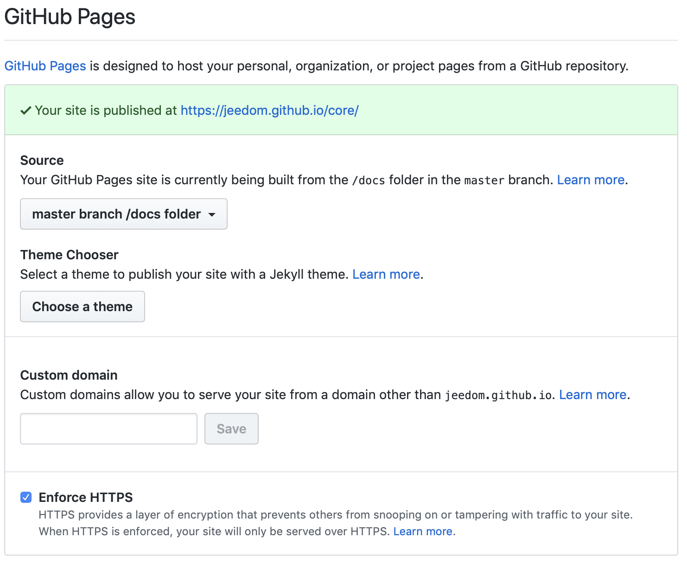

# Comment faire la documentation d'un plugin

## Principe

Le principe est très simple : la documentation du plugin doit être un simple lien web à indiquer dans votre fichier info.json (voir le détail [ici](structure_info_json) ) dans le champ documentation.

A noter que vous avez aussi un champ changelog qui doit fonctionner de la même manière que le champ documentation.

## Comment faire ?

Comme vu plus haut, vous devez juste indiquer dans le fichier info.json le lien http(s) vers votre documentation, vous êtes libre de la présentation, de l'hébergeur ou même du mode :

- un blog
- un simple serveur web
- github (seul méthode que nous verrons ici)

## Github

Le plus simple pour votre documentation est d'utiliser le système de page de github qui a l'avantage d'être très facile à utiliser.

### Langage de la documentation

Github support asciidoc et markedown (md) pour les pages, nous ne verrons ici que le markdown.

Nous n'allons pas vous décrire la syntaxe complète du markdown, d'autres sites le font déja très bien dont [celui-ci](https://guides.github.com/pdfs/markdown-cheatsheet-online.pdf)

### Emplacement

Dans votre plugin (hébergé sur github), nous vous recommandons de faire un dossier et d'y copier les fichiers et répertoires du dossier /docs dans le plugin template (voir [ici](plugin_template.md) )

Une fois cela fait, vous allez avoir un dossier fr_FR (le seul à modifier) dans le dossier /docs. Dans ce dossier, nous vous conseillons de faire 2 fichiers :

- ``changelog.md`` => votre changelog
- ``index.md`` => votre documentation

### Mise en ligne

La mise en ligne est assez simple, il suffit d'aller sur votre dépot github puis "Settings" et dans la partie "GitHub Pages" d'activer celle sur "master branch /docs folder" (comme l'indique le libellé, seuls les fichiers dans le dossier /docs de la branche master de votre plugin seront en ligne).

Github va ensuite vous fournir un lien de type ``https://jeedom.github.io/plugin-template/`` (au bout de quelques minutes, en allant dessus, vous devriez voir votre documentation mise en page correctement).

Il vous faut maintenant mettre les liens de votre documentation dans le fichier info.json de votre plugin pour cela il faut :

- ajouter ``#language#/`` pour le lien vers la documentation, cela donne donc sur notre exemple ``https://jeedom.github.io/plugin-template/#language#/``
- ajouter ``#language#/changelog`` pour le lien vers votre changement, cela donne donc sur notre exemple ``https://jeedom.github.io/plugin-template/#language#/changelog``

> **Note**
>
> Vous l'aurez compris, lorsque l'utilisateur va demander à voir votre doc, Jeedom ou le market vont automatiquement remplacer #language# par la langue de l'utilisateur pour pointer vers la bonne langue (si votre documentation n'est pas disponible dans la langue de l'utilisateur alors automatiquement, cela renverra vers le Français)
