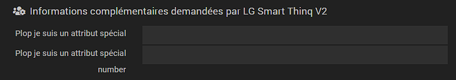

# Documentation fichier info.json

Intégré depuis la version 3.0 de Jeedom, le fichier ``info.json`` est obligatoire pour le bon fonctionnement des plugins, et leur bon déploiement sur le Market Jeedom.

Le fichier info.json est enregistré dans le dossier ``/plugin_info/`` de votre plugin.

## Liste des variables du fichier ``info.json``

Les champs marqués d’un * sont des champs obligatoires.

Champs                   | Valeurs                                                                                                                   |
------------------------ | ------------------------------------------------------------------------------------------------------------------------- |
``id`` *                     | Identifiant unique du plugin sur le Market Jeedom. Doit debuter par une lettre. Sans accents.                             |
``name`` *                   | Nom du plugin.                                                                                                            |
``description`` *            | Description du plugin, tel qu'elle s’affichera sur le Market Jeedom. Minimum 80 caractères. (``<br/>`` pour le retour à la ligne.). Attention c'est un tableau pour les differentes langues de jeedom possible (bien regarder l'exemple du plugin template)                                  |                                                                                     |
``utilization``                    | Informations complémentaires à la documentation sur l’usage du plugin.                                                    |
``licence`` *                | Type de licence.                                                                                                          |
``author`` *                 | Nom de l’auteur du plugin, tel qu’il sera affiché une fois le plugin installé, dans les informations de celui-ci.         |
``require`` *                | Version minimum requise de Jeedom (Core).                                                                                                |
``os``                 | Version minimale et maximale requise de Debian. Sous la forme d'un objet json, exemple : {"min" : 10,"max" : 12} (Core 4.4.15 minimum). Si l'un des deux n'est pas rempli, il ne sera pas comparé à la version de l'OS de l'utilisateur. Vous pouvez indiquer une version plus précise comme 10.5 par exemple. Pour retirer la restriction de version il faut republier sur la market avec une valeur vide "".                                                |
``category`` *               | Catégorie de classement du plugin sur le Market jeedom. **Respecter impérativement la [nomenclature du tableau ci-dessous](https://doc.jeedom.com/fr_FR/dev/structure_info_json/#NOMENCLATURE%20CATEGORIES)** |
``display``                  | Si le plugin utilise un panel dédié sur le desktop,. Il s’agit du nom du fichier principal de ce panel.                    |
``mobile``                   | Si le plugin utilise un panel dédié sur la webApp Jeedom. Il s’agit du nom du fichier principal de ce panel.   |
``changelog`` *              | Lien Html vers le Changelog.                                                                                              |
``documentation`` *          | Lien Html vers la documentation du plugin.
``changelog_beta`` *              | Lien Html vers le Changelog Beta.|
``documentation_beta`` *          | Lien Html vers la documentation beta du plugin.
``link`` -> ``video``               | Lien Html vers une vidéo de présentation.                                                                                 |
``link`` -> ``forum``               | Lien Html vers le forum sur le sujet officiel du plugin.                                                                  |
``language``                | Liste des langues disponibles pour le plugin : ``fr_FR``, ``en_US``, ``de_DE``, ``it_IT``, ``es_ES``, ``pt_PT``            |
``compatibility``            | Compatibilité du plugin : miniplus, smart, docker, rpi, diy, mobileapp, v4.                                                   |
``hasDependency``            | «true» si [le plugin doit installer des dépendances](https://doc.jeedom.com/fr_FR/dev/daemon_plugin#Les%20d%C3%A9pendance), sinon «false» ou absent.                                              |
``hasOwnDeamon``             | «true» si [le plugin doit exécuter des deamons](https://doc.jeedom.com/fr_FR/dev/daemon_plugin#Les%20d%C3%A9mons%20%26%20d%C3%A9pendances), sinon «false» ou absent.                                                   |
``maxDependancyInstallTime`` | Temps maximum imparti pour l’installation des dépendances, exprimé en minutes.                                            |
``specialAttributes`` | Permet aux plugin de demander des [parametre suplémentaire](https://doc.jeedom.com/fr_FR/dev/structure_info_json#SpecialAttributes) sur [des objets](https://doc.jeedom.com/fr_FR/dev/structure_info_json#Attributs%20Objet) ou [des utilisateurs](https://doc.jeedom.com/fr_FR/dev/structure_info_json#Attributs%20User) (bien regarder l'exemple du plugin template) (Voir explicationsci-dessous)                                            |
``issue``                    | URL vers le bugtracker si externe (si non remplis alors vous receverez un mail)

## Exemple

[Fichier plugin-template/plugin_info/info.json](https://github.com/jeedom/plugin-template/blob/master/plugin_info/info.json)

## NOMENCLATURE CATEGORIES

Market Jeedom         | info.json               |
--------------------- | ----------------------- |
Communication         | ``communication``           |
Confort               | ``wellness``                |
Energie               | ``energy``                  |
Météo                 | ``weather``                 |
Monitoring            | ``monitoring``              |
Multimédia            | ``multimedia``              |
Nature                | ``nature``                  |
Objets Connectés      | ``devicecommunication``     |
Organisation          | ``organization``            |
Passerelle domotique  | ``home automation protocol``|
Programmation         | ``programming``             |
Protocole domotique   | ``automation protocol``     |
Santé                 | ``health``                  |
Sécurité              | ``security``                |
Automatisme           | ``automatisation``          |

## SpecialAttributes

Ces attributs permettent de demander aux utilisateurs des paramètres supplémentaires, sur chaque objet (`objet` au sens Jeedom : menu Outils / Objets; typiquement ça représente les pièces dans notre domotique) ou bien pour chaque utilisateur.

### Utilisation

Dans votre code, vous pourrez récupérer la valeur de ces paramètres en utilisant l'objet `User` pour un attribut User, ou bien l'objet `jeeObject` pour un attribut objet:

```
user : $user->getOptions(‹ plugin::ID_plugin::clef ›)
object : $jeeObject->getConfiguration(‹ plugin::ID_plugin::clef ›)
```
* ID_plugin est l'ID de votre plugin
* clef est la clé dans votre configuration json (dans l'exemple: toto, toto 2 ...)

### Attributs Objet

La syntaxe est la suivante pour proposer 2 paramètres spécifiques par objet :
```
	"specialAttributes" : {
		"object" : {
			"toto" : {"name" : {"fr_FR" : "Plop je suis un attribut spécial"},"type" : "input"},
			"toto2" : {"name" : {"fr_FR" : "Plop je suis un attribut spécial number"},"type" : "number"}
		}
	}
```

L'utilisateur pourra ainsi définir ces 2 paramètres pour chaque objet dans le menu de configuration des objets (menu Outils / Objets).
Ici un texte libre, et un numérique.


### Attributs User

```
	"specialAttributes" : {
		"user" : {
			"toto" : {"name" : {"fr_FR" : "Plop je suis un attribut spécial users"},"type" : "select","values" : [{"value" : "1", "name" : "valeur 1"},{"value" : "plop", "name" : "valeur plop"}]}
		}
	}
```

Ici, cet attribut permet à chaque utilisateur de définir un paramètre qui lui est propre (dans le menu Réglages / Préférences)


### Attributs EqLogic

```
	"specialAttributes": {
        "eqLogic": {
            "mqttTranmit": {
                "type": "checkbox",
                "name": {
                    "fr_FR": "Transmettre l'équipement en MQTT"
                }
            }
        }
    }
```

Ici, cet attribut permet de définir un paramètre pour chaque équipement de jeedom (dans la configuration avancée de l'équipement). Vous le retrouver dans la configuration de l'équipement sous `plugin::mqtt2::mqttTranmit` (`plugin::id_plugin::key`)
