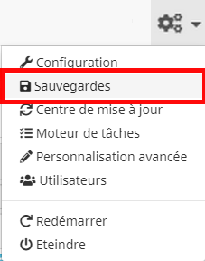
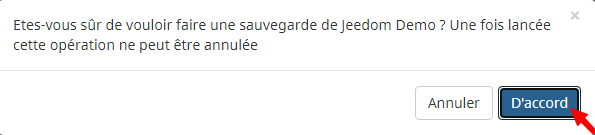
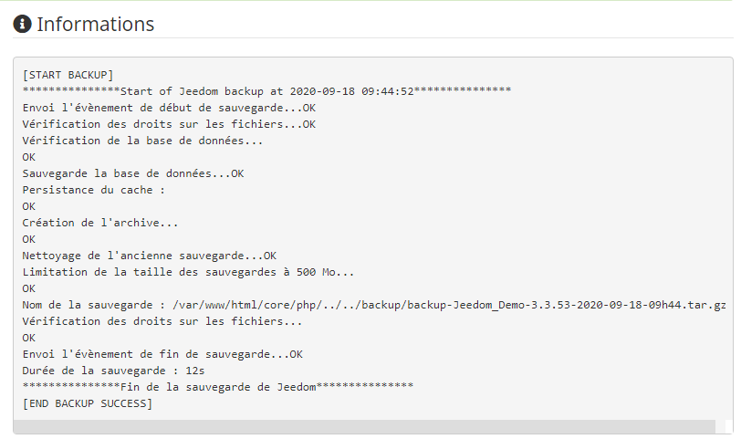
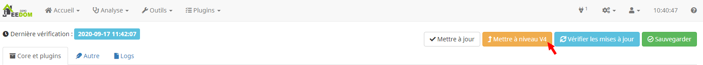
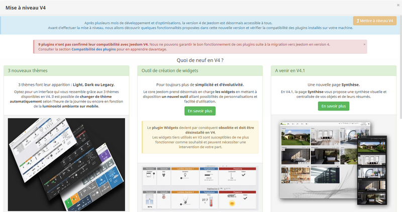
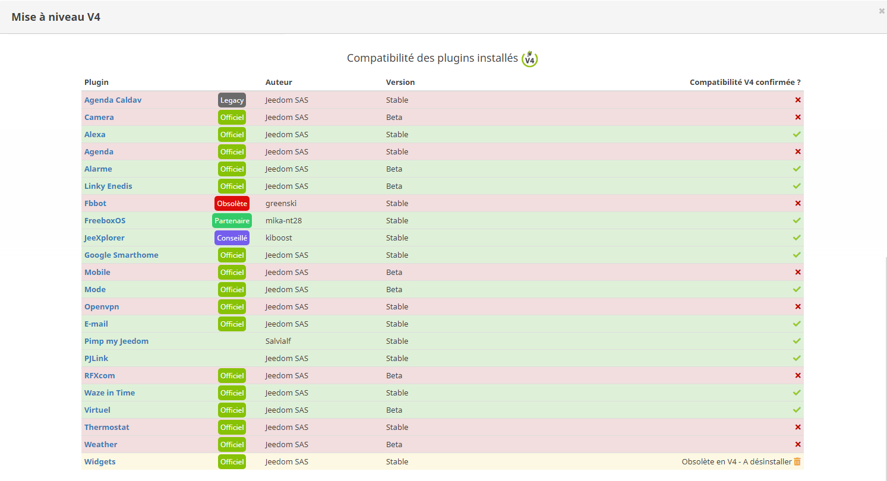
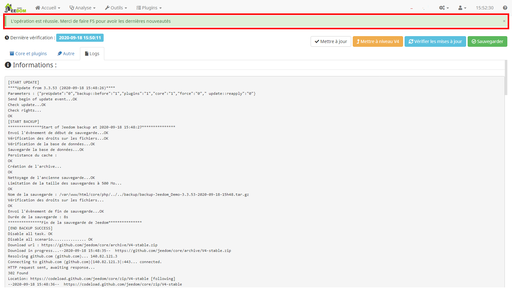

# Migrer de version (V3 → V4)

Découvrons ensemble les principales actions à mettre en œuvre pour migrer de version de Jeedom dans les meilleures conditions. Le présent tutoriel est basé sur le cas concret d'une migration V3 vers V4.

## Sauvegarde de Jeedom

Avant toute mise à jour de Jeedom, il est important de s'assurer d'avoir pris les précautions nécessaires pour pouvoir récupérer rapidement une installation domotique fonctionnelle en cas de difficultés.

### Création de la sauvegarde

Nous allons tout d'abord générer le fichier de sauvegarde de votre installation actuelle.

Dirigeons-nous vers le **menu en forme d'engrenages** présent en haut dans la barre de navigation, sur la gauche de l'horloge, puis cliquons sur le sous-menu **Sauvegardes** pour accéder au [composant qui gère les sauvegardes](../core/3.3/backup):    

Pour créer la sauvegarde, nous allons cliquer sur le bouton vert **Lancer** dans la partie intitulée **Sauvegardes** :    

Validez le message demandant confirmation de votre souhait de procéder à une sauvegarde de Jeedom en cliquant sur le bouton **D'accord** :    

Le processus de sauvegarde démarre. Cela peut prendre un certain temps, vous pouvez en suivre l'avancement dans la fenêtre nommée **Informations** :    

Si tout se déroule normalement, la fin du processus est indiquée par le message :      
``***************Fin de la sauvegarde de Jeedom*************** [END BACKUP SUCCESS]``

Le fichier de sauvegarde a été correctement généré dans Jeedom.

### Téléchargement de la sauvegarde

En l'état actuel, la sauvegarde générée précédemment n'est accessible que depuis Jeedom. Or, en cas de difficultés lors d'une mise à jour, Jeedom ou la machine qui l'héberge peut ne plus être accessible. Nous allons donc voir comment récupérer le fichier de sauvegarde sur un ordinateur en dehors de Jeedom.

Dans la partie **Sauvegardes locales**, il faut s'assurer que la sauvegarde créée au paragraphe précédent soit bien renseignée sur la ligne **Sauvegardes disponibles** en confirmant à l'aide de la date et de l'heure qui apparaissent dans le nom du fichier. Si tel est bien le cas, nous pouvons maintenant cliquer sur le bouton vert **Télécharger** :    

Le fichier de sauvegarde est alors téléchargé sur votre ordinateur, conservez-le préciseusement car il contient la copie de l'intégralité de votre Jeedom au moment de la sauvegarde.

## Outil de migration facile

Maintenant que nous avons mis en sécurité la sauvegarde de notre Jeedom, nous pouvons procéder à la mise à niveau sereinement.

Depuis la V3.3.54, un outil de migration facile à été implémenté au **Centre de mise à jour**. Pour y accéder, il faut se rendre sur le **menu en forme d'engrenages** présent en haut dans la barre de navigation, sur la gauche de l'horloge, puis cliquer sur le sous-menu **Centre de mise à jour**.

Une fois dans le centre de mise à jour, cliquez sur le bouton orange intitulé **Mettre à niveau V4** pour ouvrir la fenêtre modale de migration :    

### Pré-requis

La fenêtre de mise à niveau va analyser le système et l'ensemble des plugins installés sur votre machine à partir du market Jeedom afin de vérifier la compatibilité annoncée avec la V4. Elle se décompose en 2 parties :

- La partie haute présente quelques innovations à découvrir en V4 avec un bandeau récapitulant de manière générale la compatibilité des plugins installés :    

> **IMPORTANT**
>
> Il ne sera pas possible de procéder à la migration sur une installation dont l'environnement est antérieur à ``Debian Stretch 9.X`` *(``Debian 8.X Jessie`` ou inférieur)*. Il sera également demandé de supprimer d'éventuels plugins identifiés comme étant obsolètes.

- La partie basse consiste en un tableau détaillant l'ensemble des plugins installés ainsi que leur compatibilité confirmée ou non avec cette nouvelle version :    

> **IMPORTANT**    
>
> Cette nouvelle version de Jeedom amène des changements majeurs. En conséquence les widgets tiers et certaines personnalisations de design utilisés en V3 sont suceptibles de ne plus s'afficher ou réagir comme voulu et peuvent nécessiter une intervention de votre part suite au passage en V4.

### Mise à niveau

Maintenant que nous avons pris connaissance de toutes les informations importantes à connaitre avant de mettre à niveau notre Jeedom, nous pouvons lancer la migration en cliquant sur le bouton orange **Mettre à niveau V4** en haut à droite de la fenêtre modale.

> **A SAVOIR**   
>
> Le bouton **Mettre à niveau V4** ne devient cliquable qu'une fois l'intégralité de la fenêtre consultée. Il faut donc veiller à bien scroller jusqu'en bas de la page.

Une fenêtre pop-up s'ouvre et nous apprend qu'une sauvegarde complète sera effectuée automatiquement avant migration afin de pouvoir revenir rapidement et facilement en V3 si cela était nécessaire.
Pour démarrer le processus de migration, cliquez sur **D'accord** :    

Vous basculez alors sur la page contenant les logs de migration qui va commencer par effectuer la sauvegarde de l'installation actuelle avant de mettre à jour les plugins et le core.

> **IMPORTANT**    
>
> En fonction du matériel sur lequel est installé Jeedom, cette opération est suceptible de durer plusieurs minutes. Il est primordial de laisser le processus de migration se dérouler jusqu'à la fin.

Une fois l'opération de migration terminée, un bandeau vert s'affiche en haut de l'écran avec le message ***L'opération est réussie. Merci de faire `F5` pour avoir les dernières nouveautés*** :    

Il ne reste donc plus qu'à appuyer sur le bouton `F5` du clavier *(ou actualiser la page)* pour constater le passage effectif en V4. Il est possible que certains plugins demandent à nouveau d'être mis à jour suite à la migration, n'hésitez pas à les mettre à jour immédiatement.
