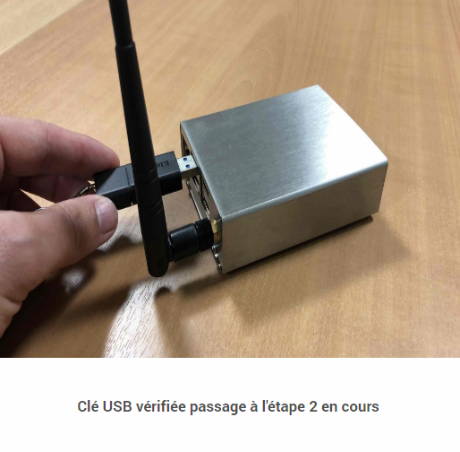
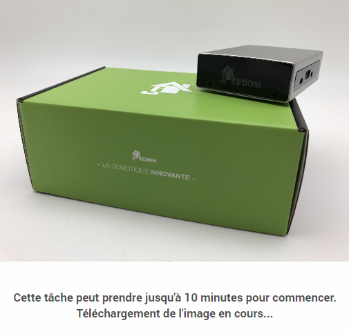
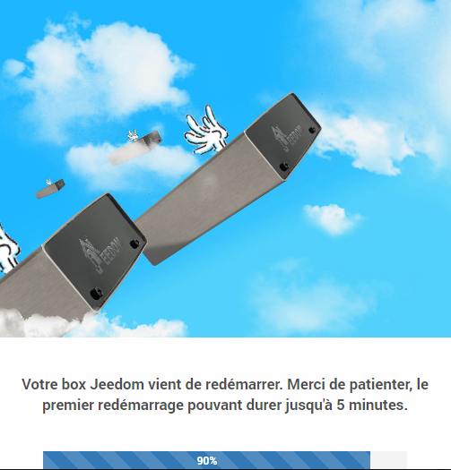

# Mettre à niveau l'environnement Debian d'une Smart

Nous allons détailler la procédure de **migration de l'environnement Debian de la box Smart** afin que vous puissiez avoir un aperçu des différentes étapes avant mise en pratique. Sachez que toutes les étapes sont également expliquées à l'écran au fur et à mesure de la progression de la migration.

## Prérequis

La migration de l'environnement Debian et du kernel de la Smart est un processus long et complexe, plusieurs prérequis indispensables sont donc à prendre en compte avant de débuter l'opération.

Il faut notamment :

- pouvoir **rester sur la page de migration** durant l'intégralité du processus *(il faut compter environ 1h30)*,
- préparer [une clé USB formatée en **FAT32**](https://fr.wikihow.com/formater-en-FAT32){:target="\_blank"} et disposant de **plus de 8Go d'espace libre**,
- être sur le **même réseau local** que la box Smart et y accéder à partir de son **adresse interne**.

> **IMPORTANT**
>
> Comme à l'habitude, il est vivement recommandé de conserver à disposition une **sauvegarde récente** de votre Jeedom au préalable.

## Migration

### Initier la migration

Vous avez la possibilité d'initier la procédure de migration de 2 manières :

- En vous dirigeant vers le menu **Réglages → Système → Restauration Image** :     

- En y étant invité dans le **centre de mise à jour** lorsque cela sera nécessaire :     

### Étape 1

La première étape de la migration consiste à préparer et vérifier le matériel. Les prérequis mentionnés précédemment sont rappelés dans une fenêtre pop-up et vous êtes invité à insérer une clé USB *(formatée en FAT32)* disposant de plus de 8Go d'espace libre dans la box Smart.

Une fois la clé USB insérée, vous pouvez cliquer sur la flèche pour lancer le processus :

Lorsque les prérequis sont validés, nous pouvons passer à l'étape 2 :

> **INFORMATION**
>
> Il n'est pas nécessaire de rester devant l'écran durant tout le processus. Celui-ci va se dérouler automatiquement jusqu'à proposer de restaurer une sauvegarde.

### Étape 2

La deuxième étape va se charger de générer une sauvegarde de votre Jeedom dont une copie sera mise en sécurité sur la clé USB. Cette sauvegarde sera restaurée à la fin du processus de migration si vous le souhaitez. En cas de besoin, la sauvegarde se trouve dans un répertoire nommé ``Backup`` sur la clé USB.

Nous vous recommandons tout de même de vous assurer d'avoir une sauvegarde récente de Jeedom à disposition par ailleurs.

La durée de la phase de sauvegarde dépendera de la taille de votre installation et des options de sauvegarde déportée mises en place. Vous avez la possibilité d'accélérer le processus en désactivant l'envoi des sauvegardes Market et/ou Samba au préalable.

### Étape 3

La troisième étape va permettre de télécharger l'image contenant la nouvelle version de l'environnement Debian et d'en vérifier la bonne validité après téléchargement :

Cette étape peut durer un certain temps et sera fonction de la vitesse de votre connexion internet ainsi que des performances en lecture/écriture de la clé USB :

### Étape 4

De loin l'étape la plus importante car il s'agit de la migration effective du matériel. Il ne faut surtout pas débrancher la clé USB ou couper l'alimentation électrique de la Smart durant cette phase !

Cette étape dure une trentaine de minutes au terme desquelles la box Smart va redémarrer. Ce premier redémarrage est susceptible de durer un certain temps :

### Finalisation de la migration

A l'issue du processus de migration, la box Smart est maintenant sur un environnement à jour mais avec un Jeedom vierge. La finalisation de la procédure va donc consister soit à repartir d'une installation vierge soit à restaurer la sauvegarde générée lors de la première étape :

> **IMPORTANT**
>
> **Veillez à bien retirer la clé USB de la box Smart à la fin de l'opération.**

Félicitations, **votre box Smart est maintenant à jour et opérationnelle** !

## Foire aux questions

> **Le processus de migration se déroule correctement pourtant aucun changement ne semble avoir eu lieu après le redémarrage de la box.**    
> Cela signifie que la clé USB utilisée n'est pas correctement reconnue par l'outil de migration. Veuillez renouveler l'opération avec une autre clé USB ou [repartitionner votre clé USB](https://fr.wikihow.com/partitionner-une-cl%C3%A9-USB){:target="\_blank"} en prenant soin de **ne créer qu'une seule partition** *(Single partition)*.

> **Je ne parviens plus à m'authentifier sur Jeedom suite à la migration de l'environnement.**    
> Jeedom ayant été réinstallé suite à la mise à jour de l'environnement Debian, tant que vous n'avez pas restauré une sauvegarde ou créé un nouvel utilisateur, les identifiants par défaut sont ***admin/admin***.

> **Ma box n'est plus joignable suite à la migration de l'environnement.**    
> Vérifiez la présence et l'adresse ip de la box Jeedom depuis l'interface de votre routeur au cas où celle-ci ait changé d'adresse ip.

> **Certains plugins ne fonctionnent plus suite à la migration.**    
> Assurez-vous d'avoir procédé à la réinstallation des dépendances pour les plugins qui en nécessitent *(consulter la page de configuration du plugin)*.
