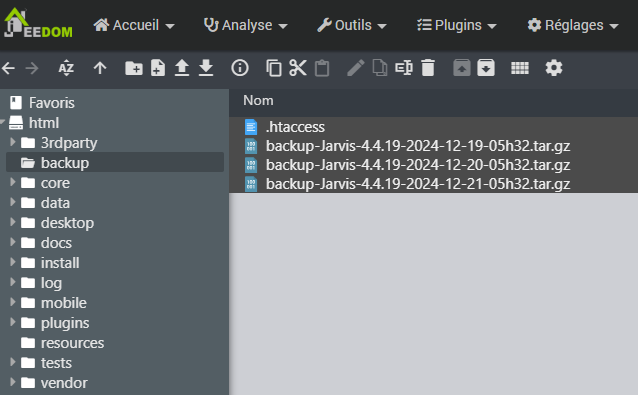

# Restauration d'une sauvegarde

## Méthode actuelle

Allez dans *Réglages / Système / Editeur de fichiers* puis sélectionner le répertoire backup dans l'arborescence de gauche.

Sélectionnez le fichier qui vous intéresse, faites un clic-droit et sélectionnez "Télécharger".

## Ancienne méthode

La procédure va permettre de se connecter en SFTP à votre box afin d’aller récupérer les sauvegardes quotidiennes effectuées par celle-ci.

> **Conseil**
>
> Attention, afin que cette procédure fonctionne, il est nécessaire que le serveur SSH de la box soit toujours fonctionnel.

### Installation de Filezilla

Filezilla est un logiciel gratuit et disponible sur toutes les plateformes. Il permet de transférer des fichiers via différents protocoles (FTP, FTPS, SFTP…​) Il est téléchargeable via ce [lien](https://filezilla-project.org/download.php?type=client)

### Connexion à la box

Pour se connecter à votre box, il suffit de renseigner les champs d’information en haut de la fenêtre Filezilla :

-   Hôte : Adresse IP de Jeedom (``sftp://`` est rajouté automatiquement)
-   Identifiant : ``jeedom``
-   Mot de passe : ``Mjeedom96``
-   Port : 22

Puis de cliquer sur "Connexion rapide"

### Navigation vers le répertoire de sauvegarde

Une fois la connexion établie, il est nécessaire de se rendre dans le répertoire de sauvegarde de Jeedom.

2 cas de figures :

-   Serveur Apache (Box Jeedom Smart) : ``/var/www/html/backup``
-   Serveur Nginx :  ``/usr/share/nginx/www/jeedom/backup``

Le chemin d’accès se renseigne dans la partie site distant.

### Téléchargement de la sauvegarde

Sur la liste des sauvegardes, en faisant un clic droit, il est possible de lancer son téléchargement.

