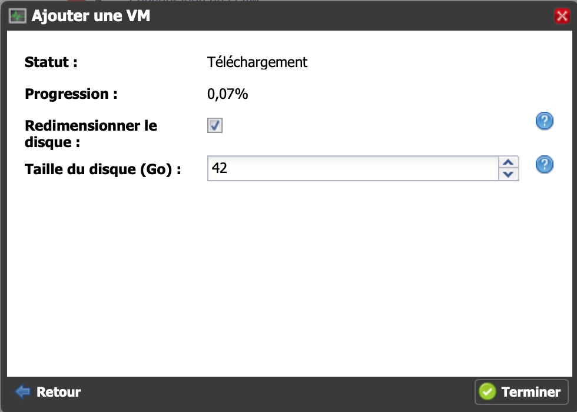

# Installation sur Freebox Delta

Il est possible d'installer Jeedom sur Freebox Delta via le système de VMs.

## Connexion à la Delta

Vous devez vous rendre sur l'interface de configuration de votre Freebox Delta. Cliquez ensuite sur VMs.

## Paramétrage des différentes options

Cliquez sur "Ajouter une VM"

Configurez les caractéristiques. Nous vous recommandons de mettre 2 CPUs et le maximum en RAM.

Configurez l'utilisateur et le mot de passe, **il faut bien les garder en mémoire ils vous seront demandés lors d'une connexion SSH**:

## Installation en cours

Patientez pendant le téléchargement de l'image

## Connectez-vous à votre Jeedom

Vous pouvez vous connecter grâce à l'adresse indiquée sur la page:

Pensez à affecter le port USB de la Delta à la VM si vous souhaitez utiliser une antenne.

Ne **pas** cocher "Écran", ceci ne sert à rien sur l'image Jeedom (à part une surconsommation).

L'adresse IP de votre Jeedom sur la Freebox Delta est ecrite en haut, sous son nom.

Les login et mot de passe par défaut sont admin/admin quand vous accédez à jeedom via votre navigateur.

Pour la suite, vous pouvez suivre la documentation [Premier pas avec Jeedom](../premiers-pas/index)
