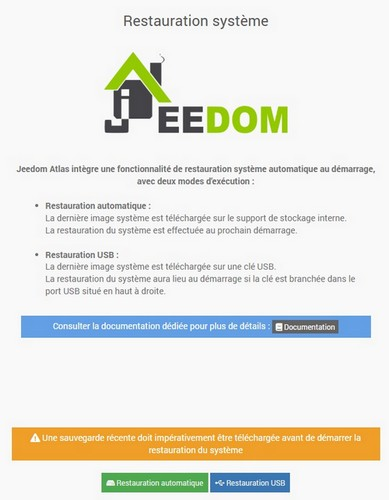

# Installation sur Smart/Atlas

## Sauvegarde de Jeedom

Avant de réinstaller le système, **il est indispensable de télécharger une sauvegarde récente de Jeedom** qui pourra être restaurée à l'issue de la procédure.

1. Depuis l'interface Jeedom, cliquer sur le menu **Réglages > Système > Sauvegardes**.

2. Cliquer sur le bouton **Lancer une sauvegarde**.

3. Quand la sauvegarde est terminée, cliquer sur **Télécharger la sauvegarde**.

## Restauration système

**Depuis la version 4.4.20, Jeedom intègre une fonctionnalité de restauration système automatique initiée juste avant le démarrage du système. Le processus dure environ vingt minutes durant lesquelles le système est inaccessible. A l’issue, le système se lance une première fois avant de redémarrer automatiquement pour devenir finalement visible sur le réseau et accessible.**

>**IMPORTANT**
>
>La patience est de mise, même si on a facilement l'impression qu'il ne se passe rien, 20 minutes, finalement, ce n'est pas si long.\
>Sur Smart il est possible de suivre l'évolution en branchant un écran.

La procédure peut être effectuée directement depuis Jeedom en cliquant sur le menu "**Réglages > Système > Restauration système**", selon 2 modes opératoires différents :

>**INFORMATION**
>
>Les détails de la procédure de restauration système sont visibles dans le menu "**Analyse > Logs**", section "**recovery**".

### Mode automatique

Dans ce mode l'ensemble de la procédure est réalisée de manière entièrement automatique sans avoir besoin de toucher à la box.

Après avoir cliqué sur le bouton "**Restauration automatique**", la dernière image système est directement téléchargée depuis nos serveurs vers le support de stockage interne. L'intégrité de l'image est vérifiée puis le fichier est renommé.

La mise à jour du système est effectuée au prochain démarrage sauf si le fichier de restauration est supprimé ou déplacé de son répertoire de téléchargement.

>**INFORMATION**
>
>Pour préparer "manuellement" une restauration automatique, sans passer par l'utilitaire Jeedom, il suffit d'envoyer une image système compatible renommée en `JeedomSystemUpdate.img.gz` dans le dossier `/install/update` de Jeedom *(`/var/www/html/install/update/JeedomSystemUpdate.img.gz`)*.

### Mode USB

Ce mode nécessite de brancher une clé USB, dont la première partition est formatée en `FAT`, dans le port situé en haut à droite vu de l'arrière.

Le bouton "**Restauration USB**" entraine, dans un premier temps, la détection, la vérification et le montage de la clé USB. Ensuite, la dernière image système est téléchargée depuis nos serveurs vers le support USB. L'intégrité de l'image est vérifiée puis le fichier de configuration USB est écrit.

Le système est mis à jour au démarrage si la clé USB préparée est branchée dans le premier port en haut à droite.

>**INFORMATION**
>
>Pour créer soi-même une clé USB de restauration, il faut envoyer à la racine de la première partition *(format `FAT`)* de la clé USB :
>
>- soit une image système compatible renommée en `JeedomSystemUpdate.img.gz`
>- soit une image système compatible **accompagnée du fichier de configuration USB** `JeedomSystemUpdate.ini` dont le contenu est `update_filename="Jeedom****-*.*.*_******-1*.*.img.gz"`.\
>`Jeedom****-*.*.*_******-1*.*.img.gz` correspondant au nom du fichier présent sur la clé USB.

>**IMPORTANT**
>
>Un fichier `JeedomSystemUpdate.log` est créé sur la clé USB durant le processus afin de ne pas mettre le système à jour en boucle. Il faut supprimer ce fichier pour relancer la mise à jour du système *(sur une box identique avec la même clé USB par exemple)*.

## Images système

Les images systèmes actuellement fournies par l'équipe Jeedom sont librement consultables et téléchargeables aux adresses suivantes en fonction du matériel concerné :

- [**Image(s) système Jeedom Smart**](https://images.jeedom.com/smart/){:target="_blank"}
- [**Image(s) système Jeedom Atlas**](https://images.jeedom.com/atlas/){:target="_blank"}

>**INFORMATION**
>
>La clé SHA256, permettant de vérifier l'intégrité du fichier téléchargé, est disponible dans le fichier `info.json` du même dossier.

### Gravure du support

Sur Smart, l'image système peut directement être écrite sur le support de stockage eMMC détachable. Consulter [la documentation "Guides > Tutoriaux > Remise en état d'usine Smart"](https://doc.jeedom.com/fr_FR/howto/smart) pour plus de détails.
