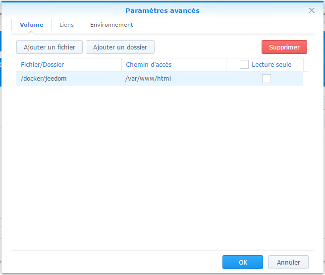
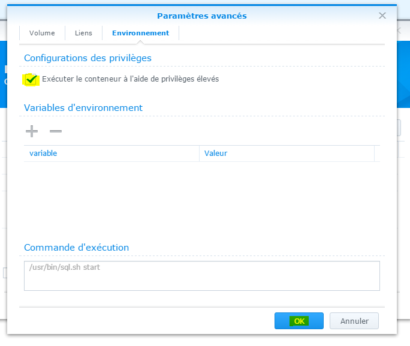
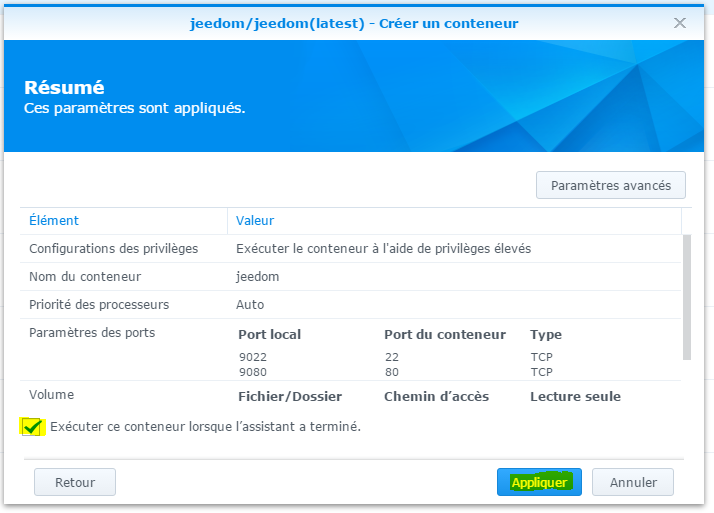

# Installation sur Synology

Vous trouverez ici la documentation pas à pas pour installer Jeedom sur un Synology (DSM 5.2 minimum).

## Etape 1 : Installation de Docker

Allez sur le centre des paquets :

Cliquez sur tous, puis installez le paquet Docker

Attendez jusqu’à ce que l’installation soit finie :

> **Important**
>
> Pour avoir accès au paquet Docker, il faut absolument avoir DSM 5.2 et un NAS compatible

## Etape 2 : Récupération et installation des images Jeedom

Lancez l’application Docker :

Cliquez sur "Registre" :

Dans le champ de recherche, tapez "jeedom", sélectionnez jeedom/jeedom et cliquez sur télécharger :

Validez ensuite la demande de version, le mieux étant de prendre la dernière.

Cliquez ensuite sur image, ici vous pouvez suivre l’avancement du téléchargement (peut prendre plusieurs dizaines de minutes) :

Une fois terminé, cliquez sur l’image puis lancez :

Donnez un nom à votre jeedom ainsi qu’un port local redirigé vers le port 80 (ici 9080) puis faites suivant :

Faites suivant :

Cliquez sur "Paramètres avancés"

Puis sur "Ajouter un dossier"

Choisissez un dossier sur votre Synology (c’est dans ce dossier qu’il y aura tous les fichiers jeedom), attention à bien décocher "Lecture seule"

Dans chemin d’accès, mettez /var/www/html puis cliquez sur "Environnement" :

Repetez cette opération pour le dossier /var/lib/mysql

Cochez "Exécuter le conteneur à l’aide de privilèges élevés" puis validez le tout :

Cochez "Exécuter ce conteneur lorsque l’assistant a terminé" puis cliquez sur "Appliquer".

> **Paramètre de configuration avancé**
>
> Il existe 3 paramètres optionnel de configuration, ces paramètres doivent etre passé en variable d'environement
> - APACHE_PORT : permet de changer le port par défaut (80) d'écoute du serveur web
> - MODE_HOST : indique que le résaux est en mode host

> **IMPORTANT**
>
> Certain plugin on besoin d'avoir le broadcast du réseaux (type plugin Xioami), pour cela il faut ABSOLUMENT passer en le réseaux en mode host (possible uniquement lors de la création), changer le port d'écoute par defaut du serveur web et ssh par des ports non utilisé (type 9080 pour le serveur web et 9022 pour le ssh), et mettre la variable MODE_HOST à 1

Il vous faut maintenant installer Jeedom, c’est très simple, allez sur IP\_NAS:9080

Ensuite, vous pouvez suivre la documentation [Premier pas avec Jeedom](https://doc.jeedom.com/fr_FR/premiers-pas/index)
