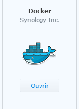
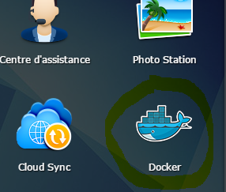
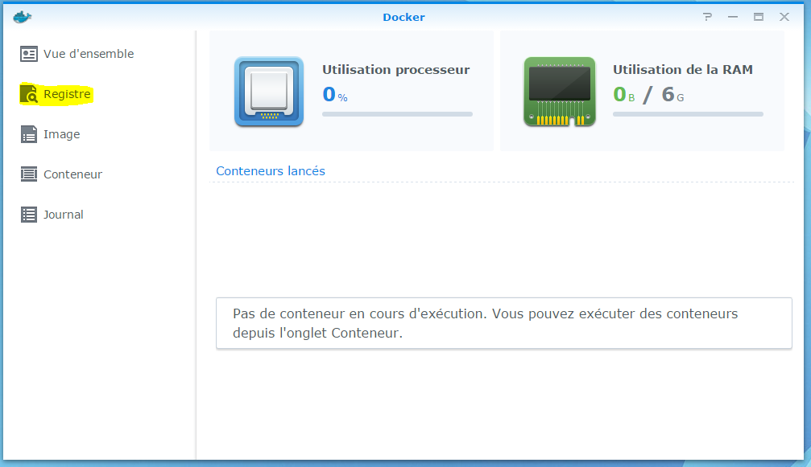
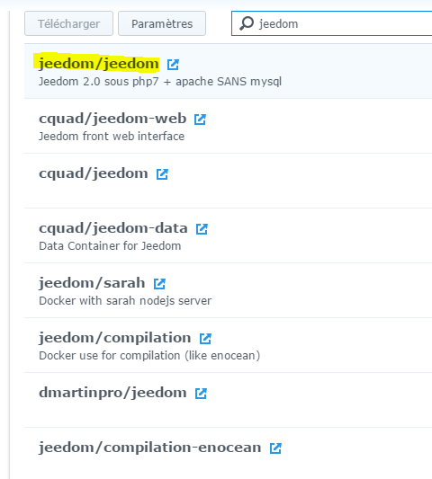
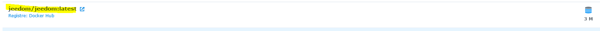
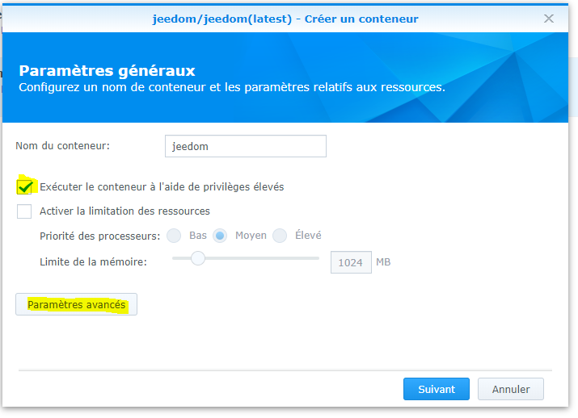
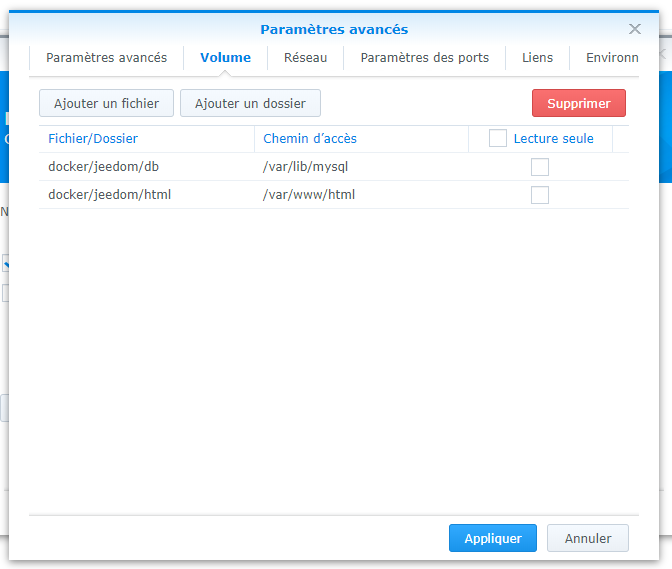

# Installation sur Synology

Vous trouverez ici la documentation pas à pas pour installer Jeedom sur un Synology (DSM 5.2 minimum).

## Installation de Docker

Allez sur le centre des paquets :


Cliquez sur tous, puis installez le paquet Docker


Attendez jusqu’à ce que l’installation soit finie :



> **Important**
>
> Pour avoir accès au paquet Docker, il faut absolument avoir DSM 5.2 et un NAS compatible

## Récupération de l'images Jeedom

Lancez l’application Docker :



Cliquez sur "Registre" :



Dans le champ de recherche, tapez "jeedom", sélectionnez jeedom/jeedom, et cliquez sur télécharger :



Validez ensuite la demande de version, le mieux étant de prendre la dernière (prendre la version latest).
 _Mais pour certains modèles Sybology il peut être nécessaire de choisir la version *-buster_

Cliquez ensuite sur image, ici vous pouvez suivre l’avancement du téléchargement (peut prendre plusieurs dizaines de minutes) :



## Configuration du container

Une fois terminé, cliquez sur l’image puis lancez :



Donnez un nom à votre jeedom, cochez la case "Exécuter le conteneur à l’aide de privilèges élevés" puis cliquez sur parametre avancées puis dans parametres de port redirigé le port 80 (ici vers 9080) :


Puis sur "Volume" ajoutez les 2 volumes suivant :



Cochez "Exécuter le conteneur à l’aide de privilèges élevés" puis validez le tout.

> **IMPORTANT**
>
> Certain plugin on besoin d'avoir le broadcast du réseaux (type plugin Xioami), pour cela il faut ABSOLUMENT passer en le réseaux en mode host (possible uniquement lors de la création), changer le port d'écoute par defaut du serveur web (type 9080 pour le serveur web)

> **IMPORTANT**
>
> En cas d'erreur, si le service Apache ne démarre pas avec cette erreur dans les logs: ```function not implemented: AH00141: Could not initialize random number generator``` dans ce cas vous devez utiliser l'image `jeedom/jeedom4.3-buster`.

Après une phase de 1er démarrage plus ou moins longue vous avez juste à allez sur IP_NAS:9080

Ensuite, vous pouvez suivre la documentation [Premier pas avec Jeedom](https://doc.jeedom.com/fr_FR/premiers-pas/index)
