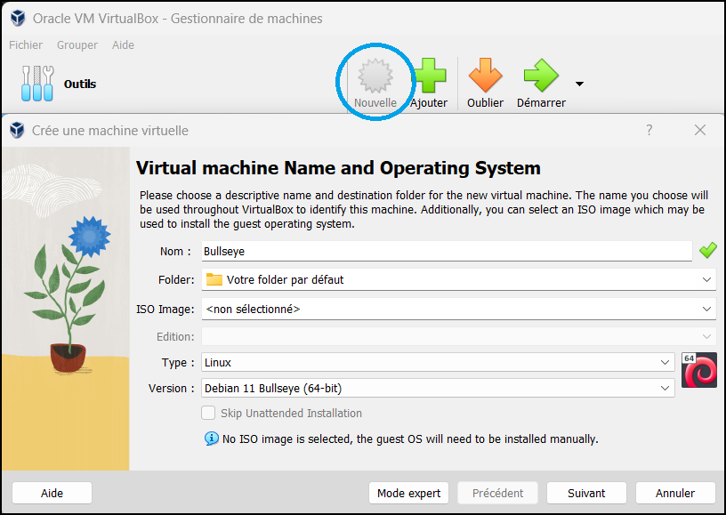

# Installation sur une VM

Si vous voulez découvrir Jeedom sans risque, vous pouvez aussi le virtualiser sur votre PC, voici la démarche à suivre. Vous ne prenez aucun risque dans une VM, l’intégrité de votre Pc est protégé :

## Téléchargement et installation de VirtualBox

Vous devez télécharger le logicel Virtual Box [ici](https://www.virtualbox.org/wiki/Downloads)

# Installation automatique

Téléchargez l'iso jeedom [ici](https://images.jeedom.com/x86-64/).

## Configuration de l’environnement de la VM

Cliquez sur "Nouvelle" et renseignez les champs comme ci dessous :



-   Cliquez sur suivant, adapter la taille de la mémoire par rapport à votre système (1024 Mb sont suffisants)


-   Cliquez sur suivant
-   Ensuite cliquer sur "Créer un disque virtuel maintenant" (8Go suffisent)


-   Cliquez sur suivant
-   Cliquez sur Finish

## Lancement de la VM

-   Cliquez sur configuration
-   Cliquez sur + à côté de contrôleur (1)
-   Indiquez l’image précédemment téléchargée (2)
-   Cliquez sur choisir (3)


-   Sélectionnez ensuite réseau et choisissez "accès par pont" dans le mode d’accès réseau.
  


-   Cliquez sur OK
-   Cliquez sur démarrer

Selectionnez "Install on disk" (touche entrée du clavier), valider avec yes (touche flèche bas puis entrée). Toute la suite va se faire automatiquement (10 à 30min), puis une fois la vm redemarré attendant 5min et vous devriez avoir accès à Jeedom en mettant simplement l'ip de jeedom dans un navigateur.

>**TIPS**
>
>Pour connaitre l'ip de la vm (une fois connecté dessus, les identifiants s'affichent sur l'écran de connexion) tapez la commande ci dessous en respectant les espaces: 
````
ip -s -c -h a
````

> **Information**
>
> Les identifiant de connection ssh par defaut sont : jeedom et Mjeedom96 pour le mot de passe 

Ensuite, vous pouvez suivre la documentation [Premier pas avec Jeedom](https://doc.jeedom.com/fr_FR/premiers-pas/index)

# Installation manuel

## Téléchargement d’une image Debian 11 - netinstall

Téléchargez une image minimaliste debian 11 [ici](https://www.debian.org/releases/bullseye/debian-installer/), en choisissant "images de CD d’installation par le réseau" -> AMD64

## Configuration de l’environnement de la VM

Cliquez sur Nouvelle et renseignez les champs comme ci dessous :


-   Cliquez sur suivant, adapter la taille de la mémoire par rapport à votre système (1024 sont suffisants)


-   Cliquez sur suivant, créer un disque virtuel maintenant (8Go suffisent)


-   Cliquez sur suivant
-   Cliquez sur Finish

## Lancement de la VM

-   Cliquez sur configuration
-   Cliquez sur + à côté de contrôleur (1)
-   Indiquez l’image précédemment téléchargée (2)
-   Cliquez sur choisir (3)


-   Sélectionnez ensuite réseau et choisissez "accès par pont" dans le mode d’accès réseau.
  


-   Cliquez sur OK
-   Cliquez sur démarrer

## Installation de debian 11

C’est du classique…​


-   Choisissez Graphical install
-   Installez la debian de préférence sans interface graphique car inutile. Le nom d’utilisateur n’a aucune importance. Dans la plupart des écrans, il suffit de valider le choix par défaut. Vous pouvez laissez des champs vides, ce n’est pas bloquant.
-   Pour la sélection des logiciels :

-   Pour Grub, pas d’inquiétude, le secteur de démarrage est celui de la VM, pas celui de votre PC. Aucun risque de casser quoi que ce soit.

## Installation de jeedom

-   Lancez votre VM
-   Identifiez-vous avec l’utilisateur et le mot de passe choisis pendant l’installation
-   Passez en root

``su -``

-   Saisissez le mot de passe root défini pendant l’installation
-   Récupérez le script jeedom, le rendre exécutable, le lancer

````
wget https://raw.githubusercontent.com/jeedom/core/V4-stable/install/install.sh
chmod +x install.sh
./install.sh
````

-   et laissez faire…​

## Lancement de jeedom

-   Pour connaitre l’adresse Ip Lan de la VM

````
ip -s -c -h a
````

Votre adresse Ip, type 192.168.0.XX apparait en rouge. Il vous suffit de la saisir dans votre navigateur.

> **Warning**
>
> Si cela ne fonctionne pas, vous n’avez pas configuré votre carte réseau en Pont réseau comme indiquée au départ.

Ensuite, vous pouvez suivre la documentation [Premier pas avec Jeedom](https://doc.jeedom.com/fr_FR/premiers-pas/index)
