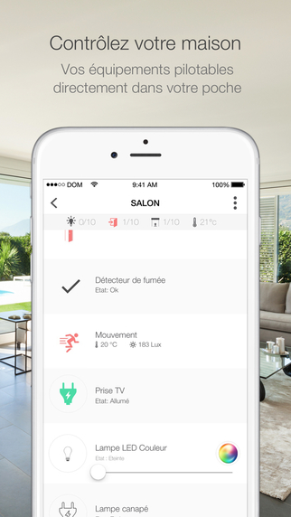
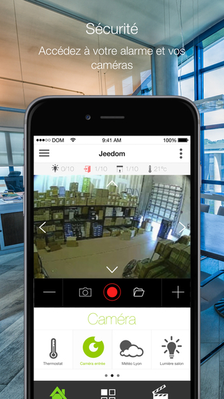
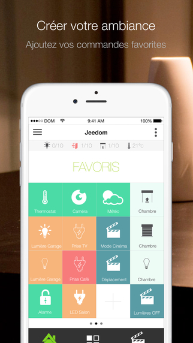

# Version mobile

Jeedom est utilisable sur Mobile de deux manières.

## WebApp

Jeedom adopte une version spécifique sur mobile et tablette. Vous y accédez à partir de la même adresse, dans un navigateur sur Mobile (Firefox, Chrome, Safari, etc.).

Cette version adaptée est aussi simplifiée, dans un souci d'affichage et de performance.

- Equipements : Accédez au dashboard par objet. Vous pouvez également afficher la Synthèse.
- Messages : Affichez le centre de messages.
- Vues : Accédez à vos Vues.
- Designs : Accédez à vos Designs ou Designs 3D. (L'affichage d'un Design est plein écran, faites un clic à trois doigts pour revenir à l'accueil).
- Scénario : Affichage des tuiles de vos scénarios, par groupes, avec possibilité de les activer/désactiver, arrêter/démarrer. En cliquant sur le titre du scénario, vous accéderez à son log.
- Analyse : Accédez à la Timeline, aux Logs, Analyse équipement, Crons, Démons et Santé.
- Autre : Basculez entre les thèmes principal et alternatif, accédez à la version Desktop, forcez la mise à jour, accédez à la documentation, à propos ou déconnectez-vous.
- Plugins : Certains plugins peuvent avoir un affichage dédié à la WebApp. Ils seront accessibles ici.

> **Note**
>
> La page d'accueil de la WebApp peu-être paramétrée sur votre Jeedom dans Réglages → Préférences.

La WebApp a un rôle principalement consultatif. Vous pouvez bien sûr interagir avec vos équipements comme en Desktop, mais vous ne pourrez pas, par exemple, éditer un scénario, modifier un équipement, accéder à la configuration de Jeedom.

## Application Jeedom

L'application mobile Jeedom (compatible IOS/Android) permet le pilotage de votre système domotique Jeedom, que ce soit en Wifi local ou sur le réseau 3G/4G de votre opérateur. L'application se connecte automatiquement à votre Jeedom par l'intermédiaire d'un QRcode, aucune configuration n'est nécessaire. Vous retrouverez les fonctionnalités de votre Jeedom sur votre mobile (scénarios, objets connectés et domotiques, plugins). Vous pourrez aussi personnaliser votre application avec des raccourcis et plus encore...

	

    
