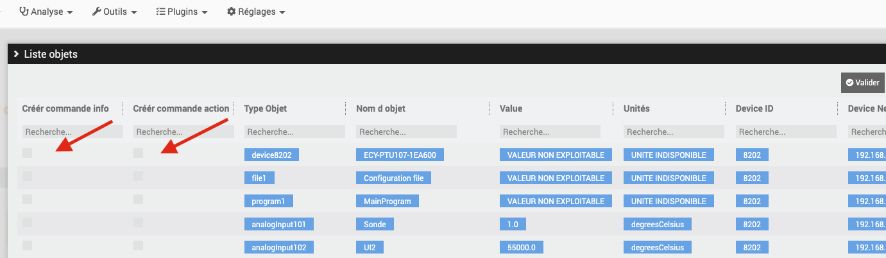
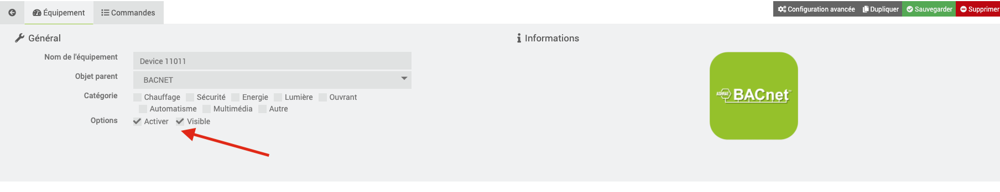

# Bacnet

#Description

Le plugin Bacnet permet de récuperer les informations de vos équipements Bacnet/Ip et interargir avec depuis votre Jeedom.

# Configuration du plugin

Après téléchargement du plugin, il faut tout d’abord activer celui-ci, comme tout plugin Jeedom :

Ensuite, il faut lancer l’installation des dépendances (même si elles apparaissent OK) :

Enfin, il faut démarrer le démon :

Rien n’est à modifier dans le champ « Port socket interne » de la section « Configuration ».

Dans ce même onglet, il vous faut choisir la valeur du Cron pour l'actualisation de vos équipements.

# Comment déclarer un nouvel équipement Bacnet dans Jeedom

>**IMPORTANT**
>
>Vos équipements BACNET doivent se trouver sur le même réseau que votre Jeedom pour être détectés par celle-ci.

Rendez-vous dans le menu « Plugins → Energie → Bacnet » :

Vous arrivez sur la page suivante:

Vous devez donc cliquer sur l’option « Nouvel équipement / Création commandes » :

Un scan automatique de votre réseau va être lancé pour détecter les équipements Bacnet présents sur ce dernier.
Cela peut prendre une vingtaine de secondes.

A la suite du scan, un tableau avec toutes les entrées/sorties de vos équipements s'affichera.

Le menu du tableau où vous pouvez effectuer des recherches par colonne :

Un exemple de détection d'un équipement Bacnet :

Suivant les constructeurs d'équipements, certaines valeurs ne sont pas disponibles;

Il vous suffit de sélectionner les commandes à créées en cochant une des options suivant votre choix (commande de type info ou de type action):

Validez, rafraichissez la page, et l'équipement correspondant aura été créé dans votre Jeedom ; par défaut, il sera nommé avec le DeviceID de votre équipement Bacnet prévu par le fabriquant ( libre à vous de le renommer )

 Cliquez ensuite sur votre équipement créé, puis cocher « Activer » et « Visible » pour le voir apparaitre sur votre dashboard.

Pour ajouter des commandes ultérieurement à un équipement existant, il vous faut refaire la manipulation précédente : « Nouvel équipement / Création commandes » , et sélectionnez les commandes que vous désirez.

# Les commandes

Rendez-vous dans l’onglet « Commandes » de la page de configuration du nouvel équipement Bacnet.

Ici vous pouvez masquer et rendre visibles les différentes commandes de type « action » et « info » disponibles (les commandes de type « info » peuvent également être historisées) :

Tous les équipements créés auront par défaut 2 commandes : une commande info « Connexion Bacnet » et une commande action « Refresh » , qui serviront à voir l'état de la connexion Bacnet sur votre dashboard, et à rafraichir les valeurs de vos commandes.

>**IMPORTANT**
>
>Concernant l'écriture: par sécurité, le protocole Bacnet prévoit par défaut un système d'écriture à niveaux de priorités sur les entrées/sorties de ses équipements.
Il y a 16 niveaux de priorité(le niveau le plus bas étant prioritaire sur tous les autres). Il se peut que votre équipement soit programmé de telle manière que la fonction d'écriture développée dans ce plugin ne soit pas prioritaire sur la programmation logique de l'équipement/système par défaut.
Pour les entrées/sorties de type Output, le plugin est parametré avec une écriture en priorité 8 (Manual Operator).
Plus d'infos sur le sujet :

https://store.chipkin.com/articles/bacnet-why-doesnt-the-present-value-change

Pour une écriture sur un équipement Bacnet, on intérargit sur la PresentValue de l'entrée/sortie correspondante.
Il faut savoir que les PresentValues des entrées/sorties de type: Analogique Output, Binary Output et Multistate Output sont toujours commandables.
Celles des entrées/sorties de type AnalogValue, BinaryValue ou MultistateValue sont commandables si le fabricant à implanté cette fonctionnalitée. C'est au seul choix du fabricant. Veuillez vous renseignez auprès de la documentation de votre équipement pour en savoir plus à ce sujet.

A la création des commandes choisies de type écriture, une commande action associée sera également créée, par défaut non visible sur le dashboard.
En cliquant dessus, elle permet de remettre par défaut le tableau de priorités d'écriture d'une entrée/sortie.
Elle portera un nom avec << resetPrioritesEcriture >>
Pour rendre visible cette commande sur votre dashboard, il faut vous rendre dans les commandes de votre équipement et de cocher la case "Afficher"

# Liste sur Commande Action (pour MultiStateValue)

Quand vous avez créez une commande d'Ecriture comme habituellement depuis les résultats du scan, elle est de base en Slider ou On Off, suivant le type de point Bacnet remonté (analog, binary) : maintenant, si vous choisissez une multiState, la commande sera de type Slider par défaut, mais vous pouvez la mettre en Liste dans la liste des commandes de l'équipement; un nouveau champ Valeur Liste apparaitra;
Vous pouvez y mettre les valeurs que vous désirez, séparés par un -, sans espace : par exemple 1-4-5-8
A la sauvegarde de l'équipement, cela mettra ces valeurs dans la liste de la commande sur le Dashboard
Au changement de cette valeur, cela enverra la valeur écrire sur le point paramètré.

# Priorite des ecritures

    A Manipuler avec prudence

    Un champ Priorité Ecriture est disponible sur chaque commande créée

    Comme d'après la documentation :

    In BACnet, object to which we can write often provide what is called the priorityArray. This array contains 16 levels to which we can write (1 being the highest priority).

    Typical usage of priority is :

    1 Manual-Life Safety 2 Automatic-Life Safety 3 Available 4 Available 5 Critical Equipment Control 6 Minimum On/Off 7 Available 8 Manual Operator (Override) 9 Available 10 Available (Typical Control from a Supervisor) 11 Available 12 Available 13 Available 14 Available 15 Available (Schedule) 16 Available

    Vous pouvez choisir une priorité d'écriture sur les commande souhaites, en choisissant un nombre entre 1 et 16

    Si pas de valeur entrée sur une commande d'ecriture, par defaut la valeur sera établie a 8.

# Changement Noms des Commandes par la Description

Certains devices Bacnet ont des codes erreurs ccontenus dans la Description des points.
Il peut etre utile dans ce cas de vouloir renommer les commandes par leur descritpion pour plus de lisibilité

Pour changer le nom par défaut des commandes créées, vous pouvez ensuite venir sur la modale Gestion Points, pour choisir les commandes a renommer via leur Description

On ouvre la modale Gestion Points Bacnet :

On voit la liste des Eqlogics deja créés :

On clique sur Configurer de l'equipement desiré, et l'on voit la liste des commandes deja créées
On peut Selectionner celles que l'on souhaite via la checkbox associés, et cliquer sur Valider Selection, pour choisir si on veut renommer par la Description, ou revenir au nom original

