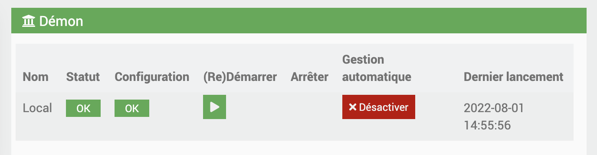
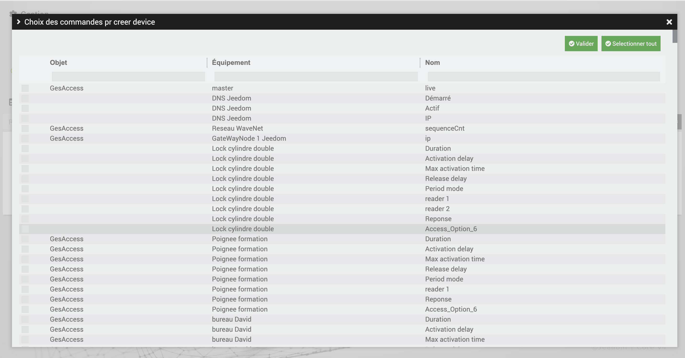
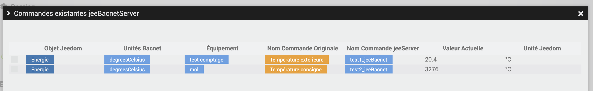

# BacnetManager

# Description

Le plugin BacnetManager permet de créer un equipement Bacnet de votre Jeedom, ainsi que ses commandes Jeedom, pour etre vu sur le réseau par un superviseur Bacnet

# Configuration du plugin

Après téléchargement du plugin, il faut tout d’abord activer celui-ci, comme tout plugin Jeedom :

Ensuite, il faut lancer l’installation des dépendances (même si elles apparaissent OK) :

Enfin, il faut démarrer le démon :

Rien n’est à modifier dans le champ « Port socket interne » de la section « Configuration ».

Dans ce même onglet, il vous faut choisir la valeur du Cron pour l'actualisation de vos équipements.

# Comment fonctionne le plugin ?

>**IMPORTANT**
>
>Vos équipements BACNET doivent se trouver sur le même réseau que votre Jeedom pour être détectés par celle-ci.

Par défaut, un équipement jeeBacnetManager est créé; c'est cet équipement 'bacnet' qui sera vu par votre superviseur Bacnet sur le réseau

Vous pouvez configurer son deviceId dans la configuration du plugin

Pour ajouter des commandes Jeedom à votre jeeBacnetManager, cliquez sur Ajouter Commandes au Serveur :

Une modale va s'ouvrir, où apparaitra tous les commandes de type Infos présentes dans les differents plugin de votre jeedom.

>**IMPORTANT**
>
>Vos équipements doivent etre Actifs pour que les commandes soient détectées sur cette modale.

Vous devez egalement nommer la commande, en remplissant le champ prevu a cet effet. 
Ne pas mettre d'espace dans le nom de la commande

Il vous suffit de chercher celles que vous desirez, et de Valider.

Le device bacnet avec l'instanceId que vous avez choisi va étre créer, et apparaitre sur votre réseau.

Pour mettre à jour les valeurs, vous devez configurer le cron dans la configuration du plugin.

Pour supprimer des commandes du Serveur, il faut se rendre dans les commandes de l'équipement, et simplement Supprimer celles que vous desirez puis sauvegarder.

Vous pouvez également supprimer le device du réseau, ainsi que ses points bacnet en cliquant sur Supprimer le jeeBacnetManager.

# Configuration des Commandes :

Pour changer l'unité des points bacnet, et les voir apparaitre sur le réseau, il vous faut choisir l'unité dans le menu Select prévu à cet effet sur les commandes.
Les commandes Jeedom de type 'string', n'ont pas de selectionner des unités.

Sur le réseau bacnet, les instances des points reprendront les noms des commandes precisés dans le champ sur la modale des Ajouts de commandes.

Une fonction de postCalcul est également prevue : 
si vous choissisez de remplir ce postCalcul, alors la valeur injecté dans le deviceBacnet aura pris la valeur initale à remonter avec le calcul precisé

Vous pouvez par exemple :

#value# * 10

Cela prendra la valeur initiale de la commande a remontée, puis la multipliera par 10 avant de la mettre a jour dans l'instance jeeServer

Exemple :

>**IMPORTANT**
>
>Vous retrouverez l'ensemble des commandes existantes sur le jeeServer sur l'ecran du plugin, en cliquant sur Cmds JeeServer

# Importer/Exporter le jeeBacnetManager (à venir):

Pour prévenir les besoins, 2 options sont prévues : 

- Exporter le device :

En cliquant sur ce bouton, cela va télécharger un fichier Json reprenant la configuration du device ainsi que ses commandes.

- Importer le device :

En cliquant sur ce bouton, vous pouvez importer le ficher json de configuration du jeeBacnetManager que vous auriez télécharger, pour reprendre les commandes qui étaient configurées dans celui ci

# ANNEXE:

# Liste des BACnet Engineering Units (Unités Bacnet)

| Engineering units               |
|---------------------------------|
| ampereSeconds                   |
| ampereSquareHours               |
| ampereSquareMeters              |
| amperes                         |
| amperesPerMeter                 |
| amperesPerSquareMeter           |
| bars                            |
| becquerels                      |
| btus                            |
| btusPerHour                     |
| btusPerPound                    |
| tusPerPoundDryAir               |
| candelas                        |
| candelasPerSquareMeter          |
| centimeters                     |
| centimetersOfMercury            |
| centimetersOfWater              |
| cubicFeet                       |
| cubicFeetPerDay                 |
| cubicFeetPerHour                |
| cubicFeetPerMinute              |
| cubicFeetPerSecond              |
| cubicMeters                     |
| cubicMetersPerDay               |
| cubicMetersPerHour              |
| cubicMetersPerMinute            |
| cubicMetersPerSecond            |
| currency1                       |
| currency10                      |
| currency2                       |
| currency3                       |
| currency4                       |
| currency5                       |
| currency6                       |
| currency7                       |
| currency8                       |
| currency9                       |
| cyclesPerHour                   |
| cyclesPerMinute                 |
| days                            |
| decibels                        |
| decibelsA                       |
| decibelsMillivolt               |
| decibelsVolt                    |
| degreeDaysCelsius               |
| degreeDaysFahrenheit            |
| degreesAngular                  |
| degreesCelsius                  |
| degreesCelsiusPerHour           |
| degreesCelsiusPerMinute         |
| degreesFahrenheit               |
| degreesFahrenheitPerHour        |
| degreesFahrenheitPerMinute      |
| degreesKelvin                   |
| degreesKelvinPerHour            |
| degreesKelvinPerMinute          |
| degreesPhase                    |
| deltaDegreesFahrenheit          |
| deltaDegreesKelvin              |
| farads                          |
| feet                            |
| feetPerMinute                   |
| feetPerSecond                   |
| footCandles                     |
| grams                           |
| gramsOfWaterPerKilogramDryAir   |
| gramsPerCubicCentimeter         |
| gramsPerCubicMeter              |
| gramsPerGram                    |
| gramsPerKilogram                |
| gramsPerLiter                   |
| gramsPerMilliliter              |
| gramsPerMinute                  |
| gramsPerSecond                  |
| gramsPerSquareMeter             |
| gray                            |
| hectopascals                    |
| henrys                          |
| hertz                           |
| horsepower                      |
| hours                           |
| hundredthsSeconds               |
| imperialGallons                 |
| imperialGallonsPerMinute        |
| inches                          |
| inchesOfMercury                 |
| inchesOfWater                   |
| jouleSeconds                    |
| joules                          |
| joulesPerCubicMeter             |
| joulesPerDegreeKelvin           |
| joulesPerHours                  |
| joulesPerKilogramDegreeKelvin   |
| joulesPerKilogramDryAir         |
| kiloBtus                        |
| kiloBtusPerHour                 |
| kilobecquerels                  |
| kilograms                       |
| kilogramsPerCubicMeter          |
| kilogramsPerHour                |
| kilogramsPerKilogram            |
| kilogramsPerMinute              |
| kilogramsPerSecond              |
| kilohertz                       |
| kilohms                         |
| kilojoules                      |
| kilojoulesPerDegreeKelvin       |
| kilojoulesPerKilogram           |
| kilojoulesPerKilogramDryAir     |
| kilometers                      |
| kilometersPerHour               |
| kilopascals                     |
| kilovoltAmpereHours             |
| kilovoltAmpereHoursReactive     |
| kilovoltAmperes                 |
| kilovoltAmperesReactive         |
| kilovolts                       |
| kilowattHours                   |
| kilowattHoursPerSquareFoot      |
| kilowattHoursPerSquareMeter     |
| kilowattHoursReactive           |
| kilowatts                       |
| liters                          |
| litersPerHour                   |
| litersPerMinute                 |
| litersPerSecond                 |
| lumens                          |
| luxes                           |
| megaBtus                        |
| megabecquerels                  |
| megahertz                       |
| megajoules                      |
| megajoulesPerDegreeKelvin       |
| megajoulesPerKilogramDryAir     |
| megajoulesPerSquareFoot         |
| megajoulesPerSquareMeter        |
| megAVoltAmpereHours             |
| megAVoltAmpereHoursReactive     |
| megAVoltAmperes                 |
| megAVoltAmperesReactive         |
| megAVolts                       |
| megawattHours                   |
| megawattHoursReactive           |
| megawatts                       |
| megohms                         |
| meters                          |
| metersPerHour                   |
| metersPerMinute                 |
| metersPerSecond                 |
| metersPerSecondPerSecond        |
| microSiemens                    |
| microgramsPerCubicMeter         |
| microgramsPerLiter              |
| microgray                       |
| micrometers                     |
| microsieverts                   |
| microsievertsPerHour            |
| milesPerHour                    |
| milliamperes                    |
| millibars                       |
| milligrams                      |
| milligramsPerCubicMeter         |
| milligramsPerGram               |
| milligramsPerKilogram           |
| milligramsPerLiter              |
| milligray                       |
| milliliters                     |
| millilitersPerSecond            |
| millimeters                     |
| millimetersOfMercury            |
| millimetersOfWater              |
| millimetersPerMinute            |
| millimetersPerSecond            |
| milliohms                       |
| milliseconds                    |
| millisiemens                    |
| millisieverts                   |
| millivolts                      |
| milliwatts                      |
| minutes                         |
| minutesPerDegreeKelvin          |
| months                          |
| nanogramsPerCubicMeter          |
| nephelometricTurbidityUnit      |
| newton                          |
| newtonMeters                    |
| newtonSeconds                   |
| newtonsPerMeter                 |
| noUnitsohmMeterPerSquareMeter   |
| ohmMeters                       |
| ohms                            |
| pH                              |
| partsPerBillion                 |
| partsPerMillion                 |
| pascalSeconds                   |
| pascals                         |
| perHour                         |
| perMille                        |
| perMinute                       |
| perSecond                       |
| percent                         |
| percentObscurationPerFoot       |
| percentObscurationPerMeter      |
| percentPerSecond                |
| percentRelativeHumidity         |
| poundsForcePerSquareInch        |
| poundsMass                      |
| poundsMassPerHour               |
| poundsMassPerMinute             |
| poundsMassPerSecond             |
| powerFactor                     |
| psiPerDegreeFahrenheit          |
| radians                         |
| radiansPerSecond                |
| revolutionsPerMinute            |
| seconds                         |
| siemens                         |
| siemensPerMeter                 |
| sieverts                        |
| squareCentimeters               |
| squareFeet                      |
| squareInches                    |
| squareMeters                    |
| squareMetersPerNewton           |
| teslas                          |
| therms                          |
| tonHours                        |
| tons                            |
| tonsPerHour                     |
| tonsRefrigeration               |
| usGallons                       |
| usGallonsPerHour                |
| usGallonsPerMinute              |
| voltAmpereHours                 |
| voltAmpereHoursReactive         |
| voltAmperes                     |
| voltAmperesReactive             |
| volts                           |
| voltsPerDegreeKelvin            |
| voltsPerMeter                   |
| voltsSquareHours                |
| wattHours                       |
| wattHoursPerCubicMeter          |
| wattHoursReactive               |
| watts                           |
| wattsPerMeterPerDegreeKelvin    |
| wattsPerSquareFoot              |
| wattsPerSquareMeter             |
| wattsPerSquareMeterDegreeKelvin |
| webers                          |
| weeks                           |
| years                           |

### Configuration du Plugin

#### Mode Avancé

En activant le **Mode Avancé**, le cron configuré ne récupérera plus les valeurs des commandes Jeedom pour les mettre à jour sur le serveur. À la place, il vérifiera si une écriture a eu lieu sur le serveur et exécutera les commandes Actions des différents plugins paramétrés avec la valeur écrite sur le point Bacnet ou la valeur renseignée (voir la modale CmdsJeeServer).

#### Paramétrage des Commandes

Comme d'habitude, après avoir paramétré les commandes de type Info, il est nécessaire de se rendre dans la modale **CmdsJeeServer** pour configurer et envoyer les commandes au serveur.

1. **Choix de la Commande Action** : Sélectionnez une commande Action en fonction du plugin choisi.
2. **Valeur Initiale** : Définissez une valeur initiale pour initialiser le point Bacnet pour la première fois.
3. **Utiliser Valeur Bacnet** : Cochez cette option pour utiliser la valeur Bacnet. Si cette option n'est pas cochée, vous devez remplir le champ "Valeur à envoyer à l'action".

Lors du passage du cron, le système vérifiera s'il y a eu un changement de valeur sur le point Bacnet (écriture). À ce moment-là, il enverra soit cette valeur Bacnet, soit la valeur renseignée dans "Envoyer à l'action" à la commande Action paramétrée.