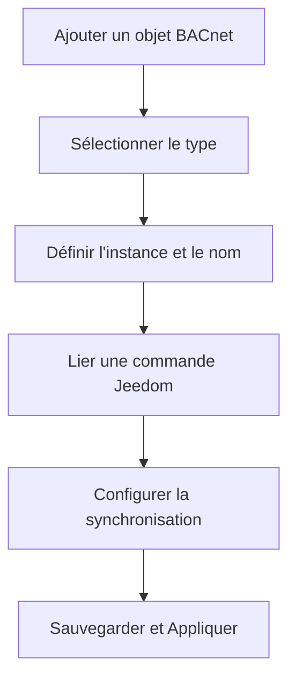

# Mapping Jeedom → BACnet

La fenêtre de mapping permet de créer et gérer les liens entre vos commandes Jeedom et les objets BACnet exposés sur le réseau. C'est l'interface centrale pour configurer votre serveur BACnet.

## Accès

Pour accéder à l'écran de mapping :
1. Depuis le plugin BACnet Stack Server
2. Cliquez sur le bouton **Mapping Jeedom → BACnet** dans le menu principal
3. L'écran s'ouvre dans une fenêtre modale

> **Note** : Vous devez disposer des droits administrateur pour accéder à cette fonctionnalité.

---

## Vue d'ensemble

### En-tête

L'en-tête présente :
- **Titre** : Mapping Jeedom → BACnet
- **Description** : "Liez vos commandes Jeedom à des objets BACnet pour les exposer sur le réseau"
- **Bouton de défilement** : Icône flottante permettant d'aller rapidement en bas de la page

---

## Configuration de la synchronisation automatique

### 1. Synchronisation des valeurs

Cette section configure la mise à jour automatique des valeurs BACnet depuis Jeedom.

#### Paramètres disponibles

| Paramètre | Options | Par défaut |
|-----------|---------|------------|
| **Fréquence** | • Chaque minute<br>• Toutes les 5 minutes<br>• Toutes les 10 minutes<br>• **Toutes les 15 minutes** ✓<br>• Toutes les 30 minutes<br>• Chaque heure<br>• Personnalisé | 15 minutes |
| **Cron personnalisé** | Format cron : `* * * * *` | - |
| **Activation** | Case à cocher | Activé |

#### Format du cron personnalisé
```
minute heure jour mois jour_semaine
```

**Exemples** :
- `*/5 * * * *` : Toutes les 5 minutes
- `0 */2 * * *` : Toutes les 2 heures
- `0 8,12,18 * * *` : À 8h, 12h et 18h

---

### 2. Synchronisation des agendas

Cette section configure la mise à jour automatique des agendas Jeedom avec les schedules BACnet.

#### Paramètres disponibles

| Paramètre | Options | Par défaut |
|-----------|---------|------------|
| **Fréquence** | • **Une fois par jour (minuit)** ✓<br>• Toutes les 6 heures<br>• Toutes les 12 heures<br>• Chaque heure<br>• Toutes les 30 minutes<br>• Personnalisé | Minuit |
| **Cron personnalisé** | Format cron : `0 0 * * *` | - |
| **Activation** | Case à cocher | Activé |

> **ℹ️ Important** : Cette synchronisation met à jour les agendas Jeedom avec les plannings des schedules BACnet cochés "Sync agenda". Elle est **indépendante** de la synchronisation des valeurs des commandes info.

---

## Boutons d'action principaux

### Barre d'actions

| Bouton | Icône | Description |
|--------|-------|-------------|
| **Ajouter un objet BACnet** | ➕ | Ajoute une nouvelle ligne vide dans le tableau |
| **Synchroniser maintenant** | 🔄 | Lance immédiatement une synchronisation des valeurs |
| **Synchroniser les agendas maintenant** | 📅 | Lance immédiatement une synchronisation des agendas |

---

## Tableau des objets BACnet

Le tableau présente tous les objets BACnet configurés avec leurs liaisons Jeedom.

### Colonnes du tableau

#### 1. Type BACnet (13%)

Liste déroulante des types d'objets BACnet disponibles :

| Type | Description |
|------|-------------|
| **analog-input** | Entrée analogique (capteur) |
| **analog-value** | Valeur analogique (variable) |
| **analog-output** | Sortie analogique (actionneur) |
| **binary-input** | Entrée binaire (contact) |
| **binary-value** | Valeur binaire (variable) |
| **binary-output** | Sortie binaire (relais) |
| **multi-state-input** | Entrée multi-états |
| **multi-state-value** | Valeur multi-états |
| **multi-state-output** | Sortie multi-états |
| **trendlog** | Historique de données |
| **schedule** | Planning horaire |

#### 2. Instance (6%)

- Numéro d'instance BACnet (unique)
- Champ numérique, valeur minimale : 0
- Utilisé pour identifier l'objet sur le réseau BACnet

#### 3. Nom BACnet (13%)

- Nom descriptif de l'objet tel qu'il apparaîtra sur le réseau BACnet
- Texte libre
- **Recommandation** : Utilisez des noms explicites (ex: "Temperature_Salon", "Lumiere_Cuisine")

#### 4. Commande Jeedom (30%)

Sélection en 3 étapes de la commande Jeedom à lier :

**Structure** :
1. **Objet** : Sélection de l'objet Jeedom (ex: Salon, Cuisine)
2. **Équipement** : Sélection de l'équipement dans l'objet
3. **Commande** : Sélection de la commande (info ou action)

**Annotations** :
- Les commandes sont suffixées de leur type :
  - `(info)` : Commande d'information (lecture)
  - `(action)` : Commande d'action (écriture)

**Bouton supplémentaire** (pour commandes action) :
- **Configuration de l'action** : Configure la valeur à exécuter
- Badge **Configurée** ✓ : Affiché quand une configuration existe

#### 5. Valeur initiale (14%)

Gestion de la valeur présente de l'objet BACnet :

**Modes disponibles** :
- 🔄 **Auto** : La valeur est récupérée automatiquement de la commande Jeedom
- ✋ **Manuel** : Vous saisissez une valeur fixe

**Comportement** :
- Mode **Auto** (par défaut) : Le champ est désactivé (grisé), affiche "Valeur de la commande"
- Mode **Manuel** : Le champ est actif, vous pouvez saisir une valeur

#### 6. Sync auto (8%)

Configuration de la synchronisation automatique (uniquement pour commandes **info**) :

| Mode | Description |
|------|-------------|
| **Aucun** | Pas de synchronisation automatique |
| **Maj auto** ✓ | Mise à jour selon la fréquence définie en haut (cron) |
| **Sur event** | Mise à jour immédiate lors d'un changement de valeur dans Jeedom |

> **Note** : Ces options sont désactivées si aucune commande n'est liée ou si la commande est de type action.

#### 7. Actions (8%)

Boutons de configuration selon le type d'objet :

| Bouton | Icône | Type d'objet | Description |
|--------|-------|--------------|-------------|
| **Planning** | 📅 | schedule | Configure le planning hebdomadaire |
| **États** | 🔢 | multi-state-* | Définit les textes des états |
| **Trendlog** | 📈 | trendlog | Configure l'historique |
| **Supprimer** | 🗑️ | Tous | Supprime la ligne |

#### 8. Agenda (8%)

Colonne visible uniquement pour les objets de type **schedule** :

**Éléments** :
- ☑️ **Case à cocher** : "Sync agenda" - Active la synchronisation avec un agenda Jeedom
- 📅 **Bouton de configuration** : Permet de sélectionner l'agenda Jeedom cible
- ✓ **Badge configuré** : Indique qu'un agenda a été associé

---

## Configurations avancées

### Configuration des commandes action

Accessible via le bouton **Configuration de l'action** pour les commandes de type action.

#### Modes de valeur

**1. Utiliser la valeur reçue en écriture sur le point BACnet** (par défaut)
- La valeur écrite par le client BACnet est transmise directement à la commande Jeedom
- Exemple : Si un client BACnet écrit `25`, la commande Jeedom reçoit `25`

**2. Utiliser une valeur fixe**
- Une valeur prédéfinie sera toujours envoyée, quelle que soit la valeur reçue
- Utile pour des commandes on/off, des scénarios, etc.
- Exemple : Toujours envoyer `ON` quand le point BACnet reçoit une écriture

**Champ supplémentaire** :
- **Valeur fixe** : Saisissez la valeur à envoyer (visible en mode "Valeur fixe")

---

### Configuration des schedules

Accessible via le bouton **Planning** pour les objets de type schedule.

#### Paramètres généraux

| Paramètre | Description | Par défaut |
|-----------|-------------|------------|
| **Nom du schedule** | Nom BACnet (lecture seule) | - |
| **Valeur par défaut** | False (0) ou True (1) | False |
| **Priorité** | Priorité BACnet (1-16) | 8 |

#### Planning hebdomadaire

Pour chaque jour de la semaine (Lundi à Dimanche) :
1. **Ajouter une plage horaire** : Bouton pour créer une nouvelle période
2. **Heures** : Heure de début et heure de fin
3. **Valeur** : Valeur à appliquer pendant cette plage
4. **Commande action** (optionnel) : Commande Jeedom à exécuter au début de la plage

**Structure d'une plage horaire** :
```
Début : [HH:MM]  →  Fin : [HH:MM]
Valeur : [True/False]
Commande : [Sélection Jeedom]
```

**Bouton supprimer** : Pour retirer une plage horaire

---

### Configuration des états multi-state

Accessible via le bouton **États** pour les objets multi-state.

#### Fonctionnement

Définissez les textes correspondant à chaque valeur numérique :

| Valeur | Texte descriptif |
|--------|------------------|
| 1 | Mode Confort |
| 2 | Mode Eco |
| 3 | Mode Hors-gel |
| 4 | Mode Arrêt |

**Bouton** : **Ajouter un état** pour créer une nouvelle entrée

> **Note** : Les valeurs sont numérotées automatiquement (1, 2, 3...). Chaque ligne correspond à une valeur.

---

### Configuration de synchronisation agenda

Accessible via le bouton de configuration 📅 dans la colonne Agenda (pour schedules uniquement).

#### Paramètres

| Élément | Description |
|---------|-------------|
| **Schedule BACnet** | Nom du schedule (lecture seule) |
| **Agenda Jeedom** | Sélection de l'agenda cible dans Jeedom |

> **⚠️ Important** : Les commandes à exécuter se configurent dans la modale "Planning" (bouton avec icône calendrier), pour chaque plage horaire individuellement. Cela vous permet d'avoir des actions différentes selon les jours et les heures.

---

## Gestion des configurations

### Créer une nouvelle configuration

**Bouton** : **Nouvelle configuration** (vert)
- Crée un fichier de configuration vierge
- Réinitialise le tableau (supprime tous les objets)
- Point de départ pour une nouvelle installation

### Charger une configuration

**Bouton** : **Charger une configuration** (orange)
- Ouvre un sélecteur de fichier
- Importe un fichier JSON de configuration
- **⚠️ Attention** : La configuration actuelle sera remplacée

**Format de fichier** : JSON structuré avec les objets BACnet

---

## Boutons de sauvegarde

### Barre inférieure

| Bouton | Icône | Description |
|--------|-------|-------------|
| **Sauvegarder** | 💾 | Enregistre la configuration sans l'appliquer au serveur BACnet |
| **Sauvegarder et Appliquer** | 📤 | Enregistre ET applique immédiatement au serveur BACnet |

> **Recommandation** : Utilisez **Sauvegarder et Appliquer** pour que vos modifications soient prises en compte sur le réseau BACnet.

---

## Workflow type

### 1. Configuration initiale



### 2. Ajout d'un objet simple

1. Cliquez sur **Ajouter un objet BACnet**
2. Sélectionnez le **Type BACnet** (ex: `analog-input`)
3. Définissez l'**Instance** (ex: `101`)
4. Nommez l'objet (ex: `Temperature_Salon`)
5. Sélectionnez la **Commande Jeedom** :
   - Objet : Salon
   - Équipement : Capteur température
   - Commande : Température (info)
6. Mode **Auto** pour la valeur initiale
7. Activez **Maj auto** pour la synchronisation
8. Cliquez sur **Sauvegarder et Appliquer**

### 3. Configuration d'un schedule

1. Ajoutez un objet de type **schedule**
2. Définissez instance et nom
3. Cliquez sur le bouton **Planning** 📅
4. Configurez le planning :
   - Valeur par défaut : `False`
   - Priorité : `8`
   - Pour chaque jour souhaité :
     - Cliquez sur **Ajouter une plage horaire**
     - Définissez heures de début et fin
     - Sélectionnez la valeur à appliquer
     - (Optionnel) Sélectionnez une commande action
5. Validez
6. Si vous souhaitez synchroniser avec Jeedom :
   - Cochez **Sync agenda**
   - Cliquez sur le bouton de configuration 📅
   - Sélectionnez l'agenda Jeedom
   - Validez
7. **Sauvegarder et Appliquer**

---

## Bonnes pratiques

### ✅ Recommandations

#### Numérotation des instances
- **Utilisez des plages par type** :
  - Analog : 0-999
  - Binary : 1000-1999
  - Multi-state : 2000-2999
  - Schedule : 3000-3999
  - Trendlog : 4000-4999

#### Noms des objets
- **Soyez descriptif** : `Temperature_Salon` plutôt que `Temp1`
- **Évitez les accents** : Préférez `Eclairage_Cuisine` à `Éclairage_Cuisine`
- **Utilisez des underscores** : `Lumiere_Chambre` plutôt que `Lumiere Chambre`

#### Synchronisation
- **Commandes info** :
  - Utilisez **Sur event** pour les valeurs critiques (alarmes, états)
  - Utilisez **Maj auto** pour les valeurs de confort (températures, mesures)
- **Fréquence** :
  - 15 minutes par défaut pour la plupart des usages
  - 5 minutes pour les environnements dynamiques
  - 30-60 minutes pour les valeurs lentes (statistiques, compteurs)

#### Organisation
- **Groupez par fonction** : Même plage d'instances pour les objets d'une même pièce
- **Documentez** : Utilisez des noms cohérents entre Jeedom et BACnet

### ⚠️ Points d'attention

#### Instances uniques
- Chaque instance doit être **unique** sur le réseau BACnet
- Le système ne vérifie pas automatiquement les doublons
- En cas de doublon, le comportement est imprévisible

#### Types de commandes
- Une commande **info** (lecture) → Objet BACnet input/value
- Une commande **action** (écriture) → Objet BACnet output/value
- **Attention** : Un output BACnet ne peut pas être lié à une commande info Jeedom

#### Performance
- Ne synchronisez pas toutes les commandes "sur event" 
- Trop de synchronisations simultanées peuvent ralentir le système
- Préférez des fréquences adaptées au besoin réel

#### Schedules
- La synchronisation agenda est unidirectionnelle : **BACnet → Jeedom**
- Les modifications dans l'agenda Jeedom ne remontent pas vers BACnet
- Configurez le planning dans BACnet comme source de vérité

---

## Types d'objets BACnet détaillés

### Objets analogiques

**Utilisations courantes** :
- Températures
- Humidités  
- Tensions
- Puissances
- Consommations

**Configuration** :
- Valeur initiale : Nombre décimal ou entier
- Unités : Configurables dans les propriétés de la commande Jeedom

### Objets binaires

**Utilisations courantes** :
- États marche/arrêt
- Contacts de porte/fenêtre
- Détecteurs de présence
- Relais

**Configuration** :
- Valeur initiale : `0` (inactif) ou `1` (actif)
- Pas d'unités

### Objets multi-state

**Utilisations courantes** :
- Modes de fonctionnement (Confort, Eco, Hors-gel...)
- Sélection de scénarios
- États complexes

**Configuration** :
- Valeur initiale : Nombre entier (1, 2, 3...)
- Configuration des textes dans **États**

### Trendlogs

**Utilisations courantes** :
- Historisation de valeurs
- Courbes de tendance
- Enregistrements périodiques

**Configuration** :
- Nécessite une commande info Jeedom historisée
- Configuration via le bouton **Trendlog**

### Schedules

**Utilisations courantes** :
- Programmations horaires
- Gestion chauffage/climatisation
- Éclairages programmés
- Scénarios planifiés

**Configuration** :
- Planning hebdomadaire détaillé
- Synchronisation optionnelle avec agendas Jeedom
- Commandes action par plage horaire

---

## Dépannage

### Les modifications ne sont pas prises en compte

**Solution** :
1. Vérifiez que vous avez cliqué sur **Sauvegarder et Appliquer** (et non juste Sauvegarder)
2. Redémarrez le démon BACnet si nécessaire
3. Consultez les logs du plugin

### La commande Jeedom ne s'affiche pas

**Causes possibles** :
- Équipement désactivé dans Jeedom
- Commande supprimée
- Droits insuffisants

**Solution** :
1. Vérifiez que l'équipement est actif
2. Rechargez la page et réessayez
3. Sélectionnez une autre commande

### La synchronisation automatique ne fonctionne pas

**Vérifications** :
1. Le cron est-il activé ? (case cochée)
2. La commande est-elle de type **info** ?
3. Le mode est-il sur **Maj auto** ou **Sur event** ?
4. Le démon est-il démarré ?

**Solution** :
- Utilisez **Synchroniser maintenant** pour tester
- Consultez les logs de synchronisation
- Vérifiez la configuration du cron Jeedom

### Instance BACnet déjà utilisée

**Symptôme** : Erreurs dans les logs, comportement erratique

**Solution** :
1. Vérifiez les doublons d'instances dans votre tableau
2. Modifiez l'instance en doublon
3. Sauvegardez et appliquez

---

## Interface utilisateur

### Design et ergonomie

L'interface utilise :
- **Dégradés de couleur** verts pour l'en-tête (cohérence BACnet)
- **Panels gradients** beiges pour les zones de configuration
- **Boutons modernes** avec effets au survol
- **Indicateurs visuels** (badges, icônes) pour l'état des configurations

### Navigation

- **Bouton de défilement flottant** : Permet d'atteindre rapidement le bas de la page
  - Position basse par défaut
  - Remonte automatiquement quand on atteint le bas
  - Icône flèche vers le bas

### Responsive

L'interface s'adapte aux différentes tailles d'écran tout en conservant sa fonctionnalité complète.

---

## Raccourcis et astuces

### Raccourcis clavier

Aucun raccourci clavier n'est actuellement implémenté pour cet écran.

### Astuces

1. **Dupliquer un objet** : Copiez les valeurs manuellement dans une nouvelle ligne
2. **Import rapide** : Utilisez un fichier JSON pour importer plusieurs objets simultanément
3. **Test rapide** : Utilisez "Synchroniser maintenant" après chaque modification pour vérifier le comportement
4. **Mode manuel** : Utile pour tester des valeurs fixes avant de lier une commande Jeedom

---

## Formats de fichier

### Configuration JSON

Structure du fichier de configuration :

```json
{
  "device_instance": 100,
  "device_name": "Jeedom BACnet Server",
  "port": 47808,
  "objects": [
    {
      "type": "analog-input",
      "instance": 101,
      "name": "Temperature_Salon",
      "presentValue": null,
      "_jeedom_cmd_id": 1234,
      "_jeedom_cmd_type": "info",
      "_jeedom_auto_sync": true,
      "_jeedom_on_event": false
    },
    {
      "type": "schedule",
      "instance": 3001,
      "name": "Planning_Chauffage",
      "schedule": {
        "defaultValue": false,
        "priority": 8,
        "days": [
          {
            "day": 0,
            "entries": [
              {
                "start": "07:00",
                "end": "22:00",
                "value": true,
                "cmdId": 5678
              }
            ]
          }
        ]
      },
      "_jeedom_agenda_id": 12,
      "_jeedom_agenda_sync": true
    }
  ]
}
```

---

## Compatibilité

### Versions Jeedom
- Jeedom v4.x : ✅ Compatible
- Jeedom v3.x : ⚠️ Non testé

### Protocole BACnet
- BACnet/IP
- Révision du protocole : 14+

---

## Support

En cas de problème :
1. Consultez les logs du plugin : `Analyse` → `Logs` → `bacnetStackServer`
2. Vérifiez la documentation des types d'objets BACnet
3. Consultez le forum communautaire Jeedom
4. Ouvrez une issue sur GitHub si nécessaire

---

## Changelog

- **v1.0** : Version initiale
  - Gestion complète des objets BACnet
  - Synchronisation automatique configurable
  - Gestion des schedules avec agendas
  - Configuration des commandes action
  - Interface moderne et intuitive
