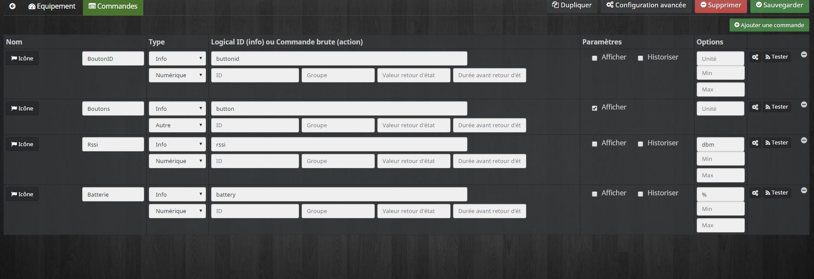

# Plugin BLEA (Bluetooth advertisement)

Ce plugin est un plugin permettant de pouvoir recevoir les événements de certains périphériques bluetooth (tel que les NIU de chez Nodon et autre)

# Configuration du plugin

> **Tip**
>
> Afin d’utiliser le plugin, vous devez le télécharger, l’installer et l’activer comme tout plugin Jeedom.

Suite à cela vous arriverez sur cette page :

Sur cette page vous avez peu de choses à faire. Il est très vivement recommandé de lancer l’installation des dépendances (même si elles apparaissent OK). Puis à la fin de rafraichir la page.

> **Important**
>
> La chose la plus importante ici est de sélectionner votre Contrôleur Bluetooth

L’autre option disponible sur cette page est : **Supprimer automatiquement les périphériques exclus**. Celle-ci permet de supprimer les équipements de Jeedom lorsqu’ils sont exclus.

Vous pouvez aussi vérifier l’état des dépendances et les relancer. Encas de soucis avec le plugin, toujours relancer les dépendances même si OK dans le doute.

# Le plugin

Rendez vous dans le menu Plugins &gt; Protocole Domotique pour retrouver le plugin.

Sur cette page, vous pourrez voir les modules déjà inclus.

Sur la partie haute de cette page, vous avez plusieurs boutons.

- Bouton Inclusion : ce bouton permet de mettre Jeedom en Inclusion.
- Bouton Exclusion : ce bouton permet de mettre Jeedom en Exclusion.
- Bouton Configuration : ce bouton permet d’ouvrir la fenêtre de configuration du plugin.
- Bouton Santé : ce bouton permet d’avoir un aperçu Santé de tous vos modules.

# Equipement

Lorsque que vous cliquez sur un de vos modules, vous arrivez sur la page de configuration de celui-ci. Comme partout dans Jeedom vous pouvez ici sur la partie gauche :

- Donner un nom au module.
- L’activer/le rendre visible ou non.
- Choisir son objet parent.
- Lui attribuer une catégorie.
- Definir un delai de surveillance de communication pour certains modules.
- Mettre un commentaire.

Sur la partie droite vous trouverez :

- Le profil de l’équipement (généralement auto détecté si le module le permet).
- Choisir un modèle si pour ce profil plusieurs modèles sont disponibles.
- Voir le visuel.

# Quels modules

Pour le moment, seuls certains modules spécifiques sont reconnus.

## Cas des NIU

Les NIU s’incluent très facilement, mettez Jeedom en Inclusion puis appuyer sur le bouton (aussi simple que cela).

Une fois le NIU créé, vous obtiendrez ceci :

Vous aurez ainsi 4 commandes :

- BoutonId : donne une représentation numérique du type d’appui (idéal pour les scénarios)
  - 01 : simple appui
  - 02 : double appui
  - 03 : appui long
  - 04 : relachement
- Boutons : donne une représentation textuelle du type d’appui
- Rssi : donne la valeur d’intensité du signal
- Batterie : donne la valeur de la batterie

## Cas d’autres modules

D’autres modules peuvent être inclus du type beacon NUT, bracelet fitbit, etc.

Ils permettront une détection de présence avec une détection sur un créneau de 1 minute.

Bien évidemment de nombreux autres modules seront rajoutés.

# Configuration d'antennes distantes

Le bluetooth ayant une portée relativement limitée, il est possible qu'une partie de votre habitation soit hors portée de votre antenne selon l'emplacement de votre box Jeedom.
Mais il existe une solution: il est possible d'étendre le réseau en installant des antennes supplémentaires.

Le plus simple est d'utiliser un raspBerry pi (existant ou dédié selon l'équipement que vous avez déjà). On va supposer ici que le raspBerry est déjà installé avec une raspbian et que ssh ainsi que le bluetooth sont activé.

## Créé l'antenne

Vous devez vous rendre sur la page du plugin (Plugins > Protocole Domotique) et cliquer sur "Antennes"

1) cliquez sur "Ajouter"
2) choisisez un nom
3) Entrez l'ip et le port (22 par défaut)
4) Entrez le nom d'utilisateur ("pi" par défaut) et le mot de passe
5) Entrez l'équipement bluetooth sur le pi ("hci0" sur une installation par défaut)
6) Sauvegardez

## Installation du démon

Si il n'y a pas eu d'erreur et que votre antenne est bien créée dans le plugin, il faut maintenant installer les dépendances nécesaires et lancer le démon sur l'antenne qui va se charger de faire le lien entre les équipements bluetooth à portée de l'antenne et le plugin (et donc Jeedom).

1) Cliquez sur le bouton "Envoyer les fichiers", cela peut prendre un peu de temps, patientez. Un bandeau vert confirmant la réussite va apparaître, rouge s'il y a eu un problème. Dans ce cas, vérifiez le log "Blea", vérifiez la configuration (ip, user, password, ...)
2) Cliquez ensuite sur le bouton "Lancer les dépendances". De nouveau, cela peut prendre du temps, patientez. Un bandeau vert confirmera la réussite ou rouge sinon (pareil, vérifiez la log Blea)
3) Optionelle, vous pouvez récupérer manuellement le log d'installation des dépendances en cliquant sur "Log dépendances" et vérfier la log, un fichier log spécifique sera disponnible dans la config du plugin.
4) Si tout c'est bien déroulé, vous pouvez cliquer sur "Lancer le démon", après maximum une minute la date de dernière communication devrait se mettre à jour, cela veut dire que le démon communique correctement avec le plugin BLEA.
5) Dernière étape optionnelle mais recommandée: activez la gestion automatique du démon en cliquant sur le bouton correspondant. Cela fera en sorte que le plugin tentera de relancer automatiquement le démon distant en cas de perte de connexion (pratique si votre pi distant a été temporairement débranché du secteur ou qu'il a été redémarré suite à des mises à jours).

# Liste des équipements compatibles

Certains équipements comme le lywsd03 nécessitent d'être ajouté a mihome au moins une fois avant d'être actif

Vous pouvez trouver [ici](https://compatibility.jeedom.com/index.php?v=d&p=home&search=&plugin=blea) la liste des équipements compatibles
