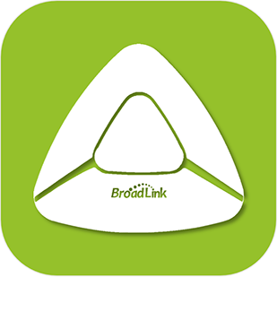
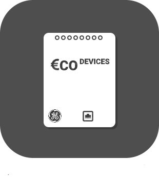
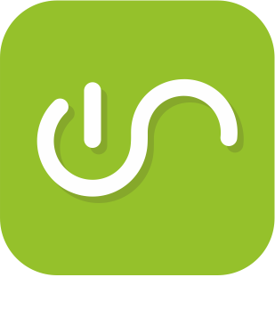
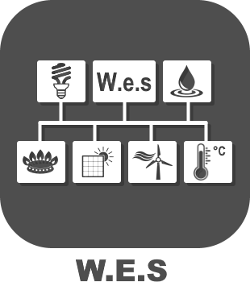
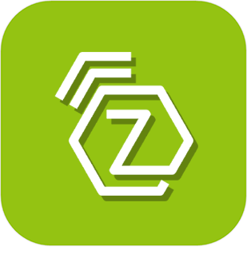

>**IMPORTANT**
>Seuls les plugins officiels ont leur documentation ici. Vous pouvez consulter les documentations des autres plugins directement depuis le Market Jeedom. Une fois sur le plugin en question, cliquez sur documentation.
>Vous pouvez voir [ici](https://market.jeedom.com/index.php?v=d&p=market&type=plugin&categorie=automation+protocol) tous les plugins officiels de cette catégorie

| | | | |
|--- | --- | --- | ---|
||BACnet|Plugin permettant de piloter des équipements Bacnet/IP|[Documentation Stable](bacnet/index.md) - [Documentation Beta](bacnet/beta/index.md) [Market](https://market.jeedom.com/index.php?v=d&p=market_display&id=4161) [Changelog Stable](bacnet/changelog.md) - [Changelog Beta](bacnet/beta/changelog.md)|
||BACnetServer|ATTENTION plugin disponible uniquement en beta Plugin permettant de créer un device Bacnet/Jeedom|[Documentation beta](bacnetServer/beta/index.md) [Market](https://market.jeedom.com/index.php?v=d&p=market_display&id=4323) [Changelog beta](bacnetServer/beta/changelog.md)|
||Odace SFSP|Plugin ajoutant le support de la gamme Odace SFSP (sans fil sans pile) Schneider à Jeedom. Il permet d'obtenir les informations des interrupteurs (volets/ scènes / simple / double). Il permet de contrôler les actionneurs (volet/dcl). Il permet aussi de pouvoir utiliser les scènes et les groupes.|[Documentation Stable](beagle/index.md) [Market](https://market.jeedom.com/index.php?v=d&p=market_display&id=3917) [Changelog Stable](beagle/changelog.md)|
||Bluetooth Advertisement|Plugin pour la gestion de certains devices qui fonctionnent en bluetooth advertisement comme les NIUS de Nodon Pour les NIUS il permet de detecter les différents appuis. Pour certains autres devices il permet de faire de la présence. Aussi compatible avec les boutons ticatag (avec gestion des multiples appuis température et action pour le faire sonner) Compatible Mi flora, Mi scale , awox smartplug, playbulb, miband1 et 1s|[Documentation Stable](blea/index.md) - [Documentation Beta](blea/beta/index.md) [Market](https://market.jeedom.com/index.php?v=d&p=market_display&id=2554) [Changelog Stable](blea/changelog.md) - [Changelog Beta](blea/beta/changelog.md)|
||Broadlink|Plugin ajoutant le support de certains produits Broadlink comme (le RM, le A1 etccc)|[Documentation Stable](broadlink/index.md) - [Documentation Beta](broadlink/beta/index.md) [Market](https://market.jeedom.com/index.php?v=d&p=market_display&id=2699) [Changelog Stable](broadlink/changelog.md) - [Changelog Beta](broadlink/beta/changelog.md)|
||Dali|Ce plugin permet la gestion du protocole Dali, compatible uniquement avec la gateway HASSEB DaliMaster v2|[Documentation Stable](dali/index.md) - [Documentation Beta](dali/beta/index.md) [Market](https://market.jeedom.com/index.php?v=d&p=market_display&id=4223) [Changelog Stable](dali/changelog.md) - [Changelog Beta](dali/beta/changelog.md)|
||Deconz|Ce plugin va vous permettre d'intégrer une multitude de modules ZigBee (Ikea, Philips Hue, Xiaomi etc...) sans avoir a passer par leur passerelle avec la clé Conbee/Conbee II. IMPORTANT : il faut absolument une clef conbee pour utiliser ce plugin. Autre point il faut bien lire la documentation et les modules compatibles.|[Documentation Stable](deconz/index.md) - [Documentation Beta](deconz/beta/index.md) [Market](https://market.jeedom.com/index.php?v=d&p=market_display&id=3610) [Changelog Stable](deconz/changelog.md) - [Changelog Beta](deconz/beta/changelog.md)|
||Eco-device||[Documentation Stable](ecodevice/index.md) - [Documentation Beta](ecodevice/beta/index.md) [Market](https://market.jeedom.com/index.php?v=d&p=market_display&id=342) [Changelog Stable](ecodevice/changelog.md) - [Changelog Beta](ecodevice/beta/changelog.md)|
||Edimax Plug||[Documentation Stable](edimaxplug/index.md) [Market](https://market.jeedom.com/index.php?v=d&p=market_display&id=2455) [Changelog Stable](edimaxplug/changelog.md)|
||Edisio|Plugin Edisio pour gérer le protocole Edisio avec clef USB Edisio. Ainsi vous pourrez communiquer avec les produits de la gamme Edisio.|[Documentation Stable](edisio/index.md) [Market](https://market.jeedom.com/index.php?v=d&p=market_display&id=1541) [Changelog Stable](edisio/changelog.md)|
||ipx800 V3||[Documentation Stable](ipx800/index.md) - [Documentation Beta](ipx800/beta/index.md) [Market](https://market.jeedom.com/index.php?v=d&p=market_display&id=344) [Changelog Stable](ipx800/changelog.md) - [Changelog Beta](ipx800/beta/changelog.md)|
||ipx800 V2|| [Market](https://market.jeedom.com/index.php?v=d&p=market_display&id=1194)|
||IPX 800 v4|Plugin pour piloter l'IPX 800|[Documentation Stable](ipx800v4/index.md) - [Documentation Beta](ipx800v4/beta/index.md) [Market](https://market.jeedom.com/index.php?v=d&p=market_display&id=2046) [Changelog Stable](ipx800v4/changelog.md) - [Changelog Beta](ipx800v4/beta/changelog.md)|
||IPX800 v5|ATTENTION plugin disponible uniquement en beta Plugin pour l'ipx800v5.Attention du à la complexité de l'api mise à disposition par le fabricant ce plugin n'est pas recommandé pour les débuts. Si vous pouvez partez plutot sur un ipx800v4 bien plus simple. Attention le plugin passera payant quand il passera en stable|[Documentation beta](ipx800v5/beta/index.md) [Market](https://market.jeedom.com/index.php?v=d&p=market_display&id=4218) [Changelog beta](ipx800v5/beta/changelog.md)|
||Lora Payload|Plugin permetant le traduire les Payloads Lora, uniquement destiné au projet de l'équipe Jeedom| - [Documentation Beta](lorapayload/beta/index.md) [Market](https://market.jeedom.com/index.php?v=d&p=market_display&id=4146) - [Changelog Beta](lorapayload/beta/changelog.md)|
||Modbus|Plugin Modbus Non compatible Wago|[Documentation Stable](modbus/index.md) - [Documentation Beta](modbus/beta/index.md) [Market](https://market.jeedom.com/index.php?v=d&p=market_display&id=4267) [Changelog Stable](modbus/changelog.md) - [Changelog Beta](modbus/beta/changelog.md)|
||Modbus Server|ATTENTION plugin disponible uniquement en beta Plugin permettant de créer un device Modbus/Jeedom|[Documentation beta](modbusServer/beta/index.md) [Market](https://market.jeedom.com/index.php?v=d&p=market_display&id=4357) [Changelog beta](modbusServer/beta/changelog.md)|
||MyhomeSCS|Permet de gérer le protocole MyHome Bus.|[Documentation Stable](myhomescs/index.md) [Market](https://market.jeedom.com/index.php?v=d&p=market_display&id=3107) [Changelog Stable](myhomescs/changelog.md)|
||EnOcean|Plugin ajoutant le support du EnOcean à Jeedom https://compatibility.jeedom.com/index.php?v=d&p=home&search=&plugin=openenocean De nombreux modules seront rajoutés rapidement et en continue Nous vous conseillons de migrer avec precaution|[Documentation Stable](openenocean/index.md) - [Documentation Beta](openenocean/beta/index.md) [Market](https://market.jeedom.com/index.php?v=d&p=market_display&id=2622) [Changelog Stable](openenocean/changelog.md) - [Changelog Beta](openenocean/beta/changelog.md)|
||Z-Wave|Plugin pour contrôler les équipements ZWave via une clé ZWave compatible openZwave|[Documentation Stable](openzwave/index.md) - [Documentation Beta](openzwave/beta/index.md) [Market](https://market.jeedom.com/index.php?v=d&p=market_display&id=185) [Changelog Stable](openzwave/changelog.md) - [Changelog Beta](openzwave/beta/changelog.md)|
||RfPlayer2|Plugin ajoutant le support de la clé RfPlayer de Ziblue à Jeedom. Ce plugin remplacera à terme le premier plugin. Il sera mis à disposition de tous les possesseurs du premier plugin. Cela permettra à chacun de migrer tranquillement. Car la philosophie du plugin ayant changé et les ids aussi, il faudra réinclure vos devices sur ce nouveau plugin.|[Documentation Stable](rfplayer2/index.md) - [Documentation Beta](rfplayer2/beta/index.md) [Market](https://market.jeedom.com/index.php?v=d&p=market_display&id=3349) [Changelog Stable](rfplayer2/changelog.md) - [Changelog Beta](rfplayer2/beta/changelog.md)|
||RFXcom|Plugin pour utiliser le RFXcom USB. Permet de piloter les équipements domotiques de type 433Mhz ( Chacon, Oregon, La Crosse, X10, DI-O, Blyss...)|[Documentation Stable](rfxcom/index.md) - [Documentation Beta](rfxcom/beta/index.md) [Market](https://market.jeedom.com/index.php?v=d&p=market_display&id=52) [Changelog Stable](rfxcom/changelog.md) - [Changelog Beta](rfxcom/beta/changelog.md)|
||Velux MQTT|ATTENTION plugin disponible uniquement en beta Ce plugin permet le pilotage des velux et des ouvrants "io-homecontrol" compatibles avec l'interface VELUX KLF 200 (volets roulants Somfy par exemple). Les plugins officiels Docker Management et MQTT Manager doivent être installés, configurés et fonctionnels.|[Documentation beta](vlx2mqtt/beta/index.md) [Market](https://market.jeedom.com/index.php?v=d&p=market_display&id=4275) [Changelog beta](vlx2mqtt/beta/changelog.md)|
||Wattlet|Ce plugin permet de piloter les modules Wattcubes de Wattlet via le Wattcube Web.|[Documentation Stable](wattlet/index.md) [Market](https://market.jeedom.com/index.php?v=d&p=market_display&id=2600) [Changelog Stable](wattlet/changelog.md)|
||Wes|Ce plugin va vous permettre d'intégrer un wes de CartElectronics|[Documentation Stable](wes/index.md) [Market](https://market.jeedom.com/index.php?v=d&p=market_display&id=1336) [Changelog Stable](wes/changelog.md)|
||JeeZigbee|Plugin permettant d'utiliser le zigbee, basé sur zigbee2mqtt.|[Documentation Stable](z2m/index.md) - [Documentation Beta](z2m/beta/index.md) [Market](https://market.jeedom.com/index.php?v=d&p=market_display&id=4351) [Changelog Stable](z2m/changelog.md) - [Changelog Beta](z2m/beta/changelog.md)|
||Zigbee|IMPORTANT Ce plugin est remplacer par Jeezigbee (documentation en cours de rédaction). Plugin offrant une compatibilité généralisée avec différents types de contrôleurs Zigbee tels que deCONZ et EZSP (Silicon labs), et en support beta : Zigate, XBee et Texas Instruments.    Il est important de bien lire la documentation du plugin avant tout achat.|[Documentation Stable](zigbee/index.md) - [Documentation Beta](zigbee/beta/index.md) [Market](https://market.jeedom.com/index.php?v=d&p=market_display&id=4050) [Changelog Stable](zigbee/changelog.md) - [Changelog Beta](zigbee/beta/changelog.md)|
||Z-Wave JS|Plugin pour contrôler les équipements Z-Wave|[Documentation Stable](zwavejs/index.md) - [Documentation Beta](zwavejs/beta/index.md) [Market](https://market.jeedom.com/index.php?v=d&p=market_display&id=4306) [Changelog Stable](zwavejs/changelog.md) - [Changelog Beta](zwavejs/beta/changelog.md)|
