# Plugin knxSecure

Le plugin **knxSecure** permet de piloter et superviser une installation **KNX** depuis Jeedom via une passerelle **KNX/IP**. Il prend en charge le **KNX IP Secure** (tunneling TCP chiffré et routing secure), la lecture des projets **ETS** (`.knxproj`) et des trousseaux de clés (`.knxkeys`), ainsi qu'un moniteur de bus temps réel.

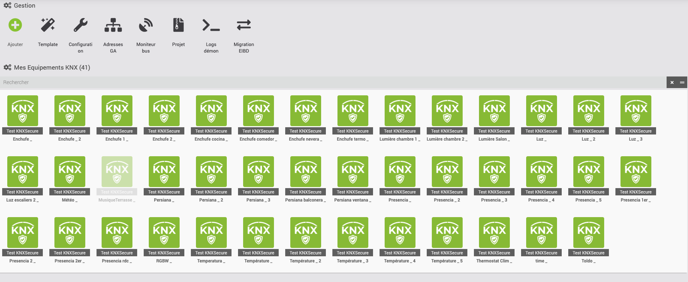

## Principe de fonctionnement

```
Jeedom (PHP)  ◄──socket TCP──►  daemon Python  ◄──KNX/IP──►  Passerelle  ◄──►  Bus KNX
```

Un daemon Python (basé sur la bibliothèque [xknx](https://github.com/XKNX/xknx)) maintient la connexion avec la passerelle KNX/IP. Jeedom dialogue avec ce daemon ; les changements d'état remontés par le bus mettent à jour les commandes en temps réel.

## Compatibilité

- Jeedom **≥ 4.2**, PHP 8.1+
- Toute passerelle/routeur **KNX/IP** (tunneling ou routing)
- **KNX IP Secure** (ETS 5.5+ / ETS 6)
- Le daemon nécessite Python 3 et installe automatiquement ses dépendances (`xknx`, `xknxproject`)

---

## Installation

1. Installez le plugin depuis le Market Jeedom.
2. Activez-le sur la page du plugin.
3. Lancez l'installation des dépendances (bouton **Dépendances** sur la page de configuration). Le plugin crée un environnement Python isolé et installe `xknx` et `xknxproject`.
4. Démarrez le daemon.

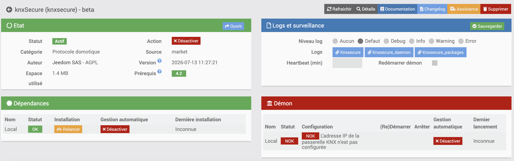

Vérifiez l'état des dépendances et du daemon sur la page **Santé** du plugin (voir ci-dessous).

---

## Premier démarrage pas à pas

Ce parcours vous mène de l'installation à un premier équipement qui réagit. Chaque étape a un **point de contrôle** : ne passez à la suivante que s'il est vert.

1. **Installer les dépendances.** Page de configuration → bouton **Dépendances**. Attendez la fin de l'installation.
   → *Contrôle :* page **Santé**, l'indicateur *Dépendances Python* est au vert.

2. **Choisir le mode de connexion.** Onglet **Connexion KNX** → sélectionnez le mode (le plus courant : **Tunneling UDP**). En tunneling, cliquez sur **Découvrir** pour trouver l'IP de votre passerelle, ou saisissez-la (port `3671`).
   → *Contrôle :* l'IP et le port sont renseignés. En Secure, complétez l'onglet **Sécurité** (voir plus bas).

3. **Démarrer le daemon** et **tester la connexion.** Onglet **Daemon** → bouton **Tester la connexion KNX**.
   → *Contrôle :* badge **vert** *« Passerelle KNX connectée »*. Si rouge → voir *Catalogue d'erreurs* en fin de page.

4. **Importer votre projet ETS** (recommandé). Onglet **Projet ETS** → glissez le `.knxproj` → **Analyser**. Cela récupère toutes vos adresses de groupe et leurs DPT.
   → *Contrôle :* le nombre d'adresses de groupe extraites s'affiche.

5. **Créer un premier équipement.** Soit via l'**import auto** (onglet Import auto du projet), soit manuellement : nouvel équipement → choisissez un **profil** (ex. *Lampe on/off*).

6. **Vérifier qu'il réagit.** Sur une commande **action** de l'équipement, cliquez sur **Tester** pour envoyer un télégramme ; ouvrez le **Bus Monitor** en parallèle pour voir le télégramme partir et l'état revenir.
   → *Contrôle :* la commande **info** (état) se met à jour dans Jeedom.

> Si l'état ne remonte pas à l'étape 6, c'est presque toujours une histoire de **flags** (`FlagInit`) ou de **GA d'état** — voir *Comprendre un équipement* et *Lecture des états* ci-dessous.

---

## Page Santé

La page **Santé** du plugin affiche un état synthétique en 7 indicateurs, utile en premier réflexe avant de creuser dans les logs :

| Indicateur | OK | En erreur |
|---|---|---|
| **Daemon KNX** | daemon en cours d'exécution | daemon arrêté |
| **Configuration daemon** | configuration valide (lançable) | configuration incomplète (mode de connexion mal renseigné, etc.) |
| **Dépendances Python** | `xknx` / `xknxproject` installés dans l'environnement virtuel | environnement virtuel absent ou import Python en échec → relancer l'installation des dépendances |
| **Passerelle KNX** | passerelle joignable en ping (modes tunneling) — non applicable en Routing | passerelle non joignable, ou adresse IP non configurée |
| **Connexion KNX (daemon)** | le daemon rapporte une connexion active au bus (dernier heartbeat < 90 s) | aucun heartbeat récent, ou daemon connecté mais pas au bus (reconnexion automatique en cours) |
| **Fichier .knxkeys** | fichier présent sur le disque (si méthode `.knxkeys` choisie en Secure) | fichier introuvable ou non importé |
| **Port socket daemon** | port TCP local en écoute | port non accessible (daemon en cours de démarrage, ou conflit de port) |

> **Connexion KNX (daemon)** est distinct du simple ping réseau : il reflète l'état applicatif réel (négociation du tunnel ou de la session Secure), remonté par le daemon à chaque battement de cœur (heartbeat).

---

## Configuration de la connexion

La page de configuration s'organise en quatre onglets : **Connexion KNX**, **Projet ETS**, **Sécurité**, **Daemon**. Choisissez d'abord le **mode de connexion** en haut de page.

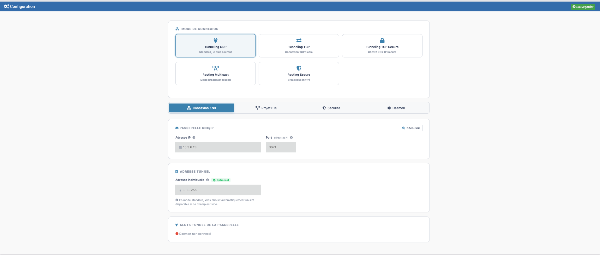

### Modes de connexion

| Mode | Usage | Champs requis |
|---|---|---|
| **Tunneling UDP** | Le plus courant. Connexion point à point via une passerelle IP. | Adresse IP, Port (défaut `3671`) |
| **Tunneling TCP** | Connexion TCP fiable (recommandée pour les liaisons instables). | Adresse IP, Port, *adresse tunnel optionnelle* |
| **Tunneling TCP Secure** | Tunneling chiffré KNX IP Secure. | IP, Port + section **Sécurité** |
| **Routing Multicast** | Mode broadcast réseau (plusieurs participants). | Groupe multicast (défaut `224.0.23.12`), Port, IP locale optionnelle |
| **Routing Secure** | Broadcast chiffré. | Groupe multicast + **Backbone key** |

> **Découverte automatique** : en mode tunneling, le bouton **Découvrir** scanne le réseau à la recherche des passerelles KNX/IP disponibles.

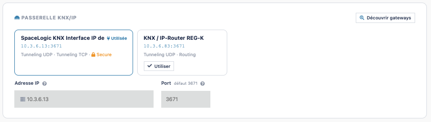

### Tunneling UDP

Le mode par défaut et le plus répandu : Jeedom se connecte en point à point à la passerelle via UDP, comme le fait ETS. Champs requis : **adresse IP** et **port** (défaut `3671`) de la passerelle.

Le champ **Adresse individuelle** du tunnel (ex. `1.1.255`) est **optionnel** : laissé vide, xknx négocie automatiquement un slot tunnel libre auprès de la passerelle. Ne le renseigner que si vous voulez forcer un slot précis (voir *Statut des slots* ci-dessous).

### Tunneling TCP

Identique au mode UDP (mêmes champs IP/port), mais la connexion passe en TCP plutôt qu'en UDP. À privilégier si votre liaison réseau est instable ou traverse un VPN/NAT : le TCP garantit la remise des télégrammes (pas de perte silencieuse comme peut le faire l'UDP), au prix d'une latence légèrement supérieure. L'adresse individuelle du tunnel reste **optionnelle**, comme en UDP.

### Tunneling TCP Secure

Tunneling chiffré **KNX IP Secure** (nécessite ETS 5.5+ ou ETS 6 et une passerelle compatible Secure). Mêmes champs IP/port que les deux modes précédents, complétés obligatoirement par l'onglet **Sécurité** (voir plus bas) pour l'authentification.

L'adresse individuelle du tunnel est :
- **optionnelle** si un fichier `.knxkeys` est importé — le keyring contient les credentials et xknx sélectionne automatiquement un slot compatible ;
- **requise** si vous utilisez des identifiants manuels sans `.knxkeys` — xknx ne peut alors pas négocier le slot seul, il faut indiquer l'adresse exacte du slot tunnel à utiliser.

### Routing Multicast

Mode broadcast : Jeedom rejoint un groupe multicast réseau et voit passer tous les télégrammes du bus, sans réserver de slot tunnel — plusieurs clients (Jeedom, ETS, autres superviseurs) peuvent donc être connectés en même temps. C'est le mode recommandé face à un **KNX IP-Router**.

Champs : **groupe multicast** (défaut `224.0.23.12`), **port**, et **IP locale** optionnelle (à renseigner si le serveur Jeedom a plusieurs interfaces réseau, pour choisir celle qui reçoit le multicast).

Prérequis réseau : le routeur/passerelle doit avoir le **routing activé** avec des tables de filtrage correctement configurées (sinon les commandes envoyées depuis Jeedom ne sont pas relayées sur le bus physique), et le réseau doit autoriser le trafic **multicast/IGMP** entre le serveur Jeedom et la passerelle.

### Routing Secure

Variante chiffrée du Routing Multicast : mêmes champs et mêmes prérequis réseau, avec en plus la **Backbone key** (32 caractères hexadécimaux, définie dans ETS et partagée par tous les participants Secure du routing) à renseigner dans l'onglet **Sécurité**. Un délai de **latence** optionnel (ms) permet d'absorber les écarts d'horloge entre participants sur un réseau au timing peu fiable.

### Interface bus physique (TPUART / USB / FT1.2) — non prise en charge

knxSecure gère **uniquement les passerelles KNX/IP** (tunneling et routing ci-dessus). Une interface raccordée **directement au bus KNX** (carte TPUART intégrée, interface KNX-USB, coupleur série FT1.2) **n'est pas prise en charge** : la bibliothèque xknx utilisée par le plugin ne parle que KNXnet/IP.

Pour ce type d'installation, utilisez le plugin **eibd**, prévu pour piloter les interfaces physiques. Vous pouvez aussi installer un service **knxd** externe qui expose votre interface physique comme une passerelle KNX/IP locale, puis pointer knxSecure dessus en **Tunneling** (`127.0.0.1:3671`).

### Statut des slots tunnel de la passerelle

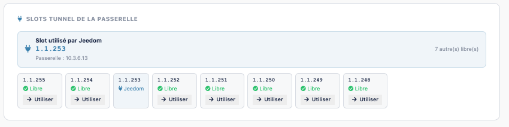

En modes tunneling (UDP/TCP/TCP Secure), un bloc **Slots tunnel de la passerelle** affiche en direct :

- le **slot utilisé par Jeedom** (adresse individuelle active) et le nombre de slots encore libres ;
- la liste de tous les slots avec leur état : **Jeedom** (utilisé par ce plugin), **Libre**, **Occupé** (par un autre client), **N/A** (non supporté par la passerelle) ;
- un bouton **Utiliser** sur un slot libre pour le renseigner automatiquement comme adresse tunnel, et **Libérer** sur un slot occupé pour forcer sa libération.

En l'absence de réponse de la passerelle (daemon non connecté ou erreur réseau), un message d'erreur s'affiche avec un bouton **Reconnecter**.

---

## Sécurité (KNX IP Secure)

Cet onglet n'est utile que pour les modes **Tunneling TCP Secure** ou **Routing Secure**. Deux méthodes d'authentification :

### Méthode 1 — Fichier `.knxkeys` (recommandée)

Exportez le trousseau depuis ETS (*Rapports → Sécurité KNX → Exporter le trousseau*), puis :
1. Glissez le fichier `.knxkeys` dans la zone prévue.
2. Saisissez son **mot de passe** (défini lors de l'export ETS).
3. Cliquez sur **Inspecter** pour vérifier les slots tunnel et clés contenus.

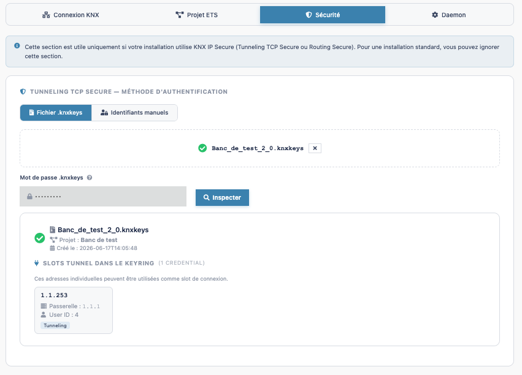

xknx sélectionnera automatiquement un slot tunnel compatible.

### Méthode 2 — Identifiants manuels

Si vous ne disposez pas du `.knxkeys`, saisissez directement :
- **User ID** (1–127, défaut `2`)
- **Mot de passe utilisateur**
- **Mot de passe d'authentification de l'appareil** (device authentication)

### Routing Secure

Renseignez la **Backbone key** (32 caractères hexadécimaux) et, si besoin, la **latence** en millisecondes.

---

## Import d'un projet ETS (`.knxproj`)

L'import d'un projet ETS permet de récupérer automatiquement la liste des adresses de groupe, leur DPT et la topologie, sans les saisir à la main.

1. Onglet **Projet ETS** → glissez votre fichier `.knxproj`.
2. Si le projet est protégé, saisissez le **mot de passe ETS**.
3. Cliquez sur **Analyser le projet**.

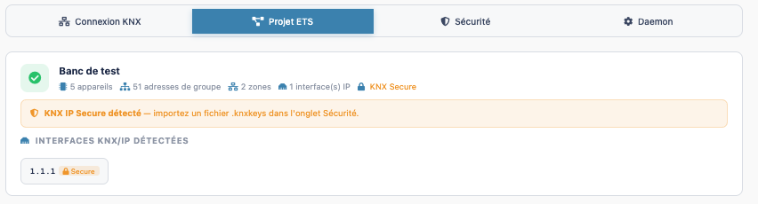

Le plugin extrait les adresses de groupe (avec leur **DPT** d'origine), la topologie (zones, lignes, participants) et les localisations. Ces données alimentent ensuite la création d'équipements et le moniteur de bus.

> L'analyse se fait via le daemon si disponible, sinon via un parseur PHP natif intégré (lecture du ZIP `.knxproj` sans dépendance).

### Ré-importer un projet (détection des changements)

Réimporter un `.knxproj` par-dessus un projet déjà chargé déclenche automatiquement une **comparaison avec l'import précédent**, affichée sous forme de compteurs par type de changement : **ajoutées**, **supprimées**, **DPT modifié**, **renommées**, avec le détail adresse par adresse pour chaque catégorie.

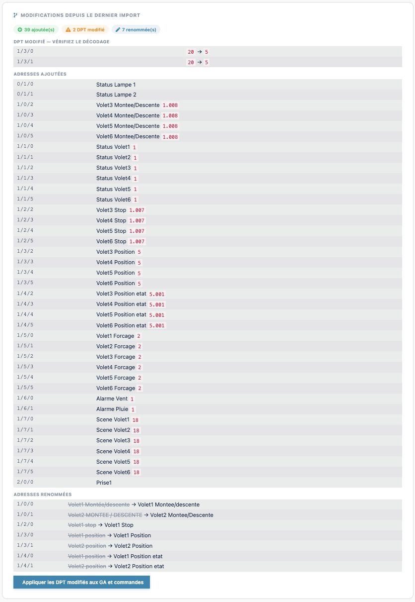

Si des DPT ont changé, un bouton **Appliquer les DPT modifiés aux GA et commandes** met à jour en un clic le DPT enregistré sur les adresses de groupe concernées ainsi que sur les commandes des équipements qui les utilisent — évite de corriger chaque commande à la main après une évolution du projet ETS.

> Les boutons **Remplacer** / **Effacer** (sur le résumé du projet chargé) permettent respectivement de relancer un import ou de supprimer le projet enregistré.

---

## Import automatique d'équipements

Une fois un projet ETS analysé, le plugin peut créer les équipements tout seul, sans saisie manuelle. Onglet **Import auto** de la modal Projet → sélecteur **Mode**, puis **Analyser** pour prévisualiser, cochez ce qui vous convient, et **Créer les équipements sélectionnés**.

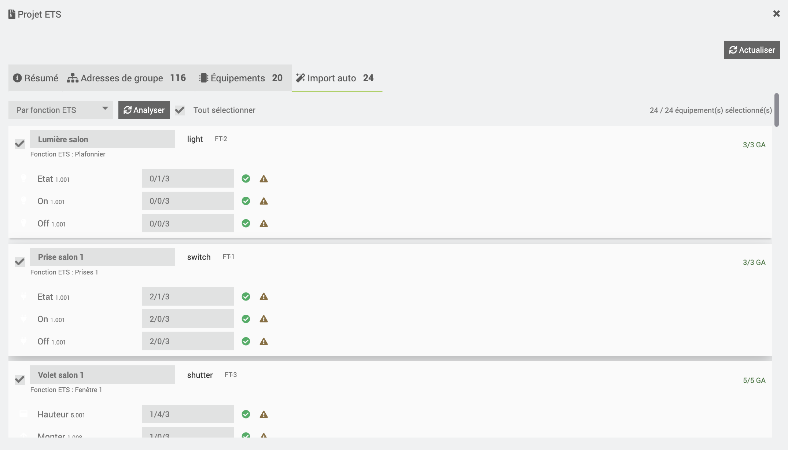

Trois modes de regroupement :

| Mode | Regroupe les GA… | Quand l'utiliser |
|---|---|---|
| **Par fonction ETS** | selon les *Functions* définies dans ETS | si votre projet ETS contient des fonctions (le plus fiable) |
| **Par dossier d'adresses** | par dossier racine + **identité de nom** (« Lampe 1 » et « État Lampe 1 » → même équipement) | si le projet n'a pas de fonctions ETS |
| **Par appareil** | par appareil physique KNX (onglet Topologie) | pour retrouver un équipement par module physique |

> Si vous choisissez *Par fonction* mais que le projet ne contient aucune fonction ETS, le plugin bascule **automatiquement** sur le mode *Par dossier*. Le **type d'équipement** (lampe, volet…) et les DPT sont devinés depuis ETS ; vérifiez le résultat avant de valider.

---

## Migration depuis le plugin eibd

Si vous utilisiez déjà le plugin **eibd**, knxSecure peut **recréer vos équipements** en conservant adresses de groupe et commandes — pas besoin de tout ressaisir.

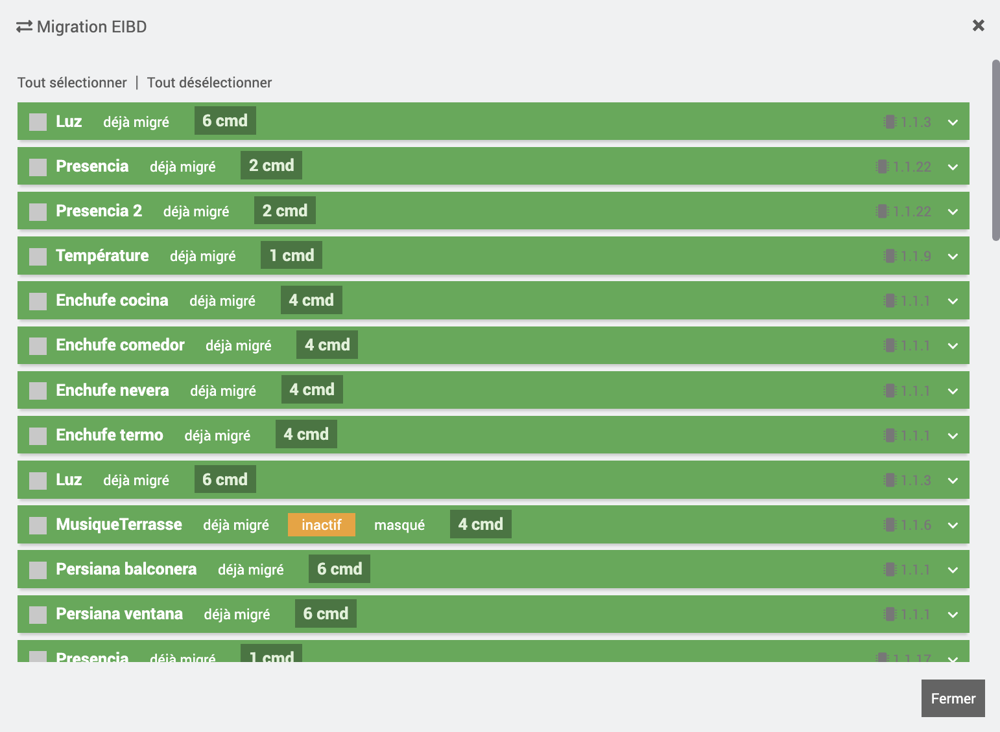

1. Bouton **Migration EIBD** (page du plugin) → la liste de vos équipements eibd s'affiche avec des cases à cocher.
2. Cochez les équipements à migrer (ou tous), puis **Migrer la sélection**.
3. Une fenêtre propose un **objet de destination** (pièce Jeedom) : laissez vide pour conserver l'objet d'origine de chaque équipement.

Ce qui est repris automatiquement : le **nom**, l'**objet/pièce**, les **adresses de groupe** (normalisées en 3 niveaux si besoin), les **DPT** (les DPT propriétaires ABB sont ignorés), le mappage action/état, et le **widget** du type détecté. Un équipement déjà migré n'est pas recréé en double.

> La migration **ne supprime pas** vos équipements eibd : les deux coexistent tant que vous ne désactivez pas l'ancien. Testez le comportement sous knxSecure avant de retirer eibd.

---

## Création d'équipements

Chaque équipement knxSecure représente un appareil KNX (lampe, volet, thermostat…). Ses **commandes** portent les adresses de groupe :

- **commande `info`** : adresse d'**état** (`ga_state`) — Jeedom lit la valeur remontée par le bus ;
- **commande `action`** : adresse d'**écriture** (`ga_write`) — Jeedom envoie un télégramme sur le bus.

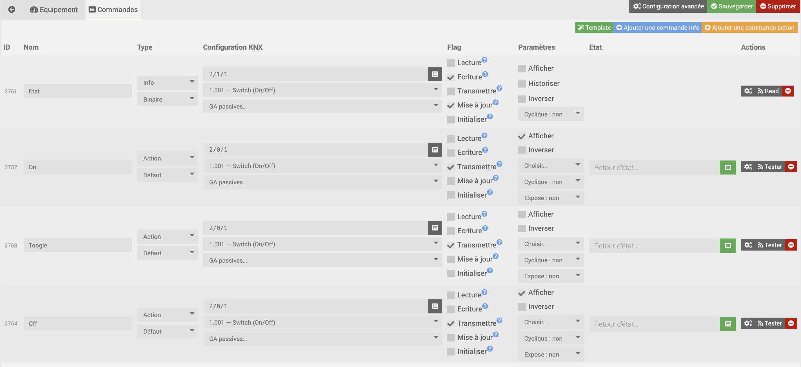

### Profils prêts à l'emploi

À la création, un **profil** applique automatiquement les bonnes commandes et le bon widget. Profils disponibles :

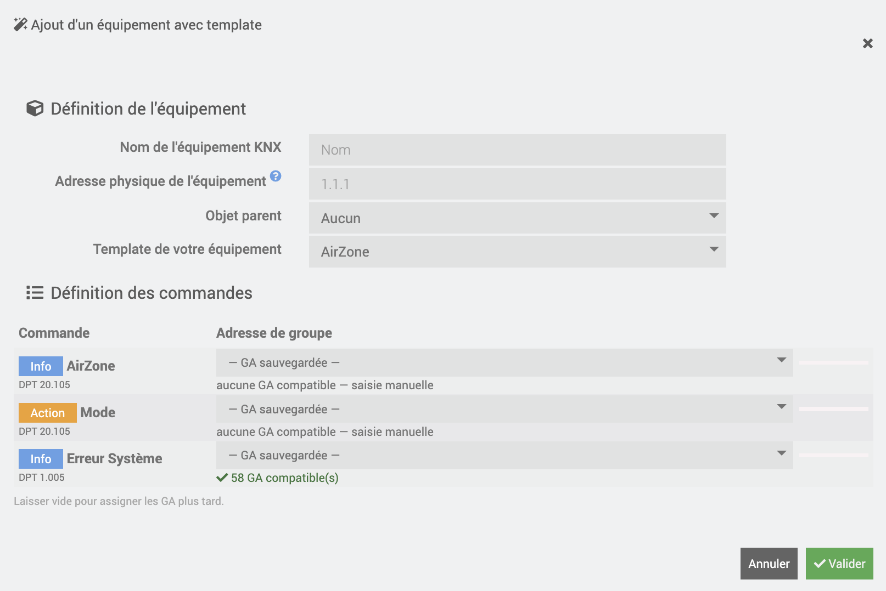

| Catégorie | Profils |
|---|---|
| Éclairage | Lampe on/off, variateur, bouton poussoir |
| Ouvrants | Volet/store, serrure/portail, contact porte/fenêtre |
| Chauffage / Climat | Thermostat, chauffage plancher |
| Capteurs | Température, présence/mouvement, capteur numérique générique |
| Confort | Ventilateur/VMC, scène, sélecteur de mode |
| Sécurité | Alarme, détecteur |
| Énergie | Compteur (puissance, consommation, V/A) |
| Divers | Station météo, notification texte, valeur numérique, interrupteur générique |

Il reste possible de partir d'un profil **générique** et d'ajouter les commandes manuellement.

### DPT automatique

Lorsque les commandes sont créées à partir des adresses importées du `.knxproj`, le **DPT** est propagé automatiquement et le sous-type Jeedom (`binaire` / `numérique` / `chaîne`) est déduit du DPT principal.

### Les flags KNX

Chaque commande porte cinq cases à cocher (colonne **Flags**) qui déterminent son comportement sur le bus. Ce sont les flags KNX standards :

| Flag | Rôle | Typiquement actif sur |
|---|---|---|
| **Lecture** (`Read`) | Jeedom répond à un télégramme *Read* reçu sur cette GA en renvoyant la valeur courante. Un seul objet par GA doit l'avoir. | rare |
| **Écriture** (`Write`) | La valeur de la commande est mise à jour quand un participant écrit sur cette GA. | commandes **info** (état) |
| **Transmettre** (`Transmit`) | Quand la valeur change dans Jeedom, un télégramme *Write* est émis sur le bus. | commandes **action** |
| **Mise à jour** (`Update`) | La valeur se met aussi à jour à partir des *réponses* de lecture (pas seulement des écritures). | commandes **info** |
| **Initialiser** (`FlagInit`) | Au démarrage du daemon, un *Read* est envoyé sur cette GA pour récupérer l'état courant. | commandes **info** dont on veut l'état dès le boot |

> Règle simple : une commande **info** a en général **Écriture + Mise à jour + Initialiser** ; une commande **action** a **Transmettre**. Les profils prêts à l'emploi règlent déjà ces flags correctement — vous n'y touchez qu'en cas de comportement particulier.

### Utiliser une commande dans un scénario

- Une commande **action** s'appelle comme n'importe quelle action Jeedom (scénario, interaction, bouton dashboard). Selon son sous-type : **slider** (valeur numérique, ex. luminosité 0-100 %), **select** (mode, ex. Confort/Éco), **couleur**, ou **bouton** (envoie sa *valeur par défaut*, `1` si non définie).
- Une commande **info** (état) se lit dans une condition de scénario ou s'affiche en widget — elle ne s'« exécute » pas.
- Pour tester une action sans scénario : bouton **Tester** sur la commande (envoie un *GroupWrite*), ou envoi manuel depuis le **Bus Monitor**.

---

## Référence des DPT

Le **DPT** (Datapoint Type) décrit comment interpréter les octets d'un télégramme KNX. C'est **le** réglage à surveiller quand une valeur s'affiche mal : le DPT de la commande Jeedom doit correspondre à celui défini dans ETS pour cette adresse de groupe. À l'import d'un `.knxproj`, il est repris automatiquement.

Principaux DPT et leur interprétation dans Jeedom :

| DPT | Sens | Unité | Sous-type Jeedom |
|---|---|---|---|
| **1.001** | Marche/Arrêt (On/Off) | — | binaire |
| **1.008** | Montée/Descente (volet) | — | binaire |
| **1.009** | Ouvert/Fermé | — | binaire |
| **3.007 / 3.008** | Variation / store relatif (+ *stop*) | — | action |
| **5.001** | Pourcentage 0-100 % (luminosité, position volet) | % | numérique |
| **5.003** | Angle 0-360° | ° | numérique |
| **6.001** | Pourcentage signé -128..127 | % | numérique |
| **7.001** | Entier 16 bits (0-65535) | — | numérique |
| **7.013** | Éclairement | lx | numérique |
| **9.001** | Température | °C | numérique |
| **9.004** | Luminosité | lx | numérique |
| **9.007** | Humidité | % | numérique |
| **9.008** | Qualité d'air | ppm | numérique |
| **9.024** | Puissance | kW | numérique |
| **12.xxx** | Entier 32 bits non signé | — | numérique |
| **13.010 / 13.013** | Énergie active | Wh / kWh | numérique |
| **14.056** | Grandeur physique (32 bits flottant) | selon libellé | numérique |
| **16.000 / 16.001** | Chaîne de caractères (14 c.) | — | chaîne |
| **17.001 / 18.001** | Numéro / contrôle de scène | — | numérique |
| **20.102** | Mode HVAC (Confort, Éco…) | — | select |
| **232.600 / 251.600** | Couleur RGB / RGBW | — | couleur |

> Liste non exhaustive : le sélecteur de DPT du plugin couvre les DPT 1 à 251. Pour un DPT non listé, choisissez la famille (numéro principal) qui correspond à la taille de la donnée.

### Diagnostiquer un DPT avec le Bus Monitor

Un doute sur le bon DPT ? Ouvrez le **Bus Monitor** et agissez sur l'équipement depuis un autre client (ETS, bouton mural) :

1. Repérez l'adresse de groupe dans le flux.
2. Comparez la **valeur décodée** à la valeur réelle : `21,5` là où il fait 21,5 °C → DPT correct ; un nombre aberrant (ex. `5504`) → DPT probablement faux (ici un 9.001 lu comme un entier).
3. Ajustez le DPT de la commande en conséquence, puis re-testez.

---

## Exemples concrets

Trois cas typiques. Les commandes et flags indiqués sont ceux appliqués automatiquement par les profils — utile pour comprendre ou corriger un équipement créé à la main.

### Lampe variateur (dimmer)

| Commande | Type | DPT | GA (exemple) |
|---|---|---|---|
| Marche/Arrêt | action | 1.001 | `1/1/1` |
| État Marche/Arrêt | info | 1.001 | `1/4/1` |
| Luminosité (0-100 %) | action | 5.001 | `1/2/1` |
| État luminosité | info | 5.001 | `1/5/1` |

### Volet / store

| Commande | Type | DPT | Remarque |
|---|---|---|---|
| Monter/Descendre | action | 1.008 | `0` = monter, `1` = descendre |
| Stop / pas | action | 1.007 ou 3.008 | arrêt du mouvement |
| Position (0-100 %) | action | 5.001 | 0 % = ouvert, 100 % = fermé (selon fabricant) |
| État position | info | 5.001 | remontée de la position réelle |

> La convention **0 % / 100 %** (ouvert/fermé) dépend du fabricant du volet. Si l'affichage est inversé, c'est ce sens qu'il faut vérifier, pas le DPT.

### Thermostat

| Commande | Type | DPT | Rôle |
|---|---|---|---|
| Consigne | action | 9.001 | température de consigne (°C) |
| État consigne | info | 9.001 | consigne courante |
| Température mesurée | info | 9.001 | température ambiante |
| Mode | action | 20.102 | Confort / Standby / Éco / Hors-gel (select) |
| État mode | info | 20.102 | mode courant |

---

## Adresses de groupe (GA)

Le gestionnaire d'adresses de groupe (modal **Adresses de groupe**) centralise toutes les GA connues — importées d'ETS ou ajoutées manuellement — organisées par groupes hiérarchiques (principal / médian).

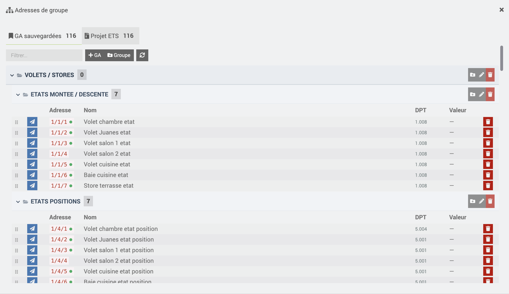

- Visualiser les GA et leur **dernière valeur connue** sur le bus.
- Organiser les GA en groupes (réutilise la hiérarchie ETS si elle existe).
- Un **point vert** discret signale une GA déjà assignée à un équipement.

---

## Moniteur de bus (Bus Monitor)

Le moniteur affiche en **temps réel** les télégrammes circulant sur le bus KNX (rafraîchissement automatique toutes les 2 secondes) :

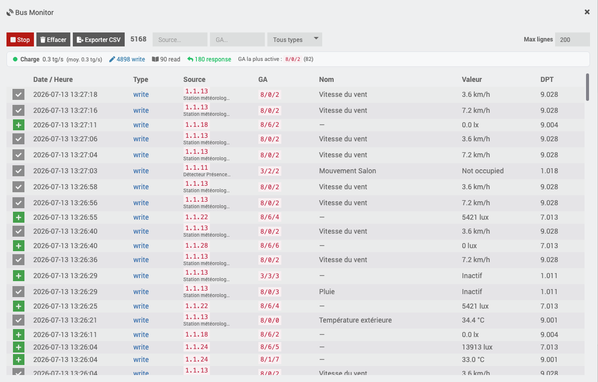

- type (write / read / response), adresse de groupe, adresse source, valeur décodée selon le DPT **avec son unité** (°C, lux, %…) quand une commande Jeedom existe pour cette GA ;
- **filtres** par source, par adresse de groupe et par type de télégramme ;
- **statistiques de charge** : débit du bus (télégrammes/s instantané et moyen), répartition par type, GA la plus active, avec un voyant de charge (vert / orange / rouge) — utile pour repérer un bus saturé ou un équipement « bavard » ;
- **export CSV** de l'historique (compatible Excel — la colonne GA est protégée du reformatage automatique en date que fait Excel/LibreOffice sur une adresse comme `8/6/2`) ;
- envoi manuel d'un télégramme de test (GroupWrite / GroupRead) sur une GA donnée, aussi disponible via le bouton **Tester** de chaque commande action dans la fiche équipement.

C'est l'outil principal de diagnostic pour vérifier qu'un équipement réagit, identifier l'adresse réelle utilisée, ou diagnostiquer une surcharge du bus.

> Si une GA n'a pas de DPT dans le projet ETS chargé (ex. équipement migré depuis EIBD avec un projet ETS plus ancien), le DPT de la commande Jeedom correspondante est utilisé en secours pour un décodage correct.

---

## Lecture des états (FlagInit / Cyclique)

Pour que Jeedom connaisse l'état réel du bus :

- **FlagInit** : au démarrage du daemon, un `GroupValueRead` est émis automatiquement sur chaque commande dont le flag `FlagInit` est actif, pour récupérer l'état courant.
- **Cache d'états au démarrage** : le daemon mémorise les dernières valeurs connues. Au redémarrage, il les réaffiche immédiatement dans Jeedom sans attendre le bus. Le paramètre *Cache d'états au démarrage* (onglet Daemon) permet, s'il est > 0, de **ne pas re-solliciter** les adresses dont l'état est plus récent que la durée indiquée — utile pour éviter une rafale de lectures sur une grande installation.
- **Lecture cyclique** : une commande peut être relue périodiquement (intervalle ≥ 10 s) — utile pour les équipements qui n'émettent pas spontanément.
- **Reconnexion automatique** : en cas de coupure de la passerelle, le daemon retente la connexion avec un délai croissant (jusqu'à 60 s), sans intervention.

---

## Onglet Daemon

L'onglet **Daemon** regroupe les réglages internes du processus Python et un outil de diagnostic de la connexion. Il se divise en deux blocs : **Paramètres internes** et **Diagnostic**.

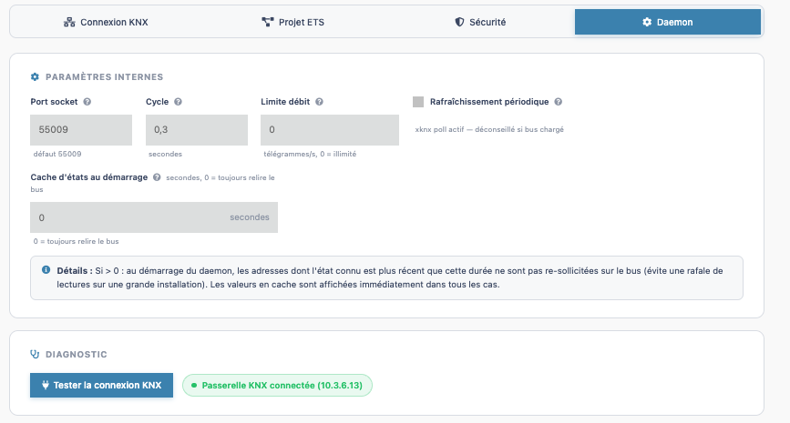

### Paramètres internes

- **Port socket** (défaut `55009`) — port TCP **local** utilisé par Jeedom pour dialoguer avec le daemon (indépendant du port `3671` de la passerelle KNX). À ne changer qu'en cas de conflit de port sur le serveur Jeedom.
- **Cycle** (secondes, défaut `0,3`) — période de la boucle interne du daemon (fréquence à laquelle il traite les événements en attente : télégrammes reçus, commandes à envoyer). Une valeur plus basse réduit la latence mais augmente légèrement la charge CPU.
- **Limite débit** (télégrammes/s, `0` = illimité) — plafonne le nombre de télégrammes que le daemon peut envoyer sur le bus par seconde. Utile pour éviter de saturer une installation KNX ancienne ou avec beaucoup de participants lors d'actions groupées (scénario qui pilote de nombreux équipements d'un coup, par exemple).
- **Rafraîchissement périodique des états** (case à cocher, désactivée par défaut) — active le polling automatique de xknx, qui relit périodiquement l'état de toutes les commandes. **Déconseillé** si le bus est chargé ou compte beaucoup d'équipements : préférez le **FlagInit** et la **lecture cyclique** par commande (voir *Lecture des états* plus bas), plus ciblés.
- **Cache d'états au démarrage** (secondes, `0` = toujours relire le bus) — si supérieur à `0` : au démarrage du daemon, les adresses dont l'état connu est plus récent que cette durée ne sont **pas re-sollicitées** sur le bus, ce qui évite une rafale de lectures (`GroupValueRead`) sur une grande installation. Dans tous les cas, les valeurs en cache sont réaffichées immédiatement dans Jeedom, sans attendre le bus.

### Diagnostic

Le bouton **Tester la connexion KNX** interroge le daemon en direct et affiche un badge de résultat à côté (visible sur la capture ci-dessus) :

- **badge vert** — ex. *« Passerelle KNX connectée (10.3.6.13) »* : le daemon est bien connecté au bus via cette passerelle ;
- **badge rouge** — la passerelle est injoignable ou la connexion a échoué, avec le message d'erreur renvoyé par le daemon.

C'est le moyen le plus rapide de valider une configuration (mode de connexion, IP, identifiants Secure…) sans attendre ni redémarrer le daemon.

---

## Dépannage

Premier réflexe : la page **Santé** (état synthétique), puis le bouton **Tester la connexion KNX** (onglet Daemon), et enfin les **logs du daemon** (visionneuse intégrée) pour le message détaillé.

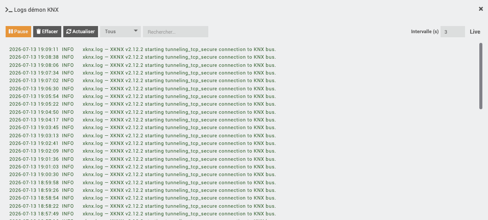

### Catalogue d'erreurs (message → cause → solution)

Les messages ci-dessous sont ceux affichés par le plugin (fenêtre de test, page Santé, logs).

**Connexion à la passerelle**

| Message | Cause | Solution |
|---|---|---|
| *L'adresse IP de la passerelle KNX n'est pas configurée* | Mode tunneling sans IP renseignée | Onglet Connexion KNX → saisir l'IP (ou **Découvrir**) |
| *Connexion timeout — gateway inaccessible ou slot tunnel occupé ?* | Passerelle injoignable, ou tous les slots tunnel sont pris | Vérifier IP/port et le réseau ; libérer un slot (bloc *Slots tunnel*) ou passer en Routing |
| *Daemon démarré, mais la passerelle %s est injoignable* | Le daemon tourne mais n'atteint pas le bus | Passerelle allumée ? IP joignable (ping) ? En Secure : keyring correspond-il à **cette** passerelle ? |
| *Impossible de se connecter au daemon sur le port…* | Daemon arrêté ou port socket local occupé | Démarrer le daemon ; en cas de conflit, changer le **Port socket** (onglet Daemon) |
| *Impossible de démarrer le daemon KNX* (timeout 30 s) | Le process ne répond pas au lancement | Consulter les logs daemon ; vérifier les dépendances (page Santé) |

**KNX IP Secure**

| Message | Cause | Solution |
|---|---|---|
| *Mode KNX Secure : importez un fichier .knxkeys ou renseignez les identifiants manuels* | Mode Secure sans authentification | Onglet Sécurité → importer le `.knxkeys` (recommandé) ou saisir User ID + mots de passe |
| *Mode KNX Secure avec identifiants manuels : l'adresse individuelle du tunnel est obligatoire* | Credentials manuels sans slot précisé | Renseigner l'**adresse individuelle** du tunnel (xknx ne peut pas la négocier seul sans keyring) |
| *Votre installation utilise KNX Secure, mais le mode « … » n'est pas sécurisé* | Secure détecté mais mode non chiffré choisi | Passer en **Tunneling TCP Secure** ou **Routing Secure** |
| *SessionResponse MAC verification failed* (logs) | Le keyring ne correspond pas à la passerelle (device auth / mot de passe) | Ré-exporter le `.knxkeys` depuis ETS pour **cette** installation ; vérifier le mot de passe d'export |
| *Fichier .knxkeys introuvable* / *invalide (XML mal formé)* | Fichier absent ou corrompu | Ré-importer le fichier ; vérifier qu'il provient bien d'un export ETS |

**États qui ne remontent pas**

| Symptôme | Cause probable | Solution |
|---|---|---|
| L'état ne se met jamais à jour | La commande **info** ne porte pas la bonne **GA d'état** (`ga_state`) | Vérifier la GA d'état dans la fiche ; l'observer dans le Bus Monitor |
| L'état est vide au démarrage mais se met à jour après une action | `FlagInit` inactif | Activer **Initialiser** sur la commande info |
| L'équipement n'émet jamais spontanément | Appareil qui ne diffuse pas son état | Activer la **lecture cyclique** (intervalle ≥ 10 s) sur la commande info |
| *Connectée au bus KNX* absent en page Santé | Pas de heartbeat récent (> 90 s) ou daemon non connecté au bus | Tester la connexion ; laisser la reconnexion automatique opérer |

**DPT / valeurs mal décodées**

| Symptôme | Cause | Solution |
|---|---|---|
| Nombre aberrant (ex. `5504` au lieu de `21,5`) | DPT de la commande ≠ DPT réel de la GA | Aligner le DPT (voir *Référence des DPT*) ; comparer dans le Bus Monitor |
| Bonne valeur, mauvaise unité (%/°C/…) | Sous-type/unité déduits d'un DPT imprécis | Choisir le DPT exact (ex. `9.001` pour une température) |
| Volet : position affichée inversée | Convention 0 %/100 % du fabricant | Interpréter 0 %=ouvert ou fermé selon l'appareil (ce n'est pas un problème de DPT) |

**Import ETS**

| Message | Cause | Solution |
|---|---|---|
| *Aucune adresse extraite… le déchiffrement nécessite le daemon* | Projet ETS protégé par mot de passe | **Démarrer le daemon** (connexion configurée), puis relancer l'analyse ; saisir le mot de passe ETS |
| *Extension non autorisée* / *Aucun fichier reçu* | Mauvais fichier déposé | Déposer un `.knxproj` (import projet) ou `.knxkeys` (Sécurité) valide |
| *Impossible d'analyser le projet (parser PHP absent ou résultat vide)* | Ni daemon ni parser PHP exploitables | Démarrer le daemon ; vérifier que le fichier n'est pas corrompu |

---

## FAQ

**Quel mode de connexion choisir ?**
Une **passerelle/interface IP** → **Tunneling UDP** (le plus simple). Liaison instable / VPN → **Tunneling TCP**. Un **routeur IP** et/ou plusieurs superviseurs simultanés → **Routing Multicast**. Installation **KNX Secure** → la variante *Secure* correspondante.

**Faut-il obligatoirement un projet ETS ?**
Non, mais c'est fortement recommandé : l'import récupère toutes les adresses de groupe et leurs DPT, et permet la création automatique. Sans projet, vous saisissez les GA à la main.

**Mon projet ETS est protégé par mot de passe.**
Le déchiffrement passe par le daemon : **démarrez le daemon** (connexion configurée) *avant* de lancer l'analyse, et saisissez le mot de passe ETS dans l'onglet Projet.

**« Slot tunnel occupé » — que faire ?**
Une passerelle a un nombre limité de slots tunnel. Ouvrez le bloc **Slots tunnel** : **Libérer** un slot occupé, ou **Utiliser** un slot libre. Sinon, fermez ETS/un autre superviseur, ou passez en **Routing** (pas de slot).

**Puis-je garder ETS connecté en même temps que Jeedom ?**
En **tunneling**, chacun consomme un slot (attention à la limite). En **Routing**, autant de clients que voulu.

**L'état d'un équipement ne remonte pas.**
Dans l'ordre : la commande **info** porte-t-elle la bonne **GA d'état** ? Le flag **Initialiser** est-il actif ? L'appareil émet-il spontanément (sinon → **lecture cyclique**) ? Vérifiez le tout dans le **Bus Monitor**.

**Une valeur s'affiche mal (nombre bizarre, mauvaise unité).**
C'est un problème de **DPT** : il doit correspondre à celui de la GA dans ETS. Voir *Référence des DPT* et la méthode de diagnostic au Bus Monitor.

**Puis-je piloter une interface USB / TPUART ?**
Non : knxSecure ne parle que **KNX/IP**. Utilisez le plugin **eibd**, ou exposez votre interface via un **knxd** externe puis pointez knxSecure dessus en Tunneling (`127.0.0.1:3671`).

**Je viens du plugin eibd, dois-je tout recréer ?**
Non : utilisez la **Migration EIBD** (voir plus haut). Elle recrée les équipements en conservant GA et commandes, sans supprimer les anciens.

**Où voir ce qui se passe réellement sur le bus ?**
Le **Bus Monitor** : c'est l'outil de diagnostic central (télégrammes temps réel, valeurs décodées, filtres, export CSV, envoi de test).

**Les logs du plugin ?**
Niveau de log réglable côté Jeedom, et **visionneuse de logs du daemon** intégrée (messages détaillés côté Python, y compris les erreurs xknx/Secure).
