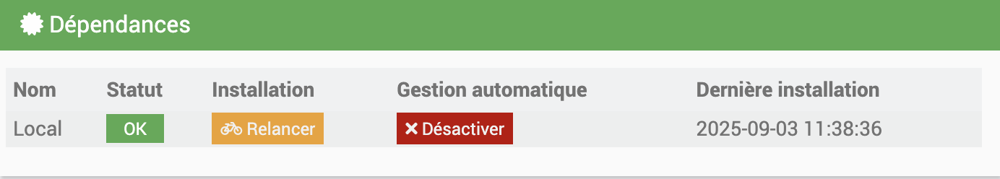
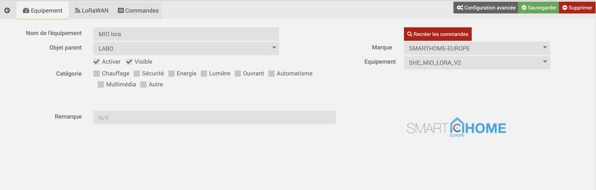
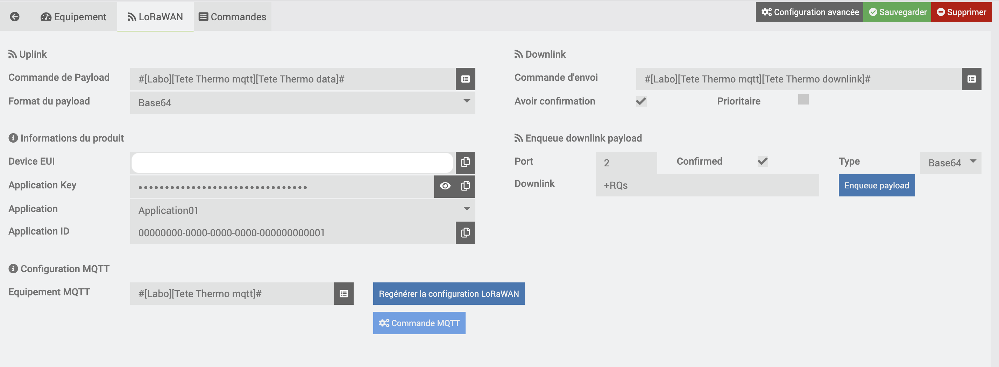
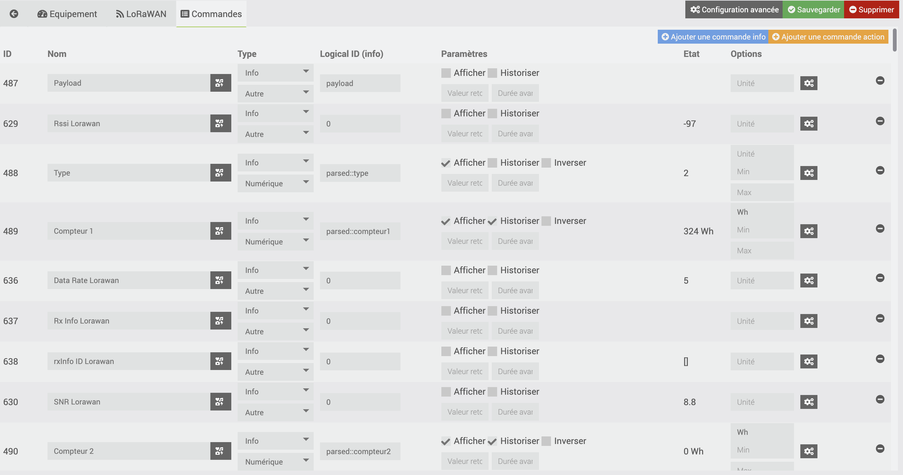
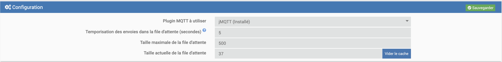
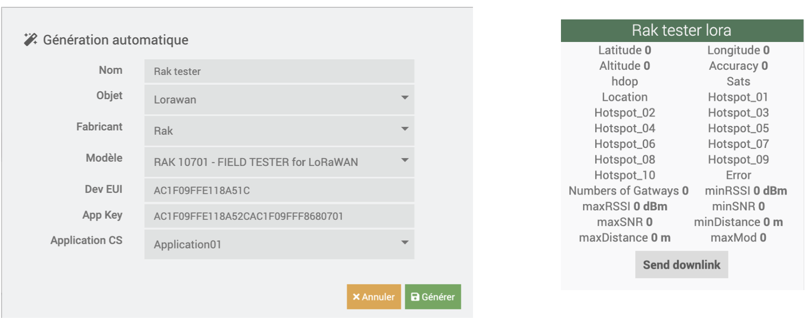
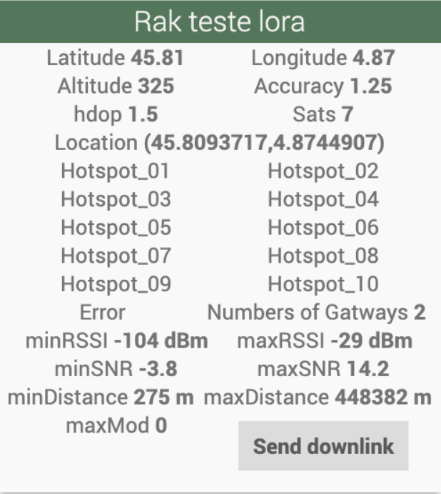
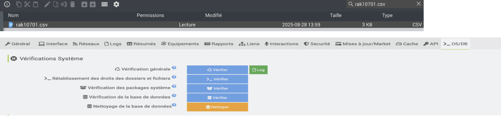
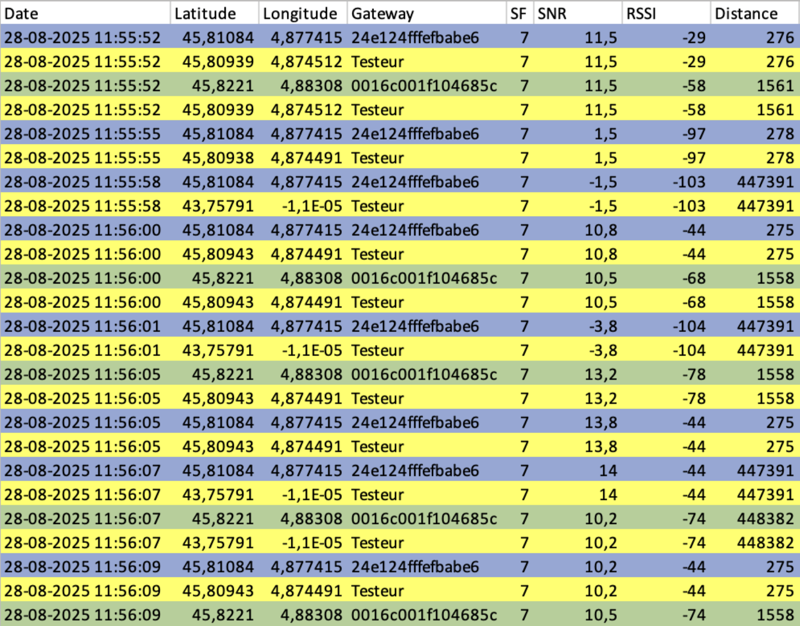

# Plugin LoraPayload

Le plugin **LoraPayload** est un plugin Jeedom qui permet d’intégrer des équipements LoRaWAN connectés via **ChirpStack (v3 ou v4)**.
Il gère automatiquement les payloads uplink, les downlinks, et crée les commandes Jeedom correspondantes pour piloter et superviser vos capteurs.
Il agit comme un intermédiaire intelligent :

- Il reçoit les trames brutes LoRaWAN (Base64, Hex).

- Il les décode grâce à des fichiers d’encodage/décodage fournis pour chaque capteur.

- Il génère et met à jour automatiquement les équipements et commandes Jeedom.

- Il permet aussi d’envoyer des consignes (downlinks) vers vos capteurs.

# Fonctionnalité
Le plugin LoraPayload offre les fonctionnalités suivantes :

- **Décodage des uplinks** : interprétation des payloads bruts (Base64 ou Hex) en mesures (température, humidité, index, alarmes, etc.).
- **Création automatique des équipements Jeedom** dès la réception d’un nouveau DevEUI.
- **Gestion des commandes Jeedom** :
  - Commandes **info** (remontées capteur).
  - Commandes **action** (envoi de consignes).
- **Support multi-constructeurs** : Milesight, Adeunis, Dragino, Diehl Sharky, Thermokon, B-Meters, etc.
- **Envoi de downlinks** avec génération automatique du payload encodé.
- **Gestionnaire de file d’attente des downlinks** avec démon dédié et priorités.
- **Panel de supervision** centralisant tous vos équipements LoRaWAN.
- **Logs et debug avancés** pour le suivi des trames et des commandes.


# Configuration
---
## Configuration du plugin

Dans la page de configuration du plugin, vous pouvez :

- Vérifier l’état des dépendances et les relancer en cas de doute.  
- Accéder aux paramètres généraux (connexion MQTT, cache, etc.).  


---

## Le plugin

Retrouvez le plugin dans le menu **Plugins → Protocole domotique → LoraPayload**.  
Sur cette page, vous pourrez voir la liste de vos équipements LoRaWAN déjà configurés.

En haut de la page se trouvent plusieurs boutons :


- **Ajouter** : crée un nouvel équipement manuellement.  
- **Configuration** : ouvre les paramètres du plugin.  
- **Génération automatique** : crée un nouvel équipement à partir d’un DevEUI et d’un profil. *(Recommandé pour un ajout simple et rapide dans chirpstack et Jeedom.)*

## Equipement

En cliquant sur un module, vous accédez à sa page de configuration :



- Nom de l’équipement.  
- Activer / rendre visible.  
- Choix de l’objet parent.  
- Attribution d’une catégorie.  

Sur la partie droite :

- Sélection du **profil de l’équipement** (type de capteur).  
- Affichage du visuel.  

Deux onglets supplémentaires :

-   Un onglet LoRaWAN (décrit dans le prochain paragraphe)

Dans cet onglet, vous configurez la liaison entre Jeedom et ChirpStack.  

### Changer l’application ChirpStack d’un équipement

Il est possible de modifier directement l’application ChirpStack liée à votre équipement depuis Jeedom.  

Procédez comme suit :  

1. **Choisir la bonne application** via la liste déroulante du champ *Application*.  
2. **Régénérer la configuration LoRaWAN** en utilisant le bouton dédié.  
3. **Afficher les commandes MQTT** en utilisant le bouton dédié.  

 **Attention** : si ces deux étapes sont respectées, l’équipement sera :  
- Supprimé de son ancienne application,  
- Recréé automatiquement dans la nouvelle application choisie.  

**NB** : Vous devrez effectuer à nouveau un **join** du capteur, car le changement d’application réinitialise son enregistrement côté ChirpStack.
   
-   Un onglet Commandes (c'est ici que vous trouverez les commandes correspondantes à votre équipement - cet onglet est standard à Jeedom)


## Ajout d'un équipement

Il suffit de cliquer sur le bouton `Génération automatique` et de choisir un nom.
Ensuite vous pouvez configurer l'objet Parent, renseigner le Dev EUI l'app Key, l'application pour chirpstack
Pour configurer, activer l'équipement, choisir une ou des catégories, et rendre l'équipement visible ou non.

Il est important sur la partie droite de choisir le type de l'équipement. C'est ce qui permettra de savoir comment parser la trame.

L'onglet LoRaWAN est très important :

-   Vous devez choisir la commande info qui reçoit le payload que ce soit MQTT ou autres ( important si vous avez utilisé le bouton `Ajouter` sinon avec `Génération automatique` tout est généré automatiquement )
-   Vous pouvez choisir si le format du payload est en Hexadécimal ou Base64.
-   Avec Euqueue downlink payload, vous pouvez envoyer des downlinks manuellement.

Une fois fait vous pouvez sauver. Suite à cela lors de la prochaine réception de trame les commandes de votre équipement se mettront à jour

## Envoyer des commandes

Certains modules Lorawan possèdent des commandes de type Action qui permettent d'envoyer des consignes aux modules via l'interface Jeedom.

Dans l'onglet Equipement du plugin LoraPayload :

- Vous devez choisir la commande d'envoi (que ce soit MQTT ou autres)
- Vous devez choisir si voulez avoir une confirmation (Ack). C'est une information remontée dans MQTT sur un topic dédié qui n'influence pas les données remontées.
Concernant la commande d'envoi, dans le cas d'utilisation de MQTT, c'est une commande dans MQTT de type Action et de sous-type Message. Le topic est le topic dédié aux downlinks et la valeur de la commande est *message*.

---
## Ajouter un nouveau capteur Milesight (downlink/uplink)

Cette section détaille **l’ajout de la configuration et de la gestion des commandes (uplink/downlink) pour un capteur Milesight** dans le plugin LoraPayload.

---

### 1. Ajout des fichiers d’encodage/décodage 

1. **Créer un fichier JavaScript** nommé selon la convention suivante :  
   `milesight_modele.js`  
   Exemple :  
   - `milesight_WT101.js`  
   - `milesight_GS601.js`

2. **Déposer ce fichier dans** :  
   `/var/www/html/plugins/lorapayload/resources/lorapayload/payloads/`

3. **Fusionner le code d’encodage (encoder) et décodage (decoder) dans ce même fichier**.

---

### 2. Adapter la fonction Decode

Remplacer :
```js
function Decode(fPort, bytes) {
    return milesightDeviceDecode(bytes);
}
Par 
function Decode(input) {
    bytes = input.bytes;
    return milesightDeviceDecode(bytes);
}
```

---

### 3. Adapter la fonction Encoder

Remplacer :
```js
function Encode(fPort, obj, variables) {
return milesightDeviceEncode(obj);
}
Par 
function Encode(obj) {
    return milesightDeviceEncode(obj);
}
```
### 4. Explorter les fonctions 
A la fin du fichier, ajouter:
```js
module.exports = {
    Decode,
    Encode
};
```
### 5. Déclaration du capteur dans la configuration

1. **Créer un dossier** dans ``/var/www/html/plugins/lorapayload/core/config/devices/ ``qui porte le même nom que votre fichier d’encodage/décodage (sans l’extension ``.js``).

2. Ajouter dans ce dossier :

- Un fichier JSON de configuration du même nom que le JS

- Une image PNG du capteur (format recommandé : 250x250 px)

### 6. Exemple de configuration JSON pour un capteur Milesight 
```json
{
  "milesight_GS601": {
    "name": "Milesight GS601 - Vape Detector",  // Modele + Nom du capteur 
    "groupe": "Milesight",      //Nom du Fabricant
    "configuration": {
      "type": "milesight_GS601",
      "language": "js",         // Indique que l’encodeur/décodeur est en JS (sinon omettre)
      "deviceProfile": "C"      // Indique que le profil LoRaWAN du device est "Class C" (sinon omettre)
    },
    "commands": [
      {
        "name": "Température",  // Nom 
        "type": "info",         // Commande info = remonte une info du capteur (uplink)
        "subtype": "numeric",   // numeric/string/binary selon la donnée
        "isVisible": 1,         // 1 = visible, 0 = cachée
        "isHistorized": 1,      // 1 = historisé, 0 = non historisé
        "unite": "°C",          // Unité d'affichage
        "logicalId": "parsed::temperature" // Doit correspondre à la variable dans le JS (decoded.temperature)
      },
      {
        "name": "fPort",        // Toujours préciser le fPort
        "type": "info",
        "subtype": "numeric",
        "isVisible": 0,
        "isHistorized": 0,
        "unite": "",
        "logicalId": "fport" // Port utilisé pour les downlinks
      },
      {
        "name": "Reboot",
        "type": "action",        // Commande action = envoi une commande vers le capteur (downlink)
        "subtype": "other",
        "isVisible": 1,
        "logicalId": "encoder::reboot::1" // Format pour envoyer une commande d'action (encoder::<fonction>::<valeur>)
      },
      {
        "name": "ON/OFF",
        "type": "action",        // Commande action = envoi une commande vers le capteur (downlink)
        "subtype": "other",
        "isVisible": 1,
        "logicalId": "action::f90001" // Format pour envoyer une commande d'action (action::<valeur_en_hexadecimal>)
      },
      {
        "name": "Set report interval",
        "type": "action",
        "subtype": "slider",     // slider/other selon le type d'action
        "isVisible": 1,
        "logicalId": "encoder::report_interval",
        "configuration": {
          "minValue": 1,
          "maxValue": 5000,
          "step": 1
        }
      },
      {
        "name": "Set report interval",
        "type": "action",
        "subtype": "slider",     // slider/other selon le type d'action
        "isVisible": 1,
        "logicalId": "action::f800llll",
        "configuration": {
          "minValue": 1,
          "maxValue": 5000,
          "step": 1
        }
      },
      {
        "name": "Payload brut",
        "type": "info",
        "subtype": "string",
        "isVisible": 0,
        "isHistorized": 0,
        "logicalId": "payload"   // Pour afficher le payload reçu tel quel
      }
    ],
    "compatibility": [
      {
        "manufacturer": "Milesight",
        "name": "GS601",
        "doc": "",
        "type": "milesight_GS601",
        "remark": "",
        "inclusion": "",
        "imglink": "milesight_GS601"
      }
    ]
  }
}

```
### Comment écrire le fichier de configuration JSON?
Le fichier de configuration JSON permet de décrire chaque capteur (uplink et downlink), d’associer les variables décodées, de définir les commandes d’action, et d’assurer l’affichage correct dans Jeedom.

#### Explication des champs principaux
- **name**: Nom lisible du capteur.

- **groupe** : Nom du fabricant (ex: Milesight, Dragino, etc).

- **configuration** :

    - `type` : Doit correspondre au nom du fichier, en minuscule.

    - `language` : Mettre "js" si le décodeur est en JavaScript, sinon ne pas mettre ce champ.

    - `deviceProfile` : Mettre "C" si le capteur est en LoRaWAN Class C (optionnel).

- **commands** : Tableau listant toutes les commandes liées au capteur (infos ou actions).

    - **type** :

        - `info` : Pour une variable reçue (uplink).

        - `action` : Pour une commande à envoyer (downlink).

- **subtype** :

    - `numeric` : valeur numérique.

    - `string` : texte.

    - `binary` : binaire.

    - `slider/slide` : pour les commandes actions avec valeur à faire varier.

    - `other` : action simple sans argument.

- **isVisible** : Affichage de la commande (1 = oui, 0 = non).

- **isHistorized** : Historisation de la commande (1 = oui, 0 = non).
(Utilisé uniquement pour type "info")

- **unite** : Unité d’affichage (optionnel pour les valeurs numériques).

- **logicalId** :

    - Pour une info : ``parsed::nom_de_la_variable`` (récupérée dans la partie `decoded.` du JS)

    - Pour une action downlink : 
        ```json
        action::<valeur_en_hexadecimal>
        ```
        ou
        ```json
        encoder::<fonction>::<valeur>
        ```
        ou
        ```json 
        encoder::<fonction>
        ``` 
        (si la valeur est définie dynamiquement, ex: slider)

    - Pour afficher le payload reçu tel quel : ``"logicalId": "payload"``

- **compatibility** : Tableau listant les capteurs compatibles, le fabricant, le type, et le lien image.

##### Bonnes pratiques
- Respecter les noms de variables : le champ `logicalId` doit strictement correspondre au nom exposé dans la fonction de décodage du JS (ex: ``decoded.temperature ⇒ "parsed::temperature"``).

- Toujours indiquer la commande d’action de façon claire pour faciliter la gestion des downlinks.

- Mettre toutes les unités pour chaque mesure si besoin (°C, %, V, etc.).

- Ajouter la compatibilité (fabricant, modèle, image) pour faciliter l’identification dans Jeedom.


### Ajouter l'image du capteur

- Format recommandé : PNG, 250x250 px

- Nommez le fichier comme votre capteur (ex : ``milesight_gs601.png``)
---
### Comment faire pour choisir la bonne structure pour les sous-types messages ?
1. Consulte la documentation officielle du capteur ou de l’API.

    - Regarde le tableau ou la section “Commandes downlink” ou “Configuration via payload”,

    - Repère les champs attendus, leur ordre, les valeurs acceptées, les unités, etc.

2. Note l’exemple de payload dans la doc.

    - Parfois c’est un tableau, parfois un JSON d’exemple.

3. Prépare la chaîne de valeurs à envoyer dans le bon ordre, séparées par | (comme vu plus haut), ou sous forme de JSON si l’outil le demande.

4. (*Facultatif*) : Si tu es un utilisateur avancé, tu peux regarder le code pour vérifier le mapping pour écrire le message.

Exemple Concret
Supposons, dans la documentation Milesight, tu trouves ce tableau :

| Champ                | Valeurs possibles | Description                    |
| -------------------- | ----------------- | ------------------------------ |
| enable               | 0, 1              | 0: Désactiver, 1: Activer      |
| threshold\_condition | 1,2,3,4           | 1: en-dessous, 2: au-dessus... |
| threshold\_min       | 0\~100            | En °C                          |
| threshold\_max       | 0\~100            | En °C                          |

```json
{
  "temperature_alarm_settings": {
    "enable": 1,
    "threshold_condition": 2,
    "threshold_min": 30,
    "threshold_max": 40
  }
}
```
- Commande à passer dans le message :
`"1|2|30|40"`

## Panel

### Qu’est-ce que le panel Lorapayload ?

- Le **panel Lorapayload** est une interface disponible dans Jeedom qui **centralise les informations des capteurs venant de votre réseau LoRaWAN**.
- Il affiche :
  - La liste **complète des capteurs connectées** au serveur LNS leurs statuts en temps réel.

- Pour l'afficher, il faut se rendre dans la configuration du plugin Lorapayload, elle se trouve en bas a droite.


---
### Visualisation dans Jeedom

- Accède à ces panels depuis l’interface Jeedom :
<p align="center">
  
  
</p>

---

#### Présentation du panneau

Le panneau est divisé en deux parties principales :

1. **Liste des devices dans ChirpStack**  
   Cette table affiche pour chaque équipement :  
   - **Status** : un point coloré qui indique l’état de communication du capteur.  
     - 🟢 **Vert** : le capteur a communiqué récemment.  
     - 🔴 **Rouge** : le capteur n’a pas communiqué depuis trop longtemps.  
     - ⚪ **Gris** : aucune donnée n’a encore été reçue pour ce capteur.  
   - **Last Seen** : date et heure du dernier message.  
   - **Application / Device Name / DevEUI / Device Profile** : informations de base de l’équipement.  
   - **Signal Quality** : indique la qualité de réception radio du capteur, calculée à partir du **SF**, du **RSSI** et du **SNR**.  
     - 🟢 **Bonne** : signal fort et stable (RSSI élevé, SNR positif).  
     - 🟡 **Moyenne** : communication possible mais instable (RSSI ou SNR limite).  
     - 🔴 **Faible** : risque élevé de perte de messages (RSSI faible, SNR très négatif).  
   - **Config Page** : un bouton permettant d’accéder directement à la page de configuration Jeedom de l’équipement.
2. **Sélection multiple**
  - Chaque ligne contient une case à cocher.  
  - Il est possible de sélectionner plusieurs équipements simultanément afin d’appliquer des **actions groupées**.  
   La case **All** en haut du tableau permet de cocher/décocher tous les équipements d’un coup.  
3. **Actions disponibles**
    - **Recréer les commandes**  
  Recrée automatiquement les commandes Jeedom pour les équipements sélectionnés.  
    - **Envoyer un downlink en masse**  
  Ouvre une fenêtre de configuration pour définir les paramètres du downlink (port, confirmé, type d’encodage, payload) puis envoie la même commande à tous les équipements cochés.  
4. **Cache des Downlinks**  
   Cette zone regroupe la file d’attente des messages downlink envoyés aux capteurs, avec la possibilité de la rafraîchir, de la vider entièrement ou de supprimer des entrées individuellement.

---

#### Personnalisation du délai de communication

Le changement de couleur du **Status** est influencé par le paramètre de timeout configuré dans Jeedom.  
Pour le personnaliser :  

1. Ouvre la configuration avancée de ton équipement.  
2. Va dans l’onglet **Alertes**.  
3. Modifie la valeur **Communication en alerte (minutes)**.  

Concrètement :  
- Si le capteur communique dans le délai défini → le statut reste 🟢 vert.  
- Si le capteur dépasse ce délai sans message → le statut passe 🔴 rouge.  
- Si aucun message n’a jamais été reçu → le statut reste ⚪ gris.  

Cela permet d’adapter la surveillance en fonction du rythme normal de communication de chaque capteur.

---
### Gestionnaire de file d'attente

Cette mise à jour améliore la gestion de la file d'attente des downlinks dans le plugin lorapayload pour Jeedom. Elle introduit :
- Un démon (lorapayloadd.php) chargé d'exécuter les downlinks au bon moment.

- Un panneau d'administration pour visualiser, rafraîchir ou purger la queue depuis l'interface Jeedom,

- Un système de priorités (champ `priority`).

- Un réordonnancement FIFO respectueux du tempo de rafraîchissement (`refreshTime`).

- Un recalcul complet des timestamps (`ts`) lorsque des downlinks prioritaires sont détectés.

- Une temporisation légère pour regrouper les appels et éviter les collisions.

### Fonctionnalités clés

1. **Démon Worker**
Le démon (`lorapayloadd.php`) tourne en continu et lit la clé de cache `queueDownlink`. À chaque cycle :
- Cycle toutes les 3s
- Relit à chaque itération pour prendre en compte les purges ou modifications.

2. **Panneau d'administration**


Dans l’interface Jeedom, onglet Acceuil → lorapayload → Cache queueDownlink :
- Liste des downlinks en attente (`EqLogic ID`, `priorité`, `DevEUI`, `ts`, `Downlink (JSON)`, `actions`),
- Boutons : `Rafraîchir`, `Vider tout`, `Supprimer` (entry par entry),
- Affichage de la taille actuelle de la file.

3. **Fonctionnalités clés**
- **Démon**
Exécution programmée des downlinks selon leur champ `ts` et relecture dynamique de la queue pour tenir compte des purges.

- **Priorité**
Attribut priority dans chaque équipement (0 = normal, 1 = prioritaire).
Lorsqu’au moins un prioritaire existe, la file est triée en deux blocs : prioritaires puis normaux.

- **Temporisation des envoies (Refresh Time)**
`refreshTime` (en secondes) paramétrable dans le plugin (défaut : 0 s).
Assure un espacement minimal entre deux downlinks du même équipement.

- **Recalcul de la file**
Si des priorités sont détectées, la queue complète est retriée selon : priorité (`1` > `0`) et l'ordre d’arrivée (`received_at`).
Les timestamps `ts` sont ensuite recalculés pour chaque équipement, en appliquant le `tempo` en FIFO.

- **Temporisation légère**
`usleep(200 ms)` avant le recalcul si des priorités sont présentes, pour regrouper les ajouts simultanés.

- **Gestion de la taille**
tailleQueue définit le nombre maximal d’entrées. Au-delà, les plus anciennes sont automatiquement purgées.


4. **Configuration**
Configurer les équipements prioritaires en allant dans les configuration de l'équipement puis dans `LoRaWAN > Downlink`

Si votre équipement est prioritaire, cochez sur le check point `Prioritaire` puis enregistrez.
Ensuite rendez-vous dans les configurations du plugin Lorapayload et dans le champs configuration, ajustez les paramètres globaux en fonction de votre application.

Redémarrer le démon s'il est arrêté ou en statut NOK.
Suivre et gérer l'état de la file dans l'onglet Cache queueDownlink.

# Guide d’utilisation du testeur RAK10701 avec Jeedom (LoRaPayload)

## 1. Intégration de l’équipement
- Une fois le testeur **RAK10701** ajouté sur le plugin **LoRaPayload**, la génération des décodages et encodages se fait automatiquement.  
- Aucun paramétrage supplémentaire n’est nécessaire côté utilisateur.  

---

## 2. Mise sous tension et join
- Allumez le testeur.  
- Attendez la procédure de **join** sur le réseau **LoRaWAN**.  
- Si l’état affiché est **“Failed”**, rapprochez le testeur d’une passerelle et rallumez-le pour relancer la tentative.  

---

## 3. Collecte des données GPS
- Une fois le join réussi, cliquez **2 fois sur le bouton Power**.  
- Le **RAK10701** enverra alors les données collectées (**RSSI, SNR, passerelle, GPS, etc.**).  
 
⚠️ **Important** : placez-vous dans un endroit dégagé afin de permettre la capture correcte des coordonnées GPS.  

---

## 4. Parcours de la zone de test
- Déplacez-vous avec le testeur sur la surface que vous souhaitez analyser.  
- Appuyez **2x sur le bouton Power** pour déclencher l’envoi des données.  
- Chaque **uplink** enregistre automatiquement les données reçues.  

---

## 5. Consultation et export des résultats
- Les données sont stockées automatiquement :  
  - en **CSV** pour exploitation sur **Excel**,  
  - en **JSON** pour un usage automatisé ou des scripts.  

 **Chemin d’accès** :  `html/plugins/lorapayload/resources/lorapayload/payloads`

→ fichiers rak10701.csv et rak10701_history.json.


Si la permission d’écriture n’est pas accordée rétablissez les droits des dossiers et fichier dans le champ OS/DB dans configuration.

## 6. Téléchargez le fichier et traitez les données

_________
# FAQ

-   Certaines commandes ne se mettent pas à jour en même temps que les autres : oui en effet certains modules Lorawan n'envoient pas forcément toutes les informations en même temps et avec la même fréquence
