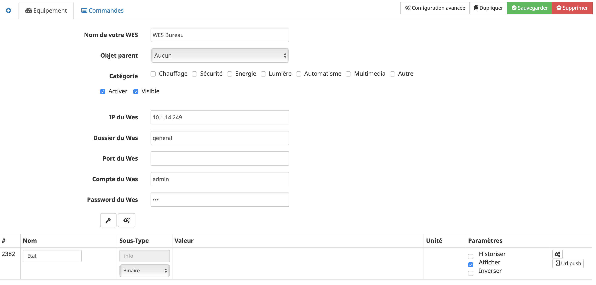

# Plugin WES

Plugin permettant d’utiliser le serveur WES de CartElectronics, afin de suivre notamment ses consommations d'énergie.

# Configuration du WES

Après installation du plugin, il vous suffit de l’activer :

**Configuration**

Pour configurer le plugin, vous devez tout d'abord ajouter le WES.

Pour Ajouter un WES : **Plugins** → **Protocole Domotique** → **Wes** → **Ajouter**

Voici les paramètres à renseigner :

-   **Nom de votre WES** : Nom du Wes qui sera affiché
-   **Activer** : Activation du Wes
-   **IP du WES** : renseigner l'ip d'accés au WES
-   **Dossier du WES** : il faut mettre "general" si c'est une configuration du WES.
-   **Port du WES** : laisser vide si vous n'avez pas changé celui-ci dans la configuration du WES.
-   **Compte du WES** : mettre le login du compte WES (à l'origine c'est "Admin").
-   **Password du WES** : mettre le mot de passe du compte WES (a l'origine c'est "wes").

> **Tip**
>
> Si vous voulez changer ces informations il faut d'abord vous rendre sur l'interface du WES pour les modifier.

Après avoir sauvegardé, vous obtiendrez une multitude de modules: il vous suffit alors d'activer ceux que vous souhaitez.

> **Tip**
>
> Les modules grisés ne sont pas surveillés par le plugin, il faut bien les activer pour cela.

# Configuration des relais du WES

Après l’initialisation du Plugin WES, vous pouvez cliquer sur la clé (voir ci-dessous).

En cliquant sur cette clé une fenêtre modale s'affiche: selectionnez les relais et les boutons souhaités, puis validez. Des scénarios seront créés automatiquement sur le WES afin de recevoir en temps réél les retours d'information des boutons et des relais (pour les autres retours d'information il faut aller dans les paramètres généraux du plugin.)

