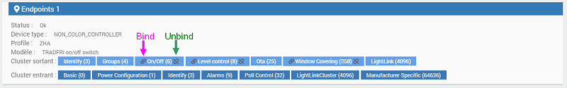

# Plugin Zigbee

**Le plugin Zigbee pour Jeedom** se base sur l'excellent travail effectué autour de **la librairie open-source Zigpy** pour offrir une **compatibilité généralisée avec les différents matériels Zigbee**. Il permet de communiquer avec les contrôleurs Zigbee suivants :

-	**deCONZ (clef Conbee/Conbee 2/Raspbee/Raspbee 2)** : Testé et validé par l’équipe Jeedom. *(Il n’est pas nécessaire d'installer l'application deCONZ)*
-	**EZSP (Silicon Labs)** : Testé, validé et recommandé par l’équipe Jeedom (attention au clef Sonoff qui semble pas très fonctionner).
-	**XBee** : Non testé par l’équipe Jeedom.
-	**Zigate** : Non testé par l’équipe.
-	**ZNP (Texas Instruments)** : Non testé par l’équipe.

>**IMPORTANT**
>
> Avant toute chose il faut mettre à jour le firmware de votre clef (surtout pour EZSP, clef popp en particulier) sinon le demon ne peut fonctionner. Pour les clef Popp la mise à jour est directement gérer depuis de le plugin pour les autres type de clef il faut vous reporter à la documentation du fabricant.

De plus, le plugin est doté de nombreux outils permettant :

- la prise en charge de **plusieurs contrôleurs à la fois**,
- la **sauvegarde et la restauration** d'un contrôleur,
- la **mise à jour du firmware** d'un contrôleur,
- la **mise à jour des modules** en OTA,
- la visualisation des nœuds et du **graphique du réseau**,
- la gestion des **groupes**,
- la prise en charge du **binding**,
- la prise en charge de **Touchlink**,
- ou encore d'intégrer ses propres configurations pour les plus aguerris...

>**TRES IMPORTANT**
>
> Du à la valse des firmware/hardware coté fabricant et des bugs possible dans leur firmware (sans avoir forcement la possibilité de le mettre à jour depuis Jeedom car la pluspart des fabricant ne les communiques pas) il se peut qu'un module marqué compatible ne le soit que partiellement (un bouton qui marche pas, ou pas de difference entre le bouton haut et pas, pas de remonté de CO2 ou d'un capteur du module...). Nous ne pouvons malheureusement pas vous prévenir à l'avance dans la liste car : 
>- nous n'avons pas forcement le module en question, beaucoup de module sont ajouter par les retours utilisateurs
>- d'une semaine à l'autre le module peut avoir changé (nouveau hardware, nouveau firmware ou meme nouveau module qui n'a pas changé de nom)
>En aucun cas Jeedom ne pourra etre tenu responsable en cas de fonction manquante (ou meme de module ne marchant pas) alors qu'il est indiqué compatible, nous subissons comme vous les changements imposé par le fabricant

# Configuration

## Configuration du plugin

**Le plugin Zigbee** utilise des dépendances qu'il faudra installer en premier lieu. Une fois les dépendances installées, vous pouvez configurer un ou plusieurs contrôleurs Zigbee en renseignant **le type de contrôleur, le port du contrôleur ainsi que le canal à utiliser**, puis (re)démarrer le démon.     


>**IMPORTANT**
>
>Tout changement de canal nécessitera un redémarrage du démon. Un changement de canal peut également nécessiter la ré-inclusion de certains modules.

## Compatibilité

Vous pouvez trouver [ici](https://compatibility.jeedom.com/index.php?v=d&p=home&plugin=zigbee) la liste des modules compatible avec le plugin

### Configuration avancée Zigpy

>**Réservé aux experts !**

Il est possible de mettre en place des paramètres spécifiques pour le sous-système Zigbee *(Zigpy)*. Cette partie est strictement réservée aux experts, c'est pourquoi l'équipe Jeedom ne fournit pas la liste des paramètres possibles *(il en existe des centaines dépendants du type de contrôleur)*.

Le champ de saisie accepte du code au format `json` de ce type :

````
{
    "ezsp": {
        "CONFIG_ADDRESS_TABLE_SIZE": "16"
    }
}
````

>**IMPORTANT**
>
>Toute demande de support sera automatiquement refusée si ce champ est rempli.

## Configuration des équipements

### Inclusion d'un module Zigbee

L’inclusion est la partie la plus complexe en Zigbee. Bien que simple, l’opération est souvent à répéter à plusieurs reprises pour aboutir. Coté plugin Jeedom c’est facile, il suffit de cliquer sur le bouton **Mode inclusion** après quoi vous avez 3 minutes pour inclure l'équipement.

La procédure d'inclusion est propre à chaque module. Veuillez vous référer à la documentation du fabricant pour la réaliser.

>**ASTUCE**
>
>Ne surtout pas oublier de faire une remise à zéro *(reset)* du module avant toute inclusion.

### Paramétrage d'un module Zigbee

Une fois inclus, Jeedom est censé reconnaitre automatiquement le module et créer les commandes correspondantes. Si ce n’est pas le cas, reportez-vous au paragraphe suivant : **Module non reconnu**.

>**IMPORTANT**
>
>A cause d'un bug dans certains firmwares *(Ikea, Sonoff, etc…)*, il est parfois nécessaire de choisir le type de module directement dans la liste **Equipement** puis de sauvegarder pour que les commandes soient créées correctement.

Sur les actions (en haut à droite) vous pouvez activer **Auto decouverte des commandes d'information**, une fois activé jeedom va automatiquement creer une commande pour toute information remontée par le module pendant 3min. Ca permet par exemple sur une télécommande qui n'est pas encore reconnu par Jeedom de creer automatiquement les commandes informations correspondant à l'appui sur les boutons (a faire pendant les 3min donc)

Comme à l'habitude, vous pouvez donner un nom à votre équipement, lui renseigner une catégorie ou un objet parent et l'activer ou le rendre visible.

D'autres paramètres plus spécifiques sont également accessibles :

- **Identification** : identifiant unique de l'équipement. Même lors d'une ré-inclusion ou si vous changez de type de contrôleur Zigbee.
- **Contrôleur Zigbee** : permet de sélectionner le contrôleur Zigbee en communication avec l'équipement.
- **Contrôle de la communication** : permet de sélectionner le mode de vérification de la bonne communication entre le contrôleur et le module.
- **Ignorer la confirmation d'exécution** : cocher la case pour ignorer la bonne exécution de la commande. Cela permet de reprendre la main plus rapidement mais ne garantit pas que l'ordre soit bien passé.
- **Autoriser la mise en file d'attente** : cocher la case pour autoriser la mise en file d'attente des commandes. Cela permet de réexécuter la commande au cas où l'ordre n'aurait pas été pris en compte par le module.
- **Auto-actualisation (cron)** : permet de forcer la mise à jour des attributs, il n'est pas recommandé de faire mettre quoique ce soit ici, une mauvaise valeur et vous saturez tout votre réseaux zigbee...

La partie **Informations** permet la sélection manuelle du fabricant et de l'équipement. On y retrouve également le visuel de l'équipement ainsi que deux boutons permettant la **régénération des commandes** ou l'accès aux options de **configuration du module**.

Dans l'onglet **Commandes**, nous retrouvons, comme à l'accoutumée, les commandes permettant d'interagir avec le module.

### Module non reconnu

Si votre module est bien inclus mais pas reconnu automatiquement par Jeedom *(pas de commandes créées)*, alors il faut en demander l'ajout auprès de l’équipe Jeedom.

>**INFORMATION**
>
>L’équipe Jeedom se réserve le droit de refuser toute demande d’intégration. Il est toujours préférable d'opter pour un équipement dont la compatibilité est déjà confirmée.

Pour solliciter l'ajout d'un nouveau matériel, il est nécessaire de fournir les éléments suivants :

- **le modèle exact** du module avec un lien vers le site d'achat et une image représentative sur fond transparent (`png`),
- Sur la page de l'équipement, cliquer sur le bouton bleu **Configuration du module** puis onglet **Informations brutes**. Copier le contenu pour le transmettre à l'équipe Jeedom,
- Mettre le démon en `debug` depuis la page de configuration du plugin et le redémarrer. Effectuer des actions sur l'équipement *(si c'est un capteur de température faire varier la température, si c'est une vanne faire varier la consigne, etc...)* et envoyer le log `zigbee` *(pas `zigbeed`)*.

>**IMPORTANT**
>
>Avant toute demande d'ajout de module vérifiez bien que votre plugin est à jour et que le module n'est pas deja dans la liste. Il arrive parfois que la reconnaissance automatique ne marche pas (car le module ne donne pas son identification dans les temps) et qu'il faille indiquer manuellement à Jeedom le type de module

>**INFORMATION**
>
>Toute demande incomplète sera refusée sans réponse de la part de l’équipe Jeedom.

### Fonctionnement des commandes
>**Réservé aux experts !**

Nous expliquons ci-après le fonctionnement des commandes dans le plugin à l'attention des utilisateurs les plus avancés :

- ``attributes::ENDPOINT::CLUSTER_TYPE::CLUSTER::ATTRIBUT::VALUE`` permet d’écrire la valeur d’un attribut *(attention tous les attributs ne peuvent pas être changés)* avec :
  - ``ENDPOINT`` : numéro du endpoint,
  - ``CLUSTER_TYPE`` : type de cluster *(IN \| OUT)*,
  - ``CLUSTER`` : numéro du cluster,
  - ``ATTRIBUT`` : numéro de l'attribut,
  - ``VALUE`` : valeur à écrire.

**Exemple** : ``attributes::1::in::513::18::#slider#*100`` va écrire l'attribut dans l'endpoint `1`, cluster entrant (``in``) `513`, attribut `18` avec pour valeur celle du ``slider*100``.

- ``ENDPOINT::CLUSTER:COMMAND::PARAMS`` permet d'exécuter une commande serveur avec :
  - ``ENDPOINT`` : numéro du endpoint,
  - ``CLUSTER`` : nom du cluster,
  - ``COMMAND`` : nom de la commande,
  - ``PARAMS`` paramètre dans le bon ordre séparé par des `::`.

**Exemple** : ``1::on_off::on``, exécute la commande ``on`` sur l'endpoint `1` du cluster ``on_off`` sans paramètres.        
**Exemple** : ``1::level::move_to_level::#slider#::0``, exécute la commande ``move_to_level`` sur l'endpoint `1` du cluster ``level`` avec les paramètres ``#slider#`` et ``0``.

# Outils

Différents outils offrant une meilleure interactivité avec son réseau Zigbee sont accessibles depuis la page de configuration du plugin :


>**IMPORTANT**
>
> Sur les clés de type EZSP *(Elelabs)*, il n’est possible de procéder qu’à une seule restauration de sauvegarde en tout et pour tout durant toute la vie de la clé.

La sauvegarde ne contient pas la liste des modules mais seulement les informations de base du réseau Zigbee. Il n’est donc pas nécessaire d’en réaliser régulièrement, une seule sauvegarde est souvent suffisante car ces informations ne changent pas durant la vie du contrôleur.

>**INFORMATION**
>
>Les démons Zigbee sont stoppés pendant le processus de sauvegarde ou de restauration.

## Mise à jour du firmware du contrôleur

Il est possible de mettre à jour le firmware du contrôleur Zigbee depuis Jeedom *(concerne uniquement les contrôleurs Elelabs à l'heure actuelle)*. Le firmware étant primordial en Zigbee car il gère le routage entre autre, il est important de le mettre à jour.

>**INFORMATION**
>
>Les démons Zigbee sont arrêtés lors d'une mise à jour de firmware.

## Mise à jour des modules OTA

Les mises à jour OTA *(Over-The-Air)* sont les mises à jour des firmwares des modules. Le processus peut prendre un certain temps (plusieurs heures selon le nombre de modules) mais permet une meilleure fiabilité du réseau Zigbee en général. Pour être en mesure de mettre à jour un module, il faut que le fabricant communique le firmware de celui-ci :

- Concernant **Ikea** et **Ledavance**, les firmwares sont directement mis à disposition en ligne où le plugin va les récupérer.
- Pour d'autres (voir [ici](https://github.com/Koenkk/zigbee-OTA/tree/master/images)), le fabricant fournit officieusement une mise à jour dans certains cas.
- Pour tous les autres, il n'est pas possible de mettre à jour le module depuis le plugin.

Afin de bénéficier des mises à jour OTA, il faut cocher la case correspondante sur la page de configuration du plugin puis sauvegarder. Il faut ensuite cliquer sur le bouton **Mettre à jour les fichiers de modules** pour récupérer les derniers fichiers à jour et enfin redémarrer le démon Zigbee.

Les mises à jour s'effectuent automatiquement en cas de disponibilité ou si le module en fait la demande. Il est possible de forcer la mise à jour d'un module depuis l'onglet **Actions** de la fenêtre de configuration du module sur la page de l'équipement.

Il n’existe malheureusement pas d’indicateur simple permettant de suivre l’avancement de la mise à jour, la seule solution est de se référer aux log `zigbeed_X` en debug et de chercher le terme `OTA`. Vous pourrez voir ce type de log lorsqu'un module se met à jour :

````
2020-02-27 15:51:10 [DEBUG][0x7813:1:0x0019] OTA query_next_image handler for 'IKEA of Sweden TRADFRI control outlet': field_control=1, manufacture_id=4476, image_type=4353, current_file_version=536974883, hardware_version=60
2020-02-27 15:51:10 [DEBUG][0x7813:1:0x0019] OTA image version: 537011747, size: 204222. Update needed: True
2020-02-27 15:51:18 [DEBUG][0x7813:1:0x0019] OTA image_block handler for 'IKEA of Sweden TRADFRI control outlet': field_control=0, manufacturer_id=4476, image_type=4353, file_version=537011747, file_offset=0, max_data_size=63, request_node_addr=Noneblock_request_delay=None
2020-02-27 15:51:18 [DEBUG][0x7813:1:0x0019] OTA upgrade progress: 0.0
````

# Touchlink/Lightlink

**Touchlink** *(ou Lightlink)* est une fonction particulière du Zigbee qui permet au contrôleur d’envoyer des ordres de gestion à un module à condition d'être très proche de celui-ci *(moins de 50 centimètres)*. Cela est utile, par exemple, pour faire une remise à zéro sur des ampoules ne possédant pas de bouton physique.

Cette fonction est disponible sur les ampoules Zigbee type **Philips Hue, Ikea, Osram, Icasa et bien d'autres...** Le principe est très simple, pour pouvoir associer ce type de module à un réseau Zigbee il faut d’abord effectuer une remise à zéro. Lors du redémarrage, le module va automatiquement essayer de s’associer au premier réseau Zigbee disponible.

## Faire une remise à zéro en Touchlink

Comme souvent en Zigbee, les difficultés peuvent intervenir lors du processus de remise à zéro ou d'association. Plusieurs méthodes s'offrent à vous pour y parvenir :

- **Effectuer rapidement 5 ou 6 cycles d'allumage/extinction** *(on/off)*. L'ampoule doit clignoter à l'issue de la procédure pour indiquer la bonne prise en compte.
- **Utiliser une télécommande Zigbee**, et :
  - **pour les télécommandes Philips Hue**, appuyer en même temps sur les boutons ON et OFF pendant 5 à 10 secondes près de l'ampoule alimentée *(il faut parfois éteindre/allumer l'ampoule juste avant sur certains modèles)*,
  - **pour les télécommandes Ikea**, appuyer sur le bouton "reset" *(a côté de la batterie)* pendant 5 à 10 secondes près de l'ampoule alimentée *(il faut parfois éteindre/allumer l'ampoule juste avant sur certains modèles)*.
- Concernant les **ampoules Philips Hue**, vous pouvez également les inclure sur le pont Hue puis les supprimer de celui-ci.

# Greenpower

La technologie Greenpower est supportée par le plugin (patch de zigpy qui ne le supporte pas nativement encore...).

>**IMPORTANT**
>
>Pour le moment le Greenpower ne marche qu'avec les clef de type EZSP (Elelabs, popp...). Le support de deconz arrivera plus tard

Pour ajouter un module Greenpower 2 possibilités :

- passer en mode inclusion, appuyer sur un bouton du module. Attention cela correspond à un ajout non securisé (n'importe qui qui intercept la trame du module peut la renvoyer à votre Jeedom)
- lire le QRcode du module et recopier la chaine dans la partie "Commissioning" de Jeedom. Cela correspond à un ajout securisé (la clef de cryptage et dans le QRcode)


>**IMPORTANT**
>
>Par defaut les interrupteurs sont sur le canal 11. Il faut absolument avoir la clef et l’interrupteur sur le meme canal. Je vous laisse consulter la documentation pour changer le canal des interrupeurs (perso je trouve la manipulation pas simple la moindre erreur oblige a tout recommancer, en général ca me prend une bonne heure…)

# Gestion des groupes

Un groupe peut être apparenté à une sorte de télécommande virtuelle permettant au contrôleur d'agir sur plusieurs modules afin de leur faire exécuter les mêmes actions simultanément.

La procédure est simple : créez un nouveau groupe et ajoutez ou supprimez des équipements membres au sein de celui-ci.

# Binding

Le binding permet de lier des modules directement entre eux sans que les ordres ne transitent par le contrôleur. Le lien se fait d'un cluster *(entrée/sortie)* vers le même cluster d'un autre module. Il faut toujours faire le lien depuis la commande (type télécommande) vers l'actionneur.

Vous retrouverez les éléments de gestion du binding, s'il est pris en charge par votre module, dans l'onglet **Information** de la fenêtre de configuration du module.



Certains modules ne sont pas compatibles avec le binding et d'autres *(tels que les modules Ikea)* ne supportent le binding que de la commande vers un groupe, il est donc nécessaire de commencer par créer un nouveau groupe dans lequel il faudra placer l'actionneur.

>**IMPORTANT**
>
>Lors de la mise en place (ou suppression) d'un binding il faut absolument reveillé le module source (télécommande par exemple) pour que celui-ci prenne en compte l'information de binding

# Réseaux Zigbee

La constitution d'un réseau Zigbee de bonne qualité est grandement aidée par les outils mis à disposition dans le plugin. Dirigez-vous vers la page générale du plugin listant l'ensemble des équipements et cliquez sur le bouton **Réseaux Zigbee** pour accéder à différentes informations et actions autour du réseau Zigbee ainsi qu'au graphique représentatif de celui-ci.

## Graphique du réseau

Le graphique du réseau permet d'avoir une vision d'ensemble du réseau Zigbee et de la qualité des communications avec les différents modules.

>**INFORMATION**
>
>Le graphique du réseau Zigbee est à titre indicatif et se base sur les voisins que les modules déclarent. Cela ne représente donc pas forcément le routage réel mais les routes possibles.

## Optimiser le réseau

Afin d'optimiser la fiabilité de votre réseau Zigbee, **il est plus que recommandé d’avoir au minimum 3 modules routeurs alimentés en permanence et d’éviter de les débrancher**. En effet, lors de nos tests nous avons remarqué une nette amélioration de la fiabilité et de la résilience du réseau Zigbee lors de l’ajout de modules routeurs. Il est d’ailleurs conseillé de les inclure en premier lieu, autrement il faudra attendre 24h à 48h pour que les "end-device" *(modules non routeurs)* les découvrent.

Autre point important, il se peut, lors de la suppression d’un module routeur, qu’une partie des "end-device" *(modules non routeurs)* soit perdue pendant un temps plus ou moins long *(en dizaine d’heures voire plus)* ou même définitivement et que vous ayez à les ré-inclure.
Malheureusement cela est dû à la manière dont la fabricant a prévu l'intégration de son matériel au sein d'un réseau Zigbee et ne peut donc pas être corrigé par le plugin qui ne gère pas la partie routage.

Pour finir et même si cela peut paraître évident pour certains, nous rappelons que les passerelles Zigbee en Wifi ou distantes sont par définition moins fiables que les passerelles USB. L'équipe Jeedom conseille donc l'utilisation d'une passerelle Zigbee en USB.  

# Changement de la clef Zigbee

Si pour un démon donné (1,2 ou 3) vous changer la clef Zigbee alors il faut supprimeer les données au niveau du demon (bouton "Supprimer les données"). Cela ne supprime pas les équipements de Jeedom ca vide juste la base de données Zigbee du demon. Attention cette opération est irréversible

# FAQ

>**Le LQI ou le RSSI est à N/A**
>
>Les valeurs sont normalement vidées après le redémarage du démon zigbee. Il faut attendre que le module communique à nouveau pour que les valeurs soient renseignées.

>**J'ai des soucis d'inclusion ou  des erreurs dans les logs de type ``TXStatus.MAC_CHANNEL_ACCESS_FAILURE``**
>
>Il faut essayer de supprimer ou de changer la rallonge USB si vous en utilisez une ou d'en installer une si vous n'en utilisez pas.

>**J'ai des erreurs ``can not send to device`` ou ``send error`` ou ``Message send failure``**
>
>C’est en général dû à un souci de routage. le routage est plus ou moins fixe en Zigbee mais non symétrique, un module peut utiliser une route différente pour répondre que celle utilisée pour lui parler. Souvent l’arrêt électrique *(retrait des piles par exemple)* et remise du courant *(ou remise des piles)* suffit à régler le problème. Il peut également être corrigé en :
>- mettant ou remplaçant la rallonge USB,
>- utilisant un autre port USB (en particulier les ports USB des Raspberry Pi qui semblent poser des difficultés),
>- mettant un hub USB alimenté,
>- déplaçant la clé afin d'éviter les interférences *(le Zigbee est très sensible aux interférences, notamment car il utilise la même fréquence que le wifi)*.

>**J’ai des erreurs bizarres sur des modules sur piles ou des soucis d’inclusion**
>
>Nous avons remarqué qu’une bonne partie des problèmes des modules sur batterie sont dûs aux piles ou éventuellement des problèmes de remise à zéro des modules avant inclusion. Même si celles-ci semblent neuves, il est conseillé de tester avec de nouvelles piles pour écarter cette hypothèse.

>**J'ai des soucis de mise à jour des valeurs de l'équipement**
>
> 2 possibilités :
> - il s'agit d'un module en ZLL *(voir la configuration de l'équipement Jeedom qui indique si c'est du ZHA ou ZLL)*. Dans ce cas il faut absolument une commande "Rafraîchir" pour que vous ou Jeedom force la mise à jour des valeurs. Si cette commande n'existe pas dans l'équipement, il faut contacter le support Jeedom pour la faire ajouter dans la prochaine version stable. Une fois sortie, il faudra cliquer sur le bouton **Recréer les commandes** sans suppression.
> -	le module est en ZHA, alors c’est un souci d’inclusion. Dans l’onglet **Action** de la configuration du module, il y a un bouton **Réinitialiser le module** permettant de forcer les actions post-inclusion. Il faut bien veiller à garder le module éveillé s’il est sur batterie.

>**Mon module vide ses batteries très vite**
>
>Vérifiez que vous etes bien sur un firmware à jour sur votre clef zigbee. Dans 90% des cas une consommation excessive des piles vient du firmware de la clef qui a un soucis.

>**Je n'arrive pas à inclure de nouveaux modules**
>
>Plusieurs possibilités pour cela :
>- Vous avez deja beaucoup de module et avez dépassé la limite du nombre de module en direct (31 en général). Il faut soit mettre une autre clef Zigbee (le plugin en géere jusqu'a 3) soit essayé en ajoutant des noeud routeur (attention il n'y a pas de norme clair sur les noeuds routeur il y a donc des incompatibilité entre fabricant...)
>- Vous etes sous Conbee : essayez de debrancher la clef pendant 2 minutes, de la remettre et relancer le demon, c'est une maladie connu des clef Conbee (meme sous deconz) ou il faut un cold reboot pour que l'inclusion remarche
>- Vous avez un SSD branché en USB3, essayez de le brancher sur un port USB2

>**Je vois dans les logs des erreurs "No cluster ID XXXXX"**
>
>Il s'agit d'une inclusion incomplete il faut supprimer le module du réseaux zigbee (par le bouton réseaux zigbee => Noeuds), faire un reset du module puis le reinclure en faisant bien attention de le maintenir eveillé pendant tous les processus de l'inclusion

>**Ma commande de capteur de mouvement/d'ouverture/interrupteur reste toujours à 1**
>
>C'est courant en zigbee le module envoi la valeur un lors d'une action (mouvement,ouverture,appui sur le bouton) mais ne renvoi pas 0 quand c'est fini (fin de mouvement par exemple). Vous pouvez mettre en place un retour d'état à 0 après 1min (par exemple) dans la configuration de l'équipement onglet commande puis sur la ligne de la commande en question.

>**J'ai pas autant de commande que de bouton sur ma télécommande**
>
>Sur ma télécommande j'ai par exemple 2 boutons mais dans la liste des commandes Jeedom j'ai que 1 commande !!! C'est normal la commande dans jeedom prends une valeur differente en fonction du bouton physique appuyé. Le plus simple pour le voir et d'aller dans "Configuration avancée" (en haut a droite) puis "Logs" (en haut a droite aussi) et d'appuyer sur les boutons de la télécommandes pour voir les differentes valeurs des commandes.

>**J'ai une erreur type "base.timeout" lors du démarrage du démon sur une clef type EZSP**
>
>Il est possible que la clef soit bloquée en mode bootloader, pour en sortir vous pouvez aller dans la configuration du plugin puis cliquer sur "Mettre à jour le firmware", selectionner votre type de clef (sur Smart/Atlas c'est Elelabs/Popp), dans port Zigbee selectionner votre port et dans firmware selectionner "Correction bootloader"
> IMPORTANT : il ne faut faire cette manipulation que les clefs de type Elelabs, box Jeedom Atlas ou Jeedom Smart. Sur tout autre clef il faut contacter le fabricant pour qu'il vous donne la procedure.

>**Je n'arrive pas a installer les dépendances**
>
>Cela peut venir d'un soucis avec la version de pip3, pour corriger il faut aller dans la configuration de Jeedom, onglet OS/DB puis lancer la console OS et faire : `sudo pip3 install --upgrade pip` puis relancer l'installation des dépendances. Si ca ne marche pas vous pouvez essayer de faire `sudo apt remove -y python3-openssl;sudo pip3 install --upgrade pip` et relancer l'installation des dépendances.
