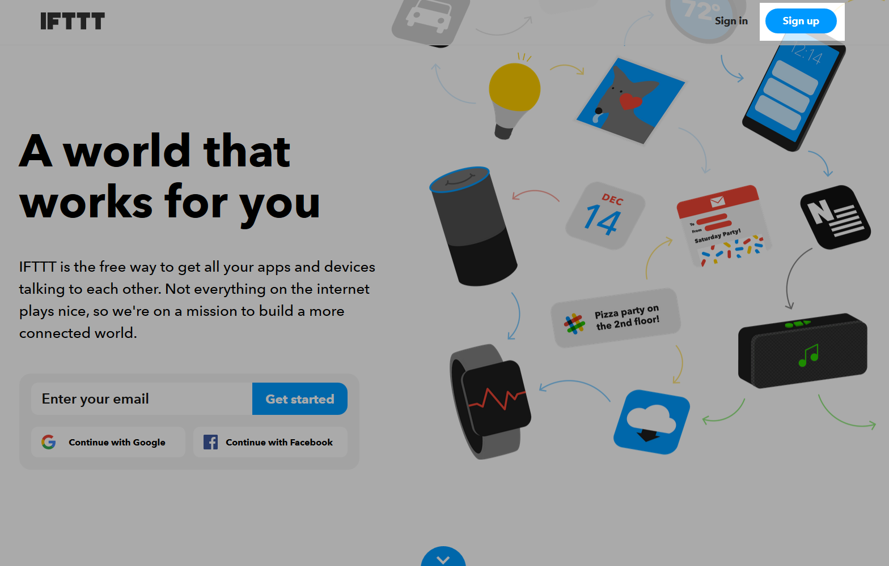
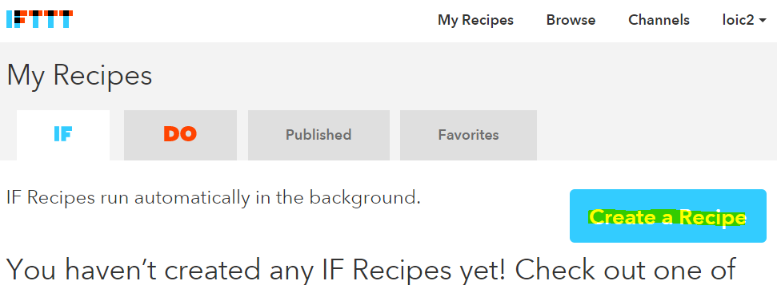
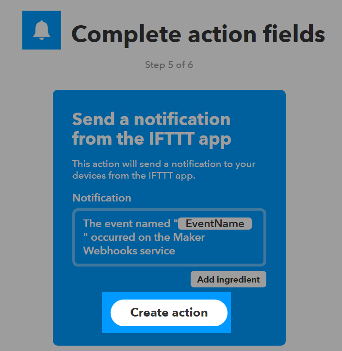
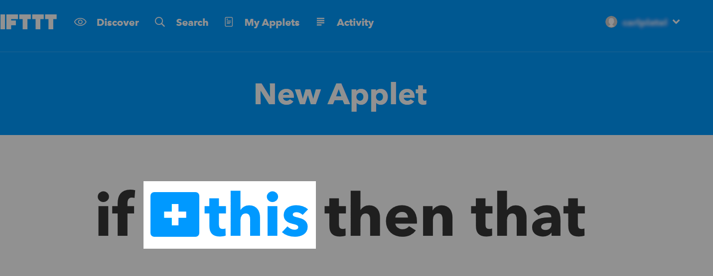

# Plugin IFTTT

Ce plugin permet d’envoyer un évènement à IFTTT.

# Configuration du plugin

Après téléchargement du plugin il faut seulement l’activer, celui-ci ne nécessitant aucune autre configuration.

# Configuration des équipements

La configuration des équipements IFTTT est accessible à partir du menu plugins :

Voilà à quoi ressemble la page du plugin IFTTT (*avec déjà 1 équipement*) :

Une fois que vous cliquez sur l’un d’eux, vous obtenez :

Vous retrouvez ici toute la configuration de votre équipement :

-   **Nom de l’équipement** : nom de votre équipement IFTTT.
-   **Activer** : permet de rendre votre équipement actif.
-   **Visible** : le rend visible sur le dashboard.
-   **Clef** : clef IFTTT que vous trouverez dans la configuration du service Webhooks (qui remplace channel maker).

En dessous vous retrouvez la configuration des commandes :

-   **Nom** : nom de la commande.
-   **Type** : Type de commande.
-   **Evènement** : nom de l’èvenement configuré dans IFTTT.
-   **Valeur** : valeur à envoyer à IFTTT. 3 distinctions possibles en fonction du sous-type, vous pouvez utiliser les tags : ``#color#, #slider#, #message#, #title#``.
-   **Configuration avancée** *(petites roues crantées)* : permet d’afficher la configuration avancée de la commande (méthode d’historisation, widget…).
-   **Tester** : permet de tester la commande.
-   **Supprimer** *(signe -)* : permet de supprimer la commande.

# Création d’un compte IFTTT

Créez un compte sur IFTTT si ce n’est pas déjà fait, en allant sur [IFTTT](https://ifttt.com) :

Renseignez votre adresse mail puis votre nom d’utilisateur et faites créer :

Un petit guide va vous expliquer les possibilités, une fois celui-ci terminé, cliquez en haut a droite sur **Search** :

Puis dans le champ de recherche tapez webhooks et cliquez sur webhooks :

Puis sur **Connect** :

Sur cettepoage il faut récupérer votre clef :

Cette clef est à copier dans le champ **Clef** de votre équipement sous Jeedom :

# Création de votre premier "Applet"

Pour cela rien de plus simple, dans IFTTT cliquez sur **My applets** puis sur **New applet** :

Puis cliquez sur **Create a Recipe** :

Cliquez sur **+this**  :

Puis recherchez "Webhooks" et cliquez dessus :

Cliquez sur **Make a web request** :

Donnez un nom à votre "Event". Attention celui-ci doit correspondre au nom de l’évènement dans la commande Jeedom, il faut donc bien le mémoriser.    
Validez en cliquant sur **Create trigger** :

Cliquez ensuite sur **+that** :

Ensuite à vous de voir, pour l’exemple je vais faire un envoi de notification sur mon téléphone (il faut au préalable avoir installé l’application IFTTT dessus), je clique donc sur **Notifications** :

Validez en cliquant sur **Send a notification** (peut être différent en fonction des channels) :

Ensuite il faut écrire le message de la notification, il existe des tags (ingrédients) possibles :

-   **EventName** : nom de l’évenement, ici weather.
-   **Value1** : valeur 1 envoyée dans le channel, cela se configure sur la commande dans Jeedom.
-   **Value2** : valeur 2 envoyée dans le channel, cela se configure sur la commande dans Jeedom.
-   **Value3** : valeur 3 envoyée dans le channel, cela se configure sur la commande dans Jeedom.
-   **OccurredAt** : date de l’occurence.

Voilà ce que cela donne ici (je veux recevoir la notification de la méteo en cours chez moi), valider en cliquant sur **Create Action** :

Donnez un nom a votre applet (recette) et validez en cliquant sur **Create Recipe** :

Voilà vous avez créé votre "applet" coté IFTTT :

Il reste plus qu’à créer la commande coté Jeedom, c’est assez simple :

Rien de particulier, il faut bien remettre le nom de l’évènement IFTTT dans Jeedom et ensuite mettre les valeurs à passer à IFTTT. Dans notre exemple les conditions météo dans l’ingrédient ``value1``.

> **ASTUCE**
>
> Coté Jeedom vous pouvez, si vous faites une commande de sous-type message par exemple, mettre le tag ``#message#`` dans un ou plusieurs champs "Valeur". Ainsi, dans votre scénario la valeur du message sera tranmis à IFTTT. La même chose est possible avec ``#title#``, ``#color#`` ou ``#slider#``.

# Envoi d’information de IFTTT vers Jeedom

Il est aussi possible de faire dans l’autre sens, c'est à dire l'envoi d’information de IFTTT vers Jeedom.      
Voilà comment faire pour, par exemple, envoyer une information lorsque le téléphone pénètre dans une zone donnée. Première chose à faire, créer une nouvelle applet :

Cliquez ensuite sur le **+this** :

Sélectionnez **Location** :

Choisissez votre déclencheur (ici je vais prendre quand on rentre dans une zone) :

Marquez votre zone puis faites **Create Trigger** :

Cliquez sur **+that** :

Cherchez "Webhooks" et cliquez dessus :

Cliquez sur **Make a web request** :

Coté Jeedom, sur votre équipement IFTTT, créer une commande de type info/autre (ou binaire si vous voulez juste savoir si vous êtês dans la zone), comme cela :

Très important : récupérer l’id de la commande (ici ``5369``).

On retourne ensuite sur IFTTT et dans notre webhooks on va lui donner l’url à appeler. C’est l’étape la plus compliquée, trouver votre url d’accès externe :

-   Vous utilisez le DNS jeedom alors c’est : ``https://XXXXX.dns.jeedom.com/core/api/jeeApi.php?apikey=\#APIKEY\#&type=ifttt&id=\#IDCMD\#&value=\#VALEUR\#``.   
Attention si vous avez une adresse en /jeedom il faut bien penser à la rajouter avant le /core.
-   Vous avez votre propre DNS alors l’url est de la forme ``http://\#VOTRE\_DNS\#/core/api/jeeApi.php?apikey=\#APIKEY\#&type=ifttt&id=\#IDCMD\#&value=\#VALEUR\#``.   
Attention si vous avez une adresse en /jeedom il faut bien penser à la rajouter avant le /core

Pensez à bien remplacer :

-   ``#APIKEY#`` : par votre clef API JEEDOM (elle se trouve dans Réglages → Système → Configuration → API).
-   ``#IDCMD#`` : par l’id de votre commande précédemment créée.
-   ``#VALEUR#`` : par la valeur que vous voulez donner à votre commande. Attention ici les espaces doivent être remplacés par des %20 (et il vaut mieux éviter les caractères spéciaux - exemple : ``Hors%20zone``).

Voilà ce que cela donne :

Pensez bien à mettre methode sur Get, puis cliquez sur **Create Action**.

Donnez un titre à votre applet puis cliquez sur **Create action**. Et voilà, dès que vous rentrez dans la zone, Jeedom sera prévenu.

> **IMPORTANT**
>
> Il faut aussi faire une recette pour la sortie de zone sinon Jeedom ne
> sera pas prévenu lors de la sortie de la zone.

> **NOTE**
>
> Pour recuperer l'url du webhook sur ifttt il faut aller [ici](https://ifttt.com/maker_webhooks) puis cliquer sur documentation
