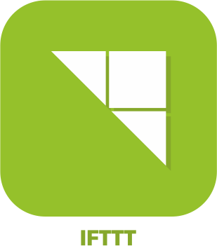
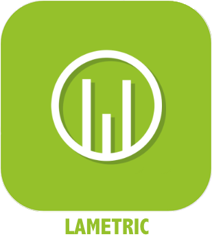

>**IMPORTANT**
>Seuls les plugins officiels ont leur documentation ici. Vous pouvez consulter les documentations des autres plugins directement depuis le Market Jeedom. Une fois sur le plugin en question, cliquez sur documentation.
>Vous pouvez voir [ici](https://market.jeedom.com/index.php?v=d&p=market&type=plugin&categorie=communication) tous les plugins officiels de cette catégorie

| | | | |
|--- | --- | --- | ---|
||Aruba|ATTENTION plugin disponible uniquement en beta | [Market](https://market.jeedom.com/index.php?v=d&p=market_display&id=4108)|
||Alexa|Plugin permettant d'utiliser Amazon Alexa (echo, dot...) pour piloter votre Jeedom. Important : le plugin nécessite un abonnement aux services vocaux . Pour gérer cet abonnement : https://www.jeedom.com/market/index.php?v=d&p=profils#services|[Documentation Stable](ash/index.md) - [Documentation Beta](ash/beta/index.md) [Market](https://market.jeedom.com/index.php?v=d&p=market_display&id=3409) [Changelog Stable](ash/changelog.md) - [Changelog Beta](ash/beta/changelog.md)|
||Bestway|Plugin pour piloter les équipements connecté Bestway. Pour le moment seul le SPA Milan a été testé (seul spa connecté de la gamme).|[Documentation Stable](bestway/index.md) - [Documentation Beta](bestway/beta/index.md) [Market](https://market.jeedom.com/index.php?v=d&p=market_display&id=4014) [Changelog Stable](bestway/changelog.md) - [Changelog Beta](bestway/beta/changelog.md)|
||Borne Tenda W301A|Auteur du plugin : Thomas Guenneguez ATTENTION, il ne s’agit pas d’un plugin Officiel Jeedom mais d’un plugin développé par une tierce personne et dont l’évolution a été abandonnée. L’équipe technique Jeedom assurera l’assistance sur ce plugin sans obligation de résultat. Plugin permettant de gérer les Bornes Tenda W301A.|[Documentation Stable](bornetenda/index.md) [Market](https://market.jeedom.com/index.php?v=d&p=market_display&id=1299) [Changelog Stable](bornetenda/changelog.md)|
||Dialog flow|Plugin permet de parler à Google Home/Assistant par le biais des interactions Jeedom|[Documentation Stable](dialogflow/index.md) [Market](https://market.jeedom.com/index.php?v=d&p=market_display&id=3215) [Changelog Stable](dialogflow/changelog.md)|
||Dyson|Plugin pour controller les équipements Dyson Link (pure link, hot+cool, humidify+cool...). Pour le moment l'aspirateur n'est pas supporté.|[Documentation Stable](dyson/index.md) [Market](https://market.jeedom.com/index.php?v=d&p=market_display&id=4002) [Changelog Stable](dyson/changelog.md)|
||Gcast|Plugin permettant de faire parler un device CAST. Il permet aussi de régler le volume. En usage combiné avec un Google home il permet de faire le pont avec les interactions et d'avoir un retour vocal, il permet aussi d'utiliser la fonction ask.|[Documentation Stable](gcast/index.md) - [Documentation Beta](gcast/beta/index.md) [Market](https://market.jeedom.com/index.php?v=d&p=market_display&id=3057) [Changelog Stable](gcast/changelog.md) - [Changelog Beta](gcast/beta/changelog.md)|
||GL-iNet|Plugin de gestion des GliNet (sms, connexion)|[Documentation Stable](glinet/index.md) - [Documentation Beta](glinet/beta/index.md) [Market](https://market.jeedom.com/index.php?v=d&p=market_display&id=4181) [Changelog Stable](glinet/changelog.md) - [Changelog Beta](glinet/beta/changelog.md)|
||Google Smarthome|Plugin pour piloter Jeedom avec un Google Home. Important : le plugin nécessite un abonnement aux services vocaux (3 mois offerts lors de l’achat du plugin) pour une configuration facile. Pour gérer cet abonnement : https://www.jeedom.com/market/index.php?v=d&p=profils#services Vous pouvez utiliser aussi le mode standalone mais sa configuration est plus complexe, nous vous conseillons vivement de lire la documentation avant tout achat si vous souhaitez utiliser ce mode.|[Documentation Stable](gsh/index.md) - [Documentation Beta](gsh/beta/index.md) [Market](https://market.jeedom.com/index.php?v=d&p=market_display&id=3412) [Changelog Stable](gsh/changelog.md) - [Changelog Beta](gsh/beta/changelog.md)|
||Helium Hotspot|Plugin permettant de récupérer les infos des hotspots Helium|[Documentation Stable](heliumhotspot/index.md) - [Documentation Beta](heliumhotspot/beta/index.md) [Market](https://market.jeedom.com/index.php?v=d&p=market_display&id=4315) [Changelog Stable](heliumhotspot/changelog.md) - [Changelog Beta](heliumhotspot/beta/changelog.md)|
||IFTTT|Grâce à ce plugin, vous pouvez bénéficier des innombrables recettes disponibles sur IFTT. Ainsi un événement Jeedom peut devenir un point d'entrée pour une recette IFTT et déclencher des événements de toutes sortes.|[Documentation Stable](ifttt/index.md) - [Documentation Beta](ifttt/beta/index.md) [Market](https://market.jeedom.com/index.php?v=d&p=market_display&id=1705) [Changelog Stable](ifttt/changelog.md) - [Changelog Beta](ifttt/beta/changelog.md)|
||inter2N|ATTENTION plugin disponible uniquement en beta Plugin pour gérer les interphones inter2N|[Documentation beta](inter2N/beta/index.md) [Market](https://market.jeedom.com/index.php?v=d&p=market_display&id=4166) [Changelog beta](inter2N/beta/changelog.md)|
||Jarvis|Plugin permettant de gérer un ou plusieurs Jarvis|[Documentation Stable](jarvis/index.md) - [Documentation Beta](jarvis/beta/index.md) [Market](https://market.jeedom.com/index.php?v=d&p=market_display&id=2577) [Changelog Stable](jarvis/changelog.md) - [Changelog Beta](jarvis/beta/changelog.md)|
||Jeedom Link|Ce plugin va vous permettre de lier plusieurs installations Jeedom afin de remonter les équipements d'un ou plusieurs "Jeedoms sources" vers un ou plusieurs "Jeedoms cibles".|[Documentation Stable](jeelink/index.md) - [Documentation Beta](jeelink/beta/index.md) [Market](https://market.jeedom.com/index.php?v=d&p=market_display&id=2530) [Changelog Stable](jeelink/changelog.md) - [Changelog Beta](jeelink/beta/changelog.md)|
||LaMetric|Plugin permettant d'afficher des notifications sur LaMetric Time.|[Documentation Stable](lametric/index.md) [Market](https://market.jeedom.com/index.php?v=d&p=market_display&id=2818) [Changelog Stable](lametric/changelog.md)|
||Mail|Ce plugin permet d'envoyer des e-mails depuis Jeedom. Cela permet de vous notifier directement par mail lors d'une alerte ou tout simplement pour un bilan journalier. Vous pouvez définir autant de destinataires que vous voulez, cela est utile pour envoyer des rapports personnalisés ou cibler les alertes pour tel ou tel destinataire.|[Documentation Stable](mail/index.md) - [Documentation Beta](mail/beta/index.md) [Market](https://market.jeedom.com/index.php?v=d&p=market_display&id=22) [Changelog Stable](mail/changelog.md) - [Changelog Beta](mail/beta/changelog.md)|
||App Mobile|L'application officielle Jeedom permet le pilotage de votre système domotique Jeedom, que ce soit en Wifi local, ou sur le réseau 3G/4G de votre opérateur.  L'app se connecte automatiquement à votre Jeedom avec une initialisation automatique par QRcode, aucune configuration n'est nécessaire. (possibilité de le faire manuellement) Vous retrouverez sur votre mobile toutes les fonctionnalités de votre Jeedom. Vous pourrez personnaliser votre application avec des raccourcis et plus encore...  Fonctionnalités actuelles: - Gestion de vos scénarios. - Gestion de votre domotique en fonction de vos pièces et équipements. - Maj et retour d'état automatique - Compatibilité aves les plugins, tel que thermostat, alarme, caméra etc... - Interface personnalisable avec les raccourcis. - Résumé domotique général et par pièce - Notifications (avec prise en charge du ASK) - Affichage des Designs   D'autres fonctionnalités et compatibilités sont à venir dans les prochaines mises à jour !  Respect de la vie privée. Aucune donnée (domotique ou personnelle) n'est stockée ou conservée sur nos serveurs.|[Documentation Stable](mobile/index.md) - [Documentation Beta](mobile/beta/index.md) [Market](https://market.jeedom.com/index.php?v=d&p=market_display&id=2030) [Changelog Stable](mobile/changelog.md) - [Changelog Beta](mobile/beta/changelog.md)|
||Netatmo|Plugin pour recuperer les équipements Netatmo (Weather,Energie,Securité). A travers le cloud Jeedom. Attention pour l'instant il n'est pas possible d'avoir le flux des cameras.|[Documentation Stable](netatmo/index.md) - [Documentation Beta](netatmo/beta/index.md) [Market](https://market.jeedom.com/index.php?v=d&p=market_display&id=4062) [Changelog Stable](netatmo/changelog.md) - [Changelog Beta](netatmo/beta/changelog.md)|
||Network|Plugin permettant la gestion réseau des équipements : ping (ip, arp, port) et wake on lan|[Documentation Stable](networks/index.md) - [Documentation Beta](networks/beta/index.md) [Market](https://market.jeedom.com/index.php?v=d&p=market_display&id=1950) [Changelog Stable](networks/changelog.md) - [Changelog Beta](networks/beta/changelog.md)|
||Nimbus|Plugin pour contrôller votre Nimbus.  Vous pouvez controller le texte affiché, la position des aiguilles. Le tout via scénario ou via le dashboard.  Une représentation personnalisable du nimbus sur votre dash viendra aggrémenter le tout  Le dashboard est complétement personnalisable  Vous pouvez changer la position de chaque aiguille et changer le texte de chaque écran indépendammment (soit via le dashboard soit via scénario)  Il existe aussi une commande démo ainsi qu'une commande tous (pour agir sur tous les écrans en meme temps) ,ainsi qu'une commande phrase pour splitter une phrase sur les 4 écrans.   Bien lire la documentation|[Documentation Stable](nimbus/index.md) [Market](https://market.jeedom.com/index.php?v=d&p=market_display&id=1506) [Changelog Stable](nimbus/changelog.md)|
||Notification Manager|Ce plugin permet de gérer les notifications (reprise en cas d'erreur, génération de texte, etc...).|[Documentation Stable](notificationmanager/index.md) - [Documentation Beta](notificationmanager/beta/index.md) [Market](https://market.jeedom.com/index.php?v=d&p=market_display&id=3315) [Changelog Stable](notificationmanager/changelog.md) - [Changelog Beta](notificationmanager/beta/changelog.md)|
||Openvpn|Plugin permettant de gérer la connexion à un serveur openvpn.|[Documentation Stable](openvpn/index.md) - [Documentation Beta](openvpn/beta/index.md) [Market](https://market.jeedom.com/index.php?v=d&p=market_display&id=1965) [Changelog Stable](openvpn/changelog.md) - [Changelog Beta](openvpn/beta/changelog.md)|
||Philips Hue|Plugin permettant d'intégrer un écosystème Philips Hue dans Jeedom. Le plugin est capable de gérer jusqu'à 2 ponts simultanément.|[Documentation Stable](philipsHue/index.md) - [Documentation Beta](philipsHue/beta/index.md) [Market](https://market.jeedom.com/index.php?v=d&p=market_display&id=190) [Changelog Stable](philipsHue/changelog.md) - [Changelog Beta](philipsHue/beta/changelog.md)|
||Phone market|Plugin pour utiliser le market comme passerelle SMS et pour passer des appels|[Documentation Stable](phonemarket/index.md) [Market](https://market.jeedom.com/index.php?v=d&p=market_display&id=1694) [Changelog Stable](phonemarket/changelog.md)|
||Sarah|Plugin pour utiliser Sarah (http://encausse.wordpress.com/s-a-r-a-h/)|[Documentation Stable](sarah/index.md) [Market](https://market.jeedom.com/index.php?v=d&p=market_display&id=17) [Changelog Stable](sarah/changelog.md)|
||Slack|Plugin pour lier Jeedom à Slack|[Documentation Stable](slack/index.md) [Market](https://market.jeedom.com/index.php?v=d&p=market_display&id=1689) [Changelog Stable](slack/changelog.md)|
||SMS|Plugin ajoutant la gestion (envoi/réception) de SMS à Jeedom. Avec ce plugin vous pouvez ainsi être notifié par SMS, voire poser une question ou déclencher une action via SMS grâce au moteur d'interactions. (Nécessite une clé 3G et une carte SIM ).|[Documentation Stable](sms/index.md) - [Documentation Beta](sms/beta/index.md) [Market](https://market.jeedom.com/index.php?v=d&p=market_display&id=16) [Changelog Stable](sms/changelog.md) - [Changelog Beta](sms/beta/changelog.md)|
||Wifip|Plugin permettant de gérer le wifi de votre box ainsi que fixer l'ip.|[Documentation Stable](wifip/index.md) [Market](https://market.jeedom.com/index.php?v=d&p=market_display&id=2286) [Changelog Stable](wifip/changelog.md)|
||Wifipower|Plugin pour la gestion des équipements wifipower|[Documentation Stable](wifipower/index.md) [Market](https://market.jeedom.com/index.php?v=d&p=market_display&id=1046) [Changelog Stable](wifipower/changelog.md)|
||Wireguard|Plugin permettant de gérer la connexion à un serveur Wireguard. Compatible uniquement avec le DNS Jeedom pour le moment|[Documentation Stable](wireguard/index.md) - [Documentation Beta](wireguard/beta/index.md) [Market](https://market.jeedom.com/index.php?v=d&p=market_display&id=4222) [Changelog Stable](wireguard/changelog.md) - [Changelog Beta](wireguard/beta/changelog.md)|
