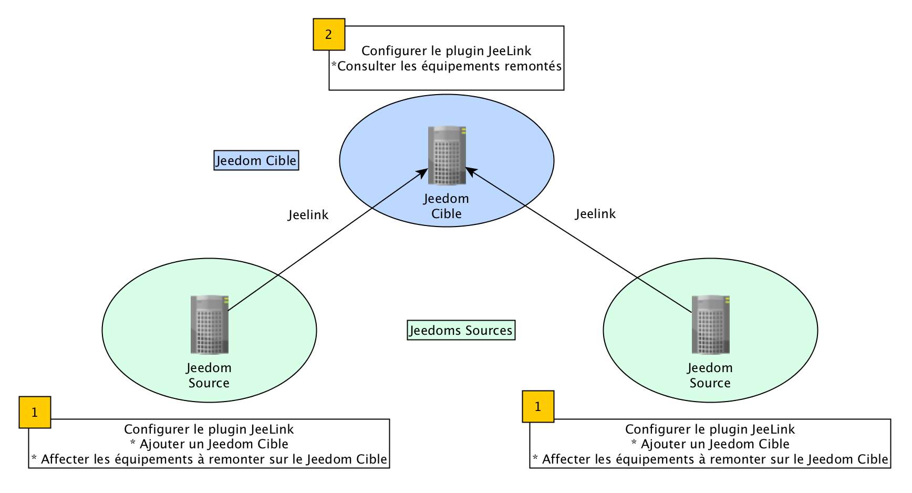

# Plugin Jeedom Link

Le plugin **Jeedom Link** *(également appelé Jeelink)* permet la remontée d'équipements depuis une ou plusieurs installations Jeedom "sources" vers un (ou plusieurs) Jeedom "cible".

Le plugin doit impérativement être installé sur chaque Jeedom, qu'il soit source ou cible.

Avant de débuter, assurons-nous d'utiliser les mêmes termes :
- **Jeedom source** : serveur Jeedom sur lequel sont présents les équipements à remonter sur le **Jeedom cible**.
- **Jeedom cible** : serveur Jeedom qui recevra et centralisera les équipements remontés par un ou plusieurs **Jeedoms sources**.
- **Affectation** : configuration effectuée au niveau du **Jeedom source** pour sélectionner les équipements à remonter au **Jeedom cible**.

>**INFORMATION**
>
>Pour une meilleure lecture et compréhension de cette documentation, Les captures d’écran sur fond blanc correspondent au **Jeedom source** et celles avec un fond noir au **Jeedom cible**.

# Configuration

## Configuration du plugin

Ce plugin ne nécessite pas de configuration particulière et doit simplement être activé après l'installation.

>**IMPORTANT**
>
>Attention la désactivation du plugin entraine la suppression des Jeedoms cibles du plugin sans aucun moyen de les récuperer (hormis restaurer un backup)

>**IMPORTANT**
>
>Les configurations réseaux de l'ensemble des Jeedoms *(source & cible)* doivent IMPERATIVEMENT être OK sinon le plugin ne fonctionnera pas.

>**IMPORTANT**
>
>Il ne faut surtout pas avoir la même clé api sur plusieurs Jeedom cibles. La clé d'un équimement est basé sur la clé api (il ne faut donc pas la changer après la configuration) et l'id source de l'équipement. Avoir la même clé api sur les Jeedom cibles entrainera donc des problèmes de synchronisation avec des équipements qui pourraient ne pas apparaître sur la source.

## Configuration Jeedom cible

La première étape va constituer à définir un **Jeedom cible** depuis le **Jeedom source** *(celui qui détient les équipements à remonter)*.

Pour se faire, dirigez-vous vers le menu **Plugins → Communication → Jeedom Link** puis cliquez sur le bouton vert **Jeedoms cibles**.

Une fenêtre va s'ouvrir à partir de laquelle vous pourrez ajouter ou modifier des **Jeedom(s) cible(s)**. Pour ajouter un **Jeedom cible**, il suffit de renseigner :

- Le nom du **Jeedom cible**.
- L’adresse IP ou le nom DNS auquell le **Jeedom cible** est joignable.
- La **clé API du plugin Jeedom Link** du **Jeedom cible**.
- Le mode d'accès, interne ou externe (utilisé pour le retour d’informations du **Jeedom source** vers le **Jeedom cible**).

>**ASTUCE**
>
>Vous retrouverez la **clé API Jeedom Link**, spécifique à chaque installation, dans le menu **Réglages → Système → Configuration → API**.

### Affectation des équipements

Après avoir effectué la configuration du **Jeedom cible** sur le **Jeedom source**, il faut aller dans l’onglet **Affectation** pour sélectionner les équipements à transmettre au **Jeedom cible**. Toutes les commandes de chaque équipement seront automatiquement créées et configurées sur le **Jeedom cible**.

Ajoutez les équipements que vous désirez remonter vers le **Jeedom cible** en cliquant sur **Ajouter un équipement** puis sélectionnez l’objet et l’équipement :

>**INFORMATION**
>
>Les plugins utilisant un widget spécifique ne le retrouveront pas sur le **Jeedom cible** *(plugin Caméra, Networks, etc.)*.

>**IMPORTANT**
>
>Par mesure de sécurité, la suppression d'un équipement affecté à un **Jeedom cible** depuis un **Jeedom source** ne le supprime pas sur le **Jeedom cible**.

Il ne reste qu'à **Sauvegarder** pour que la liaison s'effectue et que les équipements sélectionnés soient transmis du **Jeedom source** au **Jeedom cible**.

## Configuration des équipements

Dirigeons-nous maintenant vers le menu **Plugins → Communication → Jeedom Link** du **Jeedom cible** pour constater la création automatique des équipements sélectionnés précédemment :

Comme tout équipement Jeedom, vous accédez à sa page de configuration en cliquant dessus :

Dans l’onglet **Commandes**, vous accédez à tous les paramètres des commandes de l’équipement :

>**IMPORTANT**
>
>Comme pour les équipements affectés sur un **Jeedom source**, la suppression d'un équipement sur un **Jeedom cible** ne le supprime pas sur le **Jeedom source**.

### Modification Jeedom source

Les 3 paramètres suivants permettent de remplacer un **Jeedom source** sans perte de données *(historique par exemple)* :

-   **Adresse Jeedom source**
-   **Clé API Jeedom Link source**
-   **ID de l’équipement source** et **ID source** des commandes.

Pour cela, il suffit de renseigner la nouvelle adresse et la nouvelle clé API Jeedom Link du Jeedom source et de changer les identifiants de l’équipement et des commandes.

# FAQ

>**J'ai des erreurs :** `Vous n'êtes pas autorisé à effectuer cette action`
>
>Assurez-vous que les **clés API Jeedom Link** soient bien renseignées :
>- La **clé API Jeedom Link** du **Jeedom source** sur chaque équipement Jeelink du **Jeedom cible**.
>- La **clé API Jeedom Link** du **Jeedom cible** sur la page de configuration des **Jeedoms cibles** du **Jeedom source**.
