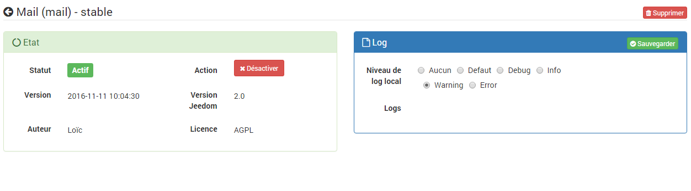

# Plugin Mail

Plugin permettant d’envoyer des mails.

# Configuration du plugin 

Après avoir installé le plugin, il vous suffit de l’activer. Ce plugin n’a aucune configuration particulière :

# Configuration des équipements 

La configuration des équipements Mail est accessible à partir du menu plugin :

Voilà à quoi ressemble la page du plugin Mail (ici avec déjà 1 mail, vous pouvez en mettre autant que vous voulez avec le bouton "Ajouter") :

Une fois que vous cliquez sur l’un d’eux, vous obtenez :

Vous retrouvez ici toute la configuration de votre équipement :

-   **Nom de l’équipement mail** : nom de votre équipement mail
-   **Objet parent** : indique l’objet parent auquel appartient l’équipement
-   **Activer** : permet de rendre votre équipement actif
-   **Visible** : rend votre équipement visible sur le dashboard
-   **Nom expéditeur** : nom de l’expéditeur du mail (ex : Jeedom)
-   **Mail expéditeur** : mail de l’expéditeur (ex : <jeedom@moi.fr>)
-   **Mode d’envoi** : mode d’envoi du mail :
    -   Jeedom cloud : aucune configuration a faire envoi des mails par le services cloud Jeedom, en phase beta pour le moment, limité à 5 mails par jour
    -   SMTP : mode le plus courant pour l’envoi de mail
    -   Sendmail
    -   Qmail
    -   Mail()\[PHP Function\] : utilise la [fonction d’envoi standard de PHP,window="\_blank"](http://fr.php.net/manual/fr/function.mail.php), nécessite de configurer le système d’exploitation

Hormis l’option SMTP, les autres options nécessitent la configuration de l’OS (Linux) pour pouvoir fonctionner. Autrement dit, de base seule la fonction SMTP fonctionne, les autres sont réservées aux experts qui pourront, s’ils le souhaitent, paramétrer eux-mêmes ces options.

L’onglet configuration SMTP permet de renseigner les informations du serveur d’email que vous voulez utilisé.

Voici quelques exemples pour les principaux fournisseurs de services email :

-   **Gmail**
    -   Serveur SMTP : smtp.gmail.com
    -   Port SMTP : 587
    -   Sécurité SMTP : TLS
-   **Hotmail**
    -   Serveur SMTP : smtp.live.com
    -   Port SMTP : 587
    -   Sécurité SMTP : TLS
-   **iCloud**
    -   Serveur SMTP : smtp.me.com
    -   Port SMTP : 25
-   **Yahoo.com**
    -   Serveur SMTP : smtp.mail.yahoo.com
    -   Port SMTP : 465
    -   Sécurité SMTP : SSL

Les champs « Utilisateur SMTP » et « Mot de passe SMTP » correspondent aux identifiants de votre compte email.

A partir de l’onglet "Commandes", vous pouvez ajouter des commandes qui correspondent aux adresses email auxquelles vous souhaitez pouvoir envoyer des emails avec Jeedom :

-   **nom** : nom de la commande
-   **email** : l’addresse email à laquelle envoyer le message. Vous pouvez en mettre plusieurs en les séparants par des ,
-   **configuration avancée** (petites roues crantées) : permet     d’afficher la configuration avancée de la commande (méthode     d’historisation, widget, etc.)
-   **tester** : permet de tester la commande,
-   **supprimer** (signe -) : permet de supprimer la commande.

Ce plugin fonctionne comme un module, c’est-à-dire qu’une fois sauvegardé, il apparaît dans la liste des actions ou commandes. Il est ainsi très simple de l’utiliser lors de la création de scénarios par exemple.

Dans un scénario, une fois sélectionné dans une action, il faudra saisir le titre et le message.

> **Important**
>
> Si vous êtes en double authentification avec Gmail il faut donner un mot de passe spécifique pour l’application : Mon compte ⇒ connexion et sécurité ⇒ Se connecter à Google ⇒ Mots de passe d’application, si ce n'est pas le cas vous devez renseigner votre mot de passe gmail habituel.

> **Tip**
>
> Le format HTML est supporté par l’éditeur de scénario pour le corps des messages.

> **Tip**
>
> Pensez à sauvegarder toutes les modifications.
