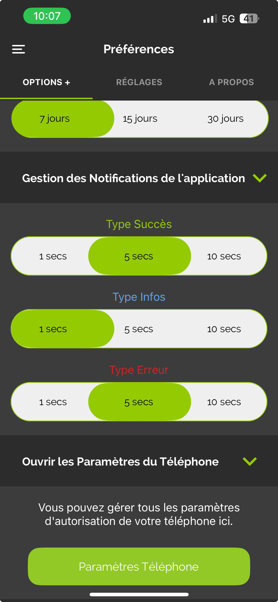

# Plugin Mobile

Le plugin Mobile permet d’utiliser l’application Mobile Jeedom.

Pour que l’application Mobile puisse communiquer avec votre Box Jeedom, il est nécessaire d’installer ce plugin.

# Configuration du plugin Mobile pour l'application V2

Après avoir installé le plugin, activez-le simplement :

# Première connexion à l'application V2

Pour connecter votre téléphone, deux méthodes sont disponibles :  
Sur le premier écran de l'application, vous pouvez soit connecter votre compte Market pour retrouver toutes les Box associées à ce compte, soit ajouter une Box manuellement.

> **IMPORTANT**  
> Pour profiter pleinement des fonctionnalités de l'application, votre Core Jeedom doit être en version 4.4.0 ou supérieure.

### **Connexion via le compte Market**

Saisissez simplement votre identifiant et mot de passe Market pour vous connecter.

### **Connexion via l'ID de la Box**

Sur cet écran, plusieurs options s'offrent à vous :

- Entrez l'URL de votre Jeedom (interne ou externe), ainsi que vos identifiants d'accès, puis cliquez sur le bouton **CONNEXION**.
- Cliquez sur **QR Code** : un nouvel écran s'affiche, vous permettant de scanner un QR Code depuis l'onglet QR Code du plugin Mobile de la Box que vous souhaitez ajouter.

> **Onglet QR Code du plugin Mobile**  
> 

Une fois cette étape terminée, vous êtes enregistré dans l'application. Si vous possédez le plugin Mobile, vous aurez accès à des fonctionnalités comme les notifications, les QR Codes, ou encore la personnalisation du menu.

Dans le menu, un onglet **Boxs** regroupe toutes les Box associées à votre compte Market.

Cliquez sur la Box où le plugin Mobile est installé, puis identifiez-vous pour y accéder.  
La Box validée apparaîtra en haut de la liste. Vous pouvez répéter cette opération pour plusieurs Box.

En cliquant sur le bouton **+** en bas à droite, vous accédez à différentes options :

- Ajouter une Box via un QR Code (depuis le plugin Mobile),
- Ajouter une Box manuellement,
- Détecter les Box Atlas et Luna sur le réseau Wi-Fi,
- Synchroniser les informations de votre compte Market.

Pour accéder à des fonctionnalités comme les notifications, la personnalisation du menu ou la géolocalisation, vous devez d'abord sélectionner une Box comme "actuelle".

# Fonctionnement de la géolocalisation

Ajoutez une zone de géolocalisation en cliquant sur l'icône **+**.

Saisissez l'adresse recherchée et validez avec la touche Entrée de votre téléphone. Le curseur se positionnera automatiquement sur l'adresse. Vous pouvez ensuite nommer et sauvegarder la zone.

Cela créera une commande binaire sur votre équipement mobile, qui indiquera les entrées et sorties de la zone si la géolocalisation est activée sur votre téléphone.

Vous pouvez également ajuster le rayon de la zone pour élargir la détection.

Pour supprimer une zone, cliquez sur **Éditer**, puis sur l'icône Corbeille. Cela supprimera la zone de l'application ainsi que la commande associée sur la Box.

# Paramètres de l'application

Vous pouvez configurer la durée d'affichage des notifications in-app selon leur type (Succès, Info, Erreur). Par défaut, elles sont réglées sur 5 secondes.

# FAQ

> **Mon mobile ne possède pas d'IQ (identifiant unique)**  
> Le plugin Mobile a besoin de l'IQ du téléphone pour l'identifier. Si ce paramètre est manquant dans les logs du plugin, rendez-vous dans le menu Préférences de l'application. Une alerte vous indiquera que la récupération de l'IQ est en cours.

> **J'ai des soucis avec les notifications**  
> Cette fonctionnalité est en cours d'amélioration et d'optimisation dans la version bêta de l'application.

> **J'ai des soucis d'affichage de ma webview**  
> Vérifiez dans les Préférences de votre Jeedom que la page d'accueil mobile est bien définie sur **ACCUEIL**.

> **L'application apparait sous jeedom sous IOS et/ou AppleWatch à la place de Jeedom**  
> .

