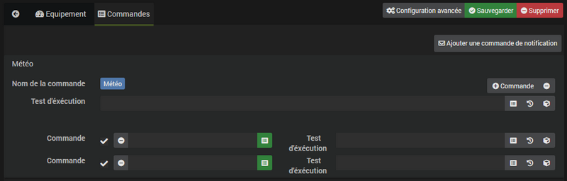

# Plugin Notification Manager

Ce plugin permet de gérer les notifications (reprise en cas d'erreur, génération de texte, etc...).

# Configuration du plugin

Après téléchargement du plugin, il suffit simplement d'activer le plugin, aucune autre configuration n'est nécessaire.

# Configuration des équipements

## Equipement

La configuration des équipements **Notification Manager** est accessible à partir du menu Plugins → Communication. Vous retrouverez ici la configuration de votre équipement :

- **Nom du notifieur** : nom de l'équipement.
- **Objet parent** : indique l’objet parent auquel appartient l’équipement.
- **Activer** : permet de rendre votre équipement actif.
- **Visible** : rend votre équipement visible sur le dashboard.

## Commande

C'est ici que vous allez pouvoir ajouter des commandes de notifications. Pour chaque commande de notifications, vous allez pouvoir définir les commandes de type message à utiliser dans l'ordre des prioritées.

Vous avez comme options :

- **Test d'éxécution** : permet d'ajouter un test avant l'exécution de la notification. Si le test est faux le plugin ne fera rien, s'il est vrai alors il exécutera les notifications dans l'ordre de priorité jusqu'à en trouver une fonctionnelle. Si le champ est vide alors le test est ignoré.

> **NOTE**
>
> Vous avez aussi un test par commande dans la notification.

> **IMPORTANT**
>
> Le plugin ne supporte pas le renommage des commandes de notification. Si vous voulez changer le nom d'une commande de notification il faudra passer sur tout les scénarios/équipements qui l'utilise pour faire la mise à jour

**Exemple simple**

*Vous pouvez mettre en premier une commande de type Slack puis une commande de type SMS. Si l'envoi par Slack ne marche pas alors il enverra le message par SMS.*

**Exemple plus complexe**

*Vous pouvez mettre en premier une commande de type Slack et une commande SMS (dans la meme case, séparés par des ``&&``), puis Mail. Le plugin va d'abord envoyer le message par Slack et SMS, si les deux ne fonctionnent pas alors il enverra la notification par mail.*

# Génération de texte

Le plugin offre aussi une possibilité de génération de texte pour que les messages ne soient pas tout le temps identiques. Le système est le même que pour les interactions :

- ``[Coucou|Salut] ca va ?`` retournera soit "*Coucou ca va ?*" ou  "*Salut ca va ?*"

# Texte conditionnel

Il est également possible d'insérer du texte conditionnel sous la forme ``{(test) ? vrai : faux}``.

> **IMPORTANT**
>
> Il faut absolument mettre le test (la condition) entre parenthèses.

Voici un exemple pour la méteo du matin avec texte conditionnel et génération de texte :

``[Bonjour|Salut|Coucou] [j'espères que tu as bien dormi ?|bien dormi ?|ça va ?]. [Aujourd'hui il fera|Aujourd'hui le temps sera|La météo annonce] #[Maison][Météo][Condition]# [et la température sera de|avec] {(#[Maison][Météo][Température Max]# < 6) ? [oula il va faire froid|oula il caille]: } #[Maison][Météo][Température Max]# degrés.``

# FAQ

>**Le plugin gère t-il ask ?**
>
>Oui le plugin gère le ask.
