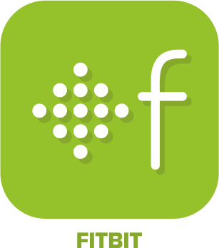

# Santé

>**IMPORTANT**
>Seuls les plugins officiels ont leur documentation ici. Vous pouvez consulter les documentations des autres plugins directement depuis le Market Jeedom. Une fois sur le plugin en question, cliquez sur documentation.
>Vous pouvez voir [ici](https://market.jeedom.com/index.php?v=d&p=market&type=plugin&categorie=health) tous les plugins officiels de cette catégorie

| | | | |
|--- | --- | --- | ---|
||Fitbit|Plugin pour Fitbit|[Documentation](fitbit/index.md) - [Market](https://market.jeedom.com/index.php?v=d&p=market_display&id=1018)|
||SevenHugs|Plugin pour SevenHugs|[Documentation](sevenhugs/index.md) - [Market](https://market.jeedom.com/index.php?v=d&p=market_display&id=2492)|
