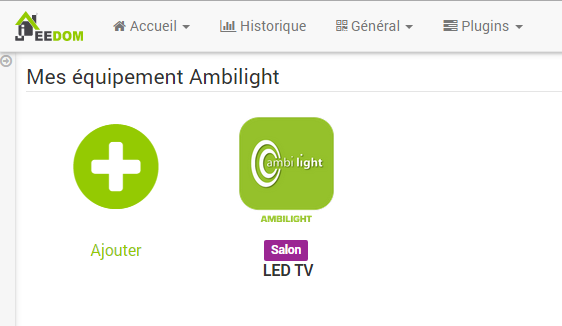

# Plugin Ambilight

Ce plugin permet la gestion d’un serveur hyperion (il faut que le serveur Json soit actif), avec la gestion des couleurs et le lancement d’effet.

# Configuration du plugin 

Après téléchargement du plugin, il vous suffit juste d’activer celui-ci, il n’y a aucune configuration à ce niveau.

# Configuration des équipements 

La configuration des équipements Ambilight est accessible à partir du menu Plugins :

Voilà à quoi ressemble la page du plugin Ambilight (ici avec déjà 1 équipement) :

Une fois que vous cliquez sur l’un d’eux, vous obtenez :

Vous retrouvez ici toute la configuration de votre équipement :

-   **Nom de l’équipement Ambilight** : nom de votre équipement Ambilight,
-   **Objet parent** : indique l’objet parent auquel appartient l’équipement,
-   **Activer** : permet de rendre votre équipement actif,
-   **Visible** : rend votre équipement visible sur le dashboard,
-   **IP** : L’IP du serveur hyperion
-   **Port** : le port du serveur hyperion json (par défaut 19444)

En dessous vous retrouvez la liste des commandes :

-   **Nom** : le nom affiché sur le dashboard,
-   **Afficher** : permet d’afficher la donnée sur le dashboard
-   **Tester** : permet de tester la commande,

