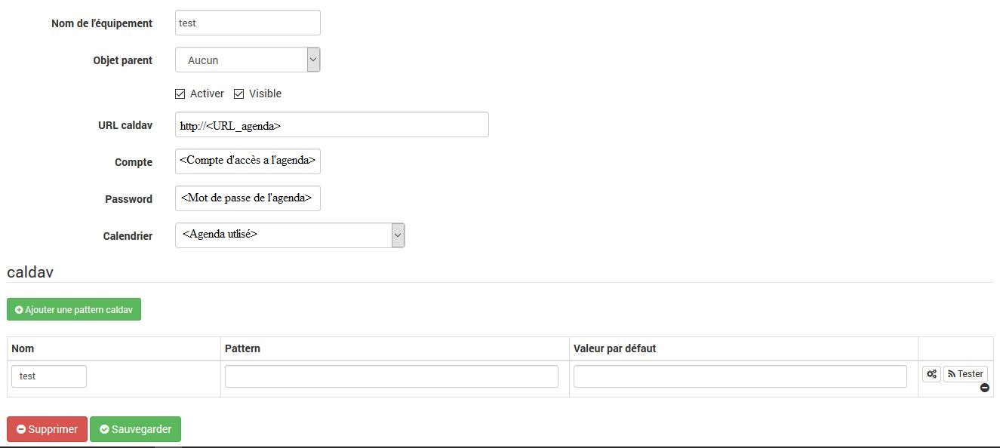

# Plugin Caldav

# Description

Le plugin **Agenda Caldav** permet de récupérer les événements d’un agenda caldav. Il gère les multiples évènements en les séparant par une virgule (``,``). Il ne reste plus qu’à tester la présence de l’évènement dans un scénario pour déclencher une action (il existe dans les scénarios l’opérateur ``~`` ou ``matches`` pour savoir si une chaîne de caractères en contient une autre).

# Configuration

Pour le configurer c’est très simple il suffit de créer un équipement par agenda puis de lui associer des patterns d’isolation d’event.

Il est nécessaire de renseigner une URL, un compte et un mot de passe pour accéder à l’agenda. Une fois sauvegardé, on peut choisir le calendrier que l’on souhaite utiliser.

Dans la case pattern, il est possible de mettre une pattern pour filtrer/extraire un évènement.

Exemple de pattern : ``!^Arrière-cuisine (.*)$!``

Si l’évènement est "Arrière-cuisine 15", la valeur retournée sera 15. Ce qui permet de gérer des températures pour une programmation.

http://perldoc.perl.org/perlre.html

>**IMPORTANT**
>
>Le nom du calendrier ne peut-être choisi qu’après sauvegarde de l’équipement avec des informations justes. Il peut mettre un certain temps à apparaitre.

## Configuration avec Webdav sur Synology

Il faut en premier lieu configurer le packet Webdav. Il faut savoir si l’on souhaite utiliser http ou https (je recommande https). Une fois activé, il faut noter le port activé pour le https (5006 par defaut).

Il faut savoir où seront stocké les calendriers :

Il faudra donc spécifier dans jeedom comme suit :

## Configuration avec Webdav sur Framagenda

Il faut en premier lieu se créer un compte sur Framagenda. Il faut ensuite aller sur https://framagenda.org/index.php/apps/calendar/.

Il faut récupérer l’URL Framagenda qui sert pour la configuration du plugin.

# FAQ

>**Aucun évènement ne remonte**
>Avez-vous sélectionné et sauvegardé un agenda ?

>**Peut-on avoir les futurs évènements**
>Non ce n’est pas possible le plugin ne donne que les évènements en cours.

>**Quelle est la fréquence de rafraichissement des informations ?**
>Par défaut c’est toutes les minutes.
