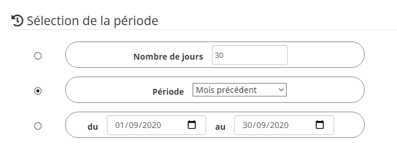

# Plugin Data Export

Plugin permettant de générer des exports d'historique des commandes de son choix vers un fichier `*.csv`.

Il est possible de récupérer le fichier d'export de plusieurs manières :
- En téléchargement direct à la demande,
- Par envoi sur le canal de son choix via une programmation,
- Par envoi sur le canal de son choix via un scénario.

# Configuration

## Configuration du plugin

Le plugin **Data Export** ne nécessite aucune configuration spécifique et doit seulement être activé après l'installation.

## Configuration des lots d'exportation

Pour gérer vos différents lots d'exportation, dirigez-vous vers le menu **Plugins → Organisation → Data Export** et cliquez sur le lot que vous souhaitez configurer.

> **A savoir**    
> Le bouton **+ Ajouter** permet de créer un nouveau lot d'exportation.

Tout d'abord, donnez un nom à cet export et renseignez l'objet parent.

Sélectionnez ensuite les commandes dont vous souhaitez obtenir les historiques en cochant la case correspondante en bout de ligne :       

> **Astuce**    
> Il est possible de trier et/ou de filtrer chaque colonne ainsi que de cocher/décocher toute la sélection en cours.

Pour finir, choisissez la période pour laquelle l'historique doit être récupéré parmi les possibilités offertes :
- **Nombre de jours** : la sélection sera effectuée sur les "X" derniers jours.
- **Période** : Sélectionnez une période pré-définie *(Semaine en cours, Semaine précédente, Mois en cours, Mois précédent, Année en cours, Année précédente, etc...)*.
- **Dates** : Renseignez manuellement les dates de début et de fin de la sélection.  

Cliquez sur le bouton sauvegarder pour enregistrer la configuration.

# Utilisation

## Téléchargement du fichier à la demande

Pour récupérer le fichier d'export en téléchargement immédiat, il suffit de cliquer sur le bouton **Exporter** une fois la sélection des commandes et de la période configurée et sauvegardée.

Le fichier `*.csv` correspondant sera immédiatement généré et téléchargé via votre navigateur.

## Envoi du fichier via programmation

Il est possible de réaliser l'envoi du fichier d'export sur le canal de votre choix (Mail, Telegram, etc...) via une programmation directement configurée sur la page du lot d'exportation.

Pour activer la programmation, cochez la case **Envoi programmé**.

2 nouveaux champs font alors leur apparition :
- **Programmation (cron)** : indiquez la programmation par un cron.
> **Astuce**    
> Cliquez sur le point d'interrogation en fin de ligne pour accéder à l'**Assistant cron** permettant de configurer facilement la programmation voulue.

- **Commande d'envoi** : sélectionnez la commande Action/Message permettant l'envoi sur le canal choisi.      

## Envoi du fichier via scénario

Il est également possible de réaliser l'envoi du fichier d'export sur le canal de votre choix (Mail, Telegram, etc...) via un scénario.

Pour se faire, il faut sélectionner la commande **Envoi Export CSV** correspondant au lot d'exportation voulu dans un bloc *Action* d'un scénario.
Renseignez le **Titre** *(facultatif)* ainsi que la **commande Action/Message pour envoi de l'export** sur le canal choisi *(obligatoire)*.    

