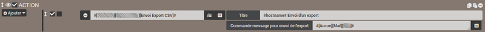

# Plugin Data Export

Plugin permettant de générer et de gérer l'archivage d'exports d'historique des commandes de son choix vers un fichier `*.csv`.

Le plugin offre la possibilité d'exporter les valeurs brutes de chaque commande sur la période sélectionnée ou bien les statistiques de celle-ci : **moyenne, min., max., somme, écart type, nombre de valeurs, dernière valeur**.

Il est possible de récupérer le fichier d'export de plusieurs manières :
- En téléchargement direct à la demande,
- Par envoi sur le canal de son choix via une programmation,
- Par envoi sur le canal de son choix via un scénario.

Un outil d'import est également inclus afin de pouvoir intégrer des valeurs dans l'historique d'une commande Jeedom.

# Configuration

## Configuration du plugin

Le plugin **Data Export** ne nécessite aucune configuration spécifique et doit seulement être activé après l'installation.

## Configuration des équipements

Pour gérer vos différents lots d'exportation, dirigez-vous vers le menu **Plugins → Organisation → Data Export** et cliquez sur l'équipement que vous souhaitez configurer.

>**INFORMATION**
>
>Le bouton **+ Ajouter** permet de créer un nouveau lot d'exportation.

Vous pouvez donner un nom au lot d'exportation, lui assigner un objet parent *(utile pour identifier la commande d'envoi d'export dans un scénario)* et l'activer ou le désactiver.    
Cocher la case **Statistiques** permet d'opter pour un export de statistiques *(moyenne, min., max., somme, écart type, variance, nombre de valeurs, dernière valeur)* au lieu de valeurs brutes.

### Choisir la périodicité de l'export

Choisissez la période pour laquelle l'historique doit être récupéré parmi les possibilités offertes :
- **Jours** : la sélection sera effectuée sur les **"X" derniers jours** *(minimum:1/maximum:999)*.
- **Période** : Sélectionnez une **période prédéfinie** *(Semaine en cours, Semaine précédente, Mois en cours, Mois précédent, Année en cours, Année précédente, etc...)*.
- **Dates** : Renseignez manuellement les **dates de début et de fin** de la sélection.  
>**ASTUCE**
>
>Si la date de fin n'est pas renseignée, ce sera celle du jour en cours par défaut.

### Choisir les commandes à exporter

Sélectionnez ensuite les commandes dont vous souhaitez obtenir les historiques en cliquant sur le bouton bleu **Afficher les commandes historisées**.    

Une fenêtre s'ouvre alors et fait apparaitre la liste des commandes historisées avec une case de sélection à cocher en début de ligne. Chaque colonne peut être filtrée ou triée, le bouton **Inverser** permet l'inversion de la sélection en cours et le bouton vert **Valider** enregistre la sélection en cours.

En dessous du bouton de sélection de commandes se trouve **la liste des commandes actuellement sélectionnées**.

>**ASTUCE**
>
>Le clic sur le nom d'une commande ouvre la page de configuration de la commande concernée.

# Archivage des fichiers d'export

Pour accéder aux exports archivés, dirigez-vous vers l'onglet **Archivage** de l'équipement.

Le champ **Rétention** permet d'indiquer le nombre de fichiers d'export à conserver en archives *(minimum:1/maximum:99)*.

En dessous la partie **Navigation** affiche la liste des fichiers d'export actuellement archivés. Sélectionnez un des fichiers pour afficher **l'aperçu du fichier** *(limité aux 1000 premières lignes)* et **activer les boutons de téléchargement et de suppression du fichier**.

# Exporter des données

## Téléchargement à la demande

Une fois la période et les commandes choisies, sauvegardez l'équipement puis cliquez sur le bouton bleu **Export CSV** pour générer un nouvel export correspondant aux critères demandés.

A l'issue du processus, le nouveau fichier sera automatiquement ajouté à la liste des exports de l'onglet **Archivage**. Cliquez sur le nom du fichier pour le sélectionner puis sur le bouton vert **Télécharger** pour le télécharger immédiatement via votre navigateur.

## Envoi via programmation

Il est possible de réaliser l'envoi du fichier d'export sur le canal de votre choix *(Mail, Telegram, Discord, etc...)* via une programmation directement configurée sur la page de l'équipement.

Pour activer la programmation, cochez la case **Activer** de la section **Envoi programmé**.

3 nouveaux champs font alors leur apparition :
- **Programmation** : indiquez la programmation par un cron.
> **ASTUCE**
>
>Cliquez sur le point d'interrogation en bout de ligne pour accéder à l'assistant-cron permettant de configurer facilement la programmation.

- **Commande d'envoi** : sélectionnez la commande Action/Message permettant l'envoi sur le canal choisi *(facultatif)*.
> **INFORMATION**
>
>Si aucune commande d'envoi n'est sélectionnée, le fichier d'export sera tout de même généré et archivé.

- **Titre de l'envoi** : Renseignez le titre à apposer sur cet envoi *(facultatif)*.
> **ASTUCE**
>
>Il est possible d'utiliser [**des tags de scénario**](https://doc.jeedom.com/fr_FR/core/4.1/scenario#Les%20tags){:target="\_blank"} dans le titre de l'envoi.  

## Envoi via scénario

Vous pouvez également réaliser l'envoi du fichier d'export sur le canal de votre choix *(Mail, Telegram, Discord, etc...)* via un scénario.

Il faut alors sélectionner la commande **Envoi Export CSV** correspondant au lot d'exportation voulu dans un bloc *Action* d'un scénario.
Renseignez le **Titre** *(facultatif)* ainsi que la **commande Action/Message pour envoi de l'export** sur le canal voulu *(facultatif)*.

> **ASTUCE**
>
>Comme pour l'envoi par programmation, il est possible d'utiliser [**des tags de scénario**](https://doc.jeedom.com/fr_FR/core/4.1/scenario#Les%20tags){:target="\_blank"} dans le titre de l'envoi et le fichier sera automatiquement archivé par le plugin si aucune commande d'envoi n'est renseignée.

# Importer des données

Si vous désirez intégrer des données dans l'historique d'une commande Jeedom, vous avez la possibilité d'utiliser cet outil. Pour se faire, vous devez envoyer un fichier tableur portant l'extension `csv` **avec séparateurs point-virgule** contenant une colonne des valeurs à intégrer et une colonne des horodatages correspondants.

Attention aux horodatages qui peuvent être interprétés et modifiés en fonction de l'application tableur que vous utilisez. Par exemple, **Excel** a tendance à supprimer les secondes automatiquement et à formater la date au format français par défaut. Dans ce cas, il faudra indiquer un format personnalisé de type `jj/mm/aaaa hh:mm:ss` ou `yyyy-mm-dd hh:mm:ss` pour les cellules contenant un horodatage.

>**IMPORTANT**
>
>Le fait d'importer des données dans Jeedom n'est pas anodin et doit être effectué en connaissance de cause. Il est toujours conseillé de procéder à une sauvegarde préalable de Jeedom avant toute intervention de ce type.

Pour accéder à l'outil d'import de valeurs, dirigez-vous vers la page générale du plugin puis cliquez sur le bouton **Importer**.

La fenêtre d'import permet d'intégrer des valeurs en historique d'une commande de type Info à partir d'un fichier `*.csv` à condition que :
- Le fichier contienne **une colonne nommée "Date"**,
- Le fichier contienne **une colonne nommée "Valeur"**,
- Le séparateur de colonnes soit **un point-virgule**,
- Le **format des dates** soit correctement renseigné (français \| international).

## Envoyer les données

Cliquez sur le bouton pour sélectionner un fichier `CSV`. Une fois chargé, le fichier est vérifié et les informations importantes sont affichées à l'écran :
- **Nom et taille** du fichier,
- **Nombre de lignes** à traiter,
- **Période** concernée par l'import,
- **Dates et valeurs** à importer.

## Réceptionner les données

Cliquez ensuite sur le bouton pour sélectionner la commande destinée à recevoir les valeurs. Les informations telles que le sous-type et l'unité seront alors affichées à l'écran.

Si un historique existe déjà sur la commande sur la période concernée par l'import, son contenu sera également affiché.

## Traiter les données existantes

En présence d'historique sur la commande pendant la phase concernée par l'import, l'outil vous demandera comment vous souhaitez gérer ces données.

3 choix sont possibles :
- **Conserver toutes les données** déjà présentes en historique,
- **Remplacer uniquement les valeurs en doublon** entre le fichier csv et l'historique,
- **Écraser toutes les données** en historique sur la période.

## Démarrer l'importation

Une fois le fichier contenant les données à importer intégré et vérifié par Jeedom, la commande de réception des données renseignée et votre choix effectué concernant le traitement de l'historique, vous pouvez cliquer sur le bouton **Importer le fichier** pour initier la procédure.
