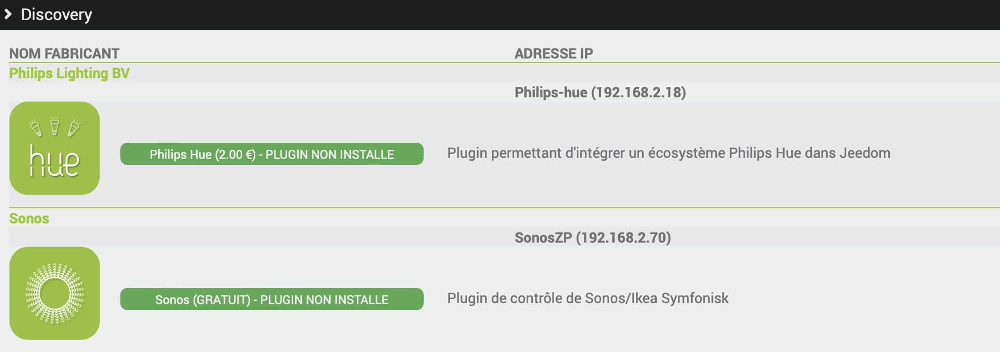

# Plugin Jeeasy

>**IMPORTANT**
>
> Jeeasy se lance AUTOMATIQUEMENT au démarrage de votre box SI vous possedez une box officielle Jeedom (Smart, Atlas, Luna, Boxs Pros).

>**IMPORTANT**
>
> Il est important de renseigner son compte Market et de suivre le déroulé de Jeeasy car c'est lui qui procedera a l'installation de plugin nécessaires ainsi que la MAJ de votre box.

A son premier lancement, il est important d'aller au bout du processus de Jeeasy, qui se fait en 2 phases :

- Premiere phase : Il vous demande de renseigner votre compte market. Cela permettra de mettre à jour la box ainsi que le plugin Jeeasy, pour lancer sa deuxieme phase.

- Deuxième phase : La personnalisation et le paramètrage de votre box : Jeeasy vous permet de pre-installer des plugins, renommer votre box, changer de langue.. Il installera également le plugin Atlas ou Luna suivant votre hardware

Vous pourrez ensuite vous rendre dans le plugin, via Plugins/Programmation/Jeeasy, et cliquer sur Détecter mes Equipements

Cette fonctionnalité permettra de scanner votre réseau à la recherche de vos équipements, et ainsi vous proposer des plugins compatibles, qui vous permettront de contrôler et gérer votre équipements.

