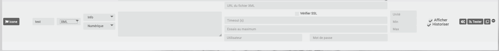

# Plugin Script

Plugin permettant d’exécuter des scripts (shell, php, ruby…), des requêtes http, de récupérer des informations dans du XML ou JSON.

# Configuration du plugin

La configuration est très simple, après téléchargement du plugin, il vous suffit de l’activer et c’est tout.


La seule option est l’endroit où Jeedom met les scripts par défaut, il est conseillé de ne pas y toucher.

# Configuration des équipements

La configuration des équipements Script est accessible à partir du menu plugin/Programmation

Voilà à quoi ressemble la page du plugin Script (ici avec déjà un équipement) :


Vous retrouvez ici la liste de vos Scripts. Une fois que vous cliquez sur un équipement vous obtenez :


Vous retrouvez ici toute la configuration de votre équipement :

- **Nom de l’équipement script** : nom de votre équipement script
- **Catégorie** : les catégories de l’équipement (il peut appartenir à plusieurs catégories)
- **Activer** : permet de rendre votre équipement actif
- **Visible** : le rend visible sur le Dashboard
- **Objet parent** : indique l’objet parent auquel appartient l’équipement
- **Auto-actualisation** : permet de spécifier un Cron d’actualisation automatique pour toutes les commandes de type info.
- **Délai avant d'actualiser les infos suite à une action** : Saisir un nombre de seconde


Vous retrouvez ici la liste des commandes :

- **Nom** : Ce champ contient le nom que vous souhaitez donner à votre commande/information.
- **Icône** : Ce champ permet d’associer une icône à votre nom (dans ce cas Jeedom remplace le nom par l’icône dans le Dashboard).
- **Type de script** :
  - Le type **http** : permet d’envoyer une requête vers un équipement externe sans forcément attendre un retour de cette commande. L’exemple qui servira de support au type http sera la configuration d’une requête vers une Vera pour allumer une lumière.
  - Le type **script** : sert principalement à lancer des scripts internes à Jeedom. L’exemple qui servira de support au type script sera la configuration du script de monitoring température du raspberry.
  - Le type **XML** : permet de rapatrier des informations encodées en XML depuis un équipement distant. L’exemple qui servira de support au type XML sera la configuration du script pour interroger un Eco-Device.
  - Le type **JSON** : permet de rapatrier des informations encodées en JSON depuis un équipement distant. L’exemple qui servira de support au type JSON sera la configuration du script pour interroger Sickbeard (ou XBMC).
- **le type** et le **sous-type**
- Le champ **requête**
  - Ce champ doit contenir la requête en elle-même, ou le chemin du script si le champ "type de script" est script. Le bouton "parcourir" : permet de sélectionner le fichier contenu dans le dossier interne à Jeedom.

        > Ce dossier est accessible en SSH dans ``/var/www/html/plugins/script/data/``. Pour info, la commande SSH pour attribuer les droits ``www-data`` à un fichier est : ``sudo chown www-data:www-data NOMDUSCRIPT.EXTENSION``. A savoir que pour exécuter un script, celui-ci doit avoir les droits www-data.

  - Le bouton **Editer** : permet d’éditer à l’aide d’un éditeur de code interne un des fichiers contenus dans le répertoire permettant l’accès au code du fichier.
  - Le bouton **Nouveau** : permet de créer un fichier de commande.

        > Ne pas oublier de saisir le nom du fichier ainsi que son extension complète sous peine de voir votre superbe script ne pas fonctionner. Sans extension Jeedom ne saura pas reconnaître le langage associé à votre fichier. CF : Généralité
  - Le bouton **Supprimer** : permet de supprimer un fichier de commande.
- Le champ **Options** : Champ avec des options variables suivant le choix du type de script.
- **unité** : unité de la donnée (peut être vide).
- **min/max** : bornes de la donnée (peuvent être vides).
- **historiser** : permet d’historiser la donnée.
- **afficher** : permet d’afficher la donnée sur le Dashboard.

> **Important**
>
> Il faut éviter, autant que possible, dans le chemin du script ou dans les paramètres de celui-ci les caractères spéciaux. Les caractères autorisés étant : les chiffres, les lettres (majuscule ou minuscule)

> **Important**
>
> Vous pouvez dans le champs requete (pour http, json, xml) mettre du json, il faut juste le faire preceder de `json::`, exemple `json::{"clef":"valeur"}`


Permet d’appeler une url ou de récupérer le retour d’une URL.

- une case à cocher "Ne pas vérifier SSL" : si cochée, permet à Jeedom de ne pas envoyer les champs "Utilisateur" et "Mot de passe" à la requête. Jeedom ne cherchera pas à s’identifier au site/machine distant.
- une case à cocher "Autoriser réponse vide" : si cochée, permet à Jeedom de ne pas attendre de réponse, ou d’ignorer toute réponse à la trame émise. En général, on coche si Jeedom nous renvoi un "Curl error : Empty reply from server".
- une case à cocher "Ne jamais remonter les erreurs" : permet de ne pas remonter d’alerte en cas d’erreur.
- un champ "timeout" : sans être renseigné, le timeout de la requête vaut par défaut 2 secondes, sinon il vaut la valeur renseignée.
- un champ "Essais au maximum" : 4 essais au maximum par défaut.
- un champ "Utilisateur" : pour renseigner un nom d’utilisateur.
- un champ "Mot de passe" : pour renseigner un mot de passe.

# Le choix HTML


Permet de passer une page Web (fichier HTML) pour récupérer une valeur dessus. La syntaxe est la même que pour jQuery.

Le champ option possède un champ "URL du fichier HTML" : ce champ contient donc le lien vers la machine hébergeant le fichier HTML en question.

# Le choix XML



Permet de récupérer du XML et d’aller chercher spécifiquement une valeur dedans.

Le champ option possède un champ "URL du fichier XML" : ce champ contient donc le lien vers la machine hébergeant le fichier XML en question.

> **Important**
>
> Il n’est possible de récupérer que des valeurs, les attributs ne peuvent être récupérés.

# Le choix JSON


Permet de récupérer du JSON et d’aller chercher spécifiquement une valeur dedans.

Le champ option possède un champ "URL du fichier JSON" : ce champ contient donc le lien vers la machine hébergeant le fichier JSON en question.

# Exemples

## HTTP : Pilotage d’une Vera

L’exemple est basé sur une Vera et consiste à piloter une ampoule dimmable. Je ne vais pas m’étendre sur la manière de piloter une Vera par requête http, le forum TLD est rempli de réponses. De plus, l’exemple correspond à mon type de matériel et devra être adapté au vôtre.

> **Tip**
>
> Une méthode pour ceux qui tâtonnent pour l’écriture de requêtes http, valider d’abord la syntaxe dans votre navigateur et seulement ensuite passer à la configuration sous Jeedom. Quand un script Action ne fonctionne pas, passer en script Info/Autre permet de voir l’erreur retournée.

Allons-y :

- On crée un équipement : par exemple LUM CUISINE (je pense qu’on a tous une cuisine sous la main)
- On l’associe à un objet parent : par exemple VERA, moi ça me permet de centraliser toutes les commandes liées à la VERA sur un unique parent.
- Choisissez votre catégorie.
- Activez votre équipement, ne cochez pas visible, on verra un peu plus tard comment l’associer à un virtuel (plus sexy, plus WAF)
- Pour l’auto-actualisation, ne rien mettre, il s’agit d’une commande impulsionnelle liée à un appui sur un bouton ou un scénario !
- Ajoutez une commande script
- Pensez à sauvegarder

Explications :

- Nom : 100 % car on va allumer une lumière à pleine puissance
- Type de script : http
- Type : Action (c’est une commande)
- Sous type : défaut
- Requête :

```url
http://<IP_VERA>:3480/data_request?id=lu_action&output_format=json&DeviceNum=12&serviceId=urn:upnp-org:serviceId:Dimming1&action=SetLoadLevelTarget&newLoadlevelTarget=100
```

> **Tip**
>
> le "100" à la fin de la requête correspond au pourcentage de puissance à affecter donc mettre "0" à la fin de la requête correspond à éteindre l’ampoule.

Le bouton "test" vous permet de tester votre commande !

Vous pouvez donc multiplier les commandes dans le même équipement en mettant par exemple une commande à 60 % pour une lumière tamisée, créer une troisième à 30 % pour les déplacements nocturnes à associer dans un scénario, …

Il est aussi possible de créer une commande de type slider en mettant le tag `#slider#` dans la requête :

```url
http://<IP_VERA>:3480/data_request?id=lu_action&output_format=json&DeviceNum=12&serviceId=urn:upnp-org:serviceId:Dimming1&action=SetLoadLevelTarget&newLoadlevelTarget=#slider#
```

> **Tip**
>
> Si votre commande est de type message vous pouvez utiliser les tags `#message#` et `#title#`, idem pour une commande de type couleur avec le tag `#color#`, ou de type slider avec `#slider#` ou liste avec `#select#`

## HTTP : Envoyer une notification à XBMC

But : Envoyer une notification vers XBMC lors de l’ouverture d’une porte d’entrée.

- Nom : PUSH XBMC
- Type de script : http
- Type : Action (c’est une commande)
- Sous-type : défaut
- Requête :

```url
http://IP_DE_XBMC:8080/jsonrpc?request={ %22jsonrpc%22:%222.0%22,%22method%22:%22GUI.ShowNotification%22,%22params%22:{ %22title%22:%22Mouvement%20Détecté%22,%22message%22:%22Porte%20Entrée%22},%22id%22:1}
```

A vous de tester ça dans un scénario par exemple !

API XBMC [ici](http://wiki.xbmc.org/index.php?title=JSON-RPC_API/v6) (seuls les champs notés "required" sont obligatoires)

But : Envoyer une notification vers XBMC lorsque la température tombe sous un certain seuil

Prenez l’exemple ci-dessus :

- remplacez `Mouvement%20Détecté` par `Risque%20de%20gel`
- remplacez `Porte%20Entrée` par `Température%20extérieur%20:%20#[EXTERIEUR][EXTERIEUR][TEMPERATURE]#`

Testez sur un scénario `#[EXTERIEUR][EXTERIEUR][TEMPERATURE]# < 5` par exemple

Action : Lancez le script, via un équipement virtuel, lié à votre script !

## SCRIPT

Le plus sympa mais pas le plus simple à expliquer.

**Prérequis : savoir développer un script en php, python, perl ou ruby.**

>**IMPORTANT**
>
> L'extension de votre script doit absolument correspondre à son type. En effet Jeedom se base sur l'extension du script pour l'exécutable à lancer
>
> Si le nom de votre fichier ne contient pas :
>
> - .php .py .pl .rb
>

Le plugin script lancera un shell qui l’exécutera en se basant sur la directive de la 1ère ligne ( shebang ).
Exemple :

```bash
#!/bin/csh -f
#!/bin/ksh
#!/usr/bin/env python3
#!/usr/bin/env php
#!/usr/bin/env node
etc ...
```

Le script de monitoring température du Raspberry va servir d’exemple pour l’utilisation du type de script : Script

Après avoir téléchargé le script, le bouton "Parcourir" vous permet de sélectionner le fichier temp\_rasp.php.

Par curiosité, vous pouvez aller voir le contenu du fichier en appuyant sur le bouton "Editer", vous devriez obtenir le code suivant :

Ceci est un script php qui peut tout à fait être réutilisé hors Jeedom !

```php
<?php
$temp = shell_exec("cat /sys/class/thermal/thermal_zone0/temp");
$temp = $temp / 1000;
$temp = round($temp,1);
echo $temp;
?>
 ```

Note : concrètement, c’est la fonction php "echo" qui va donner la valeur à Jeedom

### Les paramètres

Récupérer les infos de Jeedom pour les exploiter dans un script. La récupération dépend du type de script utilisé :

- Dans la ligne : `/var/www/html/plugins/script/data/my_script.php my_value`, l’argument `my_value` est une chaîne de caractères (fixe) récupérée dans le script php dans le tableau d'arguments `$argv` voir <https://www.php.net/manual/fr/reserved.variables.argv.php> pour plus de détails.
- Nous avons vu précédemment qu’il était possible de récupérer des valeurs dynamiques à partir de Jeedom.
- Dans la ligne : `/var/www/html/plugins/script/data/radio.py VOL #slider#`, l’argument `#slider#` est récupéré de cette façon `$argv[2]`. Au moment de l’exécution du script par Jeedom, il remplacera automatiquement `#slider#` par la valeur (numérique) du slider. cf Google pour plus de détails sur la récupération de paramètres en Python.

- Plus fort : Potentiellement, toutes les variables accessibles par Jeedom sont exploitables par le plugin script :
  - Vous voulez récupérer la valeur de la température de la cuisine pour l’historiser en dehors de Jeedom ?
  - Passer `#[MAISON][CUISINE][Température]#` comme paramètre au script et Jeedom le remplacera par la valeur lue lors de l’envoi.

Préconisation pour tester les paramètres dans le script php :

```php
if (isset($argv)) {
    foreach ($argv as $arg) {
        $argList = explode('=', $arg);
        if (isset($argList[0]) && isset($argList[1])) {
            $_GET[$argList[0]] = $argList[1];
        }
    }
}
```

## XML simple

Voici le format du XML type :

```xml
<root>
    <led0>1</led0>
    <leds>
        <led1>toto</led1>
    </leds>
</root>
```

Si vous voulez la valeur de la led0 dans requête vous mettez led0. Si vous voulez la valeur de la led1 qui est le fils de leds vous mettez leds &gt; led1.

Notez que l’élément racine &lt;root&gt; n’est pas à préciser dans le champ requête.

## XML complexe

```xml
<root>
    <led0>1</led0>
    <leds>
        <led1>toto</led1>
    </leds>
    <leds>
        <led1>tata</led1>
    </leds>
</root>
 ```

la syntaxe est :

`leds > 1 > led1` qui donne en réponse tata, 1 étant le numéro de rang du tableau !

## XML plus complexe

```xml
<AKT_Data ID="SMS-Liste" ZeitSt="01.05.2017 18:55">
    <MesPar DH="HBCHa" StrNr="2167" Typ="02" Var="02">
        <Name>Tresa - Ponte Tresa, Rocchetta</Name>
        <Datum>01.05.2017</Datum>
        <Zeit>18:50</Zeit>
        <Wert>268.56</Wert>
        <Wert dt="-24h">268.51</Wert>
        <Wert Typ="delta24">0.051</Wert>
        <Wert Typ="m24">268.52</Wert>
        <Wert Typ="max24">268.56</Wert>
        <Wert Typ="min24">268.50</Wert>
    </MesPar>
    <MesPar DH="HBCHa" StrNr="2265" Typ="03" Var="02">
        <Name>Inn - Tarasp</Name>
        <Datum>01.05.2017</Datum>
        <Zeit>18:50</Zeit>
        <Wert>4.85</Wert>
        <Wert dt="-24h">7.98</Wert>
        <Wert Typ="delta24">-3.130</Wert>
        <Wert Typ="m24">6.15</Wert>
        <Wert Typ="max24">7.98</Wert>
        <Wert Typ="min24">4.85</Wert>
    </MesPar>
    <MesPar DH="HBCHa" StrNr="2270" Typ="02" Var="32">
        <Name>Doubs - Combe des Sarrasins</Name>
        <Datum>01.05.2017</Datum>
        <Zeit>18:00</Zeit>
        <Wert>500.65</Wert>
        <Wert dt="-24h">500.65</Wert>
        <Wert Typ="delta24">0.000</Wert>
        <Wert Typ="m24">500.65</Wert>
        <Wert Typ="max24">500.65</Wert>
        <Wert Typ="min24">500.64</Wert>
    </MesPar>
</AKT_Data>
```

Pour récupérer l’information du champ Wert du 1er bloc:

`MesPar>0>Wert>0` qui retourne donc "268.56 "

Pour retourner l’élément suivant dans la "structure" Wert, il faut simplement indiquer le numéro d’ordre dans la structure. Ce qui donne pour l’élément `<Wert Typ="delta24">0.051</Wert>` le code suivant :

`MesPar>1>Wert>2`

Pour passer au bloc "MesPar" suivant, il faut donc changer l’index en conséquence : le 1 par 2, par exemple.

ATTENTION : Si dans le fichier XML l’ordre change, la requête ne fonctionne plus. Il faudra réadapter la requête en fonction de l’ordre retourné.

## JSON

A l’instar du type XML, il est possible de lire des informations issues d’un retour JSON.

Pour expliquer, je vais me baser sur les informations JSON avec l’application Sickbeard (bouh … cpasbien) mais ici seule la technique prime, pas l’outil!

L’accès à ce fichier est possible grâce à l’URL suivante :

`http://<IP_DELAMACHINEQUIEBERGESICKBEARD>:8083/api/XXXX/?cmd=history&limit=3`

NOTE : XXXX est le numéro de clef api propre à chaque SICKBEARD.

Tout d’abord, avant de se lancer dans la configuration du plugin script JSON, il s’agit d’identifier correctement les infos à récupérer., car ici nous allons intégrer une notion de tableau dans les retours.

Valider l’affichage des informations à partir de votre navigateur (test sous Chrome).

Exemple de retour :

```json
{
    "data": [
        {
            "date": "2014-09-10 01:37",
            "episode": 4,
            "provider": "RNT",
            "quality": "SD TV",
            "resource": "XXX",
            "resource_path": "XXXX",
            "season": 2,
            "show_name": "Totovaalaplage S2E4",
            "status": "Downloaded",
            "tvdbid": XXXXX
        },
        {
            "date": "2014-09-10 01:36",
            "episode": 3,
            "provider": "RNT",
            "quality": "SD TV",
            "resource": "XXXX",
            "resource_path": "XXX",
            "season": 2,
            "show_name": "Totovaalaplage S2E3",
            "status": "Downloaded",
            "tvdbid": XXXXX
        },
        {
            "date": "2014-09-10 01:21",
            "episode": 1,
            "provider": "Cpasbien",
            "quality": "SD TV",
            "resource": "XXXX",
            "resource_path": "XXXX",
            "season": 1,
ICI -->     "show_name": "Totovaplusauski mais Totovaalaplage S1E1",
            "status": "Snatched",
            "tvdbid": XXXX
        }
    ],
    "message": "",
    "result": "success"
}
```

Dans l’hypothèse où nous voudrions retourner le show\_name du 3ème élément en php (repéré ICI) , il faudrait faire : data > 2 > show\_name, l’index du tableau de retour commençant à Zéro.

Dans cet exemple, le bouton "Tester" nous retournera "Totovaplusauski mais Totovaalaplage S1E1".

Précisions :

Notez la syntaxe de la commande Requête, elle est de type élément0 > index du tableau > élément1

Inconvénients :

- cette méthode ne permet que de récupérer un seul élément à la fois.
- Si on désire retourner l’ensemble des valeurs de "show\_name", ce n’est malheureusement pas possible, il faudra dupliquer le script autant de fois que nécessaire.

## HTML

Ici nous allons essayer de récupérer la dernière VDM.

Tout d’abord il faut configurer l’url :

``http://www.viedemerde.fr``

Ensuite il faut trouver le "chemin" de la dernière VDM. Pour ce faire, il faut aller sur le site puis faire clic droit sur l’élément voulu puis inspecter l’élément, on obtient :


Là c’est la partie la plus complexe et qui demande un peu d’analyse. Ici mon texte est dans une balise "a" qui est lui dans un élément de type p qui est une div de class "post article". Il faut donc que je sélectionne le premier élément div de class "post" et "article" puis le premier élément p et que je récupère tout ce qui est dans les balises "a" qu’il contient. J’ai donc : "div.post.article:first p:first a".

On obtient donc :


Pour une actualisation en temps réel, il est possible de mettre un Cron de mise à jour.

> **Tip**
>
> Lors de la mise en place d’un Cron de mise à jour, Jeedom va automatiquement cocher la case Évènement, c’est tout à fait normal.

Voilà ensuite vous pouvez imaginer un scénario qui vous envoie par SMS la dernière VDM.
