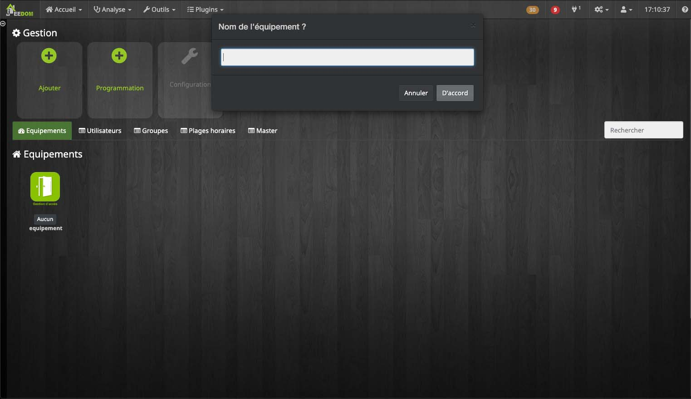

# Gestion d'accès
---
Ce plugin est utilisé pour une gestion avancée d'un système d'accès, à l'aide des fonctionnalités suivantes :

* [Activation et présentation du plugin](#activation)
* [Création et gestion des portes](#readers)
* [Création et gestion des utilisateurs](#users)
* [Création et gestion des groupes](#group)
* [Création et gestion des plages horaires](#timelapse)
* [Recherche dans l'historique](#history)

>Toutes les captures d'écrans sont effectués sous un thème, si l'apparence de votre Jeedom n'est pas exactement la même ne vous inquiètez pas.
---
## Activation et présentation du plugin gestion d'accès 

### Activation
Après instalation de votre plugin, vous devez l'activer.
>Si vous utiliser KNX, dans le groupe **Configuration** renseignez les champs.

Après avoir activé le plugin vous devriez le voir dans  **Plugins** → **Sécurité** → **gestion access**. Si ce n'est pas le cas n'hésitez pas à actualiser votre page (Ctrl+F5 ou Cmd+R).

### Présentation

Dans l'affichage par défaut du plugin, vous avez la possibilité d'ajouter un bagde, un utilisateur, une plage horaire ou une porte.

En dessous, différents onglets permettent de retrouver facilement chacun des éléments.
La barre de recherche aidera à faire le tri dans chaque catégorie pour retrouver plus facilement un élément.

Sur le **Dashbord** un historique des 20 derniers évènements est disponible.

 
## Création et gestion des portes
----
#### Création d'une porte

**Ajouter** pour créer une porte.
Le champ vous permet de définir le nom de la porte.

Dans la liste *type*, sélectionnez **Porte / Lecteur**.

#### Configuration de la porte

**Configuration équipement** permet de configurer la porte.

#### Droits équipement
**Droits équipement** sert à affecter des plages horaires particulières à la porte pendant lesquels les usagers n'auront pas besoin de leurs badges pour passer.

**Ajouter des droits** permet de sélectionner une plage horaire déjà exitstante pour l'attribuer à votre porte.
>Tous les utilisateurs reliés à la plage horraire sélectionnée pourrons passer par cette porte pendant les horaires parametrés sur celle-ci.

Le bouton **-** permet d'enlever la plage horaire.

## Création et gestion des utilisateurs
---

#### Création de l'utilisateur

**Ajouter** sert à créer un utilisateur.
Le champ vous permet de définir le nom de l'utilisateur.

Dans la liste *type*, indiquez **Utilisateur**.

#### Configuration de l'utilisateur

**Configuration utilisateur** est utilisé pour configurer. 

Plusieurs champs sont personnalisables.
Vous pouvez ainsi indiquer :

* un id utilisateur (correspondant au numéros du badge de l'utilisateur),
* le nom,
* le prénom,
* la photo de profil de l'utilisateur,
* la date de début, qui correspond au premier jour de votre nouvel utilisateur,
* la date de fin, qui correspond au dernier jour de votre nouvel utilisateur,
* le statut de l'utilisateur :
    * En service _(statut par défaut)_,
    * Volé,
    * Perdu,
* Quatres champs dans lesquels vous pouvez ajouter des notes.

Le bouton **Copier** prend la valeur du **Nom de l'utilisateur**, du **Prénom de l'utilisateur** et de l'**Id utilisateur** pour les attribuer au **Nom de l'équipement**, que vous pouvez voir dans l'onglet **Equipement**.

Le bouton **Envoyer** permet de transmettre la photo de profil que vous souhaitez pour votre utilisateur.

Le bouton **Télecharger** télecharge la photo de l'utilisateur. 
Le fichier sera nommé selon les valeurs indiquées dans les champs **Nom de l'utilisateur** et **Prénom de l'utilisateur** (séparés par un tiret).

#### Configuration des groupes pour un utilisateur
 **Configuration des groupes** sert à affecter votre utilisateur à un groupe.
>Cochez une case pour sélectionner le groupe correspondant.

#### Droits utilisateur
L'onglet **Droits utilisateur** sert à affecter des droits particuliers à l'utilisateur.

**Ajouter des droits**, permet de sélectionner une porte et une plage horaire qui seront affectées à l'utilisateur sélectionné. 
Deux options sont disponible **Refuser** et **Accepter** pour l'action.

Les nouveaux droits affectés sont visibles dans l'onglet **Droits utilisateur**. Le bouton **-** permet d'enlever les droits.

## Création et gestion des groupes
---
#### Création d'un groupe
Utilisez le bouton **Ajouter** pour créer un groupe.
Le champ vous permet de définir le nom du groupe.

Dans la liste type, sélectionnez **Groupe**.

#### Droits d'un groupe
L'onglet **Droits groupe** sert à affecter des droits particuliers à votre groupe.

**Ajouter des droits**, vous permet de sélectionner une porte et une plage horaire qui seront affectées au groupe sélectionné.
Deux options sont disponible **Refuser** et **Accepter** pour l'action.

Dans l'onglet **Droits groupe** les nouveaux droits affectés seront visibles. Le bouton **-** permet d'enlever les droits.

## Création et gestion des plages horaires
---
#### Création d'une plage horaire
Utilisez le bouton **Ajouter** pour créer une plage horaire.
Le champ vous permet de définir le nom de la plage horaire.

Dans la liste type, sélectionnez **Plage Horaire**.

#### Configuration de la plage horaire
L'onglet **Configuration plage horaire** permet de configurer une nouvelle plage horaire. 

>**Conseils :** 
> - Pour configurer une plage horaire, faites un clic gauche sur les cases qui vous intéresses en fonction du jour et de l'heure. 
Une case passe en bleu lorsqu'elle est active.
 Par défaut, les cases sont actives tous les jours de 10h30 à 19h00. 
 Pour désactiver une case, il faut faire un clic droit sur la elle. Celle-ci passera alors en transparent.
> - Par défaut les jours fériés sont pris en compte, veillez à bien désélectionner les cases bleues sur la ligne **"Jours Fériés"**.
> - Faites glisser vers la droite la barre défilante en bas du tableau pour voir plus d'horaires.
 

## Recherche dans l'historique
---

**Etape importante :** pour accéder à cette partie, il est important d'effectuer un réglage en amont. Allez dans **Plugins** → **Gestion des plugins**, dans **Mes plugins**, cliquez sur **Gestion d'accès**.

Dans la partie **Panel** cocher **Afficher le panneau desktop** puis cliquez sur **Sauvegarder**.

Une fois le changement effectué, une nouvelle section dans le menu **Accueil** est disponible.
Toutefois, si jamais elle ne s'affiche pas, veillez à bien actualiser votre page.

**Accueil** → **gestion access** pour accéder à la recherche avancées. La vue par défaut affiche les 20 derniers évenements enregistrés.

La partie de gauche permet de déterminer les critères de la recherche.

 - **Liste utilisateurs :** Noms des utilisateurs  recherchés. Vous pouvez sélectionner plusieurs utilisateurs.

 - **Liste équipements :** Noms des équipements recherchés. Vous pouvez sélectionner plusieurs équipements.

 - **Liste plages horaires :** Noms des plages recherché. Vous pouvez sélectionner plusieurs plages horaires.

 - **Date de début :** Indiquez une date de début ainsi qu'une heure pour votre recherche.

 - **Date de fin** Indiquer une date de fin ainsi qu'une heure pour votre recherche.

 - **Liste des groupes** Noms des groupes recherchés. Vous pouvez sélectionner plusieurs groupes.

 - **Liste des actions** Sélectionner le résultat d'une action vous avez le choix entre : **Toutes**, **Refuser** et **Autoriser**.

>Dans la partie haute du tableau, en dessous de chaque titre de colonne,  les différents champs permettent d'effectuer une seconde recherche qui triera les résultats.
