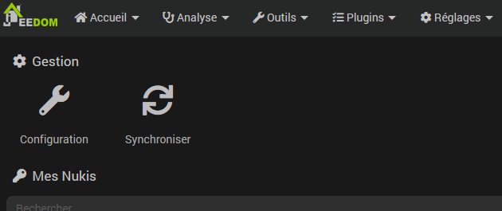

# Plugin Nuki

Ce plugin permet de piloter les serrures connectées Nuki à l’aide du bridge.

## Configuration du plugin

Après téléchargement du plugin, il vous suffit juste d’activer celui-ci, puis de configurer les informations du bridge.

Ces informations sont disponibles sur l’application mobile lors de la configuration du bridge après avoir activé l'accès API sur celui-ci.

Il est ensuite nécessaire de cliquer sur le bouton "Configurer le bridge" afin d’indiquer au bridge l’adresse de Jeedom pour le retour d’information.

## Configuration des équipements

La synchronisation des serrures est accessible à partir du menu Plugins > Sécurité > Nuki:

> **Note**
>
> Les commandes sont automatiquement créées, il n’est pas nécessaire de les rajouter manuellement.

## Valeurs possibles pour la commande *Etat*

|     | **smartlock**             | **opener**  | **doorsensor** |
|-----|---------------------------|-------------|----------------|
| 0   | Non calibré               | Non calibré | -              |
| 1   | Verrouillée               | En Ligne    | Désactivée     |
| 2   | Déverrouillage            | -           | Fermée         |
| 3   | Déverrouillée             | rto active  | Ouverte        |
| 4   | Verrouillage              | -           | Inconnue       |
| 5   | Déverrouillée (loquet)    | Ouvert      | Calibrage      |
| 6   | Déverrouillée (lock n go) | -           | -              |
| 7   | Déverrouillage (loquet)   | Ouverture   | -              |
| 16  | -                         | -           | Non calibré    |
| 240 | -                         | -           | Supprimé       |
| 253 | -                         | Démarrage   | -              |
| 254 | Moteur Bloqué             | -           | -              |
| 255 | Inconnu                   | Inconnu     | -              |
