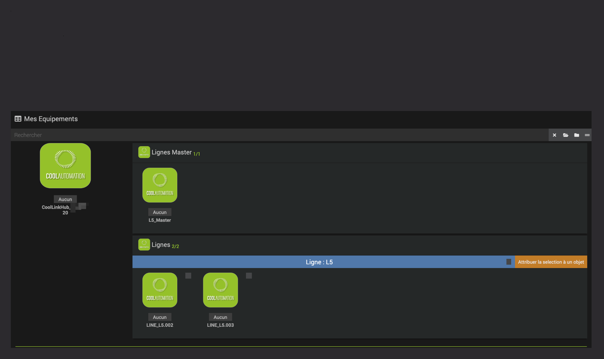
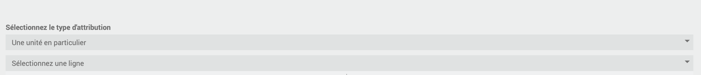

# Plugin CoolAutomation

# Auto découverte des équipements CoolAutomation

Il suffit simplement de cliquer sur Scan Réseau pour lancer une détection des équipements sur votre réseaux

Une fois trouvés, les eqlogics correspondant seront créés

# Detail Équipement

La page de l'equipement regroupe les informations nécessaires à la création des équipements dépendant de ce dernier

** Toutes les informations de cette page sont rafraichies en arrivant sur cette page.

Sur la partie droite, on peut retrouver les paramètres de l'equipement : version de firmware, nombre maximum de lignes sur l'appareil, nombre d'unités maximales etc.
Ces données sont seulement à titre informatives, et ne peuvent etre modifiées

Sur la partie gauche, on retrouve l'adresse IP de l'équipement, ainsi que son numero de série : ces 2 informations sont très importantes car elles servent à adresser les requetes sur l'API de l'appareil. 

En dessous de ces informations, on retrouve l'etat du Serveur REST : il s'agit du serveur web de l'appareil, qui sert à communiquer avec le plugin. Il faut donc l'activer si il ne l'est pas deja. 
Il peut etre activé via le plugin, en cliquant simplement sur le bouton correspondant

> ATTENTION

> Cela provoquera le redemarrage l'equipement

Enfin, sous la partie Gestion des Lignes Actives, vous retrouverez les unités connectées à l'équipement, et disponibles pour une création.

# Changer image de l'Équipement

En vous rendant sur l'equipement Cool Automation, vous pouvez choisir l'image correspondante, puis sauvegarder

# Création des Unités et de leur Équipement Maitre

Pour créer les équipements pilotant les unités connectées, il faut simplement cocher celles ci dans la partie Gestion des Lignes Actives, puis sauvegarder

Cela crééra les eqlogics correspondants, ainsi qu'un equipement Maitre, permettant de commander toute une ligne.

> ATTENTION

> Si on decoche une unité qui a deja été créée, et que l'on sauvegarde, cela supprimera l'equipement. 
> Si toutes les cases d'une ligne sont decochées, l'equipement Maitre de la ligne sera également supprimé

# Apercu d'un Équipement et de ses unités

# Attribution des unités à un objet

Des dizaines d'unités peuvent avoir été créées, et il est fastidieux de devoir se rendre sur chacune d'elles pour leur attribuer un objet parent. 

Il a été prevu un systeme pour faciliter cela : il vous suffit de cocher les unités d'une ligne, puis de cliquer sur Attribue la sélection à un objet, pour choisir l'objet parent auquel seront rattachées les unités
Vous pouvez meme selectionner toutes les unités via la checkbox à coté du bouton

# Rafraichissement des données 

Suivant la configuration du plugin, les données de tous les équipements seront actualisée à cette fréquence

Il existe 2 autres méthodes pour actualiser les données plus spécifiquement, sans faire une requete globale de tous les équipements :

- en cliquant sur l'icone Refresh d'un equipement Master de Ligne : les données de ses unités liées seront récuperées
- en cliquant sur l'icone Refresh d'un equipement enfant du Master : les données de cette unités seule seront récuperées

# Pilotage des unités et des Masters

Chaque unité est pilotable individuellement

Pour commander toute les unités d'une ligne, on peut passer par les commandes du Master associé. 

> Pour les consignes, celles ci sont associés à un mode: Chaud ou Froid
> Un changement de consigne sur un Master va changer la consigne des unités dépendantes, mais également le mode associé : Chaud ou Froid
> Pensez donc à remettre le mode souhaité une fois la consigne globale attribuée

# Historisation en masse

Vous pouvez historiser certaines commandes sur une seul unité, toutes les unités enfantes d'un équipement de type coolMaster/coolLinkHub, ou toutes les unités présentes sur le plugin

Pour cela, il faut cliquer ici :

Maintenant, vous sélectionnez l'option voulue :

Suivant votre choix, un second sélecteur apparaitra pour choisir l'option secondaire correspondante :

Une fois votre choix fait, il ne vous reste qu'a choisir les commandes souhaitées, puis de cliquer sur Historiser pour que le/les équipements choisi(s) aient leur commandes historisées
Vous pouvez toutes les sélectionner via la première checkbox

