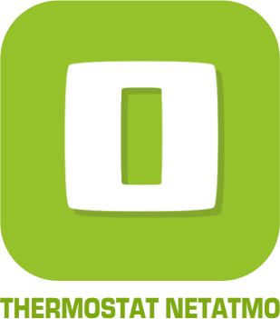
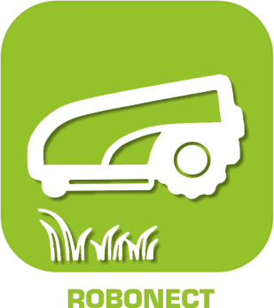

>**IMPORTANT**
>Seuls les plugins officiels ont leur documentation ici. Vous pouvez consulter les documentations des autres plugins directement depuis le Market Jeedom. Une fois sur le plugin en question, cliquez sur documentation.
>Vous pouvez voir [ici](https://market.jeedom.com/index.php?v=d&p=market&type=plugin&categorie=wellness) tous les plugins officiels de cette catégorie

| | | | |
|--- | --- | --- | ---|
||Airzone Web|Plugin pour l'integration dans Jeedom de système AirzoneWeb|[Documentation Stable](airzone/index.md) - [Documentation Beta](airzone/beta/index.md) [Market](https://market.jeedom.com/index.php?v=d&p=market_display&id=4216) [Changelog Stable](airzone/changelog.md) - [Changelog Beta](airzone/beta/changelog.md)|
||Brumisateur Alfawise|Plugin pour contrôler les brumisateurs Alfawise|[Documentation Stable](alfawiseumist/index.md) - [Documentation Beta](alfawiseumist/beta/index.md) [Market](https://market.jeedom.com/index.php?v=d&p=market_display&id=3296) [Changelog Stable](alfawiseumist/changelog.md) - [Changelog Beta](alfawiseumist/beta/changelog.md)|
||CoolAutomation|Plugin permettant la découverte automatique, la configuration et la communication par API avec les produits de la marque CoolAutomation: CoolLink Hub, CoolMaster et CoolMaster Pro.|[Documentation Stable](coolAutomation/index.md) - [Documentation Beta](coolAutomation/beta/index.md) [Market](https://market.jeedom.com/index.php?v=d&p=market_display&id=4504) [Changelog Stable](coolAutomation/changelog.md) - [Changelog Beta](coolAutomation/beta/changelog.md)|
||Green Momit|Plugin pour les thermostats Greenmomit|[Documentation Stable](greenmomit/index.md) [Market](https://market.jeedom.com/index.php?v=d&p=market_display&id=1081) [Changelog Stable](greenmomit/changelog.md)|
||Ikettle|Plugin pour gérer les bouilloires smarter Ikettle et Ikettle 2|[Documentation Stable](ikettle/index.md) [Market](https://market.jeedom.com/index.php?v=d&p=market_display&id=3297) [Changelog Stable](ikettle/changelog.md)|
||Intesis|Plugin permettant de piloter les passerelles « Intesis Wifi (ASCII) AC Interfaces » (anciennement dénommées Intesisbox). Basées sur le protocole WMP, les passerelles « Intesis Wifi (ASCII) AC Interfaces » sont des box qui permettent de domotiser des systèmes de climatisation gainables (interface Intesis à connecter en filaire sur le bus du climatisateur) ou à split avec télécommande infrarouge (interface Intesis IR). Ce plugin supporte tous les modèles de passerelles Intesis Wifi (ASCII) AC Interfaces (aussi bien filaires que IR), mais n’est pas compatible avec les passerelles IntesisHome (et notamment pas avec les passerelles Intesis de la gamme IntesisHome).|[Documentation Stable](intesis/index.md) - [Documentation Beta](intesis/beta/index.md) [Market](https://market.jeedom.com/index.php?v=d&p=market_display&id=3921) [Changelog Stable](intesis/changelog.md) - [Changelog Beta](intesis/beta/changelog.md)|
||Neato|Plugin pour contrôler votre aspirateur Botvac Connected de chez Neato. Il permet de lancer un cycle de nettoyage turbo ou éco, de mettre en pause, de reprendre, de faire un retour base, de connaitre le statut, la présence sur le dock, le niveau de charge, et bien plus encore.....  Vous réviez d'un aspirateur intégré à votre domotique, c'est réalisable grâce à ce plugin !|[Documentation Stable](neato/index.md) - [Documentation Beta](neato/beta/index.md) [Market](https://market.jeedom.com/index.php?v=d&p=market_display&id=2260) [Changelog Stable](neato/changelog.md) - [Changelog Beta](neato/beta/changelog.md)|
||Netatmo Thermostat|Plugin pour contrôler son thermostat Netatmo.  Le plugin permet de : -Choisir le mode de fonctionnement du thermostat (programme,max,absent,hors gel, off, consigne manuel) -Choisir son calendrier (vacances, standard etc...) - De connaitre la batterie et les niveaux de signals du thermostat - De connaitre le planning actuel ainsi que le suivant (et l'heure de fin du planning actuel) - De définir le jour et heure de fin des modes (absent, hors-gel, max et manuel) - L'ensemble des fonctions sont disponibles via scénarios - Les deux widgets (dashboard et mobile) permettent d'accéder à toutes ces fonctionnalités|[Documentation Stable](netatmoThermostat/index.md) - [Documentation Beta](netatmoThermostat/beta/index.md) [Market](https://market.jeedom.com/index.php?v=d&p=market_display&id=1969) [Changelog Stable](netatmoThermostat/changelog.md) - [Changelog Beta](netatmoThermostat/beta/changelog.md)|
||Robonect|ATTENTION plugin disponible uniquement en beta |[Documentation beta](robonect/beta/index.md) [Market](https://market.jeedom.com/index.php?v=d&p=market_display&id=3405) [Changelog beta](robonect/beta/changelog.md)|
||Smarter Coffee|Plugin permettant de gérer la cafetière smarter. Attention : uniqument compatible avec la version 1 de la cafetière, la version 2 qui gère Ifttt n'est pas compatible|[Documentation Stable](smartercoffee/index.md) - [Documentation Beta](smartercoffee/beta/index.md) [Market](https://market.jeedom.com/index.php?v=d&p=market_display&id=2285) [Changelog Stable](smartercoffee/changelog.md) - [Changelog Beta](smartercoffee/beta/changelog.md)|
||Swimo|Permet de piloter un contrôleur de piscine Swimo.|[Documentation Stable](swimo/index.md) [Market](https://market.jeedom.com/index.php?v=d&p=market_display&id=3747) [Changelog Stable](swimo/changelog.md)|
||Thermostat|Ce plugin très puissant et très complet vous permettra de gérer finement la température de votre logement que ce soit pour réchauffer ou refroidir celui-ci. Le plugin apprend de lui même avec le temps le meilleur moyen d'économiser de l'énergie tout en maintenant un confort optimal dans votre logement.|[Documentation Stable](thermostat/index.md) - [Documentation Beta](thermostat/beta/index.md) [Market](https://market.jeedom.com/index.php?v=d&p=market_display&id=77) [Changelog Stable](thermostat/changelog.md) - [Changelog Beta](thermostat/beta/changelog.md)|
||Thinking Cleaner|Plugin pour commander les roombas via le module Thinking Cleaner|[Documentation Stable](thinkingCleaner/index.md) [Market](https://market.jeedom.com/index.php?v=d&p=market_display&id=1712) [Changelog Stable](thinkingCleaner/changelog.md)|
