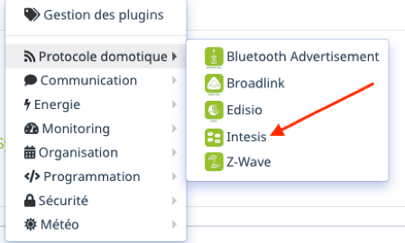
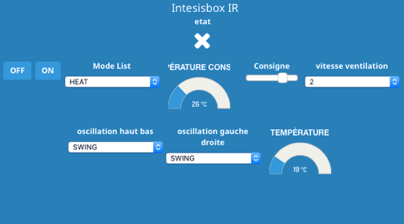

# Intesis

#Description

Plugin permettant de piloter **les passerelles « Intesis Wifi (ASCII) AC Interfaces » (anciennement dénommées Intesisbox).**  basées sur le protocole WMP.

Les passerelles « Intesis Wifi (ASCII) AC Interfaces » sont des box qui permettent de domotiser des systèmes de climatisation gainables (interface Intesis à connecter en filaire sur le bus du climatisateur) ou à split avec télécommande infrarouge (interface Intesis IR).

Ce plugin supporte tous les modèles de passerelles Intesis Wifi (ASCII) AC Interfaces (aussi bien filaires que IR), mais **n’est pas compatible avec les passerelles IntesisHome** (et notamment pas avec les passerelles Intesis de la gamme IntesisHome).

Les passerelles Intesis Wifi (ASCII) AC Interfaces sont [disponibles à la vente ici.](https://www.domadoo.fr/fr/323_intesis-unites-ac-domestiques-daikin-vers-une-interface-wi-fi-rac)

# Configuration du plugin

Après téléchargement du plugin, il faut tout d’abord activer celui-ci, comme tout plugin Jeedom :

Ensuite, il est vivement conseillé de lancer l’installation des dépendances (même si elles apparaissent OK) :

Enfin, il faut démarrer le démon :

Pour finir, il faut vérifier que tout est au vert et OK :

Il n’y a rien d’autre à faire.

Rien n’est à modifier dans le champ « Port socket interne » de la section « Configuration ».

# Comment déclarer une nouvelle interface intesis Wifi dans Jeedom

Rendez-vous dans le menu « Plugins → Confort → Intesis » :

Vous arrivez sur la page suivante, qui se compose de deux sections :

- **Gestion** avec les options suivantes : « Ajouter » et « Configuration » (cette option vous renvoie à la page de configuration du plugin, décrite au point précédent).
- **Mes Intesis** : C’est là que sont ou seront affichées les passerelles Intesis wifi gérées par Jeedom.

Vous devez donc cliquer sur l’option « Ajouter » et renseigner le nom de l’équipement (Climatisation Salon, par exemple) :

Vous devez ensuite compléter les autres champs de la page de configuration du nouvel équipement Intesis, dont l’objet, la catégorie, cocher « Activer » et « Visible », puis vous devez **renseigner l’adresse IP** de votre passerelle Intesisbox Wifi :

>**IMPORTANT**
>
>Il faut faire en sorte que votre passerelle Intesisbox Wifi ait une IP fixe sur votre réseau local, sinon son IP pourrait changer auquel cas Jeedom ne parviendrait plus à piloter la passerelle.

Il ne vous reste plus qu’à sauvegarder.

# Les commandes

Rendez-vous dans l’onglet « Commandes » de la page de configuration du nouvel équipement Intesis.

Ici vous pouvez masquer et rendre visibles les différentes commandes de type « action » et « info » disponibles (les commandes de type « info » peuvent également être historisées) :

Le plugin propose au total 14 commandes.

Les commandes de type « action » (actionneurs) disponibles sont les suivantes :

- ON : Pour mettre en marche le climatisateur
-	OFF : Pour éteindre le climatiseur
- Consigne : Pour modifier la consigne de température du climatisateur
- Mode List : Pour modifier le mode de fonctionnement du climatisteur (Auto, Heat, Dry, Fan, Cool)
- Oscillation haut-bas : Pour modifier le mode d’oscillation des lames verticales d’orientation du flux d’air (1, 2, 3 et Swing)
- Oscillation gauche-droite : Pour modifier le mode d’oscillation des lames horizontales d’orientation du flux d’air (1, 2, 3 et Swing)
- Vitesse ventilateur : Pour modifier la vitesse de rotation du ventilateur (de 1 à 4)

Les commandes de type « info» (capteurs) disponibles sont les suivantes :

-	État : Retour d’état ON/OFF du climatisateur
-	Info consigne : Retour d’état de la consigne de température
-	Mode : Retour d’état du mode de fonctionnement du climatisteur (Auto, Heat, Dry, Fan, Cool)
-	Info oscillation haut-bas : Retour d’état du mode d’oscillation des lames verticales du climatiseur.
-	Info oscillation gauche-droite : Retour d’état du mode d’oscillation des lames horizontales du climatiseur.
-	Info vitesse ventilateur : Retour d’état de la vitesse du ventilateur
-	Température : Température ambiante de la pièce

Vous pouvez masquez les commandes qui ne vous sont pas utiles. Cela peut être le cas, par exemple, si votre climatiseur n’a pas de lames d’orientation du flux d’air.

À l’inverse, vous pouvez rendre visibles les commandes de type « info » qui vous sont utiles.

# Le widget Intesis

Comme indiqué au point 3) précédent, les commandes qui s’affichent sur le widget sont uniquement celles que vous avez rendu visibles auparavant.

>**Remarque**
>
>Pour les commandes de type « info », le retour d’état se fait toutes les 5 minutes. Donc si vous utilisez la télécommande du climatiseur pour modifier la consigne (ou autre), Jeedom reflète cet état dans le Widget dans un laps de temps maximum de 5 minutes.

Comme pour tout widget Jeedom, vous pouvez réorganiser les commandes sur le widget grâce au mode édition (pour cela, cliquez sur le crayon en haut à gauche) :

Quelques exemples de widgets Intesis avec différentes commandes visibles (sur Jeedom V3) :

Exemple de widget Intesis sur Jeedom V4 :

