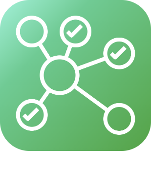

# Protocole domotique

>**IMPORTANT**
>Seuls les plugins de contributeur ont leur documentation ici. Vous pouvez consulter les documentations des plugins officiels directement depuis le Market Jeedom. Une fois sur le plugin en question, cliquez sur documentation.
>Vous pouvez voir [ici](https://market.jeedom.com/index.php?v=d&p=market&type=plugin&categorie=automation+protocol) tous les plugins officiels de cette catégorie

| | | | |
|--- | --- | --- | ---|
||MQTT Discovery|Plugin pour découverte automatique d'équipement MQTT sur le principe du 'MQTT Auto Discovery' (ou 'HA Discovery') qui existe sous home assistant. Cela permet d'utiliser Open MQTT Gateway (https://docs.openmqttgateway.com/) sur esp32 ou l'équivalent Theengs gateway (https://gateway.theengs.io/) sur pi. Il devient très facile de faire de la gestion de présence de tag bluetooth tel que les nuts ou d'intégrer une liste importante de matériel compatible BLEA. Mais c'est également compatible avec tout équipement supportant 'MQTT Discovery' tel que zwave, zigbee, Nuki, Switchbot, Sonos...|[Documentation Stable](https://mips2648.github.io/jeedom-plugins-docs/MQTTDiscovery/fr_FR/) - [Documentation Beta](https://mips2648.github.io/jeedom-plugins-docs/MQTTDiscovery/fr_FR/) [Market](https://market.jeedom.com/index.php?v=d&p=market_display&id=4429) [Changelog Stable](https://mips2648.github.io/jeedom-plugins-docs/MQTTDiscovery/fr_FR/changelog) - [Changelog Beta](https://mips2648.github.io/jeedom-plugins-docs/MQTTDiscovery/fr_FR/changelog)|
||Poêle Agua IOT Micronova navel 2.0|Plugin PoeleAgua pour la gestion des poêles à bois et granulé utilisant la plateforme aqua iot  de micronova (navel 2.0) ex: Jolly Mec / Piazzetta / superior / MCZ et bien plus. Voir la documentation pour les modèles supportés|[Documentation Stable](https://lefilliatre.github.io/lefilliatre-documentation/PoeleAgua/fr_FR/) - [Documentation Beta](https://lefilliatre.github.io/lefilliatre-documentation/PoeleAgua/fr_FR/) [Market](https://market.jeedom.com/index.php?v=d&p=market_display&id=4251) [Changelog Stable](https://lefilliatre.github.io/lefilliatre-documentation/PoeleAgua/fr_FR/changelog) - [Changelog Beta](https://lefilliatre.github.io/lefilliatre-documentation/PoeleAgua/fr_FR/changelog)|
||dht22|Plugin permetant la lecture de sondes DHT11, DHT22, AM2302 connectées au GPIO d'un raspberry|[Documentation Stable](https://linura.github.io/dht22/fr_FR/) [Market](https://market.jeedom.com/index.php?v=d&p=market_display&id=4010) [Changelog Stable](https://linura.github.io/dht22/fr_FR/changelog)|
||EIB - KNX|Connecter Jeedom avec votre installation domotique KNX et Jeedom deviendra un participant de votre installation|[Documentation Stable](http://mika-nt28.github.io/Documentations/eibd/fr_FR/) [Market](https://market.jeedom.com/index.php?v=d&p=market_display&id=203) [Changelog Stable](https://mika-nt28.github.io/Documentations/eibd/fr_FR/changelog)|
||Global Cache|Ce plugin permet de connecter tous les appareils Global Cache à Jeedom|[Documentation Stable](https://mika-nt28.github.io/Documentations/globalcache/fr_FR/) [Market](https://market.jeedom.com/index.php?v=d&p=market_display&id=2932) [Changelog Stable](https://mika-nt28.github.io/Documentations/globalcache/fr_FR/changelog)|
||Homekit Network Devices Control|Ce plugin permet de controler dans jeedom vos périphériques Homekit Réseaux (pas les BLE). Le but de ce plugin est de permettre le contrôle de périphériques qui ne sont compatibles que avec le protocole Homekit et aucun autre protocole. Donc par exemple pas Philips Hue qui est accessible via un plugin dédié !|[Documentation Stable](https://nebzhb.github.io/jeedom_docs/plugins/hkControl/fr_FR/) - [Documentation Beta](https://nebzhb.github.io/jeedom_docs/plugins/hkControl/fr_FR/) [Market](https://market.jeedom.com/index.php?v=d&p=market_display&id=3919) [Changelog Stable](https://nebzhb.github.io/jeedom_docs/plugins/hkControl/fr_FR/changelog) - [Changelog Beta](https://nebzhb.github.io/jeedom_docs/plugins/hkControl/fr_FR/changelog)|
||Jeedouino|Plugin Jeedouino pour gérer une/des carte(s) Arduino (via Ethernet ou USB ), les GPIO du R.PI, les cartes PiFace (piRack), les cartes RPI IO Plus 32e/s, les MCP23017 (sur RPI) ou les ESP8266 / NodeMCU / Wemos.|[Documentation Stable](https://revlysj.github.io/jeedouino/fr_FR/index) [Market](https://market.jeedom.com/index.php?v=d&p=market_display&id=2064) [Changelog Stable](https://revlysj.github.io/jeedouino/fr_FR/changelog)|
||Mochad - X10|Plugin pour gérer des équipements X10 via le démon Mochad et une interface informatique CM15|[Documentation Stable](https://mika-nt28.github.io/Documentations/mochad/fr_FR/) [Market](https://market.jeedom.com/index.php?v=d&p=market_display&id=359) [Changelog Stable](https://mika-nt28.github.io/Documentations/mochad/fr_FR/changelog)|
||Modbus2MQTT|Permet de lire et écrire sur des devices modbus TCP depuis et vers MQTT|[Documentation Stable](https://mips2648.github.io/jeedom-plugins-docs/modbus2mqtt/fr_FR/) - [Documentation Beta](https://mips2648.github.io/jeedom-plugins-docs/modbus2mqtt/fr_FR/) [Market](https://market.jeedom.com/index.php?v=d&p=market_display&id=4309) [Changelog Stable](https://mips2648.github.io/jeedom-plugins-docs/modbus2mqtt/fr_FR/changelog) - [Changelog Beta](https://mips2648.github.io/jeedom-plugins-docs/modbus2mqtt/fr_FR/changelog)|
||Modbus TCP Server|Plugin transformant votre Jeedom en seveur modbus TCP|[Documentation Stable](https://mips2648.github.io/jeedom-plugins-docs/modbustcp/fr_FR/) [Market](https://market.jeedom.com/index.php?v=d&p=market_display&id=4320) [Changelog Stable](https://mips2648.github.io/jeedom-plugins-docs/modbustcp/fr_FR/changelog)|
||MyModbus|Plugin pour la gestion de matériel qui ont le protocol ModBus|[Documentation Stable](https://bebel27a.github.io/jeedom-mymobdus.github.io/fr_FR/) [Market](https://market.jeedom.com/index.php?v=d&p=market_display&id=3858) [Changelog Stable](https://bebel27a.github.io/jeedom-mymobdus.github.io/fr_FR/changelog)|
||Relay Module|Plugin pour piloter des modules de relais ethernet<ul><li><a href='https://fr.aliexpress.com/item/4000999069820.html?spm=a2g0o.productlist.main.1.4be8486f3Ic93qDingtian'>IOT Relay</a></li><li><a href='https://fr.aliexpress.com/item/32914881766.html?spm=a2g0o.productlist.main.45.109933f0huhSBo'>Relais réseau IP à 8 canaux, double contrôle, interface Ethernet RJ45</a></li></ul> D'autre type de carte pourrait être ajouté à la demande|[Documentation Stable](http://fobsoft.github.io/jeedom-plugins-documentation/relayModule/fr_FR) - [Documentation Beta](http://fobsoft.github.io/jeedom-plugins-documentation/relayModule/fr_FR) [Market](https://market.jeedom.com/index.php?v=d&p=market_display&id=4382) [Changelog Stable](http://fobsoft.github.io/jeedom-plugins-documentation/relayModule/fr_FR/changelog) - [Changelog Beta](http://fobsoft.github.io/jeedom-plugins-documentation/relayModule/fr_FR/changelog)|
||Niren TcpKpI8O8|Plugin tcpkp pour la gestion des cartes entrees sorties Niren tcpkp|[Documentation Stable](https://lefilliatre.github.io/tcpkp/fr_FR/) - [Documentation Beta](https://lefilliatre.github.io/tcpkp/fr_FR/) [Market](https://market.jeedom.com/index.php?v=d&p=market_display&id=4256) [Changelog Stable](https://lefilliatre.github.io/tcpkp/fr_FR/changelog) - [Changelog Beta](https://lefilliatre.github.io/tcpkp/fr_FR/changelog)|
