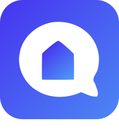
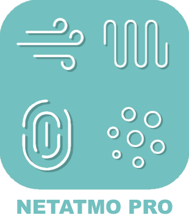

# Objets connectés

>**IMPORTANT**
>Seuls les plugins de contributeur ont leur documentation ici. Vous pouvez consulter les documentations des plugins officiels directement depuis le Market Jeedom. Une fois sur le plugin en question, cliquez sur documentation.
>Vous pouvez voir [ici](https://market.jeedom.com/index.php?v=d&p=market&type=plugin&categorie=devicecommunication) tous les plugins officiels de cette catégorie

| | | | |
|--- | --- | --- | ---|
||Bosch Indego|Plugin pour les robots de tonte Bosch Indego|[Documentation Stable](https://jpty.github.io/jeedom/plugins/BoschIndego/fr_FR/index.html) [Market](https://market.jeedom.com/index.php?v=d&p=market_display&id=3937) [Changelog Stable](https://jpty.github.io/jeedom/plugins/BoschIndego/fr_FR/changelog.html)|
||Mercedes Me|Plugin arrété car Mercedes arrête l'API BYOC: https://developer.mercedes-benz.com/news/bringyourowncar-sundown Plugin pour récuperer les informations de votre Mercedes.  Se base sur l'API officielle.|[Documentation Stable](https://mguyard.github.io/Jeedom-Documentations/fr_FR/Mercedes_me/documentation) - [Documentation Beta](https://mguyard.github.io/Jeedom-Documentations/fr_FR/Mercedes_me/documentation) [Market](https://market.jeedom.com/index.php?v=d&p=market_display&id=4046) [Changelog Stable](https://mguyard.github.io/Jeedom-Documentations/fr_FR/Mercedes_me/changelog) - [Changelog Beta](https://mguyard.github.io/Jeedom-Documentations/fr_FR/Mercedes_me/changelog)|
||AirthingsX|Intégration avec l'API Airthings: relève les mesures des équipement Airthings pour la qualité de l'air. Attention: requiert PHP 7.3 et une clé API Airthings à créer par vous-même (l'opération est gratuite).|[Documentation Stable](https://www.xypii.be/projects/jeedom-airthingsx/fr_FR/) [Market](https://market.jeedom.com/index.php?v=d&p=market_display&id=4268) [Changelog Stable]()|
||Alexa - SmartHome|Le plugin a été totalement refondu et relooké pour accepter les équipements que détecte l’application Alexa. Le lien mis en place par les plugins entre Jeedom et le serveur Amazon permet de remonter les états des équipements et de leur envoyer des commandes. Le lien entre le serveur Amazon (Alexa) et les équipements est quant à lui assuré par les skills de chaque fabriquant (Xiaomi, SmartLife, Tuya, Netatmo, Wemo, Somfy, eWelink,…) ce qui rend les possibilités totalement infinies.|[Documentation Stable](http://jeedom.sigalou-domotique.fr/alexa-amazon-smarthome-documentation) [Market](https://market.jeedom.com/index.php?v=d&p=market_display&id=3914) [Changelog Stable](http://jeedom.sigalou-domotique.fr/alexa-amazon-smarthome-changelog)|
||Arenti|Plugin permettant de récupérer toutes les informations et de piloter les appareils synchronisés sur l'API Arenti. Pour la visualisation du flux vidéo : création automatique d'un équipement caméra si vous avez le plugin caméra et que ONVIF a été activé sur l'appareil.|[Documentation Stable](https://flobul-domotique.fr/presentation-et-documentation-du-plugin-arenti-pour-jeedom/) - [Documentation Beta](https://flobul-domotique.fr/presentation-et-documentation-du-plugin-arenti-pour-jeedom/) [Market](https://market.jeedom.com/index.php?v=d&p=market_display&id=4420) [Changelog Stable](https://flobul-domotique.fr/liste-des-versions-du-plugin-arenti-pour-jeedom/) - [Changelog Beta](https://flobul-domotique.fr/liste-des-versions-du-plugin-arenti-pour-jeedom/)|
||FordCar|Plugin permettant de ce connecté à Ford Pass et à récuperrer toutes les information de votre Véhicule. Il permet de vérouiller/dévérouiller son véhicules et suivant les régions du monde, Démarrer son véhicule.|[Documentation Stable](https://cddu33.github.io/fordcar/fr_FR/) - [Documentation Beta](https://cddu33.github.io/fordcar/fr_FR/) [Market](https://market.jeedom.com/index.php?v=d&p=market_display&id=4319) [Changelog Stable](https://cddu33.github.io/fordcar/fr_FR/changelog) - [Changelog Beta](https://cddu33.github.io/fordcar/fr_FR/changelog_beta)|
||Govee|Plugin permettant de piloter les équipements Govee|[Documentation Stable](https://youdom.net/plugin-govee-with-youdom/) - [Documentation Beta](https://youdom.net/plugin-govee-with-youdom/) [Market](https://market.jeedom.com/index.php?v=d&p=market_display&id=4371) [Changelog Stable](https://youdom.net/plugin-govee-changelog/) - [Changelog Beta](https://youdom.net/plugin-govee-changelog/)|
||Home Connect|Plugin permettant de récupérer les informations des appareils électroménagers compatibles|[Documentation Stable](https://jmvedrine.github.io/homeconnect/fr_FR/) [Market](https://market.jeedom.com/index.php?v=d&p=market_display&id=3894) [Changelog Stable](https://jmvedrine.github.io/homeconnect/fr_FR/changelog)|
||Infos & Localisation|Gestion de la présence, de la géolocalisation et autres infos d'un téléphone|[Documentation Stable](https://jeremie-c.github.io/plugin-InfoLoc/fr_FR/index) [Market](https://market.jeedom.com/index.php?v=d&p=market_display&id=4020) [Changelog Stable](https://jeremie-c.github.io/plugin-InfoLoc/fr_FR/changelog)|
||iopool - EcO|Plugin Jeedom pour collecter les informations de la sonde <a href='https://iopool.com'>iopool</a> EcO depuis le Cloud iopool (API). Pour plus de détails, n'hésitez pas à consulter la documentation qui est très complète.|[Documentation Stable](https://mguyard.github.io/Jeedom-Documentations/fr_FR/iopool_EcO/documentation) - [Documentation Beta](https://mguyard.github.io/Jeedom-Documentations/fr_FR/iopool_EcO/documentation) [Market](https://market.jeedom.com/index.php?v=d&p=market_display&id=4189) [Changelog Stable](https://mguyard.github.io/Jeedom-Documentations/fr_FR/iopool_EcO/changelog) - [Changelog Beta](https://mguyard.github.io/Jeedom-Documentations/fr_FR/iopool_EcO/changelog)|
||Kia-UVO|Plugin de gestion des véhicules compatibles KIA-UVO|[Documentation Stable](https://neopix.github.io/jeedom-kiauvo-documentation/fr_FR) [Market](https://market.jeedom.com/index.php?v=d&p=market_display&id=4076) [Changelog Stable](https://neopix.github.io/jeedom-kiauvo-documentation/fr_FR/changelog)|
||iRobot|Plugin permettant de piloter les robots aspirateurs (Roomba) et laveurs de sols (Braava) de la marque iRobot.|[Documentation Stable](https://mips2648.github.io/jeedom-plugins-docs/kroomba/fr_FR/) - [Documentation Beta](https://mips2648.github.io/jeedom-plugins-docs/kroomba/fr_FR/) [Market](https://market.jeedom.com/index.php?v=d&p=market_display&id=2776) [Changelog Stable](https://mips2648.github.io/jeedom-plugins-docs/kroomba/fr_FR/changelog) - [Changelog Beta](https://mips2648.github.io/jeedom-plugins-docs/kroomba/fr_FR/changelog)|
||LG Smart Thinq|Plugin pour les Objets Connectés de la marque LG compatibles 'Smart Thinq APIv1'|[Documentation Stable](https://pifou25.github.io/jeedom-lgthinq-plugin/fr_FR/) - [Documentation Beta](https://pifou25.github.io/jeedom-lgthinq-plugin/fr_FR/index_beta) [Market](https://market.jeedom.com/index.php?v=d&p=market_display&id=4080) [Changelog Stable](https://pifou25.github.io/jeedom-lgthinq-plugin/fr_FR/changelog) - [Changelog Beta](https://pifou25.github.io/jeedom-lgthinq-plugin/fr_FR/changelog_beta)|
||LG ThinQ|Plugin permettant de récupérer les informations et de piloter les appareils synchronisés sur l'API LG ThinQ|[Documentation Stable](https://flobul-domotique.fr/presentation-et-documentation-du-plugin-lgthinq2-pour-jeedom/) [Market](https://market.jeedom.com/index.php?v=d&p=market_display&id=4485) [Changelog Stable](https://flobul-domotique.fr/liste-des-versions-du-plugin-lgthinq2-pour-jeedom/)|
||Miele|Plugin permettant d'intégrer tous les appareils de la gamme Miele@Home. Il est possible d'accéder aux données des appareils, de les monitorer et d'effectuer certaine actions (en fonction de l'appareil)|[Documentation Stable](https://mips2648.github.io/jeedom-plugins-docs/miele/fr_FR/) [Market](https://market.jeedom.com/index.php?v=d&p=market_display&id=3950) [Changelog Stable](https://mips2648.github.io/jeedom-plugins-docs/miele/fr_FR/changelog)|
||Netatmo Pro|Intégration de l'univers Netatmo|[Documentation Stable](https://thanaus.github.io/jeedom_docs/plugins/netatmopro/fr_FR/) - [Documentation Beta](https://thanaus.github.io/jeedom_docs/plugins/netatmopro/fr_FR/) [Market](https://market.jeedom.com/index.php?v=d&p=market_display&id=2950) [Changelog Stable](https://thanaus.github.io/jeedom_docs/plugins/netatmopro/fr_FR/changelog) - [Changelog Beta](https://thanaus.github.io/jeedom_docs/plugins/netatmopro/fr_FR/changelog)|
||Netro arrosage|Plugin basé sur le système d'arrosage automatique Netro Smart Garden|[Documentation Stable](https://kcofoni.github.io/jeedom-docs/plugin-netroarrosage/docs/fr_FR/) - [Documentation Beta](https://kcofoni.github.io/jeedom-docs/plugin-netroarrosage/docs/fr_FR/beta/) [Market](https://market.jeedom.com/index.php?v=d&p=market_display&id=4354) [Changelog Stable](https://kcofoni.github.io/jeedom-docs/plugin-netroarrosage/docs/fr_FR/changelog) - [Changelog Beta](https://kcofoni.github.io/jeedom-docs/plugin-netroarrosage/docs/fr_FR/beta/changelog)|
||SmartThings|Ce plugin permet de créer un équipement pour chaque appareil identifié sur son compte SmartThings. La communication se fait uniquement par l'API SmartThings, aucune connexion directe entre Jeedom et l'appareil n'est réalisée. Les commandes générées lors de la synchronisation dépendent de l'appareil (chaque appareil fournit sa liste de commandes), elles dépendent aussi de l'informations remontée via l'API (si la valeur est 'null', la commande n'est pas créée car non mise à jour via l'API ou non gérée). J'ai tout de même laissé une option pour créer l'ensemble des commandes au cas où. Les commandes disponibles varient et peuvent être très nombreuses : afficher l'état de l'appareil, son programme, l'allumer/l'éteindre, changer de chaîne, lancer une programme... J'ai implémenté un widget pour les appareils les plus communs, pour les autres, libre à vous de créer le vôtre, et pourquoi pas le partager.|[Documentation Stable](https://flobul-domotique.fr/documentation-du-plugin-smartthings-pour-jeedom) [Market](https://market.jeedom.com/index.php?v=d&p=market_display&id=4099) [Changelog Stable](https://flobul-domotique.fr/liste-des-versions-du-plugin-smartthings-pour-jeedom/)|
||Sure PetCare|Plugin pour les objets connectées pour animaux Sure Petcare (Sureflap)|[Documentation Stable](https://jmvedrine.github.io/jeedom-surepetcare/fr_FR/) [Market](https://market.jeedom.com/index.php?v=d&p=market_display&id=3718) [Changelog Stable](https://jmvedrine.github.io/jeedom-surepetcare/fr_FR/changelog)|
||Switchbotcloud|Ce plugin permet de piloter les équipements Switchbot via Jeedom.|[Documentation Stable](https://jeremyarnoux.github.io/jeedom/plugins/switchbotcloud/index.html) [Market](https://market.jeedom.com/index.php?v=d&p=market_display&id=4369) [Changelog Stable](https://jeremyarnoux.github.io/jeedom/plugins/switchbotcloud/changelog.html)|
||Tesla|Plugin pour monitorer une Tesla. Accédez à votre Tesla depuis Jeedom et contrôlez le chauffage, la charge, les fênetres, ... depuis des scénarios. Ce plugin contient également un outil de tracking qui permet de suivre l'historique de vos trajets, de vos charges et de vos temps de parking. Retrouvez les statistiques du trajets en cours. Définissez des favoris sur la carte avec un rayon d'action et lorsque votre Tesla entre ou sort de ce favoris, déclenchez des scénarios, ... Faites de votre Tesla un objet connecté ! Pas de Cloud, vos données sont stockées chez vous. Pas d'abonnement, pas de frais supplémentaires|[Documentation Stable](http://tesla.jeedom.free.fr/documentation) - [Documentation Beta](http://tesla.jeedom.free.fr/documentation) [Market](https://market.jeedom.com/index.php?v=d&p=market_display&id=3486) [Changelog Stable](http://tesla.jeedom.free.fr/changelog) - [Changelog Beta](http://tesla.jeedom.free.fr/changelog)|
||Velux|Plugin permettant de coordonner les mouvements d'une fenêtre et d'un volet roulant Velux.   Attention ce plugin nécessite le plugin hkControl!|[Documentation Stable](https://ktn001.github.io/fr_FR/velux/) - [Documentation Beta](https://ktn001.github.io/fr_FR/velux/beta.html) [Market](https://market.jeedom.com/index.php?v=d&p=market_display&id=4453) [Changelog Stable](https://ktn001.github.io/fr_FR/velux/changelog) - [Changelog Beta](https://ktn001.github.io/fr_FR/velux/changelog)|
||VeSync|Plugin permettant de récupérer les informations et de piloter les appareils synchronisés sur l'API VeSync|[Documentation Stable](https://flobul-domotique.fr/presentation-et-documentation-du-plugin-vesync-pour-jeedom/) - [Documentation Beta](https://flobul-domotique.fr/presentation-et-documentation-du-plugin-vesync-pour-jeedom/) [Market](https://market.jeedom.com/index.php?v=d&p=market_display&id=4362) [Changelog Stable](https://flobul-domotique.fr/liste-des-versions-du-plugin-vesync-pour-jeedom/) - [Changelog Beta](https://flobul-domotique.fr/liste-des-versions-du-plugin-vesync-pour-jeedom/)|
||Wall|Plugin pour la gestion des tablettes|[Documentation Stable](https://barre35.github.io/jeedom-plugin-doc/fr_FR/wall_documentation) [Market](https://market.jeedom.com/index.php?v=d&p=market_display&id=3634) [Changelog Stable](https://barre35.github.io/jeedom-plugin-doc/fr_FR/wall_changelog)|
||wifilightV2|Pilote de nombreux périphériques wifi en local avec internet coupé : lampes, leds, prises, interrupteurs, thermostat, de marques diverses. Tapo, Kasa, Govee, Philips Wiz, Meross, Mystrom, MagicHome, Gateway Tuya/Zigbee dont SilverCrest Lidl, Smartlife, Tuya, Ewelink, Sonoff, Sonoff DIY, Mi.Light (Milight), Yeelight, Xiaomi Philips, TP-Link, Nanoleaf, H801, iHomma, arilux, Revogi, etc. Consulter la documentation pour connaitre la liste exacte des matériels compatibles.|[Documentation Stable](https://bcaro.github.io/wifilightV2-doc/fr_FR/) - [Documentation Beta](https://bcaro.github.io/wifilightV2-doc/fr_FR/) [Market](https://market.jeedom.com/index.php?v=d&p=market_display&id=2793) [Changelog Stable](https://bcaro.github.io/wifilightV2-doc/fr_FR/changelog) - [Changelog Beta](https://bcaro.github.io/wifilightV2-doc/fr_FR/changelog)|
||worxLandroidS|Plugin Jeedom pour Robots tondeuses Worx Landroid modèles S/M/L version cloud|[Documentation Stable](https://mips2648.github.io/jeedom-plugins-docs/worxLandroidS/fr_FR/) - [Documentation Beta](https://mips2648.github.io/jeedom-plugins-docs/worxLandroidS/fr_FR/) [Market](https://market.jeedom.com/index.php?v=d&p=market_display&id=3396) [Changelog Stable](https://mips2648.github.io/jeedom-plugins-docs/worxLandroidS/fr_FR/changelog) - [Changelog Beta](https://mips2648.github.io/jeedom-plugins-docs/worxLandroidS/fr_FR/changelog)|
