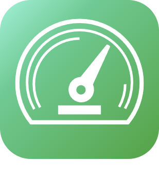

# Energie

>**IMPORTANT**
>Seuls les plugins de contributeur ont leur documentation ici. Vous pouvez consulter les documentations des plugins officiels directement depuis le Market Jeedom. Une fois sur le plugin en question, cliquez sur documentation.
>Vous pouvez voir [ici](https://market.jeedom.com/index.php?v=d&p=market&type=plugin&categorie=energy) tous les plugins officiels de cette catégorie

| | | | |
|--- | --- | --- | ---|
||EcogazSync|Plugin pour se connecter à l'API Ecogaz.|[Documentation Stable](https://github.com/impulsio/EcogazSync/blob/main/docs/fr_FR/index.md) - [Documentation Beta](https://github.com/impulsio/EcogazSync/blob/beta/docs/fr_FR/index.md) [Market](https://market.jeedom.com/index.php?v=d&p=market_display&id=4347) [Changelog Stable](https://github.com/impulsio/EcogazSync/blob/main/docs/fr_FR/changelog.md) - [Changelog Beta](https://github.com/impulsio/EcogazSync/blob/beta/docs/fr_FR/changelog.md)|
||RteSync|Plugin pour se connecter à l'API RTE. Pour le moment seule l'API Ecowatt est disponible. Merci de suivre la documentation pour la configuration. [Documentation](https://github.com/impulsio/RteSync/blob/beta/docs/fr_FR/index.md)|[Documentation Stable](https://github.com/impulsio/RteSync/blob/main/docs/fr_FR/index.md) - [Documentation Beta](https://github.com/impulsio/RteSync/blob/beta/docs/fr_FR/index.md) [Market](https://market.jeedom.com/index.php?v=d&p=market_display&id=4338) [Changelog Stable](https://github.com/impulsio/RteSync/blob/main/docs/fr_FR/changelog.md) - [Changelog Beta](https://github.com/impulsio/RteSync/blob/beta/docs/fr_FR/changelog.md)|
||APSystems ECU|Plugin récupérant les données d'un ECU d'APSystems dans Jeedom. Il récupère les informations sur l'ECU, les micro-onduleurs, la puissance générée par module, les tensions, les températures...|[Documentation Stable](https://nchoiset.github.io/jeedom-plugins-doc/aps_ecu/fr_FR/index) - [Documentation Beta](https://nchoiset.github.io/jeedom-plugins-doc/aps_ecu/fr_FR/beta/index) [Market](https://market.jeedom.com/index.php?v=d&p=market_display&id=4318) [Changelog Stable](https://nchoiset.github.io/jeedom-plugins-doc/aps_ecu/fr_FR/changelog) - [Changelog Beta](https://nchoiset.github.io/jeedom-plugins-doc/aps_ecu/fr_FR/beta/changelog)|
||Autoconsommation|Plugin pour allumer et etteindre des autres équipements Jeedom afin d'optimiser l'autoconsommation électrique (dans le cas d'une installation photovoltaïque)|[Documentation Stable](https://bwibwi13.github.io/plugin-autoconso/fr_FR) [Market](https://market.jeedom.com/index.php?v=d&p=market_display&id=4322) [Changelog Stable](https://bwibwi13.github.io/plugin-autoconso/fr_FR/changelog)|
||Beem|Plugin permettant de récupérer les informations sa Beembox de chez Beem energy|[Documentation Stable](https://flobul-domotique.fr/presentation-et-documentation-du-plugin-beem-pour-jeedom/) - [Documentation Beta](https://flobul-domotique.fr/presentation-et-documentation-du-plugin-beem-pour-jeedom/) [Market](https://market.jeedom.com/index.php?v=d&p=market_display&id=4337) [Changelog Stable](https://flobul-domotique.fr/liste-des-versions-du-plugin-beem-pour-jeedom/) - [Changelog Beta](https://flobul-domotique.fr/liste-des-versions-du-plugin-beem-pour-jeedom/)|
||Suivi Conso|Plugin pour gérer sa consommation énergétique (gaz, électricité et eau) ainsi que sa production |[Documentation Stable](https://mickeys27.github.io/Docs/conso/fr_FR/) [Market](https://market.jeedom.com/index.php?v=d&p=market_display&id=1805) [Changelog Stable](https://mickeys27.github.io/Docs/conso/fr_FR/changelog)|
||eeSmart|Plugin pour récupérer les données que le module ERL D2L d'eeSmart envoie sur le serveur suivi.consopy.|[Documentation Stable](https://caelion.github.io/jeedom-plugins-documentation/eeSmart/fr_FR/) [Market](https://market.jeedom.com/index.php?v=d&p=market_display&id=3933) [Changelog Stable](https://caelion.github.io/jeedom-plugins-documentation/eeSmart/fr_FR/changelog)|
||Fullup|Plugin permettant la lecture des données des jauges connectées Fullup. Le plugin actualise les données toutes les heures via un cron.|[Documentation Stable](https://mips2648.github.io/jeedom-plugins-docs/fullup/fr_FR/) [Market](https://market.jeedom.com/index.php?v=d&p=market_display&id=3445) [Changelog Stable](https://mips2648.github.io/jeedom-plugins-docs/fullup/fr_FR/changelog)|
||GRDF Connect|Récupérer les informations de comptage gaz à partir de son compte-client GRDF .|[Documentation Stable](https://limad.github.io/plugins-docs/plugin-grdfConnect/fr_FR) - [Documentation Beta](https://limad.github.io/plugins-docs/plugin-grdfConnect/fr_FR) [Market](https://market.jeedom.com/index.php?v=d&p=market_display&id=4381) [Changelog Stable](https://limad.github.io/plugins-docs/plugin-grdfConnect/fr_FR/changelog) - [Changelog Beta](https://limad.github.io/plugins-docs/plugin-grdfConnect/fr_FR/changelog)|
||Hydro Québec|Plugin permettant de récupérer les informations de consommation électrique d'Hydro-Québec (wwww.hydroquebec.com), et de créer des crons en fonction des événements|[Documentation Stable](http://fobsoft.github.io/jeedom-plugins-documentation/hydroQuebec/fr_FR) - [Documentation Beta](http://fobsoft.github.io/jeedom-plugins-documentation/hydroQuebec/fr_FR) [Market](https://market.jeedom.com/index.php?v=d&p=market_display&id=4243) [Changelog Stable](http://fobsoft.github.io/jeedom-plugins-documentation/hydroQuebec/fr_FR/changelog) - [Changelog Beta](http://fobsoft.github.io/jeedom-plugins-documentation/hydroQuebec/fr_FR/changelog)|
||IoTaWatt|Plugin permettant de récupérer les informations sa box IoTaWatt. IoTaWatt est un projet à code source ouvert et à matériel ouvert visant à produire un moniteur d'énergie précis, peu coûteux et facile à utiliser. Il peut utiliser plusieures dizaines de transformateurs de courant banals et transmettra les données localement via un serveur web intégré, ou les téléchargera vers n'importe lequel des sites web/bases de données énergétiques tiers.|[Documentation Stable](https://flobul-domotique.fr/presentation-et-documentation-du-plugin-iotawatt-pour-jeedom/) - [Documentation Beta](https://flobul-domotique.fr/presentation-et-documentation-du-plugin-iotawatt-pour-jeedom/) [Market](https://market.jeedom.com/index.php?v=d&p=market_display&id=4399) [Changelog Stable](https://flobul-domotique.fr/liste-des-versions-du-plugin-iotawatt-pour-jeedom/) - [Changelog Beta](https://flobul-domotique.fr/liste-des-versions-du-plugin-iotawatt-pour-jeedom/)|
||Solaredge|Plugin permettant la lecture de données d'un onduleur de panneaux photovoltaïque de la marque Solaredge.|[Documentation Stable](https://mips2648.github.io/jeedom-plugins-docs/onduleursolaredge/fr_FR/) [Market](https://market.jeedom.com/index.php?v=d&p=market_display&id=3440) [Changelog Stable](https://mips2648.github.io/jeedom-plugins-docs/onduleursolaredge/fr_FR/changelog)|
||Tesla Powerwall|Plugin pour monitorer un Powerwall Tesla. Propose un widget image qui donne une vue synthétique des échanges de flux d'électrons entre les différents éléments du système.|[Documentation Stable](https://vercorsio.github.io/jeedom-powerwall-plugin/fr_FR/) - [Documentation Beta](https://vercorsio.github.io/jeedom-powerwall-plugin/fr_FR/) [Market](https://market.jeedom.com/index.php?v=d&p=market_display&id=4377) [Changelog Stable](https://vercorsio.github.io/jeedom-powerwall-plugin/fr_FR/changelog) - [Changelog Beta](https://vercorsio.github.io/jeedom-powerwall-plugin/fr_FR/changelog)|
||Production Energie|L’autoconsommation est le but dans la production d’énergie. Ce plugin est là pour vous y aider en contrôlant les activations|[Documentation Stable](http://mika-nt28.github.io/Documentations/prosommateur/fr_FR) [Market](https://market.jeedom.com/index.php?v=d&p=market_display&id=3829) [Changelog Stable](https://mika-nt28.github.io/Documentations/prosommateur/fr_FR/changelog)|
||Suivi CO2|Plugin pour le suivi des émissions CO2 liées à sa consommation électrique, de gaz, fioul ou autre|[Documentation Stable](https://agp42.github.io/suiviCO2/fr_FR) [Market](https://market.jeedom.com/index.php?v=d&p=market_display&id=3929) [Changelog Stable](https://agp42.github.io/suiviCO2/fr_FR/changelog)|
||Veolia Pro|Information sur la consommation d'eau (compteur communicant) depuis le site "Veolia & moi - Eau". Pour information, le site "Mon eau & Moi" sera très prochainement intégré au plugin.|[Documentation Stable](https://thanaus.github.io/jeedom_docs/plugins/veoliapro/fr_FR/) - [Documentation Beta](https://thanaus.github.io/jeedom_docs/plugins/veoliapro/fr_FR/) [Market](https://market.jeedom.com/index.php?v=d&p=market_display&id=4331) [Changelog Stable](https://thanaus.github.io/jeedom_docs/plugins/veoliapro/fr_FR/changelog) - [Changelog Beta](https://thanaus.github.io/jeedom_docs/plugins/veoliapro/fr_FR/changelog)|
