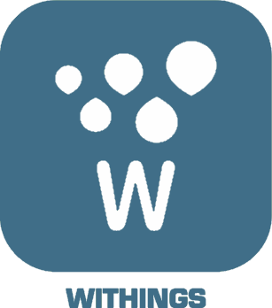

# Santé

>**IMPORTANT**
>Seuls les plugins de contributeur ont leur documentation ici. Vous pouvez consulter les documentations des plugins officiels directement depuis le Market Jeedom. Une fois sur le plugin en question, cliquez sur documentation.
>Vous pouvez voir [ici](https://market.jeedom.com/index.php?v=d&p=market&type=plugin&categorie=health) tous les plugins officiels de cette catégorie

| | | | |
|--- | --- | --- | ---|
||Withings / Nokia|Recuperer vos informations de santé sur le cloud Nokia|[Documentation Stable](http://mika-nt28.github.io/Documentations/withings/fr_FR) [Market](https://market.jeedom.com/index.php?v=d&p=market_display&id=3400) [Changelog Stable](https://mika-nt28.github.io/Documentations/withings/fr_FR/changelog)|
