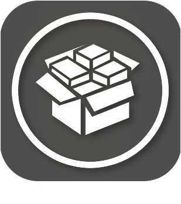
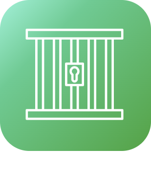
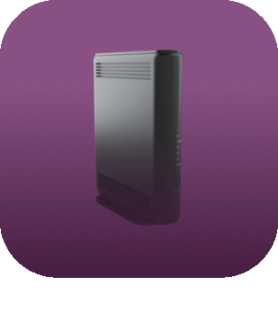

# Monitoring

>**IMPORTANT**
>Seuls les plugins de contributeur ont leur documentation ici. Vous pouvez consulter les documentations des plugins officiels directement depuis le Market Jeedom. Une fois sur le plugin en question, cliquez sur documentation.
>Vous pouvez voir [ici](https://market.jeedom.com/index.php?v=d&p=market&type=plugin&categorie=monitoring) tous les plugins officiels de cette catégorie

| | | | |
|--- | --- | --- | ---|
||AdGuard Home|Plugin permettant d'activer ou désactiver votre serveur AdGuard Home. De gérer les clients Et beaucoup plus !!|[Documentation Stable](https://nebzhb.github.io/jeedom_docs/plugins/AdGuard/fr_FR/) - [Documentation Beta](https://nebzhb.github.io/jeedom_docs/plugins/AdGuard/fr_FR/) [Market](https://market.jeedom.com/index.php?v=d&p=market_display&id=4196) [Changelog Stable](https://nebzhb.github.io/jeedom_docs/plugins/AdGuard/fr_FR/changelog) - [Changelog Beta](https://nebzhb.github.io/jeedom_docs/plugins/AdGuard/fr_FR/changelog)|
||Jailbreak|Ce plugin s’adresse à tous les iPad et iPhone retrouvés dans les placards et tiroirs, qui ont pris la poussière, que l’on a oubliés ou délaissés. Il permet d'intéragir avec Jeedom pour remonter des informations, lancer Application, exécuter des actions... Plus d'informations sur la présentation du plugin : https://flobul-domotique.fr/presentation-du-plugin-jailbreak-pour-jeedom/|[Documentation Stable](https://flobul-domotique.fr/documentation-du-plugin-jailbreak-pour-jeedom/) [Market](https://market.jeedom.com/index.php?v=d&p=market_display&id=3928) [Changelog Stable](https://flobul-domotique.fr/liste-des-versions-du-plugin-jailbreak-pour-jeedom/)|
||APSEZ1M|Plugin permettant le pilotage et la récupération des informations de Micro-Onduleurs APSystem EZ1-M. Récupération de la puissance par panneau, globale, etc|[Documentation Stable](https://taggou91.github.io/jeedom_docs/plugins/aps-ez1m/fr_FR/) [Market](https://market.jeedom.com/index.php?v=d&p=market_display&id=4477) [Changelog Stable](https://taggou91.github.io/jeedom_docs/plugins/aps-ez1m/changelog.html)|
||Défauts|Surveillance de cohérence état/mesure|[Documentation Stable](https://ktn001.github.io/fr_FR/defauts/index.html) [Market](https://market.jeedom.com/index.php?v=d&p=market_display&id=4147) [Changelog Stable](https://ktn001.github.io/fr_FR/defauts/changelog.html)|
||fail2ban|Plugin pour monitorer fail2ban. Il permet de remonter toutes les infos instantanées d'une instance de fail2ban locale ou distante (via SSH) mais il garde également des compteurs journaliers des ip bloquées ainsi qu'un compteur pour pays d'origine (pays récupéré par géolocalisation de l'adresse IP). Il permet également de bannir et de débannir une adresse ip.|[Documentation Stable](https://mips2648.github.io/jeedom-plugins-docs/fail2ban/fr_FR/) - [Documentation Beta](https://mips2648.github.io/jeedom-plugins-docs/fail2ban/fr_FR/) [Market](https://market.jeedom.com/index.php?v=d&p=market_display&id=4439) [Changelog Stable](https://mips2648.github.io/jeedom-plugins-docs/fail2ban/fr_FR/changelog) - [Changelog Beta](https://mips2648.github.io/jeedom-plugins-docs/fail2ban/fr_FR/changelog)|
||fullyKiosK|Plugin fullyKiosK pour la gestion des tablettes utilisant l'application fullykiosk|[Documentation Stable](https://sebsst.github.io/fullyKiosK/fr_FR/) [Market](https://market.jeedom.com/index.php?v=d&p=market_display&id=3406) [Changelog Stable](https://sebsst.github.io/fullyKiosK/fr_FR/changelog)|
||Fully KiosK|Plugin FullyKiosK pour la gestion des tablettes utilisant l'application fullykiosk|[Documentation Stable](https://vegeta0911.github.io/fully_kiosk/) [Market](https://market.jeedom.com/index.php?v=d&p=market_display&id=4528) [Changelog Stable](https://vegeta0911.github.io/fully_kiosk/changelog.html)|
||Gain Market|Récupère votre solde sur le market Jeedom (en tant que développeur) et peut vous alerter lorsqu'il évolue ou que le paiement Jeedom est détecté|[Documentation Stable](https://frixo3190.github.io/jeedom_plugins/gain_market/docs/fr_FR/) [Market](https://market.jeedom.com/index.php?v=d&p=market_display&id=4228) [Changelog Stable](https://frixo3190.github.io/jeedom_plugins/gain_market/docs/fr_FR/#changelog)|
||Ha-Bridge|Ce plugin permet l'utilisation d'un serveur Ha-Bridge. Grâce à lui vous pourrez utiliser tous vos équipements ALEXA pour piloter votre domotique d'une simple commande vocale.|[Documentation Stable](https://www.domlabs.fr/jeedom_docs/haBridge/fr-FR/) [Market](https://market.jeedom.com/index.php?v=d&p=market_display&id=4045) [Changelog Stable](https://www.domlabs.fr/jeedom_docs/haBridge/fr-FR/)|
||Hard Disk Sentinel|Ce plugin permet de récuperer les informations de santé de ses disques durs grâce à l'outil linux Hard Disk Sentinel.|[Documentation Stable](https://flobul-domotique.fr/presentation-et-documentation-du-plugin-hdsentinel-pour-jeedom/) [Market](https://market.jeedom.com/index.php?v=d&p=market_display&id=4247) [Changelog Stable](https://flobul-domotique.fr/liste-des-versions-du-plugin-hdsentinel-pour-jeedom/)|
||InfluxDB|Plugin permettant la connexion à une DB InfluxDB v1 ou v2. Il permet d'envoyer facilement les informations voulues en sélectionnant simplement les commandes correspondantes dans une liste ce qui permet d'externaliser l'historique qui peut ensuite être consulté via Grafana par exemple.|[Documentation Stable](https://mips2648.github.io/jeedom-plugins-docs/influxdb/fr_FR/) - [Documentation Beta](https://mips2648.github.io/jeedom-plugins-docs/influxdb/fr_FR/) [Market](https://market.jeedom.com/index.php?v=d&p=market_display&id=3935) [Changelog Stable](https://mips2648.github.io/jeedom-plugins-docs/influxdb/fr_FR/changelog) - [Changelog Beta](https://mips2648.github.io/jeedom-plugins-docs/influxdb/fr_FR/changelog)|
||JeeLog|Plugin de journalisation d’activité pour les équipements, scénarios, et fichiers log|[Documentation Stable](https://kiboost.github.io/jeedom_docs/plugins/jeelog/fr_FR/) [Market](https://market.jeedom.com/index.php?v=d&p=market_display&id=3362) [Changelog Stable](https://kiboost.github.io/jeedom_docs/plugins/jeelog/fr_FR/changelog.html)|
||Monitor sensors|Ce plugin va vous permettre de garder un oeil sur l'ensemble de vos capteurs (Z-Wave , EnOcean, ZigBee) afin de vérifier leur santé, leur portée , leur dernier message recu , etc . le tout synthétisé dans un tableau, des alertes en cas de défaillance ! Surveillance aussi toute particulière du réseau Z-Wave (Queue, Status). Surveillance du status des Daemons de tous les plugins.|[Documentation Stable](https://frixo3190.github.io/jeedom_plugins/monitor_sensors/docs/fr_FR/) [Market](https://market.jeedom.com/index.php?v=d&p=market_display&id=4207) [Changelog Stable](https://frixo3190.github.io/jeedom_plugins/monitor_sensors/docs/fr_FR/#changelog)|
||No-Ip Renew|Ce plugin permet de renouveler automatiquement vos noms de domaines gratuits no-ip.com (opération à faire tous les 30 jours manuellement sinon).|[Documentation Stable](https://tomitomas.github.io/jeedom_doc/NoIp/fr_FR/) - [Documentation Beta](https://tomitomas.github.io/jeedom_doc/NoIp/fr_FR/) [Market](https://market.jeedom.com/index.php?v=d&p=market_display&id=4112) [Changelog Stable](https://tomitomas.github.io/jeedom_doc/NoIp/fr_FR/changelog) - [Changelog Beta](https://tomitomas.github.io/jeedom_doc/NoIp/fr_FR/changelog_beta)|
||piHole|Plugin permettant d'activer ou désactiver votre serveur pi-Hole. Un interrupteur pour le désactiver et quelques chiffres, laissez-moi savoir si vous avez besoin de plus (en fonction de ce que l'API permet)|[Documentation Stable](https://nebzhb.github.io/plugin-piHole/fr_FR/) - [Documentation Beta](https://nebzhb.github.io/plugin-piHole/fr_FR/) [Market](https://market.jeedom.com/index.php?v=d&p=market_display&id=3420) [Changelog Stable](https://nebzhb.github.io/plugin-piHole/fr_FR/changelog) - [Changelog Beta](https://nebzhb.github.io/plugin-piHole/fr_FR/changelog)|
||Portainer|Plugin permettant la connexion à Portainer.io, un outils de gestion de dockers, et donc de gérer vos dockers et containers sur Jeedom.|[Documentation Stable](https://mips2648.github.io/jeedom-plugins-docs/portainer/fr_FR/) - [Documentation Beta](https://mips2648.github.io/jeedom-plugins-docs/portainer/fr_FR/) [Market](https://market.jeedom.com/index.php?v=d&p=market_display&id=3931) [Changelog Stable](https://mips2648.github.io/jeedom-plugins-docs/portainer/fr_FR/changelog) - [Changelog Beta](https://mips2648.github.io/jeedom-plugins-docs/portainer/fr_FR/changelog)|
||Proxmox|Plugin permettant la gestion d'un serveur Proxmox. Il est possible de récupérer toutes les ressources (noeuds, machine virtuelles, stockage...) et toutes leurs propriétés (statut, mémoire, CPU, disque, adresse IP, temps d'activité, list des snapshots...). Le plugin permet aussi de démarrer et arrêter les VMs et les containers ainsi que de prendre des snapshots et des backups. Il dispose également d'une page santé spécifique résumant l'ensemble des informations de vos équipements.|[Documentation Stable](https://mips2648.github.io/jeedom-plugins-docs/proxmox/fr_FR/) - [Documentation Beta](https://mips2648.github.io/jeedom-plugins-docs/proxmox/fr_FR/) [Market](https://market.jeedom.com/index.php?v=d&p=market_display&id=3835) [Changelog Stable](https://mips2648.github.io/jeedom-plugins-docs/proxmox/fr_FR/changelog) - [Changelog Beta](https://mips2648.github.io/jeedom-plugins-docs/proxmox/fr_FR/changelog)|
||sfrBox|Plugin pour contrôler sfr/neuf box|[Documentation Stable](https://limad.github.io/plugins-docs/plugin-sfrBox/) [Market](https://market.jeedom.com/index.php?v=d&p=market_display&id=3752) [Changelog Stable](https://limad.github.io/plugins-docs/plugin-sfrBox/fr_FR/changelog.html)|
||Solax Cloud|Plugin permettant de récupérer les infos des onduleurs Solax via Solax Cloud|[Documentation Stable](https://phroc.github.io/Jeedom_Solaxcloud/fr_FR/) [Market](https://market.jeedom.com/index.php?v=d&p=market_display&id=4049) [Changelog Stable](https://phroc.github.io/Jeedom_Solaxcloud/fr_FR/changelog)|
||Speedtest by Ookla|Ce plugin permet de tester la bande passante internet à l'aide de https://www.speedtest.net|[Documentation Stable](https://spine34.github.io/jeedom-plugin-speedtestByOokla/fr_FR/) - [Documentation Beta](https://spine34.github.io/jeedom-plugin-speedtestByOokla/fr_FR/beta/) [Market](https://market.jeedom.com/index.php?v=d&p=market_display&id=4345) [Changelog Stable](https://spine34.github.io/jeedom-plugin-speedtestByOokla/fr_FR/changelog) - [Changelog Beta](https://spine34.github.io/jeedom-plugin-speedtestByOokla/fr_FR/beta/changelog)|
||Unifi Network|Unifi Network - Connexion à un controleur Unifi Network. Permet certaines actions (Localiser, Gérer LED du site, Mise à jour Firmware, PowerCycle/Activation/Désactivation POE sur switchs, Activation/Désactivation/Reboot des Point d'accès, Activation/Désactivation des WLAN, Bloquer/Débloquer/Gestion présence des clients WiFi, etc)  N'a pas la vocation de remplacer l'interface du controleur  Non supporté : Unifi Access & Unifi VOIP|[Documentation Stable](https://nebzhb.github.io/jeedom_docs/plugins/unifi/fr_FR/) - [Documentation Beta](https://nebzhb.github.io/jeedom_docs/plugins/unifi/fr_FR/) [Market](https://market.jeedom.com/index.php?v=d&p=market_display&id=3433) [Changelog Stable](https://nebzhb.github.io/jeedom_docs/plugins/unifi/fr_FR/changelog) - [Changelog Beta](https://nebzhb.github.io/jeedom_docs/plugins/unifi/fr_FR/changelog)|
