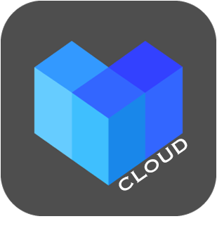
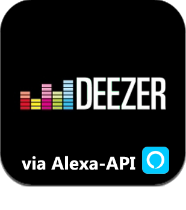
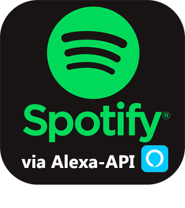

# Multimédia

>**IMPORTANT**
>Seuls les plugins de contributeur ont leur documentation ici. Vous pouvez consulter les documentations des plugins officiels directement depuis le Market Jeedom. Une fois sur le plugin en question, cliquez sur documentation.
>Vous pouvez voir [ici](https://market.jeedom.com/index.php?v=d&p=market&type=plugin&categorie=multimedia) tous les plugins officiels de cette catégorie

| | | | |
|--- | --- | --- | ---|
||Creality Cloud|Plugin permettant de récupérer les informations depuis son compte Creality Cloud et de piloter son imprimante.|[Documentation Stable](https://flobul-domotique.fr/presentation-et-documentation-du-plugin-creality-cloud-pour-jeedom/) [Market](https://market.jeedom.com/index.php?v=d&p=market_display&id=4219) [Changelog Stable](https://flobul-domotique.fr/liste-des-versions-du-plugin-creality-cloud-pour-jeedom/)|
||Alexa - Amazon Music|Interface Amazon Music|[Documentation Stable](http://jeedom.sigalou-domotique.fr/alexa-amazon-music-documentation) [Market](https://market.jeedom.com/index.php?v=d&p=market_display&id=3910) [Changelog Stable](http://jeedom.sigalou-domotique.fr/alexa-api-changelog)|
||Alexa - Deezer|Interface Deezer|[Documentation Stable](http://jeedom.sigalou-domotique.fr/alexa-deezer-documentation) [Market](https://market.jeedom.com/index.php?v=d&p=market_display&id=3911) [Changelog Stable](http://jeedom.sigalou-domotique.fr/alexa-api-changelog)|
||Alexa - Fire TV|Plugin pour interface Fire TV|[Documentation Stable](http://jeedom.sigalou-domotique.fr/alexa-fire-tv-documentation) [Market](https://market.jeedom.com/index.php?v=d&p=market_display&id=4064) [Changelog Stable](http://jeedom.sigalou-domotique.fr/alexa-api-changelog)|
||Alexa - Spotify|Interface Spotify|[Documentation Stable](http://jeedom.sigalou-domotique.fr/alexa-spotify-documentation) [Market](https://market.jeedom.com/index.php?v=d&p=market_display&id=3913) [Changelog Stable](http://jeedom.sigalou-domotique.fr/alexa-api-changelog)|
||HomepTalk|TTS vers un Apple HomePod  Ajoutez un Apple HomePod ou HomePod Mini et faites-le parler !|[Documentation Stable](https://nebzhb.github.io/jeedom_docs/plugins/homepTalk/fr_FR/) - [Documentation Beta](https://nebzhb.github.io/jeedom_docs/plugins/homepTalk/fr_FR/) [Market](https://market.jeedom.com/index.php?v=d&p=market_display&id=3825) [Changelog Stable](https://nebzhb.github.io/jeedom_docs/plugins/homepTalk/fr_FR/changelog) - [Changelog Beta](https://nebzhb.github.io/jeedom_docs/plugins/homepTalk/fr_FR/changelog)|
||Spotify|Plugin pour le pilotage spotify connect|[Documentation Stable](https://barre35.github.io/jeedom-plugin-doc/fr_FR/spotify_documentation) [Market](https://market.jeedom.com/index.php?v=d&p=market_display&id=3700) [Changelog Stable](https://barre35.github.io/jeedom-plugin-doc/fr_FR/spotify_changelog)|
