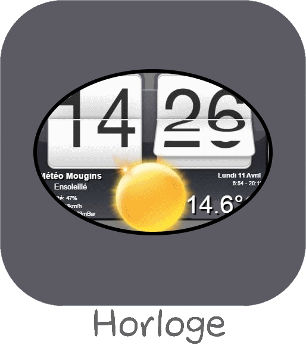

# Météo

>**IMPORTANT**
>Seuls les plugins de contributeur ont leur documentation ici. Vous pouvez consulter les documentations des plugins officiels directement depuis le Market Jeedom. Une fois sur le plugin en question, cliquez sur documentation.
>Vous pouvez voir [ici](https://market.jeedom.com/index.php?v=d&p=market&type=plugin&categorie=weather) tous les plugins officiels de cette catégorie

| | | | |
|--- | --- | --- | ---|
||Tendance Baro|Plugin de calcul de tendance météo basée sur les variations de pression d'un baromètre connecté à Jeedom (local)|[Documentation](https://odolc.github.io/Baro/fr_FR/) - [Market](https://market.jeedom.com/index.php?v=d&p=market_display&id=2405)|
||Design Image|Plugin permettant de changer automatiquement l'image de fond de vos design en fonction de la météo. Le plugin Météo officiel (weather) doit être installé et configuré.|[Documentation](https://mips2648.github.io/jeedom-plugins-docs/designImgSwitch/fr_FR/) - [Market](https://market.jeedom.com/index.php?v=d&p=market_display&id=3819)|
||HorlogeHtc|Plugin permettant d'afficher une Horloge de type HTC, avec Météo en cours issue de forecast.io|[Documentation](https://ZitouneOlivier.github.io/jeedom_horlogehtc/fr_FR/) - [Market](https://market.jeedom.com/index.php?v=d&p=market_display&id=2360)|
||Prevision meteo|Plugin pour récupérer les prévisions météo sur 5 jours|[Documentation](https://zyg0m4t1k.github.io/meteoprev/fr_FR/) - [Market](https://market.jeedom.com/index.php?v=d&p=market_display&id=3228)|
||Surveillance Pollens||[Documentation]() - [Market](https://market.jeedom.com/index.php?v=d&p=market_display&id=3251)|
||Indices Qualité de l'Air||[Documentation]() - [Market](https://market.jeedom.com/index.php?v=d&p=market_display&id=1416)|
||Rosée - Givre - Tendance|Plugin permetant de calculer : le point de rosée, le point de givrage, l'humidité absolue et la tendance Météo.  Le point de givrage ainsi que l'alerte ne se calculent uniquement dans le cas où la température < 5°C.  Compatible V4 et Debian Buster (10)|[Documentation](https://jealg.github.io/plugin-rosee/fr_FR/) - [Market](https://market.jeedom.com/index.php?v=d&p=market_display&id=1653)|
||Température|Plugin pour calculer le windchill et l'indice de température|[Documentation](https://odolc.github.io/Temperature/fr_FR/) - [Market](https://market.jeedom.com/index.php?v=d&p=market_display&id=2778)|
