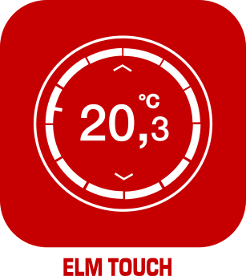
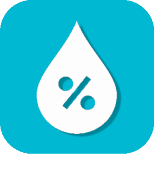
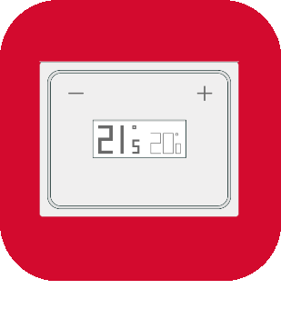

# Confort

>**IMPORTANT**
>Seuls les plugins de contributeur ont leur documentation ici. Vous pouvez consulter les documentations des plugins officiels directement depuis le Market Jeedom. Une fois sur le plugin en question, cliquez sur documentation.
>Vous pouvez voir [ici](https://market.jeedom.com/index.php?v=d&p=market&type=plugin&categorie=wellness) tous les plugins officiels de cette catégorie

| | | | |
|--- | --- | --- | ---|
||MyVaillant| Plugin pour intégrer les équipements Vaillant/Saunier-Duval(gamme senso/MiSet,MiPro Sense, multiMATIC...) associés à une passerelle sensoNET VR92x, VR7xx ou MiLink V3.   Ce plugin concerne uniquement les équipements qui fonctionnent avec l'app MyVaillant ou MigoLink.   Le plugin permet l'acquisition des informations de votre installation et d'exécuter la majorité des actions disponibles (Consigne, Plannings, Modes...).   L'actualisation se fait via API. Le Plugin fonctionne en PHP/JS sans dépendances externes ni démons.|[Documentation Stable](https://limad.github.io/plugins-docs/plugin-MyVaillant/fr_FR/) - [Documentation Beta](https://limad.github.io/plugins-docs/plugin-MyVaillant/fr_FR/) [Market](https://market.jeedom.com/index.php?v=d&p=market_display&id=4404) [Changelog Stable](https://limad.github.io/plugins-docs/plugin-MyVaillant/fr_FR/changelog) - [Changelog Beta](https://limad.github.io/plugins-docs/plugin-MyVaillant/fr_FR/changelog)|
||Vaillant Control| Plugin pour intégrer les thermostats Vaillant/Saunier-Duval(gamme senso/MiSet,MiPro Sense) associés à une passerelle VR92x ou MiLink V3.  Ce sont géneralement les équipements qui fonctionnent avec l'app sensoApp ou MiControl.  Le plugin permet l'acquisition des informations de votre installation et d'exécuter la majorité des actions disponibles(Consigne, Plannings...). L'actualisation se fait via API .|[Documentation Stable](https://limad.github.io/plugins-docs/plugin-VaillantControl/fr_FR/) - [Documentation Beta](https://limad.github.io/plugins-docs/plugin-VaillantControl/fr_FR/) [Market](https://market.jeedom.com/index.php?v=d&p=market_display&id=4299) [Changelog Stable](https://limad.github.io/plugins-docs/plugin-VaillantControl/fr_FR/changelog) - [Changelog Beta](https://limad.github.io/plugins-docs/plugin-VaillantControl/fr_FR/changelog)|
||SPA Balboa|Ce plugin permet de connecter et recuperer les informations de votre SPA Balboa. Il embarque également la possibilité de cree des mode de fonctionnement avancer avec toute la puissance de jeedom|[Documentation Stable](https://mika-nt28.github.io/Documentations/balboa/fr_FR/) [Market](https://market.jeedom.com/index.php?v=d&p=market_display&id=3712) [Changelog Stable](https://mika-nt28.github.io/Documentations/balboa/fr_FR/changelog)|
||Clage|Le plugin permet de récupérer toutes les informations de son serveur HSX de Clage. Le serveur HSX récupère les informations de ses chauffe-eau connectés parmi MCX 3-7, CEX/CFX, DEX, DSX, DSX Touch, DSX Twin. Les informations qui remontent dans l’application Smart Control (iOS, Android) remontent également dans le plugin. Aucune connexion internet n’est requise pour récupérer ces informations, tout est en local.|[Documentation Stable](https://flobul-domotique.fr/presentation-et-documentation-du-plugin-clage-pour-jeedom/) [Market](https://market.jeedom.com/index.php?v=d&p=market_display&id=4303) [Changelog Stable](https://flobul-domotique.fr/liste-des-versions-du-plugin-clage-pour-jeedom/)|
||CVC|Ce plugin permet de créer et de gérer des thermostats pour piloter un système de chauffage central de votre domicile. Il sera en mesure de gérer chaque zone de votre domicile selon les demandes de celless-ci et d'effectuer la demande au bon appareil selon la température extérieur.|[Documentation Stable](http://fobsoft.github.io/jeedom-plugins-documentation/cvc/fr_FR) - [Documentation Beta](http://fobsoft.github.io/jeedom-plugins-documentation/cvc/fr_FR) [Market](https://market.jeedom.com/index.php?v=d&p=market_display&id=4273) [Changelog Stable](http://fobsoft.github.io/jeedom-plugins-documentation/cvc/fr_FR/changelog) - [Changelog Beta](http://fobsoft.github.io/jeedom-plugins-documentation/cvc/fr_FR/changelog)|
||ELM Touch|Plugin pour la régulation de chaudière gaz Elm Leblanc avec le thermostat connecté ELM Touch|[Documentation Stable](https://jmvedrine.github.io/jeedom-elmtouch/fr_FR/) [Market](https://market.jeedom.com/index.php?v=d&p=market_display&id=3281) [Changelog Stable](https://jmvedrine.github.io/jeedom-elmtouch/fr_FR/changelog)|
||Heta|Plugin pilotage des poëles à pellet Heta, AustroFlamm équipés du boitier WiRCU|[Documentation Stable](https://edeweerdt.github.io/jeedom_heta/fr_FR/) [Market](https://market.jeedom.com/index.php?v=d&p=market_display&id=3646) [Changelog Stable](https://edeweerdt.github.io/jeedom_heta/fr_FR/changelog)|
||Hitachi AirCloud|Plugin permettant le pilotage et la récupération des informations des PAC gérées par l'application AirCloud Go d'HITACHI.|[Documentation Stable](https://taggou91.github.io/jeedom_docs/plugins/hitachiaircloud/fr_FR/) [Market](https://market.jeedom.com/index.php?v=d&p=market_display&id=4497) [Changelog Stable](https://taggou91.github.io/jeedom_docs/plugins/hitachiaircloud/changelog.html)|
||Horoscope|Plugin permettant de générer une phrase (selon différents thèmes) tous les jours en fonction des différents signes astrologiques. Très sympa pour donner l'horoscope le matin à une personne via TTS (par exemple avec la caméra Netatmo qui reconnait les visages) ou par SMS.|[Documentation Stable](https://jealg.github.io/documentation/plugin-horoscope/fr_FR/) - [Documentation Beta](https://jealg.github.io/documentation/plugin-horoscope/fr_FR/) [Market](https://market.jeedom.com/index.php?v=d&p=market_display&id=2727) [Changelog Stable](https://jealg.github.io/documentation/plugin-horoscope/fr_FR/changelog) - [Changelog Beta](https://jealg.github.io/documentation/plugin-horoscope/fr_FR/changelog_beta)|
||Gestion Humidité|Plugin pour la gestion de l'humidité grâce à un humidificateur ou déshumidificateur d'air|[Documentation Stable](https://agp42.github.io/humidity/fr_FR/) [Market](https://market.jeedom.com/index.php?v=d&p=market_display&id=3978) [Changelog Stable](https://agp42.github.io/humidity/fr_FR/changelog)|
||luminothérapie|Ce plugin permet de gérer et créer vos ambiances Lumineuse / Couleur.|[Documentation Stable](https://mika-nt28.github.io/Documentations/luminotherapie/fr_FR/) [Market](https://market.jeedom.com/index.php?v=d&p=market_display&id=3095) [Changelog Stable](https://mika-nt28.github.io/Documentations/luminotherapie/fr_FR/changelog)|
||Migo Thermostat| Plugin pour intégrer les équipements MiGo(Saunier-Duval) et eRelax/Vsmart(Vaillant) dans Jeedom.   Le plugin permet l'acquisition des informations de votre installation et d'exécuter la majorité des actions disponibles(Consigne, Plannings...).   L'actualisation se fait via API.   Compatible avec le plugin mobile|[Documentation Stable](https://limad.github.io/plugins-docs/plugin-migoThermostat/fr_FR/) - [Documentation Beta](https://limad.github.io/plugins-docs/plugin-migoThermostat/fr_FR/) [Market](https://market.jeedom.com/index.php?v=d&p=market_display&id=3447) [Changelog Stable](https://limad.github.io/plugins-docs/plugin-migoThermostat/fr_FR/changelog) - [Changelog Beta](https://limad.github.io/plugins-docs/plugin-migoThermostat/fr_FR/changelog)|
||MyUplink API|Ce plugin permet de récupérer les informations des pompes à chaleur NiBe depuis le site https://myUplink.com. Ce plugin ne fonctionne pas avec l'ancienne API http://www.nibeuplink.com.|[Documentation Stable](https://flobul-domotique.fr/documentation-du-plugin-myuplink-pour-jeedom) [Market](https://market.jeedom.com/index.php?v=d&p=market_display&id=4236) [Changelog Stable](https://flobul-domotique.fr/liste-des-versions-du-plugin-myuplink-pour-jeedom/)|
||MyUplink Internal API|Ce plugin permet de récupérer les informations des pompes à chaleur NiBe depuis l'API internal du site https://myUplink.com. Ce plugin ne fonctionne pas avec l'ancienne API http://www.nibeuplink.com. En plus des commandes de base, le plugin permet de générer des commandes depuis l'interface console (consommations, durées...)|[Documentation Stable](https://flobul-domotique.fr/documentation-du-plugin-myuplink-internal-pour-jeedom) [Market](https://market.jeedom.com/index.php?v=d&p=market_display&id=4239) [Changelog Stable](https://flobul-domotique.fr/liste-des-versions-du-plugin-myuplink-internal-pour-jeedom/)|
||Netatmo Energie| Plugin pour intégrer les équipements Netatmo Energie( Thermostat, Vannes, Thermostat OpenTherm) et Netatmo Météo dans Jeedom. Le plugin permet l'acquisition des informations de  votre installation et d'exécuter la majorité des actions disponibles(Consigne, Plannings...). L'actualisation se fait via API et par retours webhook. Compatible avec le plugin mobile|[Documentation Stable](https://limad.github.io/plugins-docs/plugin-naEnergie/fr_FR/) - [Documentation Beta](https://limad.github.io/plugins-docs/plugin-naEnergie/fr_FR/) [Market](https://market.jeedom.com/index.php?v=d&p=market_display&id=3958) [Changelog Stable](https://limad.github.io/plugins-docs/plugin-naEnergie/fr_FR/changelog) - [Changelog Beta](https://limad.github.io/plugins-docs/plugin-naEnergie/fr_FR/changelog)|
||Qivivo|Intégration du Thermostat Qivivo|[Documentation Stable](https://kiboost.github.io/jeedom_docs/plugins/qivivo/fr_FR/) [Market](https://market.jeedom.com/index.php?v=d&p=market_display&id=3551) [Changelog Stable](https://kiboost.github.io/jeedom_docs/plugins/qivivo/fr_FR/changelog.html)|
||Sensibo Sky|Plugin pour piloter le module Sensibo Sky|[Documentation Stable](https://rombautsdidier.github.io/sensibosky/fr_FR/) [Market](https://market.jeedom.com/index.php?v=d&p=market_display&id=4015) [Changelog Stable](https://rombautsdidier.github.io/sensibosky/fr_FR/changelog)|
||myVaillant|Plugin permettant de se connecter à un système myVaillant, qui remplace nottament sensoApp & multiMATIC, (compatible avec les marques Bulex, Saunier Duval, Vaillant) via sa passerelle internet. Il est possible de remonter dans Jeedom l'état de tous les équipements connectés et de les contrôler: définir le mode (On, Off, Auto...), définir les températures de consigne, activer un mode rapide, activer une marche forcée... Les vannes et les thermostats de la gamme ambiSENSE reliées au système sont également gérés.|[Documentation Stable](https://mips2648.github.io/jeedom-plugins-docs/vaillantmultimatic/fr_FR/) - [Documentation Beta](https://mips2648.github.io/jeedom-plugins-docs/vaillantmultimatic/fr_FR/) [Market](https://market.jeedom.com/index.php?v=d&p=market_display&id=4164) [Changelog Stable](https://mips2648.github.io/jeedom-plugins-docs/vaillantmultimatic/fr_FR/changelog) - [Changelog Beta](https://mips2648.github.io/jeedom-plugins-docs/vaillantmultimatic/fr_FR/changelog)|
||VMC (Zehnder/Storkair)|Plugin permettant d'interfacer un VMC de la marque Zehnder aussi connu sous le nom Storkair, ComfoAir, Wernig. Modèles: ComfoAir/ComfoD 250/350/450/550, WHR 920/930/950/960|[Documentation Stable](https://mips2648.github.io/jeedom-plugins-docs/vmczehnder/fr_FR/) - [Documentation Beta](https://mips2648.github.io/jeedom-plugins-docs/vmczehnder/fr_FR/) [Market](https://market.jeedom.com/index.php?v=d&p=market_display&id=3605) [Changelog Stable](https://mips2648.github.io/jeedom-plugins-docs/vmczehnder/fr_FR/changelog) - [Changelog Beta](https://mips2648.github.io/jeedom-plugins-docs/vmczehnder/fr_FR/changelog)|
